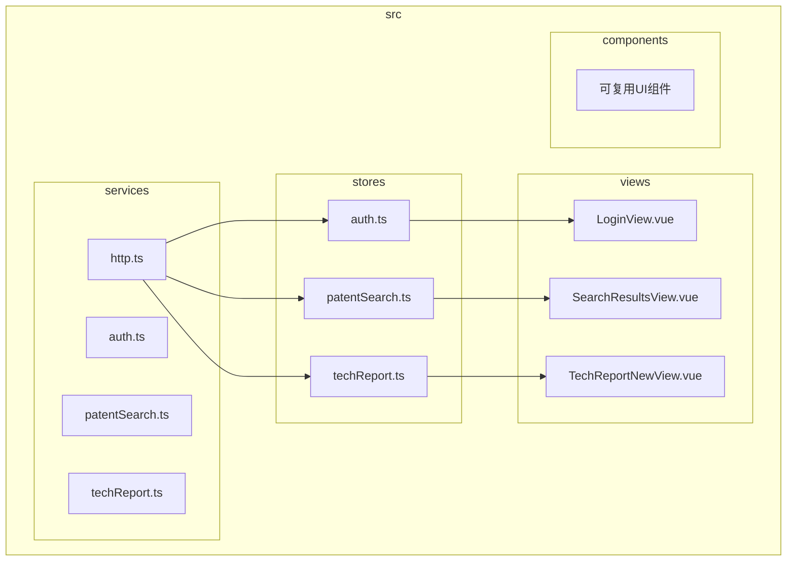
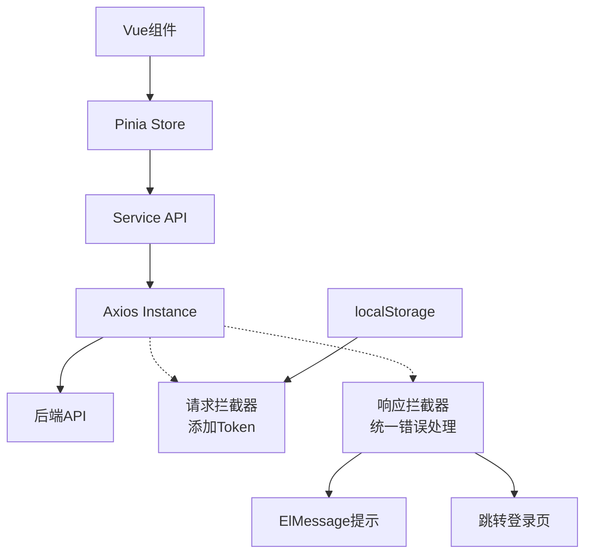
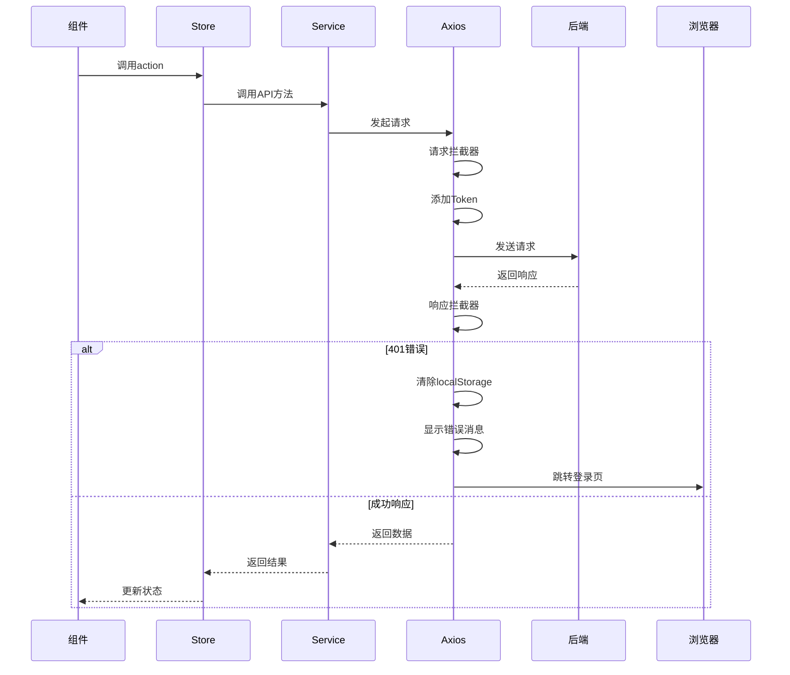
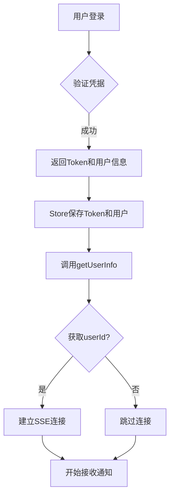
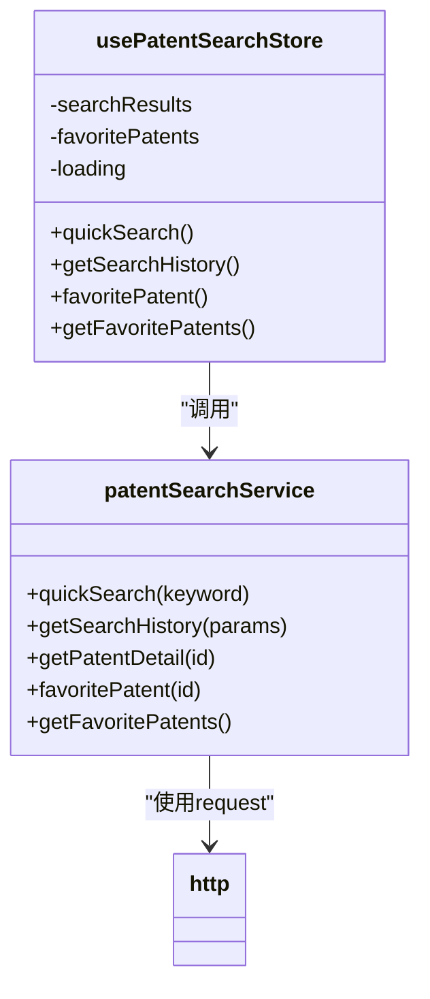
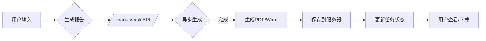
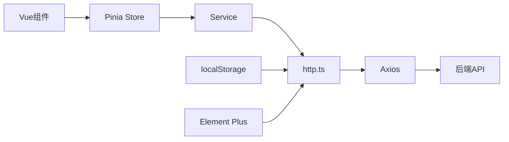

# API服务层

<cite>
**本文档引用的文件**  
- [http.ts](file://src/services/http.ts)
- [auth.ts](file://src/services/auth.ts)
- [patentSearch.ts](file://src/services/patentSearch.ts)
- [techReport.ts](file://src/services/techReport.ts)
- [auth.ts](file://src/stores/auth.ts)
- [patentSearch.ts](file://src/stores/patentSearch.ts)
- [techReport.ts](file://src/stores/techReport.ts)
</cite>

## 目录
1. [简介](#简介)
2. [项目结构](#项目结构)
3. [核心组件](#核心组件)
4. [架构概览](#架构概览)
5. [详细组件分析](#详细组件分析)
6. [依赖分析](#依赖分析)
7. [性能考虑](#性能考虑)
8. [故障排除指南](#故障排除指南)
9. [结论](#结论)

## 简介
本项目为专利服务网站，提供专利检索、技术报告生成、三性分析、专利撰写及答辩支持等功能。系统采用前后端分离架构，前端基于Vue 3与Pinia状态管理，通过Axios封装的HTTP服务层与后端API交互。服务层统一处理认证、错误、超时等逻辑，各业务模块（如auth、patentSearch、techReport）封装具体API调用，通过Pinia Store管理状态，形成“组件→Store→Service→API”的标准数据流。

## 项目结构
项目采用模块化组织方式，核心功能集中在`src`目录下。`services`目录封装所有API请求逻辑，`stores`目录管理应用状态，`views`目录为页面组件，`components`目录为可复用UI组件。服务层与状态层分离，确保业务逻辑与界面解耦，提升可维护性。

**图示来源**  
- [http.ts](file://src/services/http.ts)
- [auth.ts](file://src/stores/auth.ts)
- [patentSearch.ts](file://src/stores/patentSearch.ts)
- [techReport.ts](file://src/stores/techReport.ts)

## 核心组件
核心组件包括HTTP客户端封装、认证服务、专利检索服务和技术报告服务。HTTP封装提供统一的请求/响应拦截、错误处理和基础配置；各业务服务模块定义具体API端点；Pinia Store协调组件与服务层交互，管理本地状态。

**组件来源**  
- [http.ts](file://src/services/http.ts#L8-L245)
- [auth.ts](file://src/services/auth.ts#L29-L246)
- [patentSearch.ts](file://src/services/patentSearch.ts#L138-L406)
- [techReport.ts](file://src/services/techReport.ts#L101-L343)

## 架构概览
系统采用分层架构，自上而下为：视图层（Vue组件）、状态层（Pinia Store）、服务层（API封装）、通信层（Axios实例）。服务层通过`http.ts`统一配置基础URL、超时时间，并注入JWT Token；响应拦截器统一处理401等错误，自动跳转登录页。各业务服务模块复用`request`方法，实现代码复用与一致性。

**图示来源**  
- [http.ts](file://src/services/http.ts)
- [auth.ts](file://src/stores/auth.ts)
- [patentSearch.ts](file://src/stores/patentSearch.ts)

## 详细组件分析

### HTTP服务封装分析
`http.ts`文件创建Axios实例并配置全局选项，包括基础URL、120秒超时（适应AI报告生成）、JSON内容类型。请求拦截器从localStorage读取Token并注入Authorization头，支持JSON格式Token解析。响应拦截器统一处理401认证失败，清除本地状态并跳转登录页，同时防止重复提示。

**图示来源**  
- [http.ts](file://src/services/http.ts#L8-L245)

**组件来源**  
- [http.ts](file://src/services/http.ts#L8-L245)

### 认证服务分析
`authService`提供登录、注册、获取验证码等方法。登录成功后返回Token、用户信息和过期时间，Store层负责持久化存储。`useAuthStore`在登录后自动调用`getUserInfo`获取完整用户信息，并建立SSE连接用于实时通知。登出时断开SSE连接并清除本地数据。

**图示来源**  
- [auth.ts](file://src/services/auth.ts#L29-L246)
- [auth.ts](file://src/stores/auth.ts#L7-L261)

**组件来源**  
- [auth.ts](file://src/services/auth.ts#L29-L246)
- [auth.ts](file://src/stores/auth.ts#L7-L261)

### 专利检索服务分析
`patentSearchService`提供快速检索、高级检索、收藏专利等功能。快速检索调用`/manus/task`提交任务，返回空结果，用户需在历史记录中查看生成结果。`getSearchHistory`通过`/task/getPage`分页查询历史，解析`taskJson`提取关键词生成报告标题。Store层管理搜索结果、收藏列表和分页状态。

**图示来源**  
- [patentSearch.ts](file://src/services/patentSearch.ts#L138-L406)
- [patentSearch.ts](file://src/stores/patentSearch.ts#L5-L276)

**组件来源**  
- [patentSearch.ts](file://src/services/patentSearch.ts#L138-L406)
- [patentSearch.ts](file://src/stores/patentSearch.ts#L5-L276)

### 技术报告服务分析
`techReportService`提供生成报告、获取列表、导出等功能。生成报告调用`/manus/task`，支持文本或文件输入。`getReportList`分页查询报告历史，映射后端状态码到前端枚举。Store层支持直接打开PDF/Word链接或通过Blob下载，优化用户体验。

**图示来源**  
- [techReport.ts](file://src/services/techReport.ts#L101-L343)
- [techReport.ts](file://src/stores/techReport.ts#L6-L207)

**组件来源**  
- [techReport.ts](file://src/services/techReport.ts#L101-L343)
- [techReport.ts](file://src/stores/techReport.ts#L6-L207)

## 依赖分析
服务层依赖Axios进行HTTP通信，依赖Pinia进行状态管理。各业务服务模块依赖`http.ts`提供的`request`对象，避免重复配置。Store模块依赖对应的服务模块，形成清晰的调用链。项目通过模块化设计降低耦合度，`http.ts`的统一封装确保所有API请求遵循相同的安全和错误处理策略。

**图示来源**  
- [http.ts](file://src/services/http.ts)
- [auth.ts](file://src/services/auth.ts)
- [patentSearch.ts](file://src/services/patentSearch.ts)
- [techReport.ts](file://src/services/techReport.ts)

**组件来源**  
- [http.ts](file://src/services/http.ts)
- [auth.ts](file://src/services/auth.ts)
- [patentSearch.ts](file://src/services/patentSearch.ts)
- [techReport.ts](file://src/services/techReport.ts)

## 性能考虑
HTTP客户端设置120秒超时，适应AI生成报告等长时间任务。服务层采用异步非阻塞调用，避免阻塞主线程。Store层使用`ref`和`computed`实现响应式数据，确保视图高效更新。分页查询减少单次数据传输量，提升加载速度。未来可引入请求缓存、防抖等优化措施。

## 故障排除指南
- **登录后跳转登录页**：检查localStorage中Token是否正确存储，响应拦截器会自动处理401错误。
- **API请求失败**：检查网络连接，确认VITE_API_BASE_URL环境变量配置正确。
- **SSE连接未建立**：确保`getUserInfo`返回的用户包含`userId`字段。
- **文件上传失败**：检查`upload`方法是否正确设置`Content-Type`为`multipart/form-data`。
- **Token解析错误**：`http.ts`支持原始Token和JSON格式，确保后端返回格式一致。

**组件来源**  
- [http.ts](file://src/services/http.ts#L25-L150)
- [auth.ts](file://src/stores/auth.ts#L100-L150)

## 结论
本项目API服务层设计合理，通过Axios拦截器统一处理认证与错误，各业务服务模块职责清晰，与Pinia Store紧密结合，形成高效的数据流。建议未来增加请求缓存、错误重试机制，并完善TypeScript类型定义，进一步提升代码质量与开发效率。