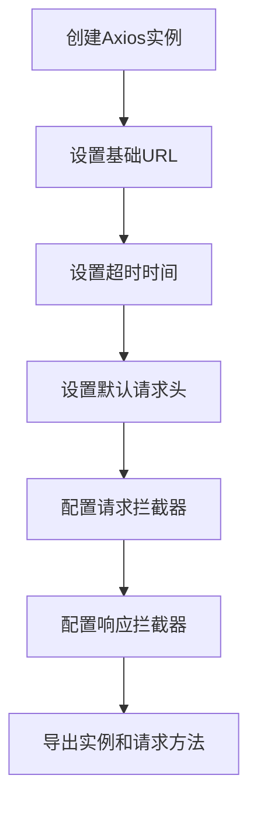
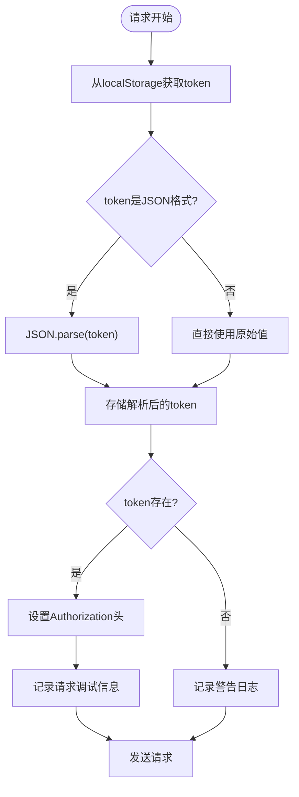
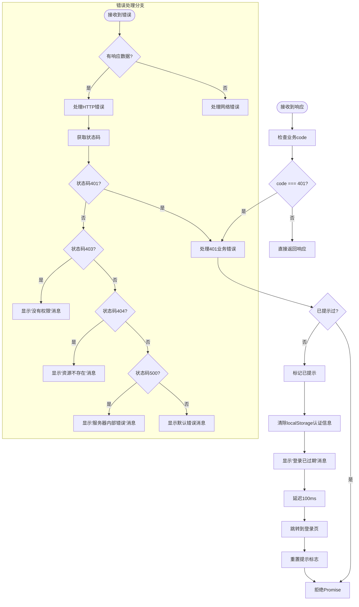
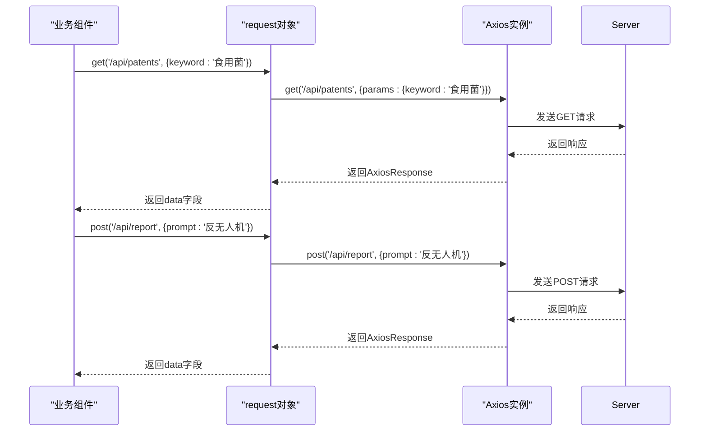
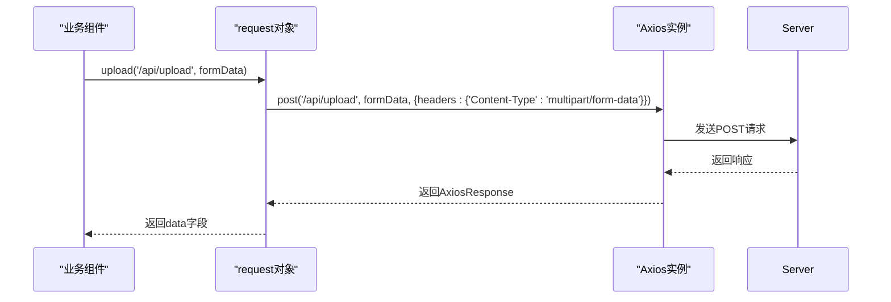

# HTTP客户端封装

<cite>
**Referenced Files in This Document**   
- [http.ts](file://src/services/http.ts)
- [patentSearch.ts](file://src/services/patentSearch.ts)
- [techReport.ts](file://src/services/techReport.ts)
</cite>

## 目录
1. [简介](#简介)
2. [核心配置](#核心配置)
3. [请求拦截器](#请求拦截器)
4. [响应拦截器](#响应拦截器)
5. [自定义配置选项](#自定义配置选项)
6. [请求方法使用](#请求方法使用)
7. [文件上传处理](#文件上传处理)
8. [封装优势](#封装优势)

## 简介
该文档详细解析了`src/services/http.ts`中基于Axios的HTTP客户端封装机制。该封装通过创建统一的请求实例，配置基础URL、超时时间、请求/响应拦截器等核心参数，为整个应用提供了标准化的网络请求能力。封装的重点在于实现了自动化的JWT token注入和统一的错误处理策略，显著提升了API调用的一致性和可维护性。

## 核心配置
HTTP客户端的核心配置在`http.ts`文件中通过`axios.create()`方法完成，定义了所有请求的默认行为。

**Diagram sources**
- [http.ts](file://src/services/http.ts#L10-L20)

**Section sources**
- [http.ts](file://src/services/http.ts#L10-L20)

## 请求拦截器
请求拦截器负责在每个请求发送前自动注入JWT token，确保用户认证信息的正确传递。

**Diagram sources**
- [http.ts](file://src/services/http.ts#L30-L75)

**Section sources**
- [http.ts](file://src/services/http.ts#L30-L75)

## 响应拦截器
响应拦截器统一处理服务器返回的响应和错误，特别是对401未授权和500服务器错误等状态码进行集中管理。

**Diagram sources**
- [http.ts](file://src/services/http.ts#L77-L200)

**Section sources**
- [http.ts](file://src/services/http.ts#L77-L200)

## 自定义配置选项
虽然HTTP实例有默认配置，但`request`对象提供了灵活的自定义选项，允许在特定请求中覆盖默认设置。

**Section sources**
- [http.ts](file://src/services/http.ts#L202-L248)

## 请求方法使用
封装的`request`对象提供了简洁的API来执行不同类型的HTTP请求，如GET和POST。

**Diagram sources**
- [http.ts](file://src/services/http.ts#L202-L248)
- [patentSearch.ts](file://src/services/patentSearch.ts#L90-L105)
- [techReport.ts](file://src/services/techReport.ts#L90-L105)

**Section sources**
- [http.ts](file://src/services/http.ts#L202-L248)
- [patentSearch.ts](file://src/services/patentSearch.ts#L90-L105)
- [techReport.ts](file://src/services/techReport.ts#L90-L105)

## 文件上传处理
`request.upload`方法专门用于处理文件上传，自动设置正确的`Content-Type`头。

**Diagram sources**
- [http.ts](file://src/services/http.ts#L240-L248)
- [techReport.ts](file://src/services/techReport.ts#L320-L330)

**Section sources**
- [http.ts](file://src/services/http.ts#L240-L248)
- [techReport.ts](file://src/services/techReport.ts#L320-L330)

## 封装优势
该HTTP客户端封装通过统一的配置和拦截器机制，显著提升了应用的API调用一致性和可维护性。

**Section sources**
- [http.ts](file://src/services/http.ts)
- [patentSearch.ts](file://src/services/patentSearch.ts)
- [techReport.ts](file://src/services/techReport.ts)