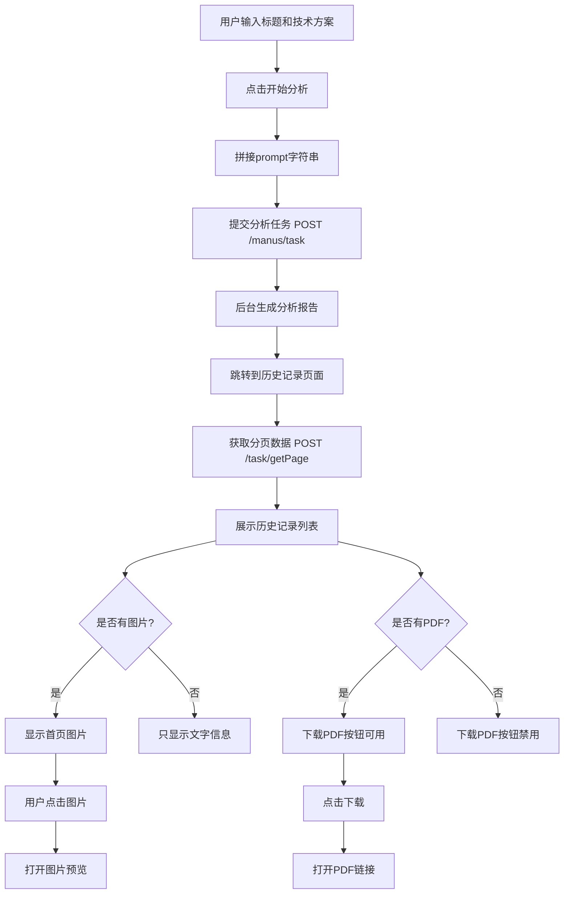

# 三性分析服务

<cite>
**Referenced Files in This Document**  
- [threeAnalysis.ts](file://src/services/threeAnalysis.ts)
- [THREE_ANALYSIS_API_INTEGRATION.md](file://THREE_ANALYSIS_API_INTEGRATION.md)
- [index.ts](file://src/types/index.ts)
</cite>

## 目录
1. [简介](#简介)
2. [核心功能](#核心功能)
3. [任务提交机制](#任务提交机制)
4. [响应处理与状态轮询](#响应处理与状态轮询)
5. [历史记录查询](#历史记录查询)
6. [结果数据解析](#结果数据解析)
7. [架构一致性](#架构一致性)
8. [接口调用流程图](#接口调用流程图)

## 简介
三性分析服务是专利服务网站中的核心功能模块之一，专注于对技术方案进行新颖性、创造性和实用性（简称“三性”）的自动化评估。该服务通过统一的任务接口与后端系统交互，实现了从任务提交到结果获取的完整流程。本文档详细说明了三性分析服务的后端交互机制，包括任务发起、参数构造、响应处理、历史记录查询及结果解析等关键环节。

**Section sources**
- [threeAnalysis.ts](file://src/services/threeAnalysis.ts#L240-L519)
- [THREE_ANALYSIS_API_INTEGRATION.md](file://THREE_ANALYSIS_API_INTEGRATION.md#L0-L475)

## 核心功能
三性分析服务提供以下主要功能：
- **三性分析任务创建**：用户提交技术方案，系统生成新颖性、创造性、实用性分析报告。
- **历史记录管理**：支持分页查询、关键词搜索和状态筛选，便于用户管理过往分析任务。
- **结果展示与下载**：提供分析报告的PDF、Word和Markdown格式下载，支持首图预览功能。
- **统一任务架构**：与其他任务型服务（如技术报告、专利撰写）共享相同的任务管理框架。

该服务通过`threeAnalysisService`对象暴露其核心方法，确保了前端调用的一致性和可维护性。

**Section sources**
- [threeAnalysis.ts](file://src/services/threeAnalysis.ts#L240-L519)
- [THREE_ANALYSIS_API_INTEGRATION.md](file://THREE_ANALYSIS_API_INTEGRATION.md#L0-L475)

## 任务提交机制
三性分析任务通过统一的`/manus/task`接口发起，该接口是系统中所有任务型服务的通用入口。

### 接口规范
- **请求方法**：`POST`
- **请求路径**：`/manus/task`
- **内容类型**：`application/json`

### 参数构造
任务提交的核心在于正确构造请求参数，其中`type`参数是识别三性分析类型的关键标识。

#### 核心参数
| 参数名 | 类型 | 说明 |
|--------|------|------|
| `type` | number | 任务类型标识，`3`表示三性分析 |
| `prompt` | string | 技术方案描述，由标题和技术方案文本拼接而成 |
| `fileUrls` | string[] | 可选，上传的专利文件URL数组 |

#### 技术方案描述的传递
技术方案描述通过`prompt`参数传递，其构造规则如下：
1. **优先级**：当用户上传了专利文件（PDF、DOC等），系统优先使用文件内容进行分析。
2. **文本输入**：若未上传文件，则使用用户输入的文本信息。
3. **拼接规则**：将“专利标题”和“技术方案”两个字段用换行符`\n`连接，形成`prompt`字符串。

例如：
```json
{
  "type": 3,
  "prompt": "组装式食用菌种植棚\n本实用新型公开了一种组装式食用菌种植棚..."
}
```

当同时提供文件和文本时，文件内容为主，文本内容作为补充提示（prompt）。

**Section sources**
- [threeAnalysis.ts](file://src/services/threeAnalysis.ts#L280-L315)
- [THREE_ANALYSIS_API_INTEGRATION.md](file://THREE_ANALYSIS_API_INTEGRATION.md#L10-L25)

## 响应处理与状态轮询
任务提交后，系统返回响应，客户端需根据响应进行后续处理。

### 响应结构
后端返回标准的`ApiResponse`格式：
```json
{
  "code": 200,
  "data": { /* 任务信息 */ },
  "msg": "success"
}
```

### 任务ID获取
成功提交任务后，响应的`data`字段中包含任务的唯一标识（`taskId`）。该ID是进行状态轮询的关键。

### 状态轮询机制
由于三性分析可能耗时较长，系统采用异步处理模式：
1. **立即响应**：`/manus/task`接口在接收到请求后立即返回，不等待分析完成。
2. **轮询查询**：客户端通过`getAnalysisHistory`方法，结合任务ID和状态参数，定期查询任务的最新状态。
3. **状态映射**：后端使用数字表示状态，`0`为生成中，`1`为已完成，`2`为失败。

客户端在收到任务提交成功的响应后，通常会自动跳转至历史记录页面，该页面会自动发起轮询，直到任务状态变为“已完成”或“失败”。

**Section sources**
- [threeAnalysis.ts](file://src/services/threeAnalysis.ts#L300-L310)
- [THREE_ANALYSIS_API_INTEGRATION.md](file://THREE_ANALYSIS_API_INTEGRATION.md#L26-L35)

## 历史记录查询
获取三性分析历史记录的机制与`getDraftList`等其他任务服务高度一致，体现了系统架构的统一性。

### 接口规范
- **请求方法**：`POST`
- **请求路径**：`/task/getPage`
- **功能**：分页查询指定类型的任务记录。

### 请求参数
| 参数名 | 类型 | 说明 |
|--------|------|------|
| `type` | number | 任务类型，`3`表示三性分析 |
| `pageIndex` | number | 当前页码 |
| `pageSize` | number | 每页数量 |
| `keyword` | string | 可选，搜索关键词 |
| `state` | number | 可选，任务状态（0:生成中, 1:已完成, 2:失败） |

### 方法调用
前端通过调用`threeAnalysisService.getAnalysisHistory`方法来获取历史列表。该方法封装了请求参数的构建和响应数据的转换逻辑。

**Section sources**
- [threeAnalysis.ts](file://src/services/threeAnalysis.ts#L330-L380)
- [THREE_ANALYSIS_API_INTEGRATION.md](file://THREE_ANALYSIS_API_INTEGRATION.md#L36-L45)

## 结果数据解析
历史记录查询返回的每条记录都包含一个`taskJson`字段，该字段是解析三性分析结果数据的关键。

### taskJson字段
`taskJson`是一个JSON字符串，存储了任务创建时的原始请求信息，包括`prompt`、`fileUrls`等。

### 解析流程
1. **获取原始数据**：从后端返回的记录中提取`taskJson`字段。
2. **JSON解析**：使用`JSON.parse()`将其转换为JavaScript对象。
3. **提取信息**：从解析后的对象中提取`prompt`字段。
4. **分割处理**：将`prompt`字符串按换行符`\n`分割：
   - 第一行作为“专利标题”
   - 剩余行合并为“技术方案”描述

此解析逻辑在`getAnalysisHistory`方法中实现，确保了前端展示的数据与用户提交的内容一致。

**Section sources**
- [threeAnalysis.ts](file://src/services/threeAnalysis.ts#L390-L400)
- [THREE_ANALYSIS_API_INTEGRATION.md](file://THREE_ANALYSIS_API_INTEGRATION.md#L230-L250)

## 架构一致性
三性分析服务在架构设计上与其他任务型服务（如技术报告、专利撰写、答辩支持）保持高度一致，体现了系统的模块化和可扩展性。

### 统一任务接口
所有任务型服务均通过`/manus/task`接口提交任务，通过`/task/getPage`接口查询历史记录。任务类型由`type`参数区分：
- `1`: 技术报告
- `2`: 专利检索
- `3`: 三性分析
- `4`: 专利撰写
- `5`: 答辩支持

### 共享数据结构
多个服务共享`PageQueryRequest`和`PageQueryResponse`接口定义，确保了分页查询逻辑的统一。

### 相同的处理模式
所有服务都遵循相同的异步处理模式：提交任务 -> 返回任务ID -> 轮询状态 -> 获取结果。这种一致性极大地简化了前端开发和维护工作。

**Section sources**
- [threeAnalysis.ts](file://src/services/threeAnalysis.ts#L5-L15)
- [techReport.ts](file://src/services/techReport.ts#L63-L73)
- [patentDraft.ts](file://src/services/patentDraft.ts#L6-L16)

## 接口调用流程图


**Diagram sources**
- [THREE_ANALYSIS_API_INTEGRATION.md](file://THREE_ANALYSIS_API_INTEGRATION.md#L300-L325)