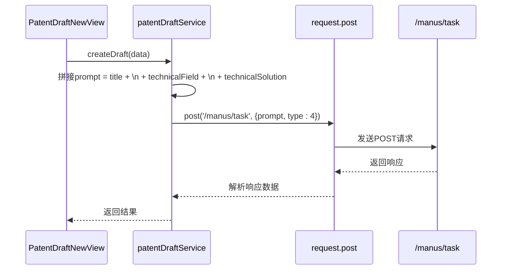
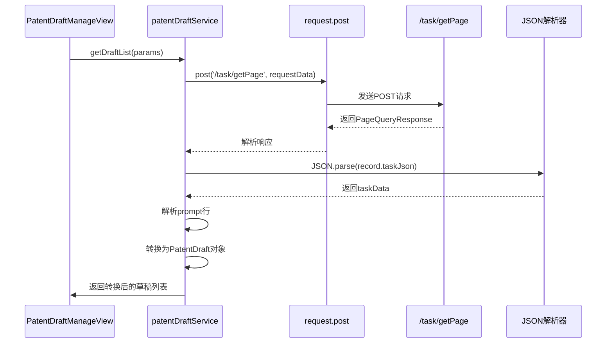
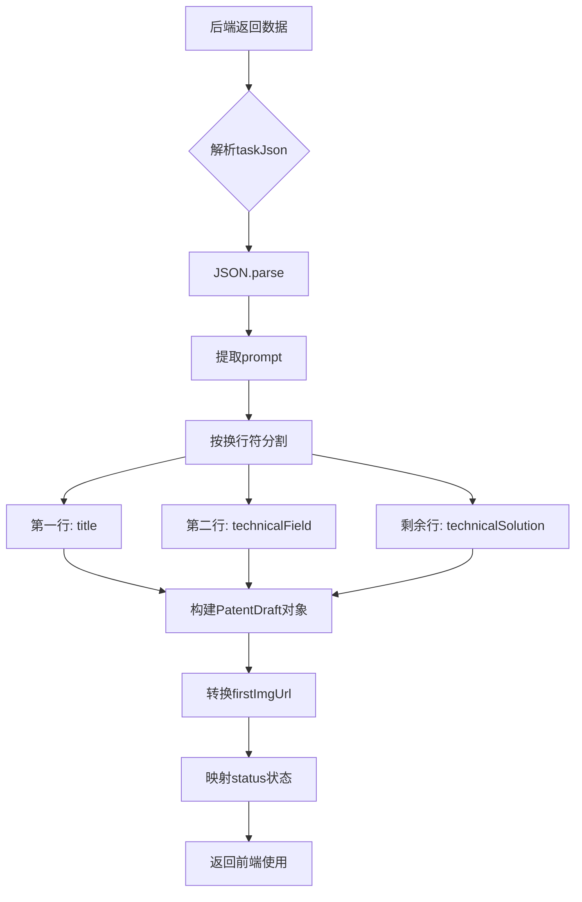
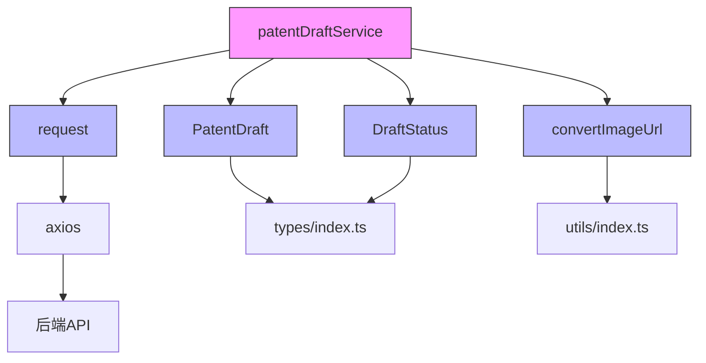

# 专利撰写服务

<cite>
**Referenced Files in This Document**   
- [patentDraft.ts](file://src/services/patentDraft.ts)
- [PATENT_DRAFT_API_INTEGRATION.md](file://PATENT_DRAFT_API_INTEGRATION.md)
- [index.ts](file://src/types/index.ts)
- [index.ts](file://src/utils/index.ts)
- [http.ts](file://src/services/http.ts)
- [PatentDraftManageView.vue](file://src/views/patent-draft/PatentDraftManageView.vue)
</cite>

## 目录
1. [简介](#简介)
2. [核心组件](#核心组件)
3. [架构概述](#架构概述)
4. [详细组件分析](#详细组件分析)
5. [依赖分析](#依赖分析)
6. [性能考虑](#性能考虑)
7. [故障排除指南](#故障排除指南)
8. [结论](#结论)

## 简介
本API文档全面解析了专利撰写服务的核心功能，重点阐述了专利草稿的创建与管理机制。系统通过`createDraft()`方法将用户输入的发明名称、技术领域和技术方案拼接为prompt，并调用后端接口创建撰写任务。同时，`getDraftList()`方法实现了草稿列表的分页获取与数据解析，将后端返回的JSON数据还原为前端所需的`PatentDraft`对象结构。文档还详细说明了文件URL的映射处理逻辑以及服务层与store之间的数据转换机制，确保草稿列表的正确渲染与交互。

**Section sources**
- [patentDraft.ts](file://src/services/patentDraft.ts#L1-L325)
- [PATENT_DRAFT_API_INTEGRATION.md](file://PATENT_DRAFT_API_INTEGRATION.md#L1-L258)

## 核心组件
专利撰写服务的核心功能由`patentDraftService`提供，包含`createDraft`和`getDraftList`两个关键方法。`createDraft`方法负责将用户输入的发明信息拼接为prompt并提交至`/manus/task`接口创建撰写任务。`getDraftList`方法则通过`/task/getPage`接口获取分页数据，并解析`taskJson`字段以还原完整的专利草稿信息。服务层还处理了文件URL的映射，将测试环境的图片URL转换为生产环境地址，确保资源的正确加载。

**Section sources**
- [patentDraft.ts](file://src/services/patentDraft.ts#L100-L325)
- [index.ts](file://src/types/index.ts#L141-L178)

## 架构概述
专利撰写服务采用分层架构，前端组件通过服务层与后端API进行交互。服务层封装了具体的HTTP请求逻辑，提供统一的接口供视图层调用。数据流从用户界面开始，经由服务层处理后发送至后端，后端返回的数据再由服务层解析并转换为前端所需的模型对象。

```mermaid
graph TB
subgraph "前端"
A[PatentDraftManageView] --> B[patentDraftService]
C[PatentDraftNewView] --> B
end
subgraph "服务层"
B --> D[request.post]
end
subgraph "后端"
D --> E[/manus/task]
D --> F[/task/getPage]
end
E --> G[创建撰写任务]
F --> H[返回分页数据]
H --> I[解析taskJson]
I --> J[转换为PatentDraft]
J --> A
```

**Diagram sources **
- [patentDraft.ts](file://src/services/patentDraft.ts#L100-L325)
- [PatentDraftManageView.vue](file://src/views/patent-draft/PatentDraftManageView.vue#L1-L643)

## 详细组件分析
### createDraft方法分析
`createDraft`方法是专利草稿创建的核心，它将用户输入的发明名称、技术领域和技术方案三个字段拼接为一个包含换行符的prompt字符串，并以`type=4`的参数调用`/manus/task`接口。



**Diagram sources **
- [patentDraft.ts](file://src/services/patentDraft.ts#L100-L140)
- [PATENT_DRAFT_API_INTEGRATION.md](file://PATENT_DRAFT_API_INTEGRATION.md#L55-L101)

### getDraftList方法分析
`getDraftList`方法负责获取专利草稿列表，通过`/task/getPage`接口获取分页数据，并将返回的`taskJson`字段解析还原为前端所需的`PatentDraft`对象。



**Diagram sources **
- [patentDraft.ts](file://src/services/patentDraft.ts#L142-L270)
- [PatentDraftManageView.vue](file://src/views/patent-draft/PatentDraftManageView.vue#L174-L237)

### 数据转换逻辑分析
服务层与store之间的数据转换逻辑确保了草稿列表的正确渲染。后端返回的原始数据需要经过解析、转换和映射才能成为前端可用的`PatentDraft`对象。



**Diagram sources **
- [patentDraft.ts](file://src/services/patentDraft.ts#L190-L270)
- [index.ts](file://src/utils/index.ts#L40-L45)

## 依赖分析
专利撰写服务依赖于多个核心模块，包括HTTP请求服务、类型定义和工具函数。服务层通过`request`模块与后端进行通信，依赖`PatentDraft`和`DraftStatus`等类型定义来保证数据结构的一致性，并使用`convertImageUrl`工具函数处理图片URL的映射。



**Diagram sources **
- [patentDraft.ts](file://src/services/patentDraft.ts#L1-L325)
- [http.ts](file://src/services/http.ts#L1-L248)
- [index.ts](file://src/types/index.ts#L141-L178)
- [index.ts](file://src/utils/index.ts#L40-L45)

## 性能考虑
在性能方面，系统采用了多项优化措施。图片加载使用了懒加载（`loading="lazy"`）策略，减少初始页面加载时间。分页查询机制有效控制了单次请求的数据量，避免了大数据量导致的性能问题。此外，服务层对错误处理进行了优化，区分了登录过期和其他错误类型，避免了不必要的错误提示，提升了用户体验。

## 故障排除指南
当遇到问题时，可参考以下常见问题的解决方案：
- **无法创建草稿**：检查网络连接，确认用户已登录，验证输入字段是否符合要求（发明名称3-50字符，技术领域至少20字符，技术方案至少50字符）。
- **草稿列表为空**：确认用户是否有创建过草稿，检查分页参数和筛选条件。
- **图片无法显示**：检查`firstImgUrl`是否为空，确认图片URL的域名替换是否正确。
- **PDF/Word无法下载**：确认`pdfUrl`或`wordUrl`是否存在，检查文件服务器是否正常运行。

**Section sources**
- [patentDraft.ts](file://src/services/patentDraft.ts#L100-L325)
- [PatentDraftManageView.vue](file://src/views/patent-draft/PatentDraftManageView.vue#L234-L298)

## 结论
本文档全面解析了专利撰写服务的API设计与实现。通过`createDraft`和`getDraftList`两个核心方法，系统实现了专利草稿的创建与管理功能。服务层精心设计的数据转换逻辑确保了前后端数据的一致性，而完善的错误处理机制则保障了系统的稳定性。整体架构清晰，职责分明，为用户提供了一个高效、可靠的专利撰写工具。