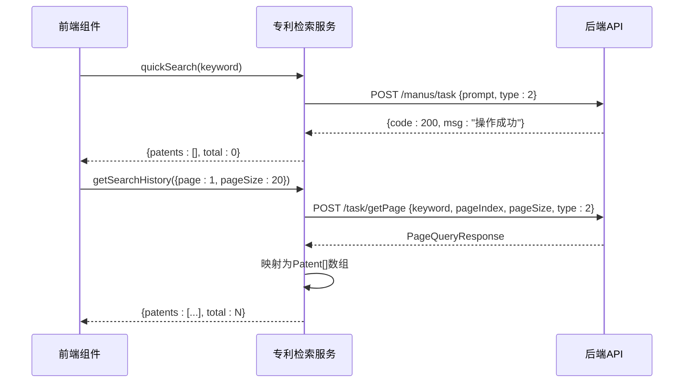
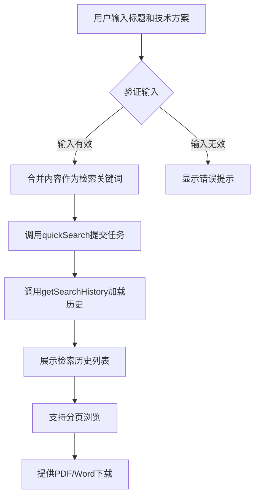

# 专利检索服务

<cite>
**本文档引用文件**  
- [patentSearch.ts](file://src/services/patentSearch.ts)
- [patentSearch.md](file://PATENT_SEARCH_API.md)
- [QuickSearchView.vue](file://src/views/patent-search/QuickSearchView.vue)
- [patentSearch.ts](file://src/stores/patentSearch.ts)
</cite>

## 目录
1. [简介](#简介)
2. [核心功能实现](#核心功能实现)
3. [接口定义与分页机制](#接口定义与分页机制)
4. [服务层交互流程](#服务层交互流程)
5. [实际调用场景示例](#实际调用场景示例)
6. [状态管理与数据流](#状态管理与数据流)
7. [错误处理机制](#错误处理机制)
8. [结论](#结论)

## 简介
本API文档深入解析专利检索服务的后端交互实现，重点阐述`quickSearch()`方法如何提交检索任务、`getSearchHistory()`方法如何获取用户检索历史，以及`PageQueryRequest`和`PageQueryResponse`接口在分页查询中的作用。系统通过统一的任务接口`/manus/task`发起异步检索任务，并利用`/task/getPage`接口获取结构化的历史记录数据，为上层组件提供完整的检索结果展示能力。

## 核心功能实现

### 快速检索任务提交
`quickSearch()`方法负责将用户输入的检索关键词封装为请求体，并通过POST请求提交至`/manus/task`接口以发起快速检索任务。该方法接收检索关键词作为主要参数，并可选地传入分页配置。请求成功后返回空结果集，实际检索结果需通过历史记录接口获取。

**Section sources**
- [patentSearch.ts](file://src/services/patentSearch.ts#L140-L186)

### 检索历史获取逻辑
`getSearchHistory()`方法用于获取用户的检索历史列表，支持分页、关键词过滤和状态筛选。该方法将前端参数转换为标准的`PageQueryRequest`格式，调用`/task/getPage`接口获取原始数据后，将其映射为`Patent`类型数组并返回。状态参数支持`generating`、`completed`、`failed`三种字符串值，内部自动映射为对应的数字状态码。

**Section sources**
- [patentSearch.ts](file://src/services/patentSearch.ts#L189-L301)

## 接口定义与分页机制

### 分页查询请求接口
`PageQueryRequest`接口定义了分页查询的通用请求参数结构，包含关键词、页码、每页数量、排序规则、状态和类型等字段。其中`type: 2`标识该请求为专利检索类型，确保后端正确路由处理。

```mermaid
classDiagram
class PageQueryRequest {
+keyword? : string
+pageIndex? : number
+pageSize? : number
+pageSorts? : Array<{asc : boolean, column : string}>
+state? : number
+type : number
}
```

**Diagram sources**
- [patentSearch.ts](file://src/services/patentSearch.ts#L5-L15)

### 分页查询响应接口
`PageQueryResponse`接口定义了分页查询的响应数据结构，包含响应码、消息和数据体。数据体中包含分页信息（当前页、页大小、总数）和记录列表，每条记录包含创建时间、图片URL、任务ID、状态等关键信息。

```mermaid
classDiagram
class PageQueryResponse {
+code : number
+msg : string
+data : {
pageIndex : number,
pageSize : number,
records : Array<Record>,
total : number
}
}
class Record {
+createTime : string
+firstImgUrl : string
+id : number
+mdUrl : string
+pdfUrl : string
+state : number
+taskId : string
+taskJson : string
+type : number
+updateTime : string
+userId : number
+wordUrl : string
}
```

**Diagram sources**
- [patentSearch.ts](file://src/services/patentSearch.ts#L18-L41)

## 服务层交互流程

### 请求参数封装
服务层在调用`quickSearch()`时，将用户输入的关键词封装为包含`prompt`和`type`字段的JSON对象，通过`request.post`方法提交至`/manus/task`接口。对于`getSearchHistory()`，则将分页参数、关键词和状态信息整合为`PageQueryRequest`对象，提交至`/task/getPage`接口。

### 异步响应处理
由于检索任务为异步执行，`quickSearch()`成功响应后仅返回空结果，提示用户任务已提交。真正的结果数据通过`getSearchHistory()`获取，服务层会解析响应中的`taskJson`字段提取原始检索关键词，并据此生成报告标题。同时，将`firstImgUrl`、`pdfUrl`、`wordUrl`等扩展字段注入到`Patent`对象中，供前端展示和下载使用。



**Diagram sources**
- [patentSearch.ts](file://src/services/patentSearch.ts#L140-L301)

**Section sources**
- [patentSearch.ts](file://src/services/patentSearch.ts#L140-L301)

## 实际调用场景示例
在`QuickSearchView.vue`页面中，用户输入专利标题和技术方案后，点击“开始检索”按钮触发`handleSearch`方法。该方法合并输入内容作为关键词，调用`patentSearchStore.quickSearch()`提交检索任务，随后立即调用`loadSearchHistory()`加载最新的检索历史列表。分页组件支持每页显示10、20或50条记录，并可通过页码切换浏览历史任务。



**Diagram sources**
- [QuickSearchView.vue](file://src/views/patent-search/QuickSearchView.vue#L187-L242)

**Section sources**
- [QuickSearchView.vue](file://src/views/patent-search/QuickSearchView.vue#L187-L242)

## 状态管理与数据流
通过Pinia状态管理器`usePatentSearchStore`统一管理检索相关的状态，包括`searchResults`、`total`、`currentPage`等。`quickSearch`和`getSearchHistory`等Action方法封装了服务层调用逻辑，并自动更新对应的状态。当检索历史加载完成后，数据被存储在`searchResults`中，供视图组件渲染展示。

**Section sources**
- [patentSearch.ts](file://src/stores/patentSearch.ts#L25-L52)
- [patentSearch.ts](file://src/stores/patentSearch.ts#L151-L169)

## 错误处理机制
系统实现了完善的错误处理机制，能够区分登录过期、后端业务错误和网络连接问题等不同异常类型。当捕获到“登录已过期”错误时，直接抛出而不显示额外提示；对于其他错误，则优先显示后端返回的错误消息，其次显示客户端错误信息，最后提供通用的网络错误提示，确保用户获得清晰的反馈。

**Section sources**
- [patentSearch.ts](file://src/services/patentSearch.ts#L176-L186)
- [patentSearch.ts](file://src/services/patentSearch.ts#L291-L301)

## 结论
专利检索服务通过`quickSearch()`和`getSearchHistory()`两个核心方法实现了异步检索任务的提交与结果获取。利用统一的`PageQueryRequest`和`PageQueryResponse`接口规范，确保了分页查询的标准化处理。服务层负责请求封装、响应解析和错误处理，为上层组件提供了结构化的数据支持。结合状态管理器，实现了从用户输入到结果展示的完整数据流闭环。