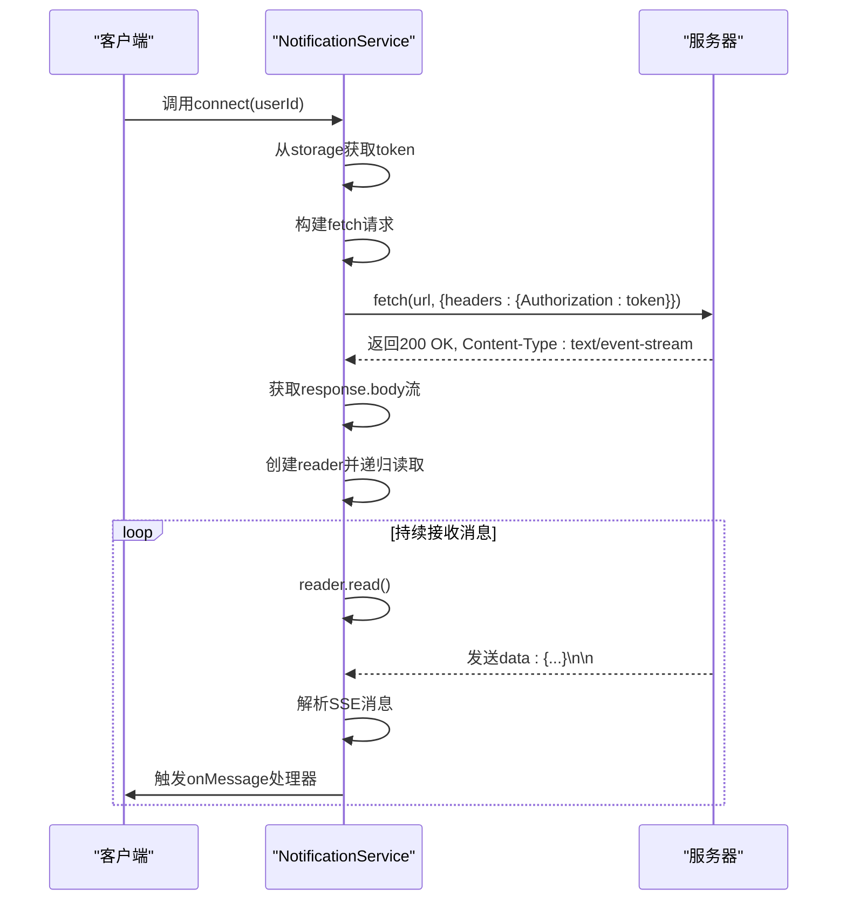
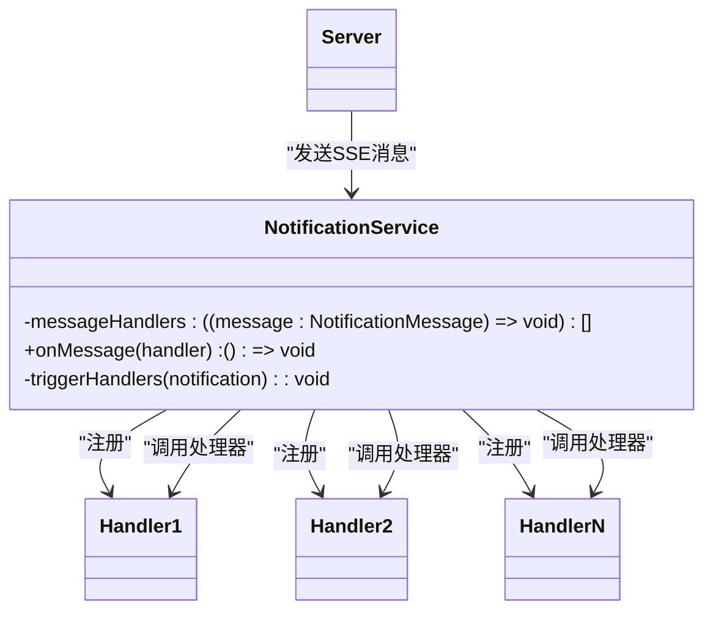
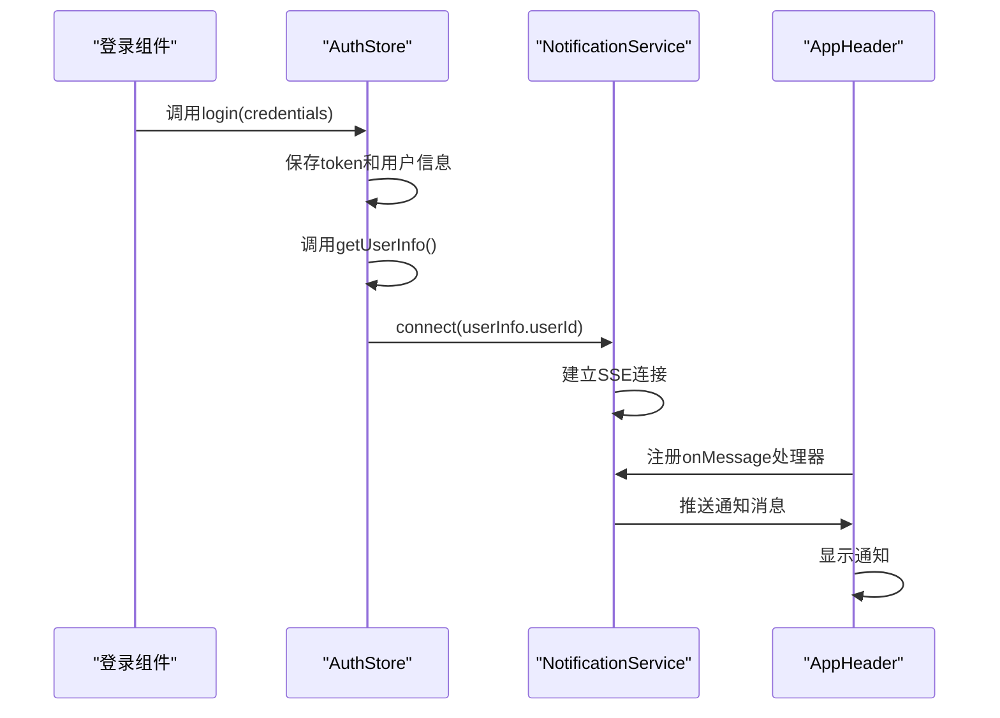

# 实时通知服务

<cite>
**本文档引用的文件**  
- [notification.ts](file://src/services/notification.ts)
- [SSE_TOKEN_AUTH_CHANGE.md](file://SSE_TOKEN_AUTH_CHANGE.md)
- [AppHeader.vue](file://src/layouts/AppHeader.vue)
- [auth.ts](file://src/stores/auth.ts)
</cite>

## 目录
1. [简介](#简介)
2. [核心组件](#核心组件)
3. [连接建立与安全机制](#连接建立与安全机制)
4. [自动重连机制](#自动重连机制)
5. [消息监听与处理](#消息监听与处理)
6. [客户端集成示例](#客户端集成示例)
7. [调试与日志](#调试与日志)
8. [结论](#结论)

## 简介
本API文档全面解析了基于SSE（Server-Sent Events）的实时通知服务实现。系统采用fetch + ReadableStream替代原生EventSource，以支持Authorization请求头传递token，确保认证信息的安全性。文档详细说明了connect()方法如何建立安全的SSE连接，disconnect()方法如何优雅断开，以及自动重连机制的实现原理。同时，阐述了onMessage()事件监听器的注册与取消机制，支持多个处理器同时监听消息。结合SSE_TOKEN_AUTH_CHANGE.md中的代码变更，说明了安全性增强的背景与实现细节，并提供客户端集成示例。

## 核心组件

**Section sources**
- [notification.ts](file://src/services/notification.ts#L11-L309)
- [SSE_TOKEN_AUTH_CHANGE.md](file://SSE_TOKEN_AUTH_CHANGE.md#L0-L285)

## 连接建立与安全机制

### 为何采用fetch + ReadableStream
原生EventSource API不支持自定义请求头，无法通过Authorization头传递token，只能将token作为URL查询参数，存在安全风险。因此，采用fetch API结合ReadableStream，既能支持自定义请求头，又能实现SSE流式通信。



**Diagram sources**
- [notification.ts](file://src/services/notification.ts#L25-L145)

### connect()方法详解
`connect(userId)`方法负责建立安全的SSE连接：
1. 若已有连接，先调用disconnect()断开旧连接
2. 从storage中获取token，若无token则连接失败
3. 构建连接URL，格式为`https://patent.langdetech.cn/api/sse/connect/{userId}`
4. 创建AbortController用于取消请求
5. 使用fetch发起GET请求，携带Authorization、Accept等请求头
6. 成功响应后，通过response.body.getReader()获取流读取器
7. 递归调用readStream()读取数据块并解析

**Section sources**
- [notification.ts](file://src/services/notification.ts#L25-L145)
- [SSE_TOKEN_AUTH_CHANGE.md](file://SSE_TOKEN_AUTH_CHANGE.md#L45-L110)

### 安全性增强实现
根据SSE_TOKEN_AUTH_CHANGE.md文档，后端要求token必须通过Authorization请求头传递。实现方案如下：
- **请求头设置**：在fetch请求中设置`'Authorization': token`
- **CORS配置**：后端需配置Access-Control-Allow-Headers允许Authorization头
- **Token存储**：token存储在localStorage中，通过storage.get()获取
- **连接URL**：不再将token作为URL参数，避免泄露风险

**Section sources**
- [SSE_TOKEN_AUTH_CHANGE.md](file://SSE_TOKEN_AUTH_CHANGE.md#L0-L285)
- [notification.ts](file://src/services/notification.ts#L45-L65)

## 自动重连机制

### 实现原理
当SSE连接断开时，系统会自动尝试重连，最多5次，每次间隔3秒。重连机制由`handleReconnect(userId)`方法实现。

```mermaid
flowchart TD
A[连接断开] --> B{重连次数 < 5?}
B --> |是| C[递增重连次数]
C --> D[设置3秒后重连定时器]
D --> E[调用connect(userId)]
B --> |否| F[停止重连]
```

**Diagram sources**
- [notification.ts](file://src/services/notification.ts#L199-L237)

### 关键实现
- **重连计数**：`reconnectAttempts`记录当前重连次数，`maxReconnectAttempts = 5`
- **延迟重连**：`reconnectDelay = 3000`毫秒，使用setTimeout实现
- **清除旧定时器**：每次重连前清除之前的reconnectTimer
- **触发条件**：流结束(done为true)、读取流错误、连接错误时触发

**Section sources**
- [notification.ts](file://src/services/notification.ts#L199-L237)

## 消息监听与处理

### onMessage()事件监听器
`onMessage(handler)`方法用于注册消息处理器，支持多个处理器同时监听。



**Diagram sources**
- [notification.ts](file://src/services/notification.ts#L270-L284)

### 消息处理流程
1. **注册处理器**：调用onMessage()，将处理器函数加入messageHandlers数组
2. **返回取消函数**：返回一个函数，调用时从数组中移除该处理器
3. **触发处理器**：收到消息后，遍历所有处理器并调用
4. **错误隔离**：每个处理器调用都用try-catch包裹，一个失败不影响其他

**Section sources**
- [notification.ts](file://src/services/notification.ts#L270-L284)
- [notification.ts](file://src/services/notification.ts#L199-L237)

### 消息解析与过滤
#### 消息解析
`parseSSEMessage(chunk)`方法解析SSE消息：
- 优先尝试JSON解析，提取id、title、message等字段
- JSON解析失败时，将原始文本作为消息内容
- 支持多种字段名：message、content、msg

#### 消息过滤
在AppHeader.vue中，对接收到的消息进行过滤，避免显示系统消息：
```typescript
const isConnectionMessage = 
  message.message.includes('连接成功') || 
  message.message.match(/连接成功[:：]\s*\d+/) ||
  (message.title === '系统通知' && message.message.includes('连接'))
if (isConnectionMessage) return // 过滤掉
```

**Section sources**
- [notification.ts](file://src/services/notification.ts#L147-L197)
- [AppHeader.vue](file://src/layouts/AppHeader.vue#L203-L284)

## disconnect()方法
`disconnect()`方法负责优雅断开SSE连接：
1. 关闭EventSource连接（向后兼容）
2. 取消fetch请求（通过AbortController.abort()）
3. 清除重连定时器
4. 重置重连次数和用户ID

```mermaid
flowchart TD
A[调用disconnect] --> B{eventSource存在?}
B --> |是| C[关闭EventSource]
C --> D{abortController存在?}
B --> |否| D
D --> |是| E[调用abortController.abort()]
E --> F{reconnectTimer存在?}
D --> |否| F
F --> |是| G[清除reconnectTimer]
G --> H[重置reconnectAttempts和currentUserId]
F --> |否| H
H --> I[断开完成]
```

**Diagram sources**
- [notification.ts](file://src/services/notification.ts#L236-L263)

**Section sources**
- [notification.ts](file://src/services/notification.ts#L236-L263)

## 客户端集成示例

### 登录后启动通知监听
在用户登录成功后，自动获取用户信息并建立SSE连接。



**Diagram sources**
- [auth.ts](file://src/stores/auth.ts#L19-L83)
- [AppHeader.vue](file://src/layouts/AppHeader.vue#L89-L285)

### 关键代码路径
- **登录触发连接**：`src/stores/auth.ts`中的login()方法，登录成功后调用`notificationService.connect(userInfo.userId)`
- **组件监听消息**：`src/layouts/AppHeader.vue`中的onMounted生命周期，调用`connectSSE(props.user.userId)`建立连接并注册处理器
- **登出断开连接**：`src/stores/auth.ts`中的logout()方法，调用`notificationService.disconnect()`断开连接

**Section sources**
- [auth.ts](file://src/stores/auth.ts#L19-L83)
- [AppHeader.vue](file://src/layouts/AppHeader.vue#L89-L285)
- [auth.ts](file://src/stores/auth.ts#L113-L132)

## 调试与日志
系统提供了详细的调试日志，便于排查问题：
- **连接流程**：从connect调用到连接成功，每一步都有日志输出
- **消息接收**：显示原始数据、解析后的数据和最终通知对象
- **错误处理**：连接错误、读取错误、处理器执行失败均有日志
- **重连机制**：显示重连次数和倒计时

可通过浏览器控制台检查连接状态：
```javascript
// 检查是否已连接
notificationService.isConnected()

// 获取连接状态
notificationService.getConnectionState()
```

**Section sources**
- [SSE_DEBUG_GUIDE.md](file://SSE_DEBUG_GUIDE.md#L0-L358)

## 结论
本实时通知服务通过fetch + ReadableStream实现了安全的SSE连接，解决了原生EventSource无法传递Authorization头的问题。系统具备自动重连、多处理器监听、消息解析容错和过滤等特性，确保了通知的可靠性和用户体验。客户端集成简单，登录后自动建立连接，登出时自动断开，形成了完整的生命周期管理。