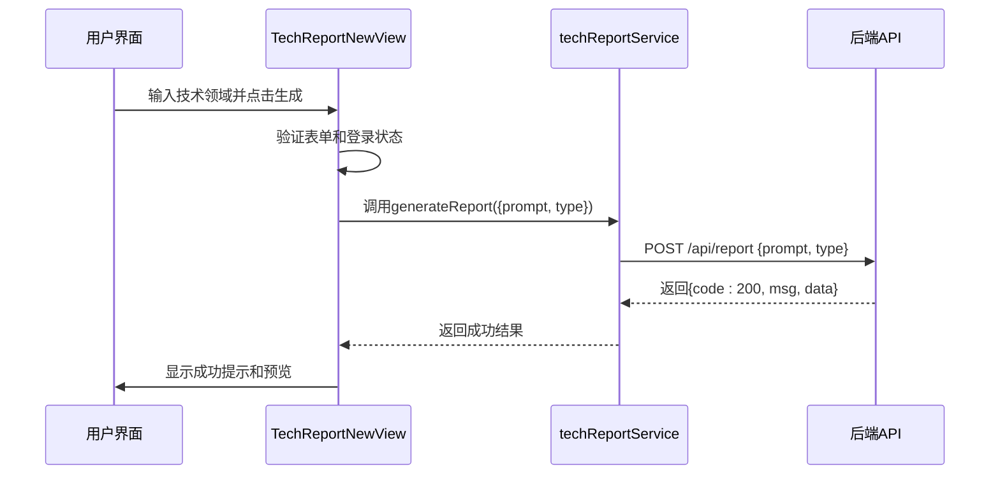
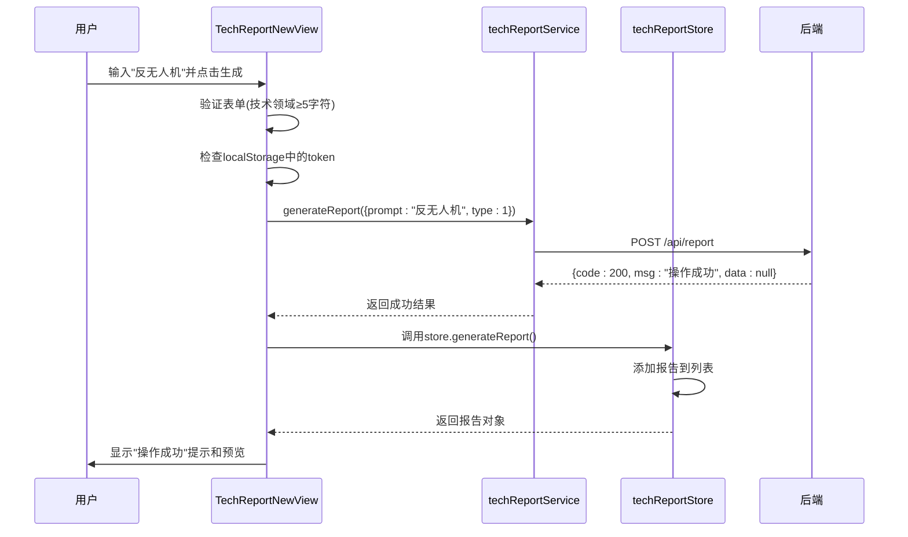

# 技术方案报告服务

<cite>
**Referenced Files in This Document**   
- [TECH_REPORT_API.md](file://TECH_REPORT_API.md)
- [techReport.ts](file://src/services/techReport.ts)
- [TechReportNewView.vue](file://src/views/tech-report/TechReportNewView.vue)
- [techReport.ts](file://src/stores/techReport.ts)
</cite>

## 目录
1. [简介](#简介)
2. [API接口机制](#api接口机制)
3. [请求参数结构](#请求参数结构)
4. [服务层错误处理](#服务层错误处理)
5. [调用流程示例](#调用流程示例)

## 简介
本技术方案报告服务API文档系统阐述了报告生成与管理的接口调用机制。文档详细解析了`generateReport()`方法如何通过POST请求将用户输入的prompt和类型参数发送至/report接口，并处理成功响应（code=200）与各类错误情况（后端错误、网络异常）。文档说明了请求参数GenerateReportRequest的结构定义及其默认值处理逻辑，描述了服务层的错误捕获与抛出机制，确保上层store能接收到可读的错误信息，并提供了实际调用示例。

**Section sources**
- [TECH_REPORT_API.md](file://TECH_REPORT_API.md#L1-L262)

## API接口机制

技术方案报告服务通过`/api/report`接口实现报告生成功能，采用POST请求方式与后端进行通信。前端通过`techReportService.generateReport()`方法封装API调用，该方法负责构建请求、处理响应和管理错误。

当用户在前端界面输入技术领域描述并点击"生成报告"按钮时，系统会触发`generateReport()`函数。该函数首先进行表单验证和登录状态检查，然后调用服务层的`techReportService.generateReport()`方法，将用户输入的prompt和类型参数作为请求体发送至后端。

后端成功处理请求后返回code=200的状态码，表示操作成功。前端接收到成功响应后，会显示成功提示信息，并根据返回的数据更新预览内容。如果后端返回非200状态码或发生网络异常，系统会捕获错误并显示相应的错误信息。



**Diagram sources**
- [TechReportNewView.vue](file://src/views/tech-report/TechReportNewView.vue#L151-L279)
- [techReport.ts](file://src/services/techReport.ts#L63-L95)

**Section sources**
- [TechReportNewView.vue](file://src/views/tech-report/TechReportNewView.vue#L151-L279)
- [techReport.ts](file://src/services/techReport.ts#L63-L95)

## 请求参数结构

报告生成请求的参数结构由`GenerateReportRequest`接口定义，包含两个核心属性：`prompt`和`type`。

`prompt`参数为必填字段，类型为字符串，用于传递用户输入的技术领域描述。该参数是生成报告的核心输入，系统将根据此描述生成相应的技术方案分析。

`type`参数为可选字段，类型为数字，默认值为1。该参数用于指定报告类型，在当前实现中固定为技术方案报告类型。

在服务层实现中，系统会对`type`参数进行默认值处理。如果调用方未提供`type`值，系统会自动使用默认值1，确保请求的完整性。

```mermaid
classDiagram
class GenerateReportRequest {
+prompt : string
+type? : number
}
note right of GenerateReportRequest
请求参数接口定义
prompt : 必填，技术领域描述
type : 可选，报告类型，默认为1
end note
```

**Diagram sources**
- [techReport.ts](file://src/services/techReport.ts#L57-L60)

**Section sources**
- [techReport.ts](file://src/services/techReport.ts#L57-L60)
- [TECH_REPORT_API.md](file://TECH_REPORT_API.md#L24-L32)

## 服务层错误处理

服务层实现了完善的错误捕获与抛出机制，确保上层store能接收到清晰、可读的错误信息。`techReportService.generateReport()`方法通过try-catch结构捕获所有异常，并根据错误类型进行分类处理。

对于后端返回的错误，系统会检查响应数据中的`msg`字段，并将其作为错误信息抛出。对于网络异常，系统会区分不同类型的错误情况：超时错误会转换为"报告生成时间较长，已提交后台处理"的友好提示；登录过期错误会直接抛出，触发重新登录流程；其他网络错误则统一提示"网络错误，请检查网络连接"。

这种分层的错误处理机制确保了用户能够获得有意义的反馈，同时保持了代码的健壮性。错误信息会被逐层向上传递，最终由store的action捕获并记录到控制台，同时抛出给调用方处理。

```mermaid
flowchart TD
Start([开始生成报告]) --> Try[try块]
Try --> API[调用API]
API --> Response{响应成功?}
Response --> |是| CheckCode{code=200?}
CheckCode --> |是| ReturnSuccess[返回成功结果]
CheckCode --> |否| ThrowBackend[抛出后端错误]
Response --> |否| CheckError{错误类型}
CheckError --> Timeout[超时错误]
CheckError --> LoginExpired[登录过期]
CheckError --> Network[其他网络错误]
Timeout --> ThrowTimeout[抛出"已提交后台处理"]
LoginExpired --> ThrowLogin[直接抛出]
Network --> ThrowNetwork[抛出"网络错误"]
ThrowBackend --> Catch[catch块]
ThrowTimeout --> Catch
ThrowLogin --> Catch
ThrowNetwork --> Catch
Catch --> End([抛出错误])
ReturnSuccess --> End
```

**Diagram sources**
- [techReport.ts](file://src/services/techReport.ts#L63-L95)

**Section sources**
- [techReport.ts](file://src/services/techReport.ts#L63-L95)

## 调用流程示例

从用户输入到触发API请求的完整流程始于`TechReportNewView.vue`组件中的`generateReport()`方法。用户在界面输入技术领域描述后，点击"生成报告"按钮触发此方法。

首先，系统会验证表单输入的有效性，确保技术领域描述不为空且达到最小长度要求。接着检查用户登录状态，若未登录则提示用户先登录。验证通过后，系统设置生成状态为true，并启动模拟进度条。

随后，系统调用`techReportService.generateReport()`方法，传入包含用户输入prompt和类型参数的对象。服务层方法处理请求并返回结果。如果成功，系统更新预览数据并显示成功提示；如果失败，则根据错误类型显示相应的错误信息。

store中的`generateReport` action也实现了类似的流程，为其他组件提供了统一的报告生成功能接口。



**Diagram sources**
- [TechReportNewView.vue](file://src/views/tech-report/TechReportNewView.vue#L151-L279)
- [techReport.ts](file://src/stores/techReport.ts#L25-L47)

**Section sources**
- [TechReportNewView.vue](file://src/views/tech-report/TechReportNewView.vue#L151-L279)
- [techReport.ts](file://src/stores/techReport.ts#L25-L47)
- [TECH_REPORT_API.md](file://TECH_REPORT_API.md#L88-L118)