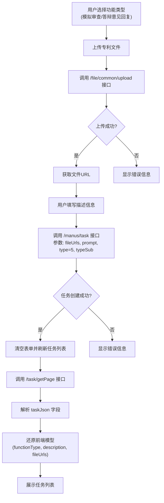
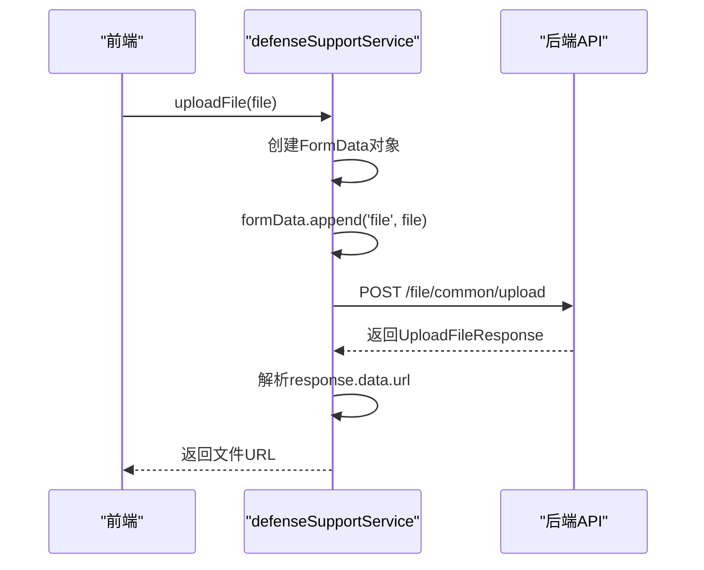
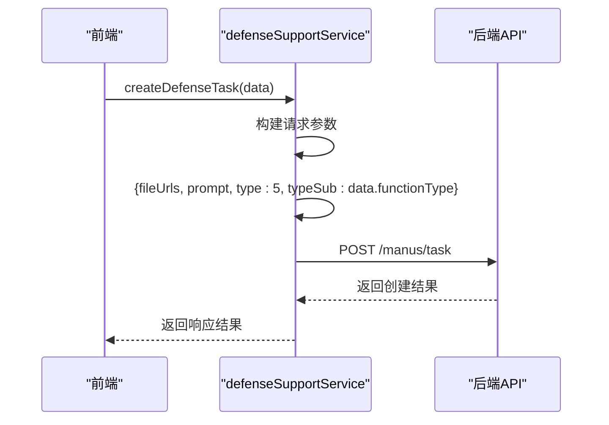
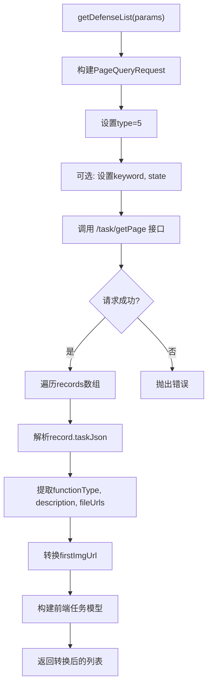
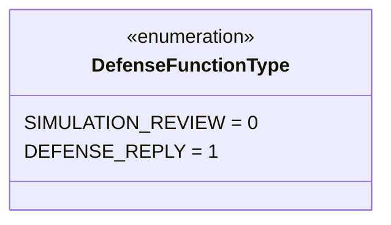
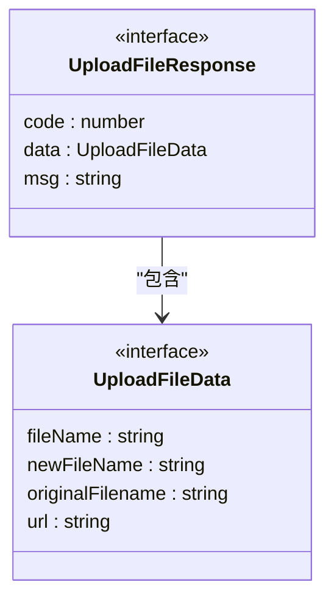
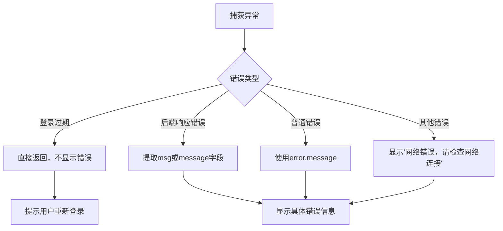

# 答辩支持服务

<cite>
**Referenced Files in This Document**   
- [defenseSupport.ts](file://src/services/defenseSupport.ts)
- [DEFENSE_SUPPORT_API_INTEGRATION.md](file://DEFENSE_SUPPORT_API_INTEGRATION.md)
</cite>

## 目录
1. [简介](#简介)
2. [核心组件](#核心组件)
3. [业务流程](#业务流程)
4. [接口实现详解](#接口实现详解)
5. [数据模型与类型定义](#数据模型与类型定义)
6. [错误处理机制](#错误处理机制)

## 简介
本API文档详细解析了答辩支持服务的核心功能实现，涵盖文件上传、答辩任务创建与任务列表查询三大核心接口。系统支持两种功能模式：模拟审查（typeSub=0）和答辩意见回复（typeSub=1）。用户通过前端界面上传专利文件（PDF/DOC/DOCX），系统将文件上传至`/file/common/upload`接口获取文件URL，随后结合用户输入的描述信息和选择的功能类型，调用`/manus/task`接口创建答辩任务。任务创建后，用户可通过`/task/getPage`接口查询任务列表，查看任务状态、结果文件及详细信息。

## 核心组件

本节深入分析答辩支持服务的核心方法实现，包括文件上传、任务创建和任务列表查询。

**Section sources**
- [defenseSupport.ts](file://src/services/defenseSupport.ts#L65-L265)

## 业务流程

以下流程图展示了从文件上传到任务创建再到列表查询的完整业务流程。



**Diagram sources**
- [defenseSupport.ts](file://src/services/defenseSupport.ts#L65-L265)
- [DEFENSE_SUPPORT_API_INTEGRATION.md](file://DEFENSE_SUPPORT_API_INTEGRATION.md#L1-L298)

## 接口实现详解

### 文件上传 (uploadFile)

`uploadFile`方法负责将用户选择的专利文件上传至服务器。该方法使用`FormData`对象封装文件数据，并通过`/file/common/upload`接口进行上传。上传成功后，从响应中提取文件的URL，供后续任务创建使用。



**Diagram sources**
- [defenseSupport.ts](file://src/services/defenseSupport.ts#L65-L95)

### 创建答辩任务 (createDefenseTask)

`createDefenseTask`方法用于创建答辩支持任务。该方法接收用户选择的功能类型（`functionType`）、上传文件的URL数组（`fileUrls`）以及用户输入的描述信息（`prompt`），并将其封装为请求参数，调用`/manus/task`接口。其中，`type`固定为5表示答辩支持，`typeSub`根据`functionType`的值设置为0（模拟审查）或1（答辩意见回复）。



**Diagram sources**
- [defenseSupport.ts](file://src/services/defenseSupport.ts#L97-L135)

### 查询任务列表 (getDefenseList)

`getDefenseList`方法用于获取答辩支持任务的分页列表。该方法首先构建分页查询参数（`PageQueryRequest`），其中`type`固定为5。请求成功后，对返回的每条记录进行数据转换，特别是从`taskJson`字段中解析出`functionType`、`description`和`fileUrls`等关键信息，以还原为前端所需的模型。



**Diagram sources**
- [defenseSupport.ts](file://src/services/defenseSupport.ts#L137-L265)

## 数据模型与类型定义

本节定义了答辩支持服务中使用的核心数据类型。

### 功能类型枚举 (DefenseFunctionType)

该枚举定义了答辩支持服务的两种功能模式。



**Diagram sources**
- [defenseSupport.ts](file://src/services/defenseSupport.ts#L4-L7)

### 分页查询请求 (PageQueryRequest)

该接口定义了分页查询的通用请求参数，`type`字段值为5表示答辩支持。

```mermaid
classDiagram
class PageQueryRequest {
<<interface>>
keyword? : string
pageIndex? : number
pageSize? : number
pageSorts? : Array<{asc : boolean, column : string}>
state? : number
type : number // 5 : 答辩支持
}
```

**Diagram sources**
- [defenseSupport.ts](file://src/services/defenseSupport.ts#L10-L20)

### 文件上传响应 (UploadFileResponse)

该接口定义了文件上传接口的响应数据结构。



**Diagram sources**
- [defenseSupport.ts](file://src/services/defenseSupport.ts#L50-L59)

## 错误处理机制

系统实现了完善的错误处理机制，确保用户能够获得清晰的反馈。



**Diagram sources**
- [defenseSupport.ts](file://src/services/defenseSupport.ts#L75-L95)
- [defenseSupport.ts](file://src/services/defenseSupport.ts#L115-L135)
- [defenseSupport.ts](file://src/services/defenseSupport.ts#L175-L195)