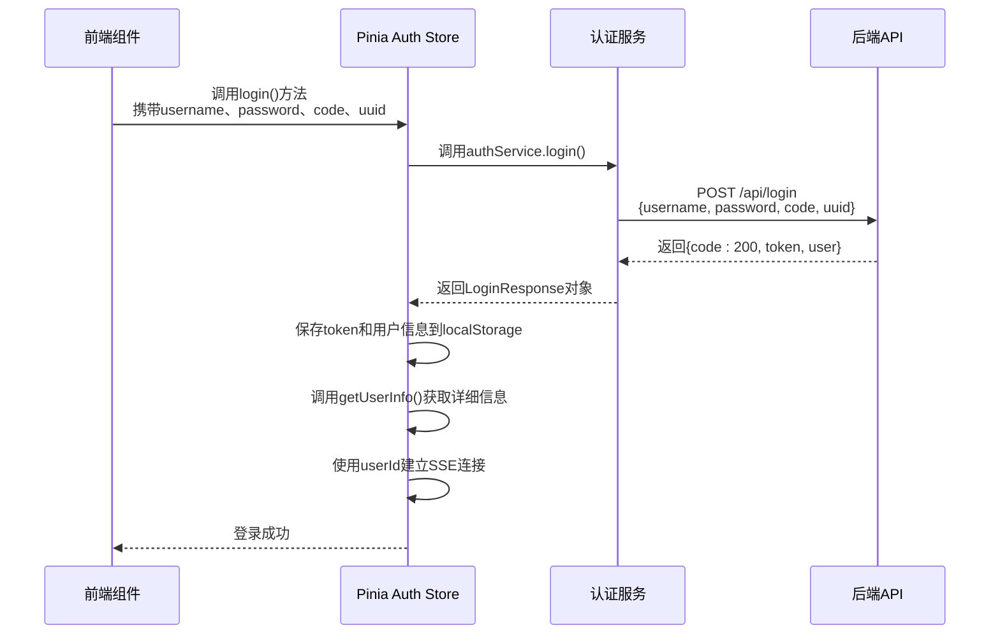
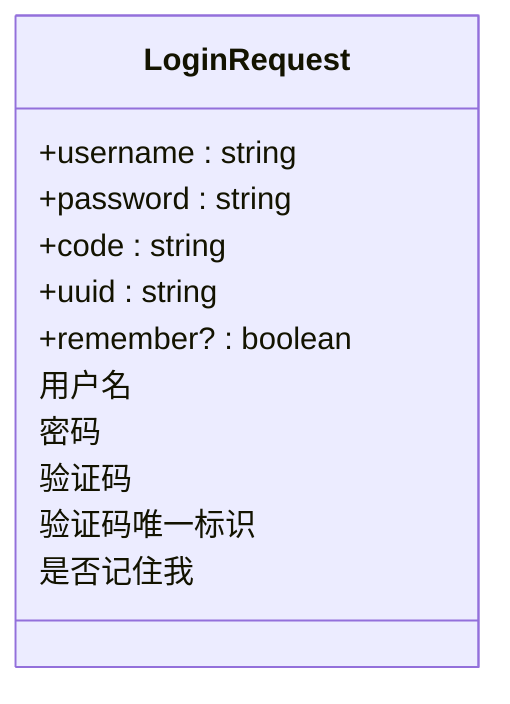
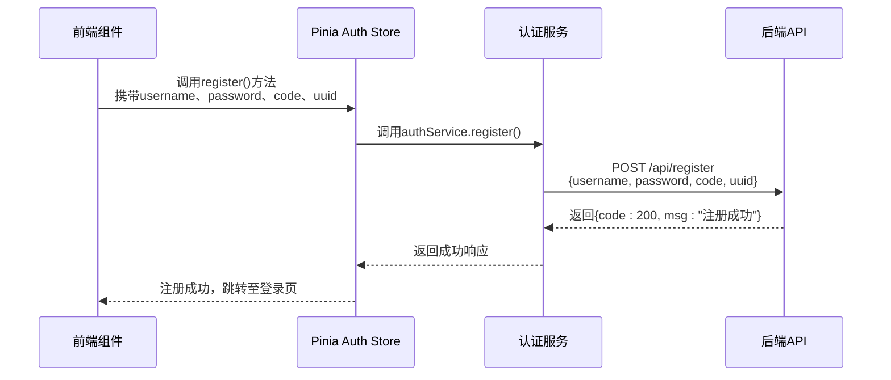
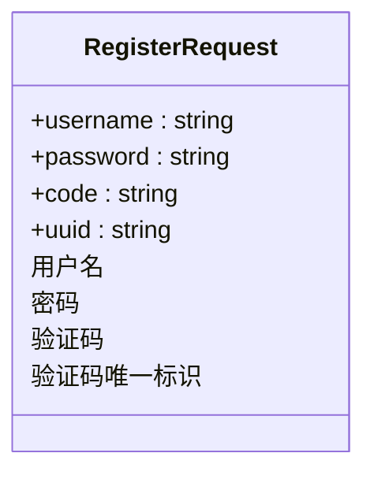
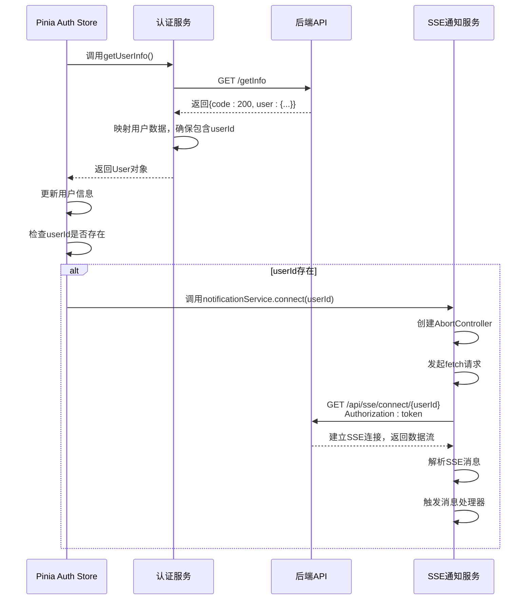
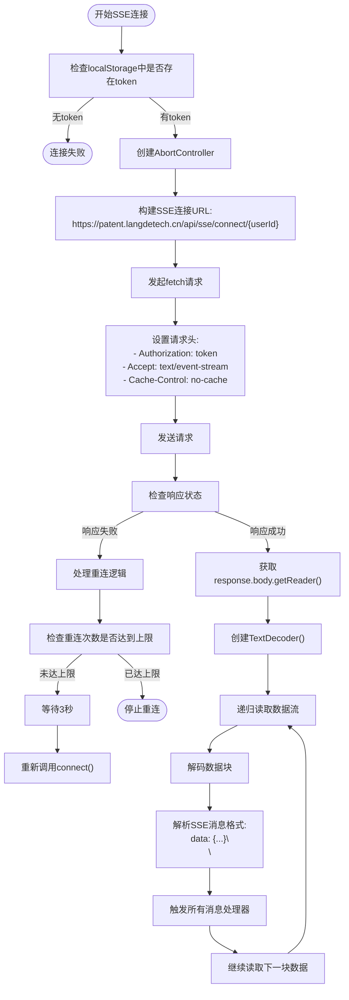
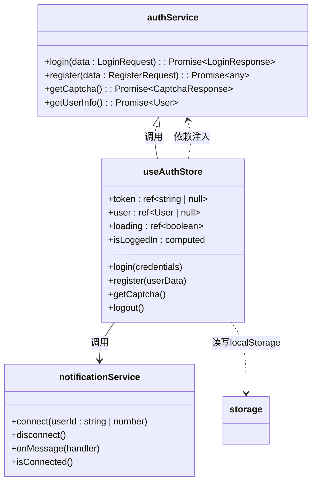
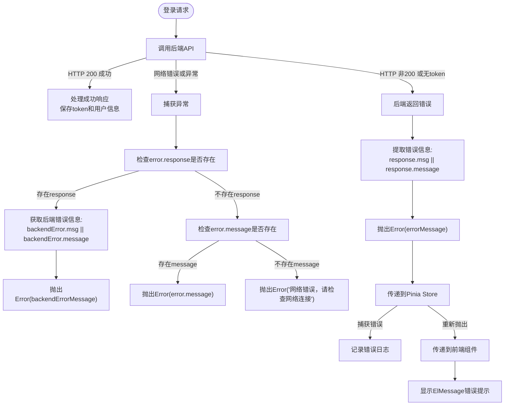

# 认证服务

<cite>
**本文档引用的文件**  
- [auth.ts](file://src/services/auth.ts)
- [auth.ts](file://src/stores/auth.ts)
- [notification.ts](file://src/services/notification.ts)
- [index.ts](file://src/types/index.ts)
- [LOGIN_CAPTCHA_INTEGRATION.md](file://LOGIN_CAPTCHA_INTEGRATION.md)
- [REGISTER_API_INTEGRATION.md](file://REGISTER_API_INTEGRATION.md)
- [SSE_TOKEN_AUTH_CHANGE.md](file://SSE_TOKEN_AUTH_CHANGE.md)
</cite>

## 目录
1. [简介](#简介)
2. [核心接口实现](#核心接口实现)
3. [登录流程详解](#登录流程详解)
4. [注册流程分析](#注册流程分析)
5. [验证码获取机制](#验证码获取机制)
6. [用户信息获取与SSE集成](#用户信息获取与sse集成)
7. [服务层与Pinia状态管理交互](#服务层与pinia状态管理交互)
8. [错误处理机制](#错误处理机制)
9. [数据结构定义](#数据结构定义)
10. [安全特性说明](#安全特性说明)

## 简介
本系统实现了完整的用户认证功能，包括登录、注册、验证码验证和用户信息管理。认证服务通过API接口与后端交互，并与前端Pinia状态管理store集成，实现用户状态的持久化和实时通知功能。系统采用JWT令牌进行身份验证，并通过SSE（Server-Sent Events）实现服务器向客户端的实时消息推送。

## 核心接口实现

认证服务的核心功能由`authService`对象提供，包含登录、注册、获取验证码、获取用户信息等关键方法。这些方法通过HTTP请求与后端API进行通信，处理请求和响应数据。

**Section sources**
- [auth.ts](file://src/services/auth.ts#L1-L247)

## 登录流程详解

### 登录接口调用
`login()`方法用于处理用户登录请求，接收包含用户名、密码和验证码信息的请求对象，并调用`/api/login`接口完成认证。



**Diagram sources**
- [auth.ts](file://src/services/auth.ts#L28-L88)
- [auth.ts](file://src/stores/auth.ts#L45-L98)

### 登录参数结构
登录请求需要提供完整的认证信息，包括用户名、密码和验证码相关数据。



**Diagram sources**
- [auth.ts](file://src/services/auth.ts#L6-L11)

**Section sources**
- [auth.ts](file://src/services/auth.ts#L6-L11)
- [LOGIN_CAPTCHA_INTEGRATION.md](file://LOGIN_CAPTCHA_INTEGRATION.md#L45-L55)

## 注册流程分析

### 注册接口调用
`register()`方法处理用户注册请求，将用户提交的注册信息发送到`/api/register`接口。



**Diagram sources**
- [auth.ts](file://src/services/auth.ts#L118-L152)
- [auth.ts](file://src/stores/auth.ts#L100-L115)

### 注册参数结构
注册请求需要提供必要的用户信息和验证码验证数据。



**Diagram sources**
- [auth.ts](file://src/services/auth.ts#L12-L16)

**Section sources**
- [auth.ts](file://src/services/auth.ts#L12-L16)
- [REGISTER_API_INTEGRATION.md](file://REGISTER_API_INTEGRATION.md#L45-L55)

## 验证码获取机制

### 验证码获取流程
`getCaptcha()`方法用于获取验证码图片，调用`/api/captchaImage`接口获取Base64编码的图片数据。

```mermaid
sequenceDiagram
participant 前端 as 前端组件
participant Store as Pinia Auth Store
participant Service as 认证服务
participant API as 后端API
前端->>Store : 调用getCaptcha()方法
Store->>Service : 调用authService.getCaptcha()
Service->>API : GET /captchaImage
API-->>Service : 返回{code : 200, uuid, img}
Service->>Service : 处理img数据，添加data : image/jpeg;base64,前缀
Service-->>Store : 返回CaptchaResponse对象
Store-->>前端 : 返回处理后的验证码图片和uuid
```

**Diagram sources**
- [auth.ts](file://src/services/auth.ts#L95-L115)
- [auth.ts](file://src/stores/auth.ts#L117-L127)

### 验证码响应结构
验证码接口返回包含唯一标识和图片数据的响应对象。

```mermaid
classDiagram
class CaptchaResponse {
+uuid : string
+img : string
}
CaptchaResponse : 验证码唯一标识
CaptchaResponse : Base64编码的图片数据<br/>已添加data : image/jpeg;base64,前缀
```

**Diagram sources**
- [auth.ts](file://src/services/auth.ts#L18-L22)

**Section sources**
- [auth.ts](file://src/services/auth.ts#L18-L22)
- [LOGIN_CAPTCHA_INTEGRATION.md](file://LOGIN_CAPTCHA_INTEGRATION.md#L25-L35)

## 用户信息获取与SSE集成

### 获取用户信息并建立SSE连接
`getInfo()`接口返回用户详细信息，其中包含用于建立SSE连接的`userId`字段。



**Diagram sources**
- [auth.ts](file://src/services/auth.ts#L175-L203)
- [auth.ts](file://src/stores/auth.ts#L65-L85)
- [notification.ts](file://src/services/notification.ts#L15-L135)

**Section sources**
- [auth.ts](file://src/services/auth.ts#L175-L203)
- [auth.ts](file://src/stores/auth.ts#L65-L85)
- [notification.ts](file://src/services/notification.ts#L15-L135)

### SSE连接实现
由于标准EventSource不支持自定义请求头，系统采用fetch API + ReadableStream方式实现SSE连接，通过Authorization请求头传递token。



**Diagram sources**
- [notification.ts](file://src/services/notification.ts#L15-L135)
- [SSE_TOKEN_AUTH_CHANGE.md](file://SSE_TOKEN_AUTH_CHANGE.md#L45-L75)

## 服务层与Pinia状态管理交互

### 认证服务与Pinia Store的调用关系
认证服务（authService）作为底层API调用层，被Pinia认证store封装，提供状态管理和业务逻辑处理。



**Diagram sources**
- [auth.ts](file://src/services/auth.ts#L26-L247)
- [auth.ts](file://src/stores/auth.ts#L1-L262)
- [notification.ts](file://src/services/notification.ts#L15-L313)

**Section sources**
- [auth.ts](file://src/services/auth.ts#L26-L247)
- [auth.ts](file://src/stores/auth.ts#L1-L262)

## 错误处理机制

### 登录失败时的错误传递
系统实现了完善的错误处理机制，确保用户能够获得清晰的错误反馈。



**Diagram sources**
- [auth.ts](file://src/services/auth.ts#L35-L85)
- [auth.ts](file://src/stores/auth.ts#L45-L98)

**Section sources**
- [auth.ts](file://src/services/auth.ts#L35-L85)
- [auth.ts](file://src/stores/auth.ts#L45-L98)

## 数据结构定义

### 核心类型定义
系统定义了完整的类型接口，确保类型安全和代码可维护性。

```mermaid
classDiagram
class LoginRequest {
+username : string
+password : string
+code : string
+uuid : string
+remember? : boolean
}
class RegisterRequest {
+username : string
+password : string
+code : string
+uuid : string
}
class CaptchaResponse {
+uuid : string
+img : string
}
class LoginResponse {
+token : string
+user : User
+expiresIn : number
}
class User {
+id : string
+username : string
+email : string
+role : UserRole
+createdAt : string
+updatedAt : string
+userId? : string | number
}
enum UserRole {
USER
ADMIN
VIP
}
LoginRequest <|-- authService.login
RegisterRequest <|-- authService.register
CaptchaResponse <|-- authService.getCaptcha
LoginResponse <|-- authService.login
User <|-- authService.getUserInfo
User <|-- useAuthStore.user
UserRole <|-- User.role
```

**Diagram sources**
- [auth.ts](file://src/services/auth.ts#L6-L25)
- [index.ts](file://src/types/index.ts#L10-L20)

**Section sources**
- [auth.ts](file://src/services/auth.ts#L6-L25)
- [index.ts](file://src/types/index.ts#L10-L20)

## 安全特性说明

### 认证安全机制
系统实现了多层次的安全防护机制，确保用户账户安全。

```mermaid
flowchart TD
A[登录/注册安全] --> B[验证码验证]
B --> B1[每次请求需提供验证码]
B --> B2[验证码一次性使用]
B --> B3[验证码具有时效性]
A --> C[Token管理]
C --> C1[使用JWT进行身份验证]
C --> C2[Token存储在localStorage]
C --> C3[支持"记住我"功能]
C --> C4[Token过期自动刷新]
A --> D[SSE连接安全]
D --> D1[通过Authorization请求头传递Token]
D --> D2[不在URL中暴露Token]
D --> D3[连接前验证用户认证状态]
A --> E[错误处理安全]
E --> E1[显示友好的错误信息]
E --> E2[不暴露系统内部细节]
E --> E3[网络错误统一提示]
A --> F[数据传输安全]
F --> F1[所有API通过HTTPS访问]
F --> F2[敏感信息加密传输]
```

**Diagram sources**
- [LOGIN_CAPTCHA_INTEGRATION.md](file://LOGIN_CAPTCHA_INTEGRATION.md#L155-L175)
- [SSE_TOKEN_AUTH_CHANGE.md](file://SSE_TOKEN_AUTH_CHANGE.md#L15-L25)
- [auth.ts](file://src/services/auth.ts#L28-L247)

**Section sources**
- [LOGIN_CAPTCHA_INTEGRATION.md](file://LOGIN_CAPTCHA_INTEGRATION.md#L155-L175)
- [SSE_TOKEN_AUTH_CHANGE.md](file://SSE_TOKEN_AUTH_CHANGE.md#L15-L25)