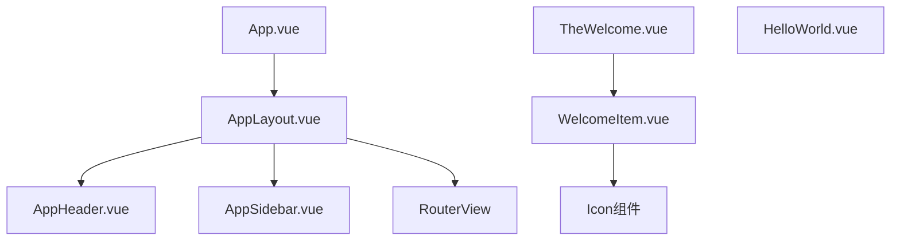
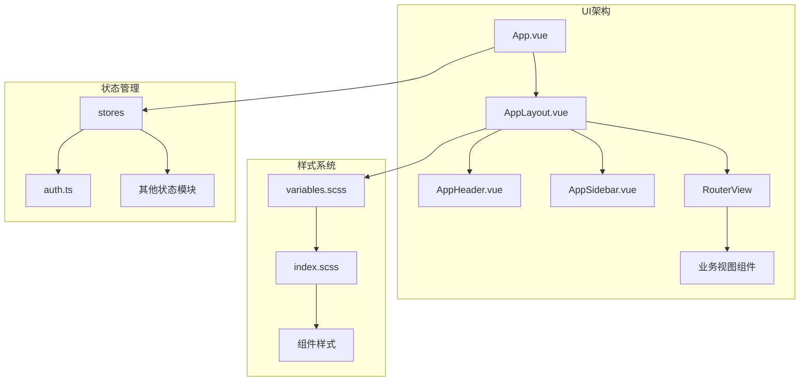
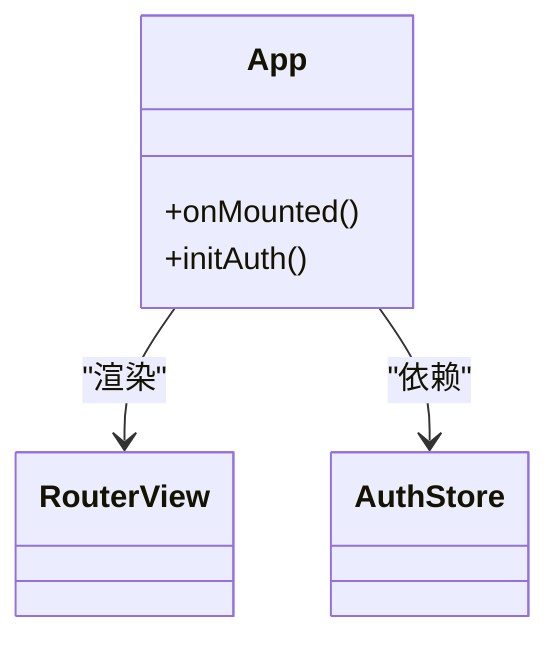
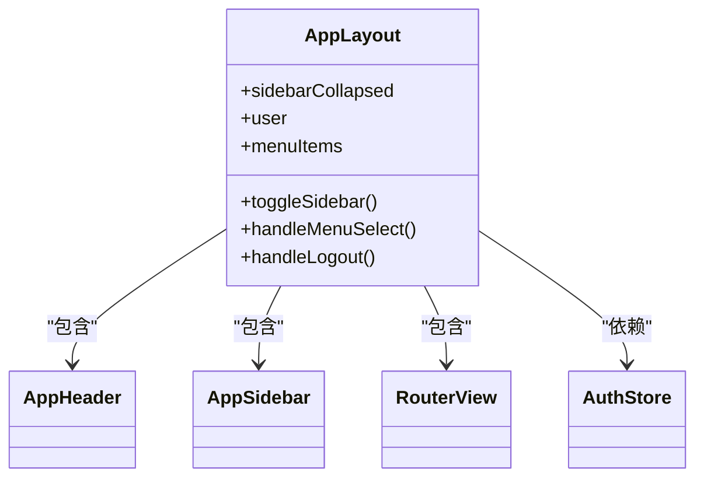
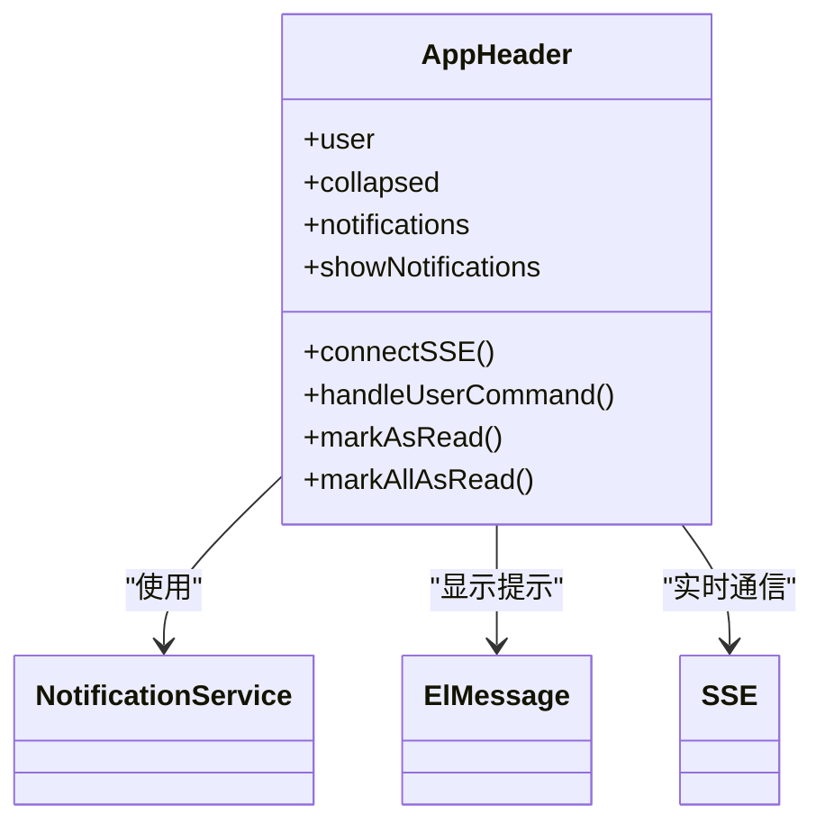
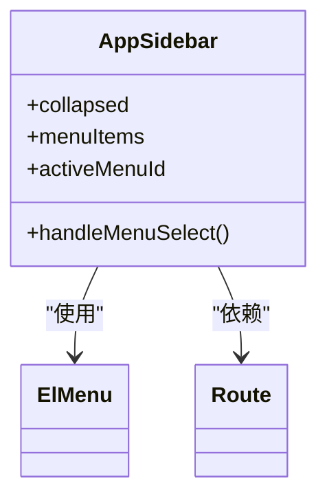
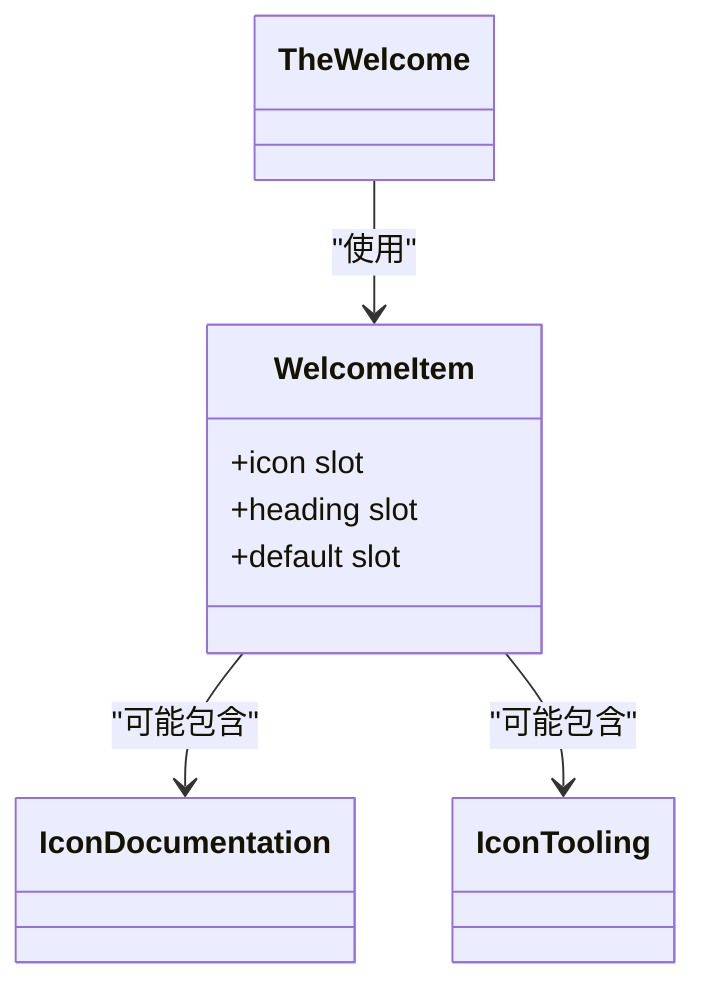
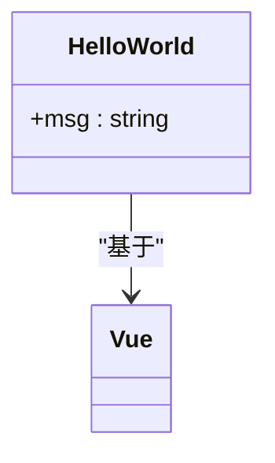
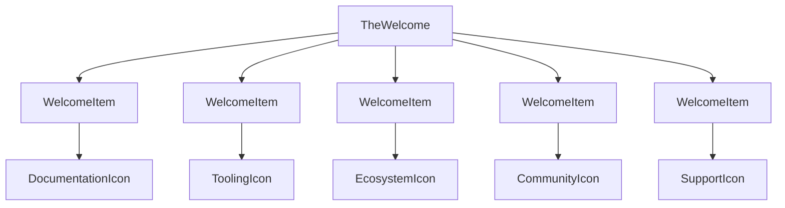
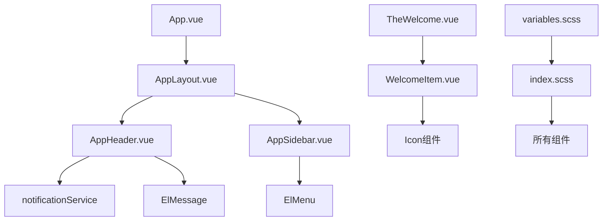

# UI架构与组件体系

<cite>
**Referenced Files in This Document**  
- [App.vue](file://src/App.vue)
- [AppLayout.vue](file://src/layouts/AppLayout.vue)
- [AppHeader.vue](file://src/layouts/AppHeader.vue)
- [AppSidebar.vue](file://src/layouts/AppSidebar.vue)
- [WelcomeItem.vue](file://src/components/WelcomeItem.vue)
- [HelloWorld.vue](file://src/components/HelloWorld.vue)
- [TheWelcome.vue](file://src/components/TheWelcome.vue)
- [variables.scss](file://src/assets/styles/variables.scss)
- [index.scss](file://src/assets/styles/index.scss)
</cite>

## 目录
1. [简介](#简介)
2. [项目结构](#项目结构)
3. [核心组件](#核心组件)
4. [架构概览](#架构概览)
5. [详细组件分析](#详细组件分析)
6. [依赖分析](#依赖分析)
7. [性能考虑](#性能考虑)
8. [故障排除指南](#故障排除指南)
9. [结论](#结论)

## 简介
本文档详细描述了专利服务平台的UI架构与组件体系。重点阐述了以App.vue为根组件的组件分层结构，由AppLayout、AppHeader和AppSidebar构成的主布局系统如何实现一致的页面结构。文档还说明了通用组件（如WelcomeItem、HelloWorld）的设计原则和复用策略，以及组件间的嵌套关系、props传递和事件通信模式。通过组件树结构图可视化整体UI组织方式，并讨论响应式设计实现、主题样式集成（SCSS变量）和可访问性考虑。最后为新组件开发提供命名规范、目录放置和样式隔离的最佳实践。

## 项目结构

**Diagram sources**  
- [App.vue](file://src/App.vue)
- [AppLayout.vue](file://src/layouts/AppLayout.vue)
- [AppHeader.vue](file://src/layouts/AppHeader.vue)
- [AppSidebar.vue](file://src/layouts/AppSidebar.vue)
- [TheWelcome.vue](file://src/components/TheWelcome.vue)
- [WelcomeItem.vue](file://src/components/WelcomeItem.vue)

**Section sources**  
- [App.vue](file://src/App.vue)
- [AppLayout.vue](file://src/layouts/AppLayout.vue)
- [AppHeader.vue](file://src/layouts/AppHeader.vue)
- [AppSidebar.vue](file://src/layouts/AppSidebar.vue)

## 核心组件

本项目采用基于Vue 3的组件化架构，通过清晰的分层结构实现UI的模块化和可维护性。根组件App.vue负责应用的初始化和路由视图的渲染，而布局组件（AppLayout、AppHeader、AppSidebar）共同构建了统一的页面框架。通用功能组件（如WelcomeItem、HelloWorld）则体现了可复用的设计原则，通过插槽和props机制实现内容的灵活定制。

**Section sources**  
- [App.vue](file://src/App.vue)
- [AppLayout.vue](file://src/layouts/AppLayout.vue)
- [WelcomeItem.vue](file://src/components/WelcomeItem.vue)
- [HelloWorld.vue](file://src/components/HelloWorld.vue)

## 架构概览

**Diagram sources**  
- [App.vue](file://src/App.vue)
- [AppLayout.vue](file://src/layouts/AppLayout.vue)
- [variables.scss](file://src/assets/styles/variables.scss)
- [index.scss](file://src/assets/styles/index.scss)
- [auth.ts](file://src/stores/auth.ts)

## 详细组件分析

### 根组件与布局系统分析

#### App.vue根组件
App.vue作为应用的根组件，承担着初始化认证状态和渲染主视图的核心职责。它通过导入RouterView组件来实现基于Vue Router的动态内容渲染，确保不同路由对应的视图能够正确显示。组件在挂载时调用认证存储的初始化方法，确保用户状态在应用启动时得到正确加载。

**Diagram sources**  
- [App.vue](file://src/App.vue#L1-L25)
- [RouterView](file://src/App.vue#L1-L25)

#### AppLayout主布局
AppLayout组件是整个应用的布局容器，采用经典的三栏式设计：顶部导航栏、侧边栏和主内容区。它通过props接收用户信息和侧边栏折叠状态，并通过事件机制与子组件进行通信。布局组件还负责管理菜单项的配置和路由导航逻辑，确保用户操作能够正确触发页面跳转。

**Diagram sources**  
- [AppLayout.vue](file://src/layouts/AppLayout.vue#L1-L184)
- [AppHeader.vue](file://src/layouts/AppHeader.vue)
- [AppSidebar.vue](file://src/layouts/AppSidebar.vue)

#### AppHeader头部组件
AppHeader组件实现了应用的顶部导航功能，包含logo、面包屑导航、通知系统和用户信息下拉菜单。特别值得注意的是，该组件集成了SSE（Server-Sent Events）实时通知功能，在用户登录后自动建立连接，接收后端推送的消息并显示在通知抽屉中。组件通过事件emit机制与父组件通信，处理侧边栏切换和用户登出等操作。

**Diagram sources**  
- [AppHeader.vue](file://src/layouts/AppHeader.vue#L1-L451)
- [notificationService](file://src/services/notification.ts)

#### AppSidebar侧边栏组件
AppSidebar组件实现了响应式的侧边栏导航，支持折叠/展开状态切换。它接收菜单项配置作为props，通过Element Plus的el-menu组件渲染出多级导航菜单。组件通过计算属性确定当前激活的菜单项，并通过事件机制将菜单选择传递给父组件，实现路由导航。在移动端，侧边栏采用抽屉式设计，提升小屏幕设备的用户体验。

**Diagram sources**  
- [AppSidebar.vue](file://src/layouts/AppSidebar.vue#L1-L241)
- [ElMenu](file://src/layouts/AppSidebar.vue#L1-L241)

### 通用组件分析

#### WelcomeItem通用项组件
WelcomeItem是一个高度可复用的内容展示组件，采用插槽（slot）设计模式实现内容的灵活定制。它包含图标插槽（icon）、标题插槽（heading）和默认插槽，允许父组件注入任意内容。该组件在TheWelcome组件中被多次实例化，用于展示不同的功能模块信息，体现了"一次编写，多处使用"的组件设计原则。

**Diagram sources**  
- [WelcomeItem.vue](file://src/components/WelcomeItem.vue#L1-L87)
- [TheWelcome.vue](file://src/components/TheWelcome.vue)

#### HelloWorld示例组件
HelloWorld组件是一个简单的展示组件，主要用于演示Vue组件的基本结构和props传递机制。它接收一个msg字符串作为props，并在模板中渲染该消息。虽然功能简单，但该组件清晰地展示了Vue 3的script setup语法、props定义和模板绑定等核心概念，可作为新开发者学习组件开发的参考模板。

**Diagram sources**  
- [HelloWorld.vue](file://src/components/HelloWorld.vue#L1-L41)

### TheWelcome组件分析
TheWelcome组件是应用的欢迎页面，它通过组合多个WelcomeItem组件来构建一个结构化的信息展示界面。该组件导入了各种图标组件和WelcomeItem组件，通过插槽机制将具体内容注入到每个WelcomeItem实例中。这种组合式设计不仅提高了代码的可读性，还增强了组件的可维护性，使得内容更新只需修改TheWelcome组件而无需改动底层的WelcomeItem组件。

**Diagram sources**  
- [TheWelcome.vue](file://src/components/TheWelcome.vue#L1-L94)
- [WelcomeItem.vue](file://src/components/WelcomeItem.vue)

## 依赖分析

**Diagram sources**  
- [App.vue](file://src/App.vue)
- [AppLayout.vue](file://src/layouts/AppLayout.vue)
- [AppHeader.vue](file://src/layouts/AppHeader.vue)
- [AppSidebar.vue](file://src/layouts/AppSidebar.vue)
- [TheWelcome.vue](file://src/components/TheWelcome.vue)
- [WelcomeItem.vue](file://src/components/WelcomeItem.vue)
- [variables.scss](file://src/assets/styles/variables.scss)
- [index.scss](file://src/assets/styles/index.scss)

**Section sources**  
- [App.vue](file://src/App.vue)
- [AppLayout.vue](file://src/layouts/AppLayout.vue)
- [AppHeader.vue](file://src/layouts/AppHeader.vue)
- [AppSidebar.vue](file://src/layouts/AppSidebar.vue)
- [TheWelcome.vue](file://src/components/TheWelcome.vue)
- [WelcomeItem.vue](file://src/components/WelcomeItem.vue)
- [variables.scss](file://src/assets/styles/variables.scss)
- [index.scss](file://src/assets/styles/index.scss)

## 性能考虑
本项目的UI架构在性能方面进行了多项优化。首先，通过将布局组件（AppLayout、AppHeader、AppSidebar）与内容组件分离，实现了布局的稳定性和内容的动态性，减少了不必要的组件重渲染。其次，采用Vue 3的Composition API和script setup语法，提高了代码的执行效率和Tree-shaking的优化效果。在样式方面，通过SCSS变量系统实现了主题样式的集中管理，避免了样式重复和冗余。对于SSE实时通知功能，组件在卸载时会自动断开连接并清理事件监听器，防止内存泄漏。移动端的响应式设计也考虑了性能因素，通过媒体查询和条件渲染减少小屏幕设备的渲染负担。

## 故障排除指南
当遇到UI相关问题时，建议按照以下步骤进行排查：首先检查App.vue的初始化逻辑，确保认证状态正确加载；其次验证AppLayout的props传递是否正确，特别是用户信息和侧边栏状态；对于通知功能异常，检查AppHeader中的SSE连接逻辑和浏览器控制台的网络请求；若样式出现问题，确认variables.scss中的设计变量是否正确导入index.scss，并检查组件的scoped样式是否被正确应用。对于路由相关问题，确保业务视图组件正确放置在views目录下，并在路由配置中正确注册。

## 结论
专利服务平台的UI架构采用了清晰的组件分层设计，通过根组件、布局组件和功能组件的合理划分，实现了高内聚低耦合的代码结构。AppLayout、AppHeader和AppSidebar构成的主布局系统确保了应用整体风格的一致性，而WelcomeItem等通用组件则体现了可复用的设计理念。SCSS变量系统的引入使得主题样式管理更加高效，响应式设计保证了跨设备的良好用户体验。该架构不仅满足了当前的功能需求，还为未来的功能扩展和样式调整提供了良好的基础。