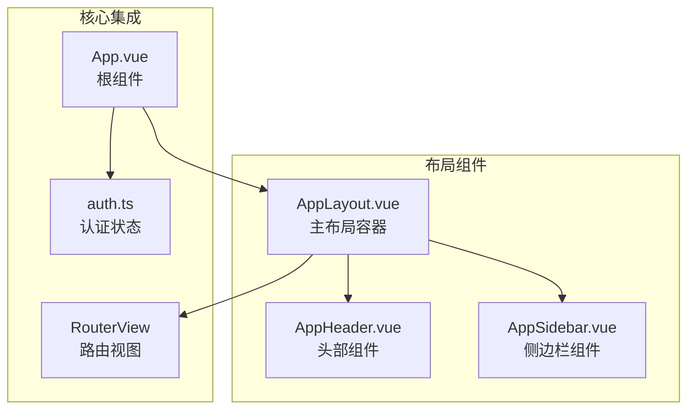
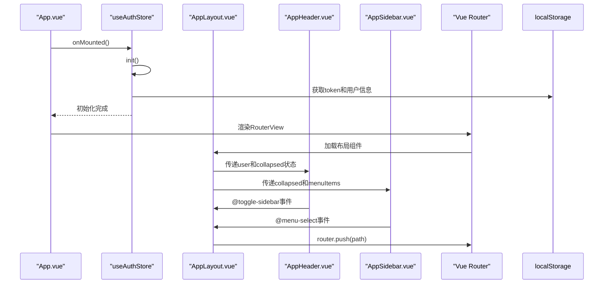
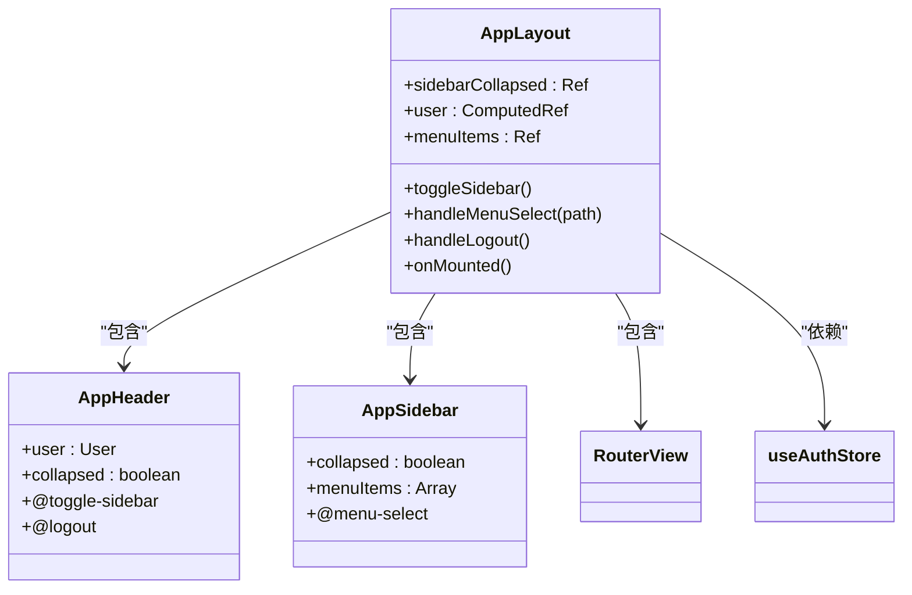
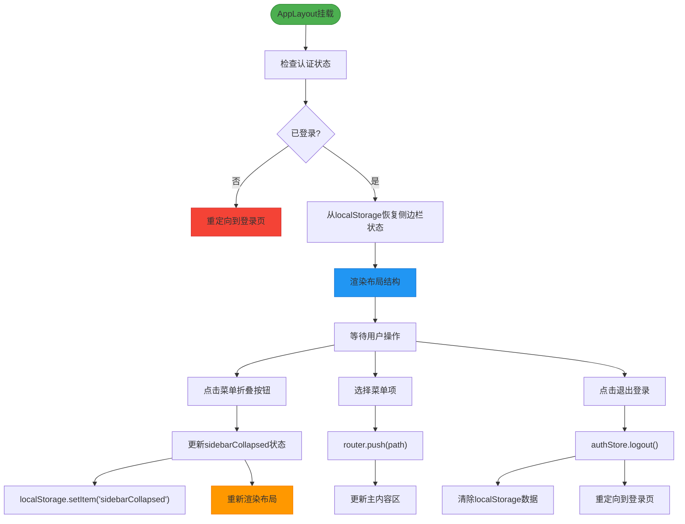
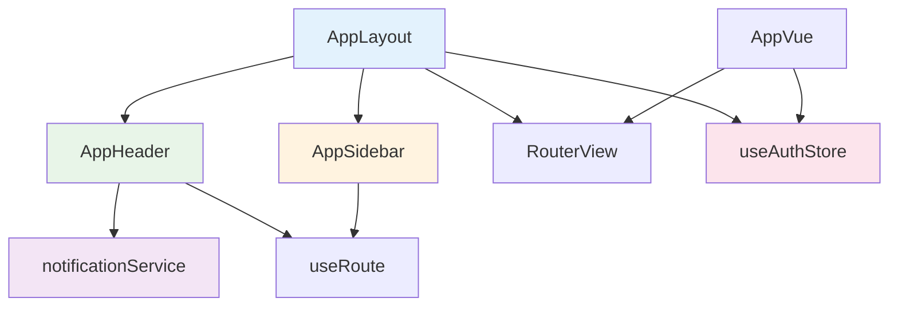

# 布局系统

<cite>
**本文档引用文件**  
- [AppLayout.vue](file://src/layouts/AppLayout.vue)
- [AppHeader.vue](file://src/layouts/AppHeader.vue)
- [AppSidebar.vue](file://src/layouts/AppSidebar.vue)
- [App.vue](file://src/App.vue)
- [variables.scss](file://src/assets/styles/variables.scss)
- [index.ts](file://src/router/index.ts)
- [auth.ts](file://src/stores/auth.ts)
</cite>

## 目录
1. [项目结构](#项目结构)
2. [核心组件](#核心组件)
3. [架构概览](#架构概览)
4. [详细组件分析](#详细组件分析)
5. [依赖分析](#依赖分析)
6. [性能考虑](#性能考虑)
7. [故障排除指南](#故障排除指南)
8. [结论](#结论)

## 项目结构

本项目采用基于功能模块的目录组织方式，布局系统核心文件位于 `src/layouts` 目录下。主布局容器 `AppLayout.vue` 作为应用视图的骨架，集成头部导航 `AppHeader.vue` 和侧边栏菜单 `AppSidebar.vue`。根组件 `App.vue` 负责初始化认证状态并通过 `RouterView` 注入布局结构。

**图示来源**  
- [AppLayout.vue](file://src/layouts/AppLayout.vue)
- [App.vue](file://src/App.vue)

**本节来源**  
- [AppLayout.vue](file://src/layouts/AppLayout.vue)
- [App.vue](file://src/App.vue)

## 核心组件

`AppLayout.vue` 作为主布局容器，采用响应式设计模式，通过 `sidebarCollapsed` 响应式变量管理侧边栏折叠状态。该组件通过 `computed` 属性从 `authStore` 获取用户信息，并在 `onMounted` 生命周期钩子中从 `localStorage` 恢复用户界面偏好设置。菜单项配置采用结构化数据定义，支持多级嵌套导航。

**本节来源**  
- [AppLayout.vue](file://src/layouts/AppLayout.vue#L25-L184)

## 架构概览

系统采用分层架构设计，`App.vue` 作为应用入口负责初始化认证状态，`AppLayout.vue` 作为布局容器协调头部、侧边栏和主内容区的交互。路由系统通过 `router.beforeEach` 守卫实现权限控制，确保未认证用户无法访问受保护路由。

**图示来源**  
- [App.vue](file://src/App.vue#L1-L26)
- [AppLayout.vue](file://src/layouts/AppLayout.vue#L1-L184)
- [index.ts](file://src/router/index.ts#L1-L293)

## 详细组件分析

### AppLayout分析

`AppLayout.vue` 实现了主布局容器的核心功能，包括侧边栏状态管理、菜单导航和用户登出处理。侧边栏折叠状态通过 `toggleSidebar` 方法切换，并使用 `localStorage.setItem` 持久化存储用户偏好。

#### 布局结构

**图示来源**  
- [AppLayout.vue](file://src/layouts/AppLayout.vue#L1-L184)
- [AppHeader.vue](file://src/layouts/AppHeader.vue#L1-L451)
- [AppSidebar.vue](file://src/layouts/AppSidebar.vue#L1-L241)

#### 交互流程

**图示来源**  
- [AppLayout.vue](file://src/layouts/AppLayout.vue#L127-L138)
- [AppLayout.vue](file://src/layouts/AppLayout.vue#L142-L144)
- [AppLayout.vue](file://src/layouts/AppLayout.vue#L150-L158)

**本节来源**  
- [AppLayout.vue](file://src/layouts/AppLayout.vue#L1-L184)

### AppHeader分析

`AppHeader.vue` 实现了头部导航栏功能，包含面包屑导航、通知中心和用户信息下拉菜单。该组件通过 `watch` 监听用户信息变化，自动建立或断开SSE连接以接收实时通知。

**本节来源**  
- [AppHeader.vue](file://src/layouts/AppHeader.vue#L1-L451)

### AppSidebar分析

`AppSidebar.vue` 使用Element Plus的 `el-menu` 组件实现侧边栏菜单，支持折叠状态和动态菜单渲染。`activeMenuId` 计算属性根据当前路由自动高亮匹配的菜单项。

**本节来源**  
- [AppSidebar.vue](file://src/layouts/AppSidebar.vue#L1-L241)

## 依赖分析

布局系统依赖多个核心模块，包括路由系统、状态管理、样式系统和工具函数。各组件通过清晰的props和emit机制进行通信，确保低耦合高内聚。

**图示来源**  
- [AppLayout.vue](file://src/layouts/AppLayout.vue)
- [AppHeader.vue](file://src/layouts/AppHeader.vue)
- [AppSidebar.vue](file://src/layouts/AppSidebar.vue)
- [auth.ts](file://src/stores/auth.ts)

**本节来源**  
- [AppLayout.vue](file://src/layouts/AppLayout.vue)
- [AppHeader.vue](file://src/layouts/AppHeader.vue)
- [AppSidebar.vue](file://src/layouts/AppSidebar.vue)
- [auth.ts](file://src/stores/auth.ts)

## 性能考虑

布局系统在性能方面进行了多项优化：使用 `computed` 属性避免重复计算，通过 `onUnmounted` 清理SSE连接防止内存泄漏，采用懒加载路由减少初始加载时间。SCSS变量注入和CSS作用域策略确保样式隔离，避免全局污染。

## 故障排除指南

常见问题包括侧边栏状态不持久化、菜单高亮异常和SSE连接失败。检查 `localStorage` 是否正确存储 `sidebarCollapsed` 值，验证路由配置与菜单项路径是否匹配，确认用户登录后是否正确建立SSE连接。

**本节来源**  
- [AppLayout.vue](file://src/layouts/AppLayout.vue#L128)
- [AppLayout.vue](file://src/layouts/AppLayout.vue#L142)
- [AppHeader.vue](file://src/layouts/AppHeader.vue#L220-L250)

## 结论

本布局系统采用现代化Vue 3组合式API设计，实现了响应式、可扩展的管理界面布局。通过合理的状态管理、组件通信和样式组织，提供了良好的用户体验和开发体验。系统支持移动端适配，具备完善的权限控制和状态持久化机制。