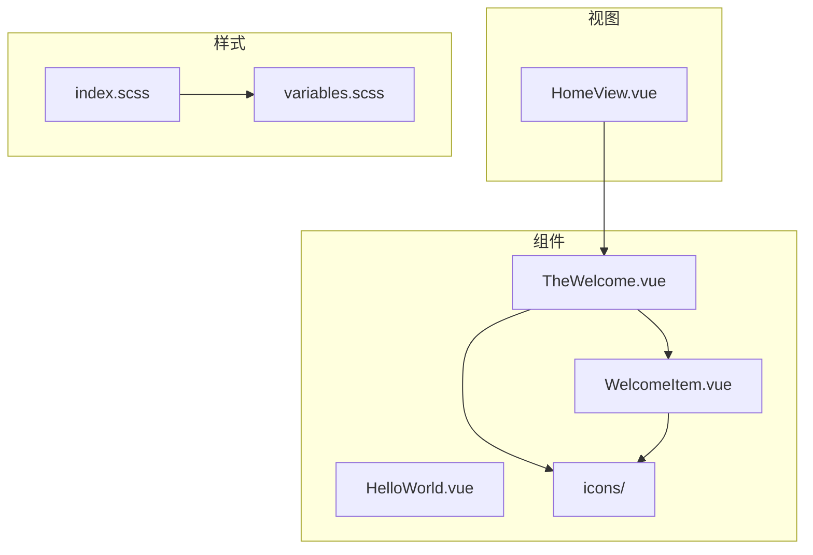
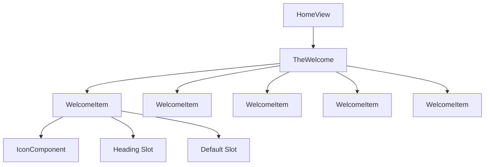
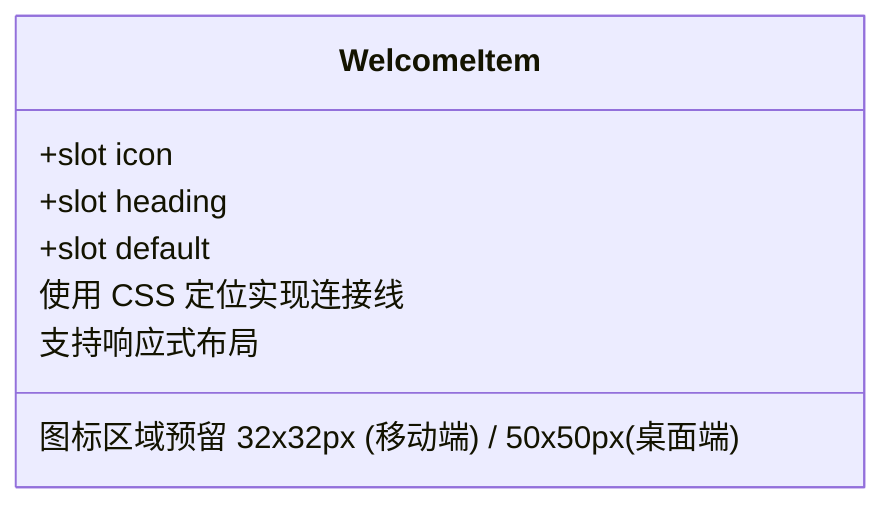
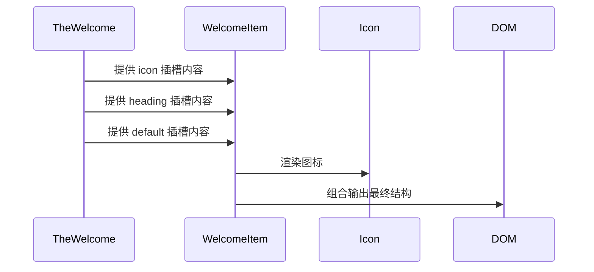
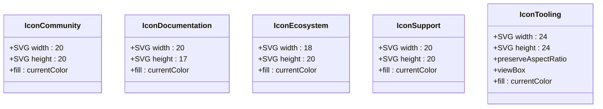
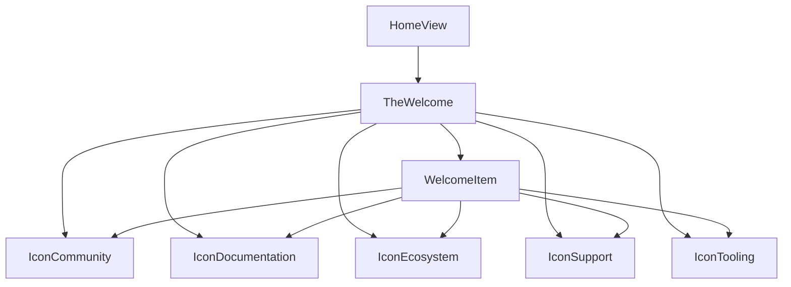

# 通用组件库

<cite>
**本文档引用文件**  
- [HelloWorld.vue](file://src/components/HelloWorld.vue)
- [WelcomeItem.vue](file://src/components/WelcomeItem.vue)
- [TheWelcome.vue](file://src/components/TheWelcome.vue)
- [IconCommunity.vue](file://src/components/icons/IconCommunity.vue)
- [IconDocumentation.vue](file://src/components/icons/IconDocumentation.vue)
- [IconEcosystem.vue](file://src/components/icons/IconEcosystem.vue)
- [IconSupport.vue](file://src/components/icons/IconSupport.vue)
- [IconTooling.vue](file://src/components/icons/IconTooling.vue)
- [HomeView.vue](file://src/views/HomeView.vue)
- [variables.scss](file://src/assets/styles/variables.scss)
- [index.scss](file://src/assets/styles/index.scss)
</cite>

## 目录
1. [简介](#简介)
2. [项目结构](#项目结构)
3. [核心组件](#核心组件)
4. [架构概览](#架构概览)
5. [详细组件分析](#详细组件分析)
6. [依赖分析](#依赖分析)
7. [性能考虑](#性能考虑)
8. [故障排除指南](#故障排除指南)
9. [结论](#结论)

## 简介
本文档旨在为专利服务网站中的通用UI组件提供全面的技术文档。重点分析`HelloWorld`、`WelcomeItem`和`TheWelcome`等基础展示组件的设计模式与复用机制，深入探讨图标组件库（如`IconCommunity`）的实现原理，包括SVG封装、属性传递与样式定制策略。同时，阐述组件间的组合关系、使用场景、可访问性支持、国际化适配及主题系统集成方案，并为新组件开发提供标准化实践建议。

## 项目结构
项目采用标准的Vue 3 + Vite架构，组件按功能模块化组织。核心展示组件集中存放于`src/components`目录，图标组件独立为`icons`子目录，便于统一维护。样式系统基于SCSS变量与工具类实现设计一致性，视图层通过`views`目录组织不同页面。

**图示来源**  
- [HelloWorld.vue](file://src/components/HelloWorld.vue)
- [WelcomeItem.vue](file://src/components/WelcomeItem.vue)
- [TheWelcome.vue](file://src/components/TheWelcome.vue)
- [HomeView.vue](file://src/views/HomeView.vue)
- [variables.scss](file://src/assets/styles/variables.scss)

**本节来源**  
- [src/components](file://src/components)
- [src/views](file://src/views)
- [src/assets/styles](file://src/assets/styles)

## 核心组件
`HelloWorld`、`WelcomeItem`和`TheWelcome`构成首页内容展示的核心组件链。`HelloWorld`作为最基础的文本展示组件，接收`msg`属性实现动态标题渲染；`WelcomeItem`通过插槽机制封装图文布局，支持图标与标题的灵活组合；`TheWelcome`则作为容器组件，集成多个`WelcomeItem`并注入具体图标与内容，形成结构化引导页面。

**本节来源**  
- [HelloWorld.vue](file://src/components/HelloWorld.vue#L1-L41)
- [WelcomeItem.vue](file://src/components/WelcomeItem.vue#L1-L87)
- [TheWelcome.vue](file://src/components/TheWelcome.vue#L1-L94)

## 架构概览
整体架构遵循Vue的组合式API设计原则，组件间通过插槽（slot）和属性（props）实现高内聚、低耦合的复用模式。样式系统基于CSS变量与SCSS预处理器，确保主题可配置性。图标组件以SVG内联方式封装，保证渲染性能与样式继承能力。

**图示来源**  
- [HomeView.vue](file://src/views/HomeView.vue#L1-L10)
- [TheWelcome.vue](file://src/components/TheWelcome.vue#L1-L94)
- [WelcomeItem.vue](file://src/components/WelcomeItem.vue#L1-L87)

## 详细组件分析

### HelloWorld 组件分析
`HelloWorld`是一个极简的展示组件，通过`defineProps`声明接收`msg`字符串属性，用于动态渲染标题内容。其样式使用`scoped`作用域，避免全局污染，同时通过媒体查询实现响应式文本对齐。

**本节来源**  
- [HelloWorld.vue](file://src/components/HelloWorld.vue#L1-L41)

### WelcomeItem 组件分析
`WelcomeItem`采用插槽设计实现内容解耦，包含三个插槽：`icon`用于插入图标组件，`heading`用于标题，`default`用于正文内容。其布局在桌面端通过绝对定位实现垂直连接线视觉效果，移动端则为线性排列。

**图示来源**  
- [WelcomeItem.vue](file://src/components/WelcomeItem.vue#L1-L87)

**本节来源**  
- [WelcomeItem.vue](file://src/components/WelcomeItem.vue#L1-L87)

### TheWelcome 组件分析
`TheWelcome`作为复合组件，导入`WelcomeItem`及多个图标组件，通过模板插槽注入具体内容，形成完整的欢迎页面。其内部通过`fetch('/__open-in-editor')`实现开发环境下的文件快速打开功能。

**图示来源**  
- [TheWelcome.vue](file://src/components/TheWelcome.vue#L1-L94)
- [WelcomeItem.vue](file://src/components/WelcomeItem.vue#L1-L87)

**本节来源**  
- [TheWelcome.vue](file://src/components/TheWelcome.vue#L1-L94)

### 图标组件库分析
所有图标组件均基于SVG封装，通过`<svg>`标签内联路径数据，设置`fill="currentColor"`实现颜色继承，确保与文本颜色一致。各图标组件无逻辑代码，仅包含模板，体积小且渲染高效。

**图示来源**  
- [IconCommunity.vue](file://src/components/icons/IconCommunity.vue#L1-L8)
- [IconDocumentation.vue](file://src/components/icons/IconDocumentation.vue#L1-L8)
- [IconEcosystem.vue](file://src/components/icons/IconEcosystem.vue#L1-L8)
- [IconSupport.vue](file://src/components/icons/IconSupport.vue#L1-L8)
- [IconTooling.vue](file://src/components/icons/IconTooling.vue#L1-L20)

**本节来源**  
- [src/components/icons/](file://src/components/icons/)

## 依赖分析
组件间依赖关系清晰，`TheWelcome`依赖`WelcomeItem`和所有图标组件，`WelcomeItem`不依赖其他组件。样式依赖通过全局SCSS变量注入，确保主题一致性。`HomeView`作为页面入口，仅依赖`TheWelcome`，形成单向数据流。

**图示来源**  
- [HomeView.vue](file://src/views/HomeView.vue#L1-L10)
- [TheWelcome.vue](file://src/components/TheWelcome.vue#L1-L94)
- [WelcomeItem.vue](file://src/components/WelcomeItem.vue#L1-L87)

**本节来源**  
- [TheWelcome.vue](file://src/components/TheWelcome.vue#L1-L94)
- [WelcomeItem.vue](file://src/components/WelcomeItem.vue#L1-L87)

## 性能考虑
- 所有图标组件为纯模板，无运行时逻辑，编译后轻量高效
- SVG内联避免网络请求，提升加载速度
- `scoped`样式减少全局样式冲突与重排
- 组件按需导入，支持Tree-shaking
- 响应式设计通过CSS媒体查询实现，避免JavaScript计算开销

## 故障排除指南
- **图标不显示**：检查组件是否正确导入并注册，确认`fill`属性继承正常
- **插槽内容未渲染**：确保使用`<template #slotName>`语法正确传递插槽
- **样式错乱**：检查`scoped`样式是否被意外覆盖，确认SCSS变量已正确导入
- **连接线错位**：桌面端布局依赖绝对定位，确保父容器无`overflow: hidden`限制

**本节来源**  
- [WelcomeItem.vue](file://src/components/WelcomeItem.vue#L45-L87)
- [index.scss](file://src/assets/styles/index.scss#L1-L392)

## 结论
该组件库通过合理的分层设计与插槽机制，实现了高度可复用的UI构建体系。图标组件的标准化封装为系统提供了统一的视觉语言。建议新组件开发遵循相同模式：使用`defineProps`定义接口，通过插槽实现内容灵活注入，样式优先使用SCSS变量与工具类，确保与整体设计系统一致。