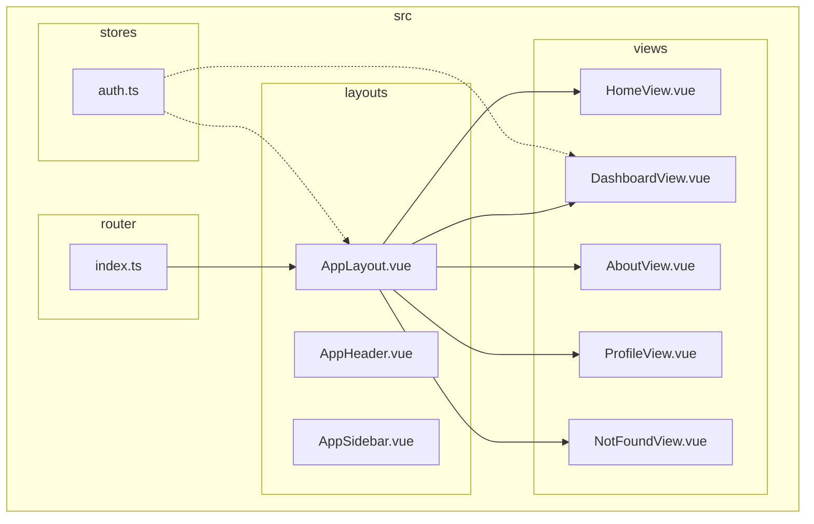
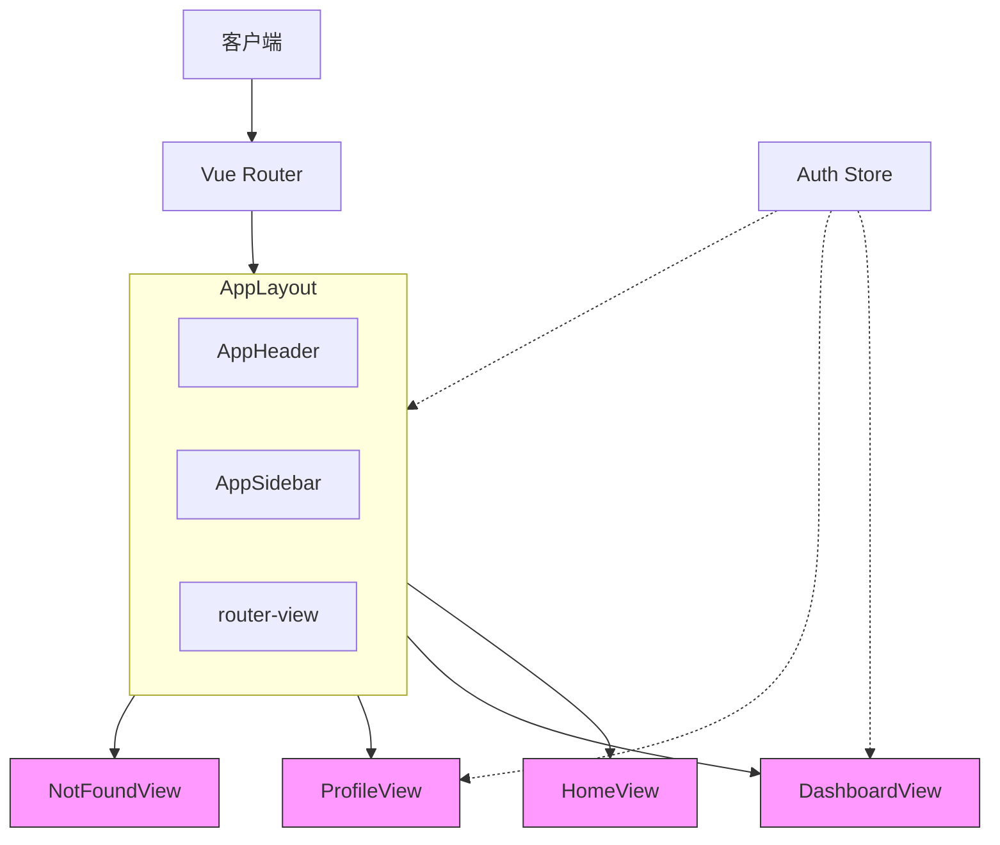
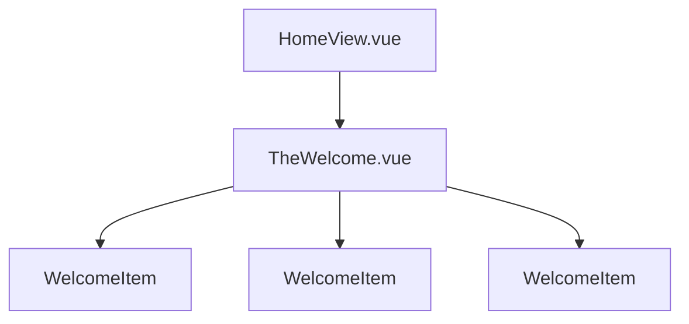
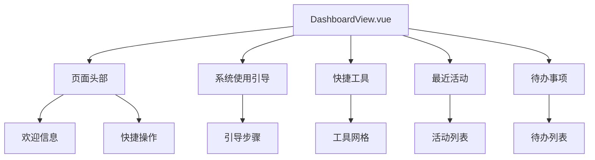
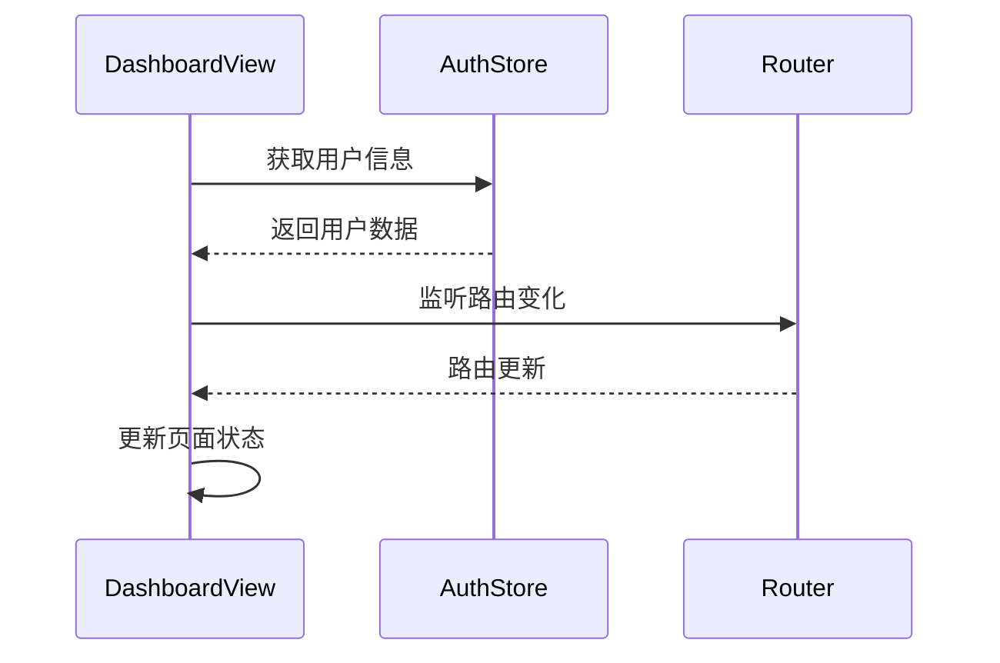
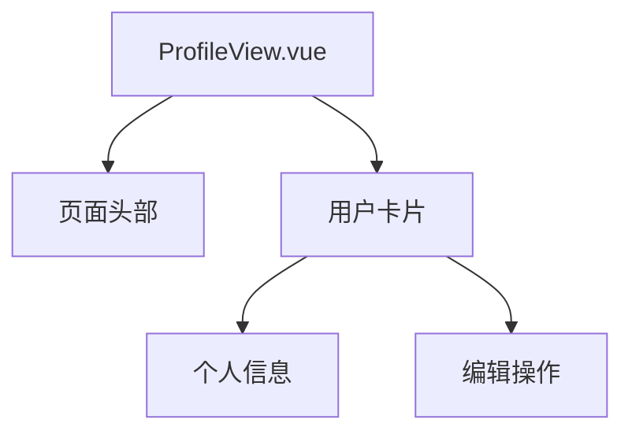
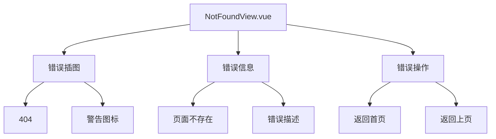
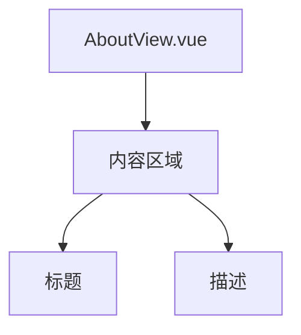
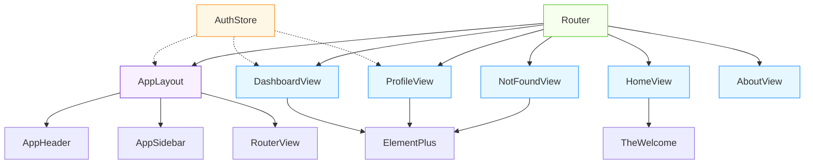

# 页面结构

<cite>
**Referenced Files in This Document**   
- [HomeView.vue](file://src/views/HomeView.vue)
- [DashboardView.vue](file://src/views/DashboardView.vue)
- [AboutView.vue](file://src/views/AboutView.vue)
- [ProfileView.vue](file://src/views/ProfileView.vue)
- [NotFoundView.vue](file://src/views/NotFoundView.vue)
- [AppLayout.vue](file://src/layouts/AppLayout.vue)
- [index.ts](file://src/router/index.ts)
- [auth.ts](file://src/stores/auth.ts)
</cite>

## 目录
1. [介绍](#介绍)
2. [项目结构](#项目结构)
3. [核心组件](#核心组件)
4. [架构概述](#架构概述)
5. [详细组件分析](#详细组件分析)
6. [依赖分析](#依赖分析)
7. [性能考虑](#性能考虑)
8. [故障排除指南](#故障排除指南)
9. [结论](#结论)

## 介绍
本文档系统性地描述了专利服务平台的核心页面结构，包括 HomeView、DashboardView、AboutView、ProfileView 和 NotFoundView 等页面的组织架构。文档详细解释了每个页面的职责划分，以及它们如何通过 Vue Router 与 AppLayout 集成，与全局状态（如用户认证信息）的交互方式，页面级组件的生命周期管理，响应式设计原则和 SEO 优化考虑。

## 项目结构

**Diagram sources**
- [AppLayout.vue](file://src/layouts/AppLayout.vue)
- [index.ts](file://src/router/index.ts)

**Section sources**
- [AppLayout.vue](file://src/layouts/AppLayout.vue)
- [index.ts](file://src/router/index.ts)

## 核心组件

本文档分析的核心页面组件包括：
- **HomeView**: 作为应用的欢迎入口，提供基础的欢迎内容展示
- **DashboardView**: 数据概览页面，展示用户欢迎信息、系统引导和快捷工具
- **AboutView**: 关于页面，提供应用的基本信息
- **ProfileView**: 用户中心页面，展示用户个人信息
- **NotFoundView**: 错误处理页面，处理未找到的路由请求

这些页面通过 Vue Router 进行路由管理，并与 AppLayout 布局组件集成，形成统一的应用界面。

**Section sources**
- [HomeView.vue](file://src/views/HomeView.vue)
- [DashboardView.vue](file://src/views/DashboardView.vue)
- [AboutView.vue](file://src/views/AboutView.vue)
- [ProfileView.vue](file://src/views/ProfileView.vue)
- [NotFoundView.vue](file://src/views/NotFoundView.vue)

## 架构概述

**Diagram sources**
- [index.ts](file://src/router/index.ts)
- [AppLayout.vue](file://src/layouts/AppLayout.vue)

## 详细组件分析

### HomeView 分析

HomeView 作为应用的欢迎入口，其结构设计简洁明了。该页面主要职责是展示欢迎内容，通过引入 TheWelcome 组件来呈现基础的欢迎信息。

**Diagram sources**
- [HomeView.vue](file://src/views/HomeView.vue)

**Section sources**
- [HomeView.vue](file://src/views/HomeView.vue)

### DashboardView 分析

DashboardView 作为数据概览页面，承担着重要的信息展示功能。该页面展示了用户欢迎信息、系统使用引导、快捷工具、最近活动和待办事项等综合信息。

#### 页面结构

#### 数据流分析

**Diagram sources**
- [DashboardView.vue](file://src/views/DashboardView.vue)
- [auth.ts](file://src/stores/auth.ts)

**Section sources**
- [DashboardView.vue](file://src/views/DashboardView.vue)

### ProfileView 分析

ProfileView 作为用户信息展示页面，其设计逻辑专注于用户个人数据的呈现和管理。尽管当前实现较为基础，但已建立了用户中心的基本框架。

**Diagram sources**
- [ProfileView.vue](file://src/views/ProfileView.vue)

**Section sources**
- [ProfileView.vue](file://src/views/ProfileView.vue)

### NotFoundView 分析

NotFoundView 作为错误处理机制的核心组件，负责处理用户访问不存在页面的情况。该页面提供了友好的错误提示和导航选项，提升用户体验。

**Diagram sources**
- [NotFoundView.vue](file://src/views/NotFoundView.vue)

**Section sources**
- [NotFoundView.vue](file://src/views/NotFoundView.vue)

### AboutView 分析

AboutView 作为关于页面，提供应用的基本信息展示。该页面结构简单，主要用于展示静态内容。

**Diagram sources**
- [AboutView.vue](file://src/views/AboutView.vue)

**Section sources**
- [AboutView.vue](file://src/views/AboutView.vue)

## 依赖分析

**Diagram sources**
- [index.ts](file://src/router/index.ts)
- [AppLayout.vue](file://src/layouts/AppLayout.vue)
- [auth.ts](file://src/stores/auth.ts)

**Section sources**
- [index.ts](file://src/router/index.ts)
- [AppLayout.vue](file://src/layouts/AppLayout.vue)
- [auth.ts](file://src/stores/auth.ts)

## 性能考虑

页面结构设计中考虑了以下性能优化因素：
1. **懒加载**: 路由配置中使用动态导入（import）实现组件的懒加载，减少初始加载时间
2. **状态管理**: 使用 Pinia 进行全局状态管理，避免不必要的重复数据获取
3. **响应式设计**: 页面布局适配不同屏幕尺寸，在移动设备上提供良好的用户体验
4. **事件处理**: 合理使用事件监听和组件通信，避免内存泄漏

这些优化措施确保了页面在不同设备和网络条件下的良好性能表现。

## 故障排除指南

当页面出现异常时，可参考以下排查步骤：

1. **路由问题**
   - 检查路由配置是否正确
   - 确认路由路径与组件映射关系
   - 验证路由守卫逻辑是否影响页面访问

2. **状态管理问题**
   - 检查 Pinia store 的状态是否正确初始化
   - 验证状态更新是否按预期工作
   - 确认状态持久化是否正常

3. **布局问题**
   - 检查 AppLayout 与子页面的集成
   - 验证响应式设计在不同屏幕尺寸下的表现
   - 确认样式冲突或覆盖问题

4. **数据加载问题**
   - 检查数据获取时机是否合理
   - 验证加载状态处理是否正确
   - 确认错误处理机制是否完善

**Section sources**
- [index.ts](file://src/router/index.ts)
- [AppLayout.vue](file://src/layouts/AppLayout.vue)
- [auth.ts](file://src/stores/auth.ts)

## 结论

本文档详细分析了专利服务平台的核心页面结构，涵盖了 HomeView、DashboardView、AboutView、ProfileView 和 NotFoundView 等页面的组织架构和职责划分。通过 Vue Router 实现页面路由管理，与 AppLayout 布局组件集成，形成统一的应用界面。页面与全局状态（如用户认证信息）通过 Pinia store 进行交互，实现了数据的统一管理和共享。页面级组件的生命周期管理合理，数据获取时机恰当，加载状态处理完善。响应式设计原则确保了在不同设备上的良好用户体验，SEO 优化考虑提升了应用的可发现性。整体页面结构设计合理，为用户提供了一致且高效的使用体验。