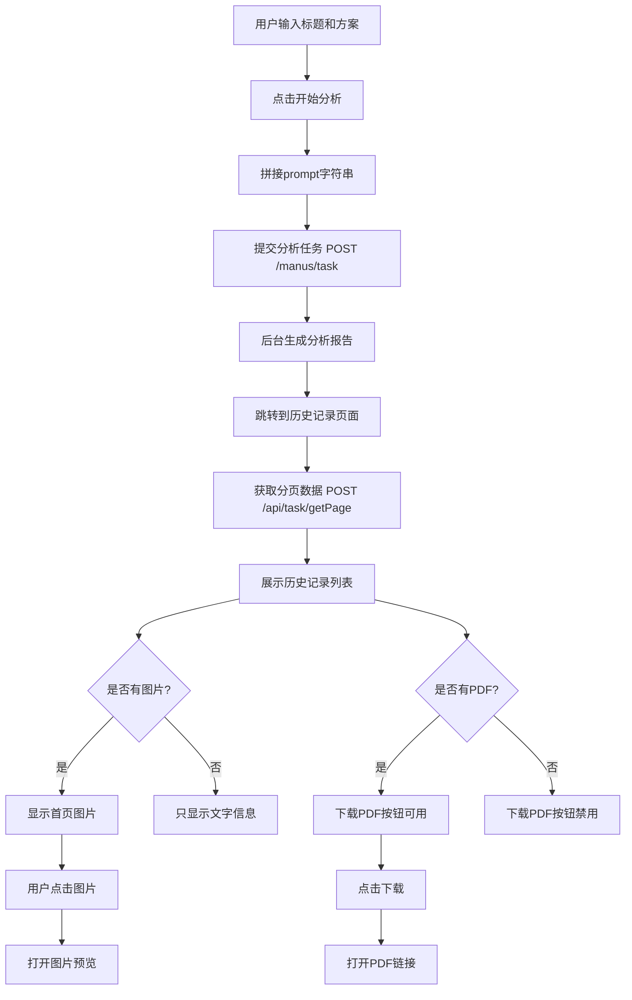
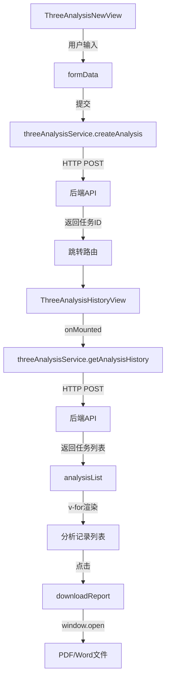

# 三性分析功能

<cite>
**Referenced Files in This Document**  
- [ThreeAnalysisNewView.vue](file://src/views/three-analysis/ThreeAnalysisNewView.vue)
- [ThreeAnalysisHistoryView.vue](file://src/views/three-analysis/ThreeAnalysisHistoryView.vue)
- [ThreeAnalysisDetailView.vue](file://src/views/three-analysis/ThreeAnalysisDetailView.vue)
- [threeAnalysis.ts](file://src/services/threeAnalysis.ts)
- [THREE_ANALYSIS_API_INTEGRATION.md](file://THREE_ANALYSIS_API_INTEGRATION.md)
</cite>

## 目录
1. [简介](#简介)
2. [新建分析功能](#新建分析功能)
3. [历史记录管理](#历史记录管理)
4. [分析详情展示](#分析详情展示)
5. [后端集成机制](#后端集成机制)
6. [数据流与状态管理](#数据流与状态管理)
7. [可解释性与可信度](#可解释性与可信度)
8. [结论](#结论)

## 简介
三性分析功能是专利服务网站的核心模块之一，旨在为用户提供专利的新颖性、创造性和实用性三大维度的自动化评估服务。该功能通过前端界面收集用户输入的技术方案和分析参数，调用后端AI分析引擎进行深度评估，并将结构化的分析结果呈现给用户。系统支持文件上传和文本输入两种方式提交分析请求，用户可在历史记录页面查看已完成的分析任务，并下载PDF或Word格式的报告。整个流程实现了从技术方案输入到综合评估输出的闭环，为专利撰写和申请决策提供数据支持。

## 新建分析功能

三性分析新建页面（ThreeAnalysisNewView）提供了两种技术方案输入方式：文件上传和文本输入。用户可通过切换按钮选择输入模式。在文件上传模式下，系统支持PDF、DOC、DOCX格式的专利文件，最大支持10MB大小。上传后文件会显示在列表中，支持删除操作。在文本输入模式下，用户需填写专利标题和技术方案描述，其中技术方案建议300-1000字，内容越详细分析质量越高。用户还可选择需要分析的维度，包括新颖性、创造性和实用性，默认全选。

提交分析时，系统会根据输入模式构建请求参数。若为文件上传模式，将文件URL列表和可选的文本提示（prompt）发送至后端；若为文本输入模式，则将专利标题和技术方案拼接成prompt字符串提交。分析过程中显示进度条，任务提交成功后自动跳转至历史记录页面。

**Section sources**
- [ThreeAnalysisNewView.vue](file://src/views/three-analysis/ThreeAnalysisNewView.vue#L1-L430)
- [threeAnalysis.ts](file://src/services/threeAnalysis.ts#L240-L300)

## 历史记录管理

三性分析历史页面（ThreeAnalysisHistoryView）用于管理和查看用户的分析任务记录。页面顶部提供搜索框，支持按专利标题、申请人或摘要关键词进行模糊搜索。列表展示所有分析任务，每条记录包含专利标题、申请人、创建时间等基本信息，以及任务状态标签（生成中、已完成、失败）。对于已完成的任务，系统会显示生成的首页图片，支持点击放大预览，图片采用懒加载优化性能。

用户可对单个分析任务执行操作，包括下载PDF或Word报告（若文件已生成）、删除任务等。页面支持分页功能，每页可显示10、20或50条记录。当无分析记录时，显示空状态提示并引导用户创建首个分析任务。系统通过轮询机制定期刷新数据，确保用户看到最新的任务状态。

**Section sources**
- [ThreeAnalysisHistoryView.vue](file://src/views/three-analysis/ThreeAnalysisHistoryView.vue#L1-L745)
- [threeAnalysis.ts](file://src/services/threeAnalysis.ts#L301-L400)

## 分析详情展示

三性分析详情页面（ThreeAnalysisDetailView）目前处于开发阶段，当前版本仅显示占位信息。根据设计规划，该页面将全面展示分析结果的各个维度。综合评分将通过评分卡片形式呈现，包括总体得分、等级评定（优秀、良好、一般、较差）以及风险提示和改进建议。分析依据部分将分章节展示新颖性、创造性、实用性的详细分析过程，包括技术特征对比、现有技术检索结果、技术效果评估等。

UI设计上，页面将采用清晰的层级结构，使用不同颜色的标签区分风险等级，通过表格或列表形式组织技术特征和效果。改进建议将以可操作的列表形式呈现，帮助用户针对性地优化专利方案。页面还将提供报告导出功能，支持生成结构化的PDF或Word文档。

**Section sources**
- [ThreeAnalysisDetailView.vue](file://src/views/three-analysis/ThreeAnalysisDetailView.vue#L1-L20)

## 后端集成机制

三性分析功能与后端AI分析引擎的集成通过threeAnalysisService服务实现。系统定义了标准化的数据格式转换规则：前端将专利标题和技术方案拼接成以换行符分隔的prompt字符串，作为核心输入。对于文件上传场景，先调用文件上传接口获取URL，再将URL列表与可选的文本prompt一同提交。

异步处理状态同步通过轮询任务状态接口实现。提交分析任务后，系统跳转至历史页面，该页面定期调用`getAnalysisHistory`接口获取最新任务列表。每个任务记录包含state字段（0:生成中, 1:已完成, 2:失败），用于实时反映处理进度。结果解析逻辑集中在`getAnalysisHistory`方法中，系统解析后端返回的taskJson字段，提取原始prompt并拆分为标题和技术方案，同时映射firstImgUrl、pdfUrl等附件链接。

**Diagram sources**
- [THREE_ANALYSIS_API_INTEGRATION.md](file://THREE_ANALYSIS_API_INTEGRATION.md#L300-L350)
- [threeAnalysis.ts](file://src/services/threeAnalysis.ts#L240-L519)

**Section sources**
- [threeAnalysis.ts](file://src/services/threeAnalysis.ts#L240-L519)
- [THREE_ANALYSIS_API_INTEGRATION.md](file://THREE_ANALYSIS_API_INTEGRATION.md#L1-L475)

## 数据流与状态管理

三性分析功能的数据流遵循清晰的单向数据流原则。用户在新建页面的输入通过表单数据模型（formData）收集，提交时通过threeAnalysisService服务发送至后端。后端返回任务ID后，前端通过路由跳转至历史页面，该页面的生命周期钩子触发`getAnalysisHistory`方法，从服务端获取任务列表。

状态管理主要通过组件的响应式数据实现。ThreeAnalysisNewView中的`analyzing`和`analysisProgress`变量控制分析状态和进度显示；ThreeAnalysisHistoryView中的`loading`、`analysisList`和`total`变量管理列表加载状态和分页数据。对于跨组件的状态，如用户身份信息，系统通过Pinia存储（auth.ts）进行全局管理，确保状态一致性。

**Diagram sources**
- [ThreeAnalysisNewView.vue](file://src/views/three-analysis/ThreeAnalysisNewView.vue#L1-L430)
- [ThreeAnalysisHistoryView.vue](file://src/views/three-analysis/ThreeAnalysisHistoryView.vue#L1-L745)
- [threeAnalysis.ts](file://src/services/threeAnalysis.ts#L240-L519)

## 可解释性与可信度

三性分析系统的可解释性通过多层次的结果呈现机制保障。首先，系统在分析报告中明确列出评估依据，如新颖性分析会展示检索到的对比文件及其与本申请的区别特征。其次，创造性分析采用技术特征-技术效果的映射表，清晰展示每个技术特征带来的具体改进。最后，实用性分析基于现有成熟技术和工艺的可行性论证，避免过度推测。

结果可信度通过多重机制保障：输入数据的完整性校验确保分析基础可靠；后端AI引擎的分析过程包含多轮交叉验证；系统提供风险提示和改进建议，主动暴露潜在问题而非给出绝对结论。此外，所有分析结果均可追溯到具体的任务记录和生成时间，支持用户复核和审计。对于关键决策，系统建议结合人工专家评审，形成人机协同的评估模式。

**Section sources**
- [THREE_ANALYSIS_API_INTEGRATION.md](file://THREE_ANALYSIS_API_INTEGRATION.md#L1-L475)
- [threeAnalysis.ts](file://src/services/threeAnalysis.ts#L240-L519)

## 结论
三性分析功能构建了一个完整的专利评估闭环，从前端友好的输入界面到后端强大的AI分析能力，再到结构化的结果呈现，实现了专利三性评估的自动化和智能化。系统通过清晰的数据流设计和状态管理，确保了用户体验的流畅性。与后端的集成机制成熟稳定，支持异步处理和状态同步。未来可进一步优化实时状态更新、详情页面交互和批量操作功能，提升系统的实用性和专业性。整体而言，该功能为专利申请人提供了有价值的决策支持工具，有助于提高专利申请的质量和效率。