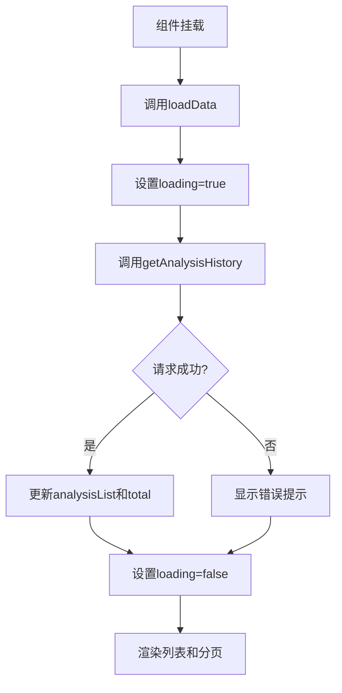
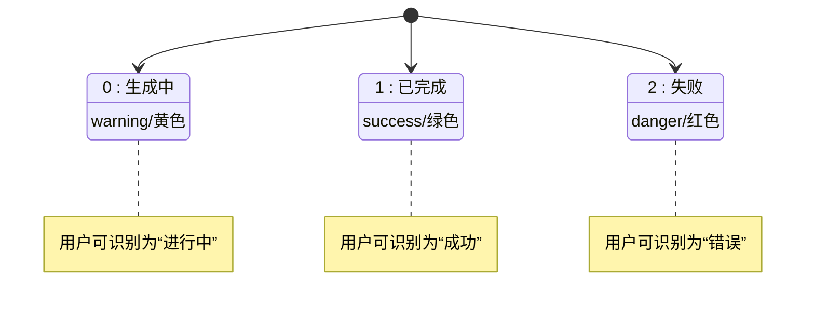
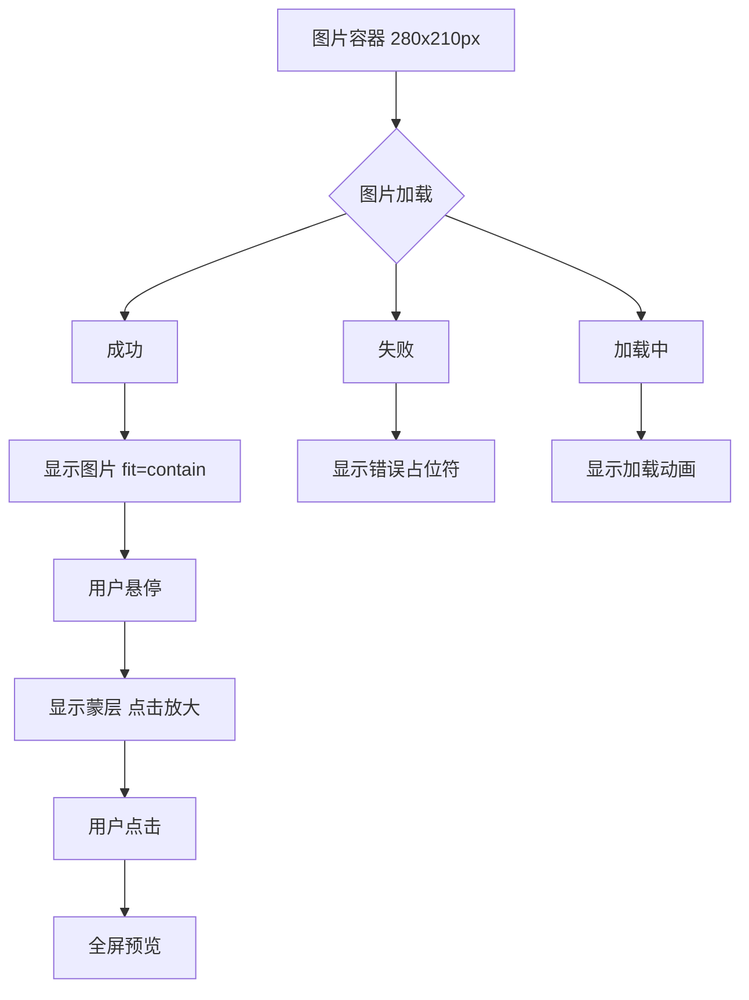
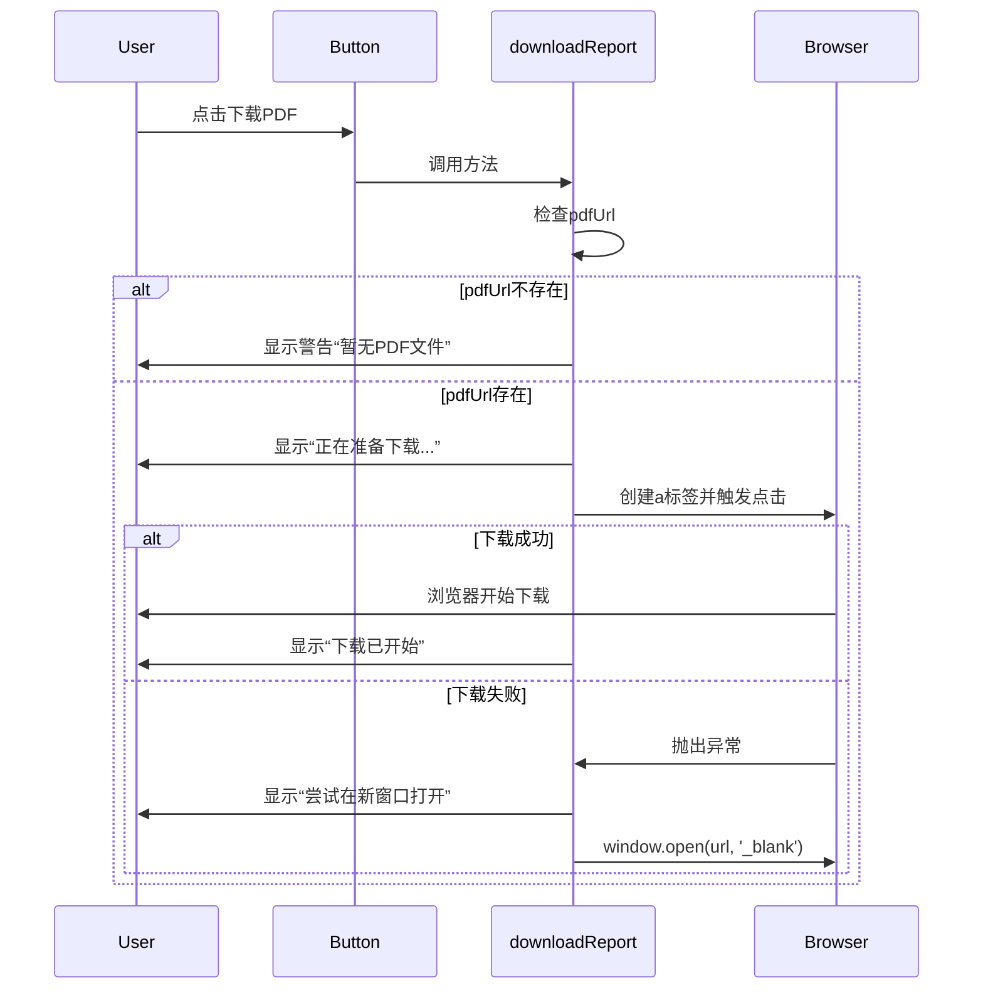
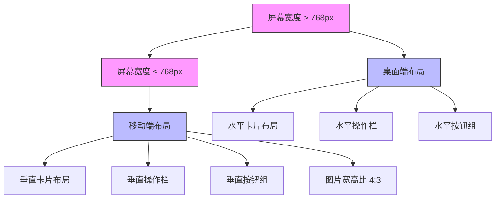

# 三性分析历史记录

<cite>
**Referenced Files in This Document**   
- [ThreeAnalysisHistoryView.vue](file://src/views/three-analysis/ThreeAnalysisHistoryView.vue)
- [threeAnalysis.ts](file://src/services/threeAnalysis.ts)
- [index.ts](file://src/utils/index.ts)
</cite>

## 目录
1. [三性分析历史记录](#三性分析历史记录)
2. [核心功能概述](#核心功能概述)
3. [分页加载机制](#分页加载机制)
4. [请求参数与接口映射](#请求参数与接口映射)
5. [状态码处理与视觉呈现](#状态码处理与视觉呈现)
6. [图片展示功能实现](#图片展示功能实现)
7. [PDF下载功能机制](#pdf下载功能机制)
8. [响应式布局适配](#响应式布局适配)

## 核心功能概述

三性分析历史记录功能为用户提供了一个集中管理其历史分析任务的界面。该功能主要由 `ThreeAnalysisHistoryView.vue` 视图组件和 `threeAnalysis.ts` 服务模块共同实现。用户可以通过该界面查看所有已完成、生成中或失败的三性分析任务，支持分页浏览、关键词搜索、刷新和删除操作。每个分析任务以卡片形式展示，包含专利标题、申请人、创建时间等基本信息，以及任务状态标签和文件下载按钮。该功能还实现了图片预览、错误处理和响应式布局，确保在不同设备上都能提供良好的用户体验。

**Section sources**
- [ThreeAnalysisHistoryView.vue](file://src/views/three-analysis/ThreeAnalysisHistoryView.vue#L1-L746)
- [threeAnalysis.ts](file://src/services/threeAnalysis.ts#L240-L519)

## 分页加载机制

三性分析历史记录采用分页机制加载和展示用户的历史分析任务。当组件挂载时，会自动调用 `loadData` 方法发起首次数据加载。分页功能由 `pagination` 响应式对象管理，包含当前页码（`page`）和每页大小（`pageSize`）两个属性，初始值分别为1和10。用户可以通过分页组件切换页码或调整每页显示数量，这些操作会触发 `handlePageChange` 或 `handleSizeChange` 方法，重置页码并重新加载数据。

数据加载的核心逻辑在 `loadData` 方法中实现，该方法调用 `threeAnalysisService.getAnalysisHistory` 服务方法，传入分页参数和搜索关键词。加载过程中，界面会显示加载动画，防止用户进行重复操作。当数据返回后，分析列表和总记录数会被更新，分页组件根据总记录数自动调整页码显示。如果列表为空，会显示空状态提示，并提供创建新分析的快捷入口。



**Diagram sources**
- [ThreeAnalysisHistoryView.vue](file://src/views/three-analysis/ThreeAnalysisHistoryView.vue#L150-L190)

**Section sources**
- [ThreeAnalysisHistoryView.vue](file://src/views/three-analysis/ThreeAnalysisHistoryView.vue#L150-L190)

## 请求参数与接口映射

`threeAnalysis.ts` 服务中的 `getAnalysisHistory` 方法负责处理与后端的通信。该方法接收一个包含分页和搜索参数的对象，将其转换为符合后端要求的 `PageQueryRequest` 结构。请求参数包括 `keyword`（搜索关键词）、`page`（当前页码）、`pageSize`（每页大小）和可选的 `status`（任务状态）。

在方法内部，这些参数被映射到 `PageQueryRequest` 对象的对应字段：`keyword` 映射到 `keyword`，`page` 映射到 `pageIndex`，`pageSize` 映射到 `pageSize`。`type` 字段被固定设置为3，表示三性分析类型。如果提供了 `status` 参数，会通过一个状态映射表将其转换为对应的数字状态码（0:生成中, 1:已完成, 2:失败），并赋值给 `state` 字段。

转换后的请求数据通过 `POST /api/task/getPage` 接口发送到后端。后端返回的 `PageQueryResponse` 数据包含分页信息和记录列表。前端会将每条记录解析为 `ThreeAnalysis` 类型的对象，其中从 `taskJson` 字段提取专利标题和技术方案，同时处理图片和文件URL的转换。最终，服务方法返回一个包含分析列表、总记录数、当前页码和每页大小的标准化响应对象。

```mermaid
classDiagram
class getAnalysisHistory {
+params : {page? : number, pageSize? : number, keyword? : string, status? : string}
+requestData : PageQueryRequest
+response : PageQueryResponse
+return : {data : ThreeAnalysis[], total : number, page : number, pageSize : number}
}
class PageQueryRequest {
+keyword? : string
+pageIndex? : number
+pageSize? : number
+state? : number
+type : number
}
class PageQueryResponse {
+code : number
+data : {records : Array<{}>, total : number}
+msg : string
}
class ThreeAnalysis {
+id : string
+patentInfo : Patent
+createTime : string
+firstImgUrl? : string
+pdfUrl? : string
+state? : number
}
getAnalysisHistory --> PageQueryRequest : "构建"
getAnalysisHistory --> PageQueryResponse : "接收"
PageQueryResponse --> ThreeAnalysis : "转换"
```

**Diagram sources**
- [threeAnalysis.ts](file://src/services/threeAnalysis.ts#L351-L496)

**Section sources**
- [threeAnalysis.ts](file://src/services/threeAnalysis.ts#L351-L496)

## 状态码处理与视觉呈现

系统定义了三种任务状态码：0表示“生成中”，1表示“已完成”，2表示“失败”。在前端，这些状态码通过 `getStateType` 和 `getStateText` 两个计算方法进行处理和呈现。`getStateText` 方法将数字状态码转换为对应的中文文本标签，而 `getStateType` 方法则根据状态码返回 Element Plus 组件库中对应的标签类型，用于控制视觉样式。

具体映射关系如下：状态码0（生成中）显示为“生成中”标签，使用警告（warning）类型的黄色背景；状态码1（已完成）显示为“已完成”标签，使用成功（success）类型的绿色背景；状态码2（失败）显示为“失败”标签，使用危险（danger）类型的红色背景。这种颜色编码的设计使得用户能够快速识别任务的当前状态，无需阅读文字即可通过颜色判断任务是否成功。

状态标签在分析任务卡片的右上角以小标签形式展示，与下载和删除按钮并列。这种设计确保了状态信息的高可见性，同时保持了界面的整洁。当任务状态发生变化时，标签会实时更新，为用户提供即时的反馈。



**Diagram sources**
- [ThreeAnalysisHistoryView.vue](file://src/views/three-analysis/ThreeAnalysisHistoryView.vue#L320-L350)

**Section sources**
- [ThreeAnalysisHistoryView.vue](file://src/views/three-analysis/ThreeAnalysisHistoryView.vue#L320-L350)

## 图片展示功能实现

图片展示功能通过 `el-image` 组件实现，具有完整的加载、错误处理和交互体验。图片容器的尺寸被严格控制为280x210px，通过CSS的 `width` 和 `height` 属性实现。为了保持图片的原始比例并避免变形，`fit` 属性被设置为 `contain`，这确保了图片在容器内完整显示，同时留有适当的空白区域。

图片加载采用了懒加载（`lazy`）配置，只有当图片进入视口时才开始加载，这显著提升了页面的初始加载性能，尤其是在历史记录较多的情况下。为了提升用户体验，组件提供了加载中和加载失败的占位符。加载中时，显示一个旋转的加载图标；加载失败时，显示一个带有“图片加载失败”文字的错误占位符，包含一个图片图标和提示文本。

用户可以通过点击图片来预览高清版本。这通过 `preview-src-list` 属性实现，该属性接收一个包含单个图片URL的数组。点击后，图片会以全屏模式展示，用户可以进行放大、缩小和导航操作。为了提示用户点击功能，当鼠标悬停在图片上时，会显示一个半透明的黑色蒙层，上面有“点击放大”文字和放大镜图标，增强了界面的可交互性。



**Diagram sources**
- [ThreeAnalysisHistoryView.vue](file://src/views/three-analysis/ThreeAnalysisHistoryView.vue#L80-L130)

**Section sources**
- [ThreeAnalysisHistoryView.vue](file://src/views/three-analysis/ThreeAnalysisHistoryView.vue#L80-L130)

## PDF下载功能机制

PDF下载功能通过 `downloadReport` 方法实现，具有完善的错误处理和用户反馈机制。下载按钮的禁用逻辑由 `:disabled="!(analysis as any).pdfUrl"` 控制，当分析记录中不存在 `pdfUrl` 时，按钮处于禁用状态，防止用户尝试下载不存在的文件。

当用户点击下载按钮时，方法首先检查 `pdfUrl` 是否存在。如果不存在，会显示“该报告暂无PDF文件”的警告提示。如果存在，则会显示“正在准备下载...”的加载提示，并创建一个隐藏的 `<a>` 标签。该标签的 `href` 属性设置为文件URL，`download` 属性设置为生成的文件名（格式为“专利标题_三性分析.pdf”）。通过将标签添加到DOM并调用其 `click()` 方法，触发浏览器的下载行为。

为了确保良好的用户体验，代码实现了降级方案。如果直接下载失败（例如浏览器阻止了自动下载），会捕获异常，关闭加载提示，并显示“直接下载失败，正在尝试在新窗口打开...”的警告。随后，通过 `window.open(fileUrl, '_blank')` 在新窗口打开文件URL，使用户可以手动保存文件。整个过程通过 `ElMessage` 组件提供清晰的反馈，确保用户始终了解操作状态。



**Diagram sources**
- [ThreeAnalysisHistoryView.vue](file://src/views/three-analysis/ThreeAnalysisHistoryView.vue#L250-L300)

**Section sources**
- [ThreeAnalysisHistoryView.vue](file://src/views/three-analysis/ThreeAnalysisHistoryView.vue#L250-L300)

## 响应式布局适配

响应式布局通过CSS媒体查询实现，确保在桌面端和移动端（≤768px）都能提供良好的用户体验。在桌面端，分析任务卡片采用水平布局，图片区域（280x210px）位于左侧，信息区域位于右侧，通过 `flex` 布局实现。操作按钮组在右侧水平排列。

当屏幕宽度小于或等于768px时，布局发生显著变化。操作栏中的搜索框和按钮组从水平排列变为垂直堆叠，以适应更窄的屏幕。分析任务卡片的整体布局从水平变为垂直，图片区域占据整个宽度，信息区域位于其下方。图片容器的高度变为自适应，但保持4:3的宽高比（`aspect-ratio: 4 / 3`），确保在不同设备上图片显示效果一致。

操作按钮组在移动端也进行了优化，从水平排列变为垂直排列，并设置固定宽度，确保按钮不会过宽。其他如评分摘要、风险提示等区域也相应调整为垂直布局，提高了移动端的可读性和操作便利性。这种响应式设计使得用户无论使用何种设备，都能获得清晰、易用的界面体验。



**Diagram sources**
- [ThreeAnalysisHistoryView.vue](file://src/views/three-analysis/ThreeAnalysisHistoryView.vue#L600-L700)

**Section sources**
- [ThreeAnalysisHistoryView.vue](file://src/views/three-analysis/ThreeAnalysisHistoryView.vue#L600-L700)