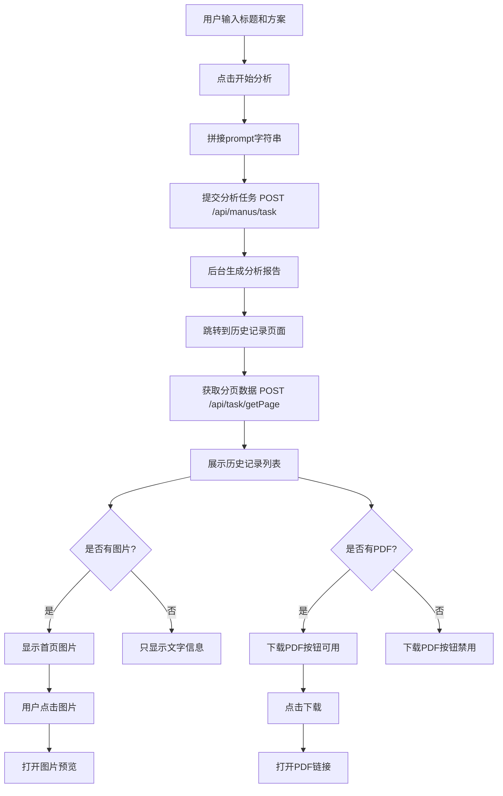
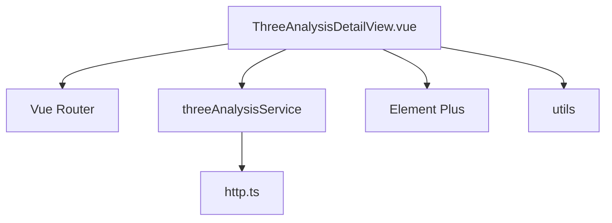
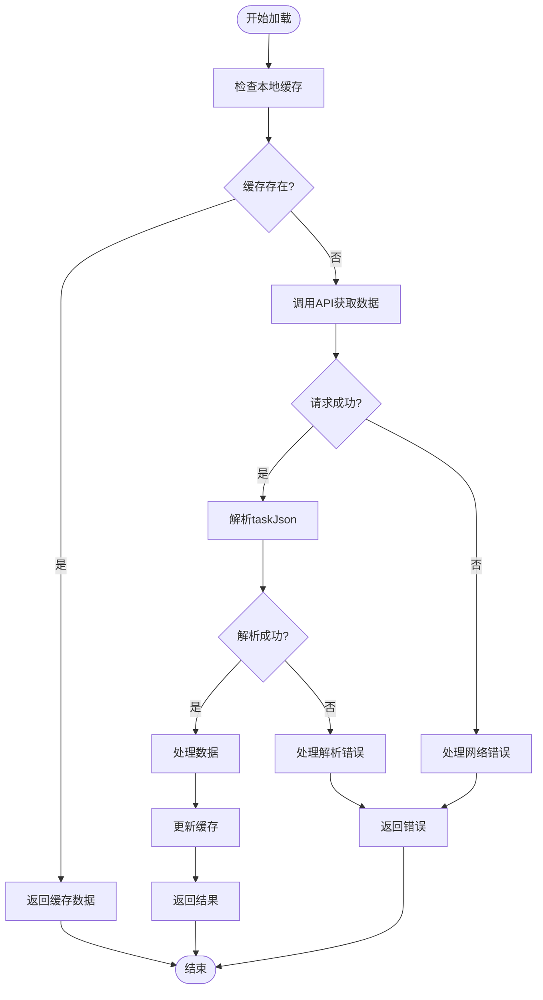

# 三性分析结果详情

<cite>
**本文档引用的文件**
- [ThreeAnalysisDetailView.vue](file://src/views/three-analysis/ThreeAnalysisDetailView.vue)
- [threeAnalysis.ts](file://src/services/threeAnalysis.ts)
- [ThreeAnalysisHistoryView.vue](file://src/views/three-analysis/ThreeAnalysisHistoryView.vue)
- [THREE_ANALYSIS_API_INTEGRATION.md](file://THREE_ANALYSIS_API_INTEGRATION.md)
- [index.ts](file://src/types/index.ts)
</cite>

## 目录
1. [简介](#简介)
2. [项目结构](#项目结构)
3. [核心组件](#核心组件)
4. [架构概述](#架构概述)
5. [详细组件分析](#详细组件分析)
6. [依赖分析](#依赖分析)
7. [性能考虑](#性能考虑)
8. [故障排除指南](#故障排除指南)
9. [结论](#结论)

## 简介
本文档详细说明了三性分析结果详情页面的设计与实现。重点阐述了ThreeAnalysisDetailView.vue如何接收并解析来自历史记录页面传递的分析任务数据，特别是从taskJson字段中提取原始输入（标题和技术方案）的方法。文档还描述了综合评分的可视化呈现方式、分析依据的结构化展示逻辑、改进建议部分的UI设计原则，以及页面加载性能优化策略和错误处理方案。

## 项目结构
三性分析功能模块位于`src/views/three-analysis`目录下，包含三个主要视图组件：新建分析页面、历史记录页面和详情页面。服务层位于`src/services/threeAnalysis.ts`，提供API调用接口。类型定义在`src/types/index.ts`中，确保类型安全。路由配置在`src/router/index.ts`中定义了详情页面的路径。

**Section sources**
- [ThreeAnalysisDetailView.vue](file://src/views/three-analysis/ThreeAnalysisDetailView.vue)
- [threeAnalysis.ts](file://src/services/threeAnalysis.ts)
- [index.ts](file://src/types/index.ts)

## 核心组件
三性分析详情页面的核心是ThreeAnalysisDetailView.vue组件，负责展示完整的分析报告。该组件通过路由参数获取分析任务ID，调用服务层接口获取详细数据。数据解析逻辑集中在从taskJson字段提取原始输入信息，包括专利标题和技术方案。综合评分部分展示新颖性、创造性、实用性三个维度的评分及总体评价。

**Section sources**
- [ThreeAnalysisDetailView.vue](file://src/views/three-analysis/ThreeAnalysisDetailView.vue)
- [threeAnalysis.ts](file://src/services/threeAnalysis.ts)

## 架构概述
系统采用前后端分离架构，前端通过RESTful API与后端交互。三性分析功能的API集成文档详细说明了数据流：用户在新建页面输入标题和技术方案，系统拼接成prompt提交给后端；后端生成分析报告后，用户可在历史记录页面查看；点击记录可进入详情页面查看完整分析结果。



**Diagram sources**
- [THREE_ANALYSIS_API_INTEGRATION.md](file://THREE_ANALYSIS_API_INTEGRATION.md)

## 详细组件分析
### ThreeAnalysisDetailView.vue 分析
该组件目前为占位状态，显示"功能开发中"提示。根据设计规划，它将实现完整的三性分析报告展示功能。

#### 数据接收与解析
详情页面通过路由参数接收分析任务ID，调用threeAnalysisService.getAnalysisDetail方法获取详细数据。关键的数据解析逻辑在于从taskJson字段提取原始输入：
```typescript
const taskData = JSON.parse(record.taskJson)
const promptLines = taskData.prompt.split('\n')
const title = promptLines[0]  // 第一行是标题
const technicalSolution = promptLines.slice(1).join('\n')  // 其余是技术方案
```

#### 综合评分可视化
综合评分将通过直观的UI元素展示三个维度的评分：
- **新颖性**：展示是否有新颖性及对比现有技术的分析
- **创造性**：显示创造性水平（高/中/低）及技术特征分析
- **实用性**：说明是否具备实用性及实施方法
总体评价输出包括综合评分、风险提示和改进建议。

#### 分析依据结构化展示
AI生成的分析结果将被分解为可读性强的技术要点：
- **新颖性分析**：列出对比的现有技术专利，说明区别特征
- **创造性分析**：展示技术特征与技术效果的对应关系
- **实用性分析**：分技术可行性、经济可行性、实际应用价值等方面呈现

#### 改进建议UI设计
改进建议部分将采用清晰的列表形式组织内容，每条建议包含：
- 建议标题
- 详细说明
- 实施优先级标识
设计原则是确保建议内容易于理解且具有可操作性。

**Section sources**
- [ThreeAnalysisDetailView.vue](file://src/views/three-analysis/ThreeAnalysisDetailView.vue)
- [threeAnalysis.ts](file://src/services/threeAnalysis.ts)
- [index.ts](file://src/types/index.ts)

## 依赖分析
三性分析详情页面依赖多个核心模块：
- **路由系统**：通过Vue Router实现页面导航
- **HTTP服务**：依赖http.ts进行API调用
- **状态管理**：可能需要与全局状态交互
- **UI组件库**：使用Element Plus组件构建界面



**Diagram sources**
- [threeAnalysis.ts](file://src/services/threeAnalysis.ts)
- [ThreeAnalysisDetailView.vue](file://src/views/three-analysis/ThreeAnalysisDetailView.vue)

## 性能考虑
### 数据缓存策略
为提升用户体验，系统应实现数据缓存机制：
- 将已加载的分析详情缓存在内存中
- 使用浏览器本地存储持久化缓存
- 设置合理的缓存过期时间

### 按需加载
对于大型分析报告，采用按需加载策略：
- 初始只加载核心评分信息
- 用户展开时才加载详细分析内容
- 图片资源使用懒加载

### 错误处理方案
系统需应对多种异常情况：
- **数据缺失**：显示友好的空状态提示
- **解析失败**：捕获JSON解析异常，提供默认值
- **网络错误**：显示重试按钮，支持离线模式
- **权限问题**：引导用户重新登录



**Diagram sources**
- [threeAnalysis.ts](file://src/services/threeAnalysis.ts)
- [THREE_ANALYSIS_API_INTEGRATION.md](file://THREE_ANALYSIS_API_INTEGRATION.md)

## 故障排除指南
### 常见问题及解决方案
- **问题**：无法加载分析详情
  - **原因**：网络连接问题或API服务异常
  - **解决方案**：检查网络连接，确认服务状态

- **问题**：数据解析失败
  - **原因**：taskJson格式异常
  - **解决方案**：验证JSON格式，提供默认解析逻辑

- **问题**：评分显示异常
  - **原因**：数据字段缺失或类型错误
  - **解决方案**：添加字段存在性检查，设置默认值

**Section sources**
- [threeAnalysis.ts](file://src/services/threeAnalysis.ts)
- [ThreeAnalysisDetailView.vue](file://src/views/three-analysis/ThreeAnalysisDetailView.vue)

## 结论
三性分析结果详情页面是专利分析系统的重要组成部分，虽然目前处于开发阶段，但其设计已充分考虑了数据处理、用户体验和系统性能等关键因素。通过合理的架构设计和错误处理机制，该页面将为用户提供全面、直观的专利三性分析报告。