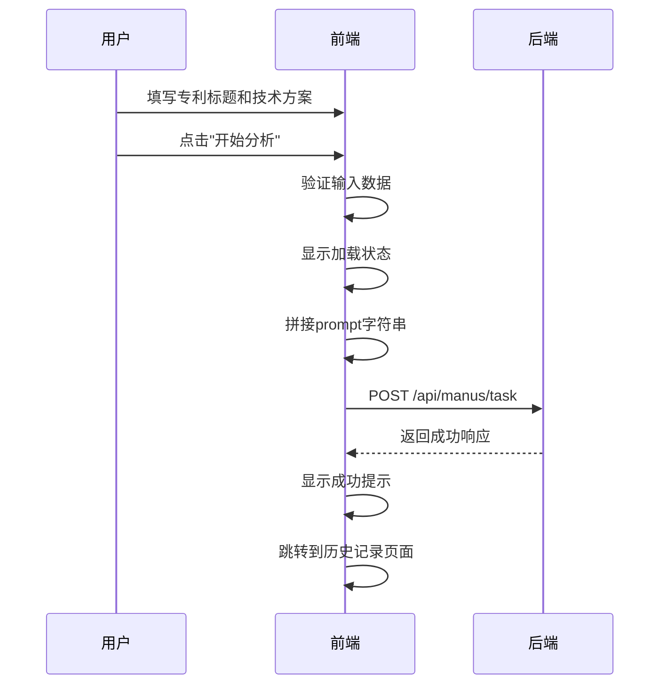

# 新建三性分析

<cite>
**本文档引用文件**  
- [ThreeAnalysisNewView.vue](file://src/views/three-analysis/ThreeAnalysisNewView.vue)
- [threeAnalysis.ts](file://src/services/threeAnalysis.ts)
- [THREE_ANALYSIS_API_INTEGRATION.md](file://THREE_ANALYSIS_API_INTEGRATION.md)
</cite>

## 目录
1. [项目结构](#项目结构)
2. [表单结构设计](#表单结构设计)
3. [用户输入验证机制](#用户输入验证机制)
4. [分析任务提交流程](#分析任务提交流程)
5. [createAnalysis方法详解](#createanalysis方法详解)
6. [type=3的业务含义](#type3的业务含义)
7. [完整交互链路](#完整交互链路)
8. [用户体验优化策略](#用户体验优化策略)
9. [请求数据格式与错误处理](#请求数据格式与错误处理)

## 项目结构
根据项目目录结构，三性分析功能主要位于`src/views/three-analysis`目录下，包含新建、历史和详情三个视图组件。服务层逻辑位于`src/services/threeAnalysis.ts`，API对接文档为`THREE_ANALYSIS_API_INTEGRATION.md`。

**Section sources**
- [ThreeAnalysisNewView.vue](file://src/views/three-analysis/ThreeAnalysisNewView.vue)
- [threeAnalysis.ts](file://src/services/threeAnalysis.ts)

## 表单结构设计
新建三性分析页面提供了两种输入方式：文件上传和文本输入。用户可通过顶部的选项卡进行切换。

在文本输入模式下，表单包含以下字段：
- **专利标题**：必填项，用于输入专利的名称
- **技术方案**：必填项，详细描述发明的技术内容，建议300-1000字
- **分析类型**：可多选，包括新颖性分析、创造性分析和实用性分析

表单采用Element Plus的el-form组件实现，布局清晰，标签宽度统一为120px，便于用户填写。

**Section sources**
- [ThreeAnalysisNewView.vue](file://src/views/three-analysis/ThreeAnalysisNewView.vue#L140-L230)

## 用户输入验证机制
系统实现了多层次的输入验证机制，确保用户提交的数据完整有效。

表单层面的验证规则定义在`formRules`中：
- 专利标题：必填，长度3-50个字符
- 技术方案：必填，长度至少50个字符

在提交分析前，系统还会进行逻辑验证：
- 若为文件上传模式，检查是否已上传文件
- 若为文本输入模式，检查标题和技术方案是否填写

验证失败时，系统会通过ElMessage组件显示相应的警告信息，引导用户完成正确输入。

**Section sources**
- [ThreeAnalysisNewView.vue](file://src/views/three-analysis/ThreeAnalysisNewView.vue#L170-L185)
- [ThreeAnalysisNewView.vue](file://src/views/three-analysis/ThreeAnalysisNewView.vue#L250-L255)

## 分析任务提交流程
分析任务提交流程如下：

1. 用户选择输入方式（文件上传或文本输入）
2. 填写必要信息并点击"开始分析"按钮
3. 系统进行输入验证
4. 显示加载状态，模拟分析进度
5. 调用`threeAnalysisService.createAnalysis`方法提交任务
6. 提交成功后显示成功提示
7. 1.5秒后自动跳转到历史记录页面

整个流程设计流畅，用户操作后能立即获得反馈，提升了用户体验。

**Section sources**
- [ThreeAnalysisNewView.vue](file://src/views/three-analysis/ThreeAnalysisNewView.vue#L240-L290)

## createAnalysis方法详解
`createAnalysis`方法位于`threeAnalysis.ts`服务文件中，负责将前端数据转换为后端可识别的格式并提交。

该方法的核心逻辑包括：
- 构建请求参数对象，设置`type: 3`标识三性分析
- 处理文件上传模式：优先使用文件URL，同时可附加文本信息作为prompt
- 处理文本输入模式：将专利标题和技术方案拼接为prompt字符串
- 调用`/manus/task`接口提交分析任务
- 处理成功和失败响应

当有文件上传时，若同时提供了文本信息，系统会将标题和技术方案拼接作为prompt；若无文本信息，则设置prompt为"无输入"。

**Section sources**
- [threeAnalysis.ts](file://src/services/threeAnalysis.ts#L294-L331)

## type=3的业务含义
在请求参数中，`type=3`具有特定的业务含义，标识当前请求为"三性分析"任务。

这一标识在系统中起到关键作用：
- 后端根据type值确定使用何种AI模型和分析流程
- 在历史记录查询时，通过`type: 3`过滤出三性分析任务
- 区分于其他类型的分析任务（如专利撰写、技术报告等）

该设计使得系统能够统一处理多种分析任务，通过type字段进行路由和业务逻辑分发。

**Section sources**
- [threeAnalysis.ts](file://src/services/threeAnalysis.ts#L295)
- [THREE_ANALYSIS_API_INTEGRATION.md](file://THREE_ANALYSIS_API_INTEGRATION.md#L15)

## 完整交互链路
以下是前端从数据收集到页面跳转的完整交互链路：



**Diagram sources**
- [ThreeAnalysisNewView.vue](file://src/views/three-analysis/ThreeAnalysisNewView.vue#L240-L290)
- [threeAnalysis.ts](file://src/services/threeAnalysis.ts#L294-L331)

## 用户体验优化策略
系统实施了多项用户体验优化策略：

**输入校验提示**
- 实时验证：在用户输入时即时反馈验证结果
- 明确提示：使用ElMessage组件显示具体的错误信息
- 视觉反馈：必填项有红色星号标识

**防重复提交机制**
- 按钮禁用：提交时"开始分析"按钮变为"分析中..."并禁用
- 加载状态：显示进度条模拟分析过程
- 变量控制：通过`analyzing`变量控制提交状态

**异步操作反馈**
- 进度模拟：通过setInterval模拟分析进度从0%到100%
- 成功提示：使用绿色成功消息告知用户提交成功
- 自动跳转：1.5秒后自动跳转，减少用户等待焦虑

这些策略共同确保了用户在提交分析任务时获得流畅、可预测的操作体验。

**Section sources**
- [ThreeAnalysisNewView.vue](file://src/views/three-analysis/ThreeAnalysisNewView.vue#L240-L290)

## 请求数据格式与错误处理
### 请求数据格式
提交到后端的请求数据格式如下：
```json
{
  "prompt": "专利标题\n技术方案内容",
  "type": 3
}
```

### 错误处理方式
系统实现了完善的错误处理机制：
- **登录过期**：不显示额外错误提示，直接跳转登录
- **后端错误**：提取msg字段显示用户友好提示
- **网络错误**："网络错误，请检查网络连接"
- **其他错误**：显示错误消息或默认提示

### 网络异常容错设计
- **请求拦截**：在http服务层统一处理网络异常
- **错误分类**：区分认证错误、后端错误和网络错误
- **用户友好**：将技术性错误转换为用户可理解的提示
- **日志记录**：在控制台输出详细错误信息便于调试

这种分层的错误处理设计既保证了系统的健壮性，又提供了良好的用户体验。

**Section sources**
- [threeAnalysis.ts](file://src/services/threeAnalysis.ts#L333-L382)
- [THREE_ANALYSIS_API_INTEGRATION.md](file://THREE_ANALYSIS_API_INTEGRATION.md#L47-L99)