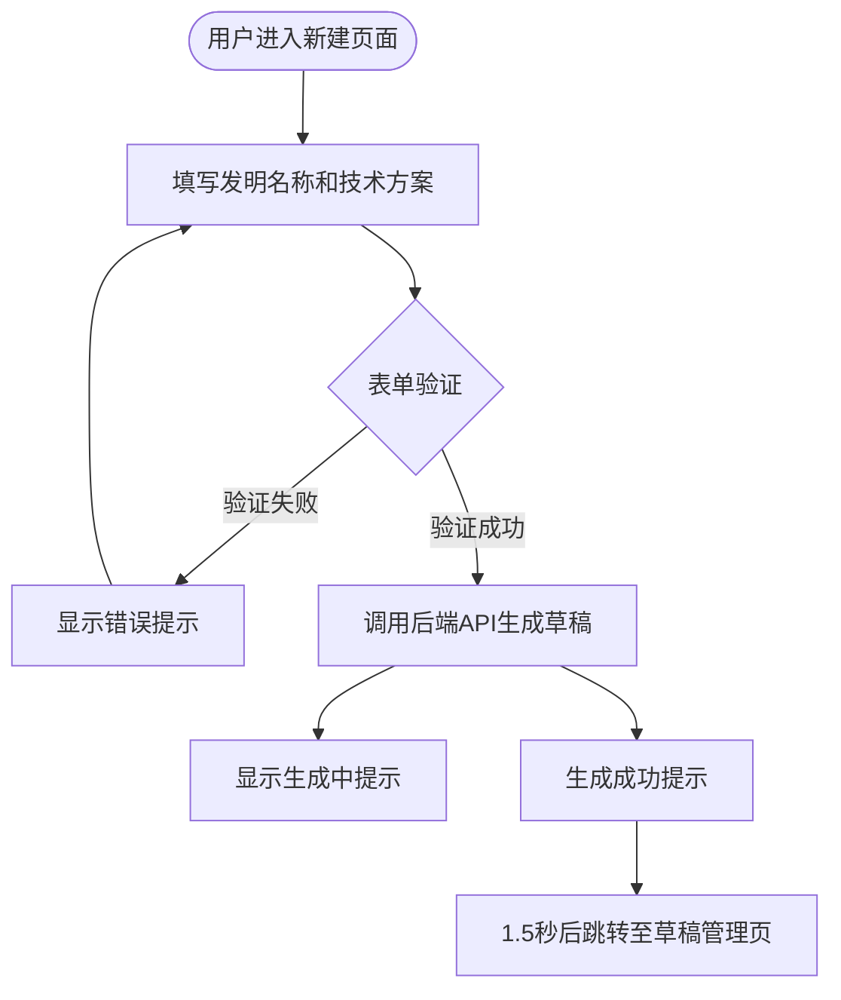
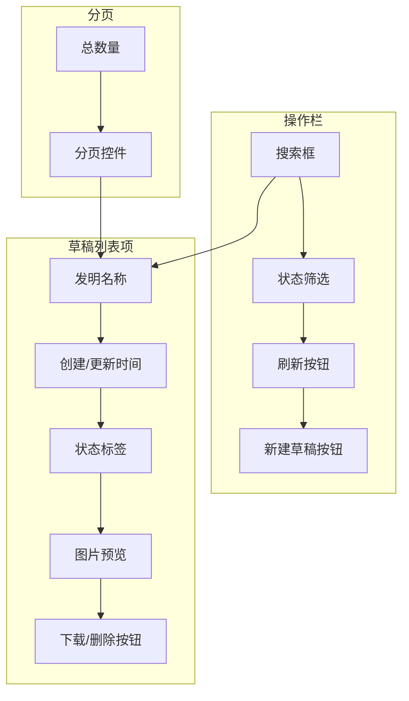
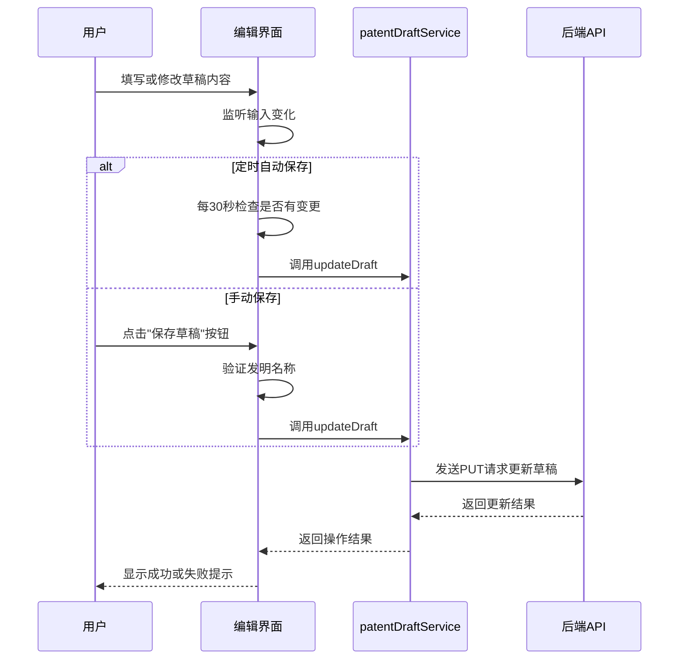
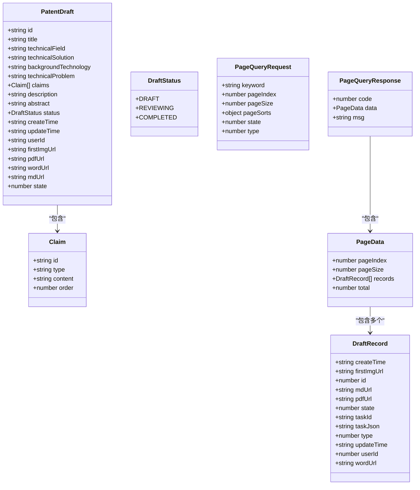

# 专利撰写功能

<cite>
**Referenced Files in This Document**   
- [PatentDraftNewView.vue](file://src/views/patent-draft/PatentDraftNewView.vue)
- [PatentDraftManageView.vue](file://src/views/patent-draft/PatentDraftManageView.vue)
- [PatentDraftEditView.vue](file://src/views/patent-draft/PatentDraftEditView.vue)
- [patentDraft.ts](file://src/services/patentDraft.ts)
- [PATENT_DRAFT_API_INTEGRATION.md](file://PATENT_DRAFT_API_INTEGRATION.md)
</cite>

## 目录
1. [简介](#简介)
2. [新建专利草稿流程](#新建专利草稿流程)
3. [草稿管理功能](#草稿管理功能)
4. [草稿编辑机制](#草稿编辑机制)
5. [数据持久化与版本控制](#数据持久化与版本控制)
6. [撰写向导与用户体验](#撰写向导与用户体验优化)
7. [结论](#结论)

## 简介

专利撰写功能为用户提供了一套完整的专利申请辅助系统，涵盖从草稿创建、管理到编辑的全流程。系统通过智能化的表单设计和API集成，帮助用户高效完成专利文档的撰写工作。核心功能模块包括新建专利草稿、草稿管理列表和草稿编辑界面，分别对应不同的用户场景和操作需求。

## 新建专利草稿流程

该功能模块实现了专利草稿的初始化创建过程，通过简洁的表单引导用户输入关键信息，并调用后端服务生成完整的专利文档。

### 模板选择与基础信息填写

在`PatentDraftNewView.vue`中，系统采用极简化的表单设计，仅要求用户填写两项核心信息：发明名称和技术方案。这种设计降低了用户的使用门槛，避免了复杂表单带来的认知负担。

- **发明名称**：用户需输入3-50个字符的发明名称，系统通过表单验证确保输入的规范性
- **技术方案**：用户需提供至少50个字符的技术方案描述，建议300-1000字以获得更高质量的生成结果

系统通过`el-form`组件实现表单验证，确保用户输入符合要求。当用户未填写必填项或内容长度不足时，系统会给出明确的提示信息。



**Diagram sources**
- [PatentDraftNewView.vue](file://src/views/patent-draft/PatentDraftNewView.vue#L1-L284)

**Section sources**
- [PatentDraftNewView.vue](file://src/views/patent-draft/PatentDraftNewView.vue#L1-L284)

## 草稿管理功能

`PatentDraftManageView.vue`提供了全面的草稿管理功能，使用户能够方便地查看、筛选和操作已创建的专利草稿。

### 草稿列表展示

系统以卡片列表的形式展示所有专利草稿，每个草稿项包含以下信息：
- **标题信息**：显示发明名称、创建时间和更新时间
- **状态标签**：根据草稿状态显示不同颜色的标签（草稿-灰色，审查中-黄色，已完成-绿色）
- **操作按钮**：提供Word下载和删除功能

### 状态管理

系统实现了三种状态的管理机制：
- **草稿**：初始状态，表示专利文档正在生成中
- **审查中**：用户已提交审查的状态
- **已完成**：专利文档生成完成的状态

状态筛选功能允许用户按状态过滤草稿列表，提高查找效率。

### 快速访问功能

系统提供了多项便捷的快速访问功能：
- **图片预览**：每个草稿可显示首张图片（280x210px），支持点击放大预览
- **文件下载**：支持下载Word格式的专利文档
- **搜索功能**：通过关键词快速查找特定草稿
- **分页支持**：支持分页浏览大量草稿



**Diagram sources**
- [PatentDraftManageView.vue](file://src/views/patent-draft/PatentDraftManageView.vue#L1-L644)

**Section sources**
- [PatentDraftManageView.vue](file://src/views/patent-draft/PatentDraftManageView.vue#L1-L644)

## 草稿编辑机制

`PatentDraftEditView.vue`提供了专利草稿的编辑功能，允许用户对已生成的专利文档进行修改和完善。

### 富文本编辑器集成

虽然当前代码中未直接使用Quill编辑器，但系统通过`el-input`组件实现了类似的功能。每个专利要素（如技术领域、背景技术、技术方案等）都有独立的文本输入区域，支持多行文本输入。

未来可在此基础上集成Quill等富文本编辑器，提供更丰富的文本格式化功能，如：
- 段落格式设置
- 字体样式调整
- 表格插入
- 图片嵌入

### 实时预览机制

当前系统未实现实时预览功能，但具备实现该功能的基础架构。通过监听表单数据的变化，可以实时更新预览区域的内容，让用户即时看到修改效果。

### 自动保存策略

系统实现了手动保存机制，通过"保存草稿"按钮触发保存操作。当用户点击保存时，系统会：
1. 验证发明名称是否填写
2. 调用`patentDraftService.updateDraft`方法更新草稿
3. 显示保存成功的提示信息

对于自动保存策略，建议实现以下机制：
- **定时自动保存**：每隔一段时间（如30秒）自动保存一次
- **变更自动保存**：当用户停止输入一段时间（如5秒）后自动保存
- **本地缓存**：在浏览器本地存储中缓存草稿内容，防止意外关闭导致数据丢失



**Diagram sources**
- [PatentDraftEditView.vue](file://src/views/patent-draft/PatentDraftEditView.vue#L1-L354)
- [patentDraft.ts](file://src/services/patentDraft.ts#L115-L324)

**Section sources**
- [PatentDraftEditView.vue](file://src/views/patent-draft/PatentDraftEditView.vue#L1-L354)

## 数据持久化与版本控制

通过`PATENT_DRAFT_API_INTEGRATION.md`和`patentDraft.ts`文件的分析，系统实现了完善的草稿数据持久化机制。

### 草稿数据存储

系统通过以下API实现数据的持久化存储：
- **创建草稿**：`POST /api/manus/task`，类型参数为4（专利草稿）
- **获取草稿列表**：`POST /api/task/getPage`，支持分页和筛选
- **更新草稿**：`PUT /api/task/{id}`，更新特定草稿的信息

草稿数据存储在后端数据库中，包含完整的专利信息和相关文件链接（如Word、PDF、图片等）。

### 数据结构解析

后端返回的草稿数据通过`taskJson`字段存储原始信息，前端需要解析该字段获取具体内容：
```typescript
const taskData = JSON.parse(record.taskJson)
const promptLines = taskData.prompt.split('\n')
const title = promptLines[0]              // 发明名称
const technicalField = promptLines[1]     // 技术领域
const technicalSolution = promptLines.slice(2).join('\n')  // 技术方案
```

### 版本控制机制

虽然当前系统未明确实现版本控制，但通过以下设计为版本控制提供了基础：
- **更新时间戳**：每次修改都会更新`updateTime`字段，记录最后修改时间
- **状态变迁**：通过状态字段记录草稿的生命周期（草稿→审查中→已完成）
- **数据完整性**：保留所有历史数据，不进行物理删除

建议的版本控制改进方案：
1. **显式版本号**：为每个草稿添加版本号字段
2. **版本历史**：记录每次保存的完整快照
3. **版本对比**：提供不同版本间的差异对比功能
4. **版本回滚**：允许用户恢复到任意历史版本



**Diagram sources**
- [patentDraft.ts](file://src/services/patentDraft.ts#L1-L326)
- [PATENT_DRAFT_API_INTEGRATION.md](file://PATENT_DRAFT_API_INTEGRATION.md#L1-L259)

**Section sources**
- [patentDraft.ts](file://src/services/patentDraft.ts#L1-L326)
- [PATENT_DRAFT_API_INTEGRATION.md](file://PATENT_DRAFT_API_INTEGRATION.md#L1-L259)

## 撰写向导与用户体验优化

基于现有功能，提出以下撰写向导设计思路和用户体验优化建议。

### 交互设计思路

1. **渐进式引导**：采用分步引导的方式，将复杂的专利撰写过程分解为简单步骤
2. **智能提示**：在用户输入时提供相关领域的术语建议和范例参考
3. **上下文帮助**：在每个输入字段旁提供简明的填写说明和示例
4. **进度可视化**：显示撰写进度，让用户了解当前所处阶段

### 用户体验优化建议

1. **增强反馈机制**：
   - 在生成草稿时显示进度条而非简单的"生成中"提示
   - 保存成功后提供更明显的视觉反馈
   - 错误提示应具体指出问题所在而非笼统的"保存失败"

2. **提升操作效率**：
   - 增加快捷键支持（如Ctrl+S保存）
   - 实现批量操作功能（如批量删除、批量导出）
   - 提供模板库，支持从模板创建草稿

3. **改善可访问性**：
   - 优化移动端适配，确保在小屏幕上也能良好显示
   - 增强键盘导航支持，方便不使用鼠标的用户
   - 提供高对比度模式，满足视觉障碍用户需求

4. **强化数据安全**：
   - 实现本地自动备份，防止网络中断导致数据丢失
   - 提供导出功能，允许用户将草稿保存到本地
   - 增加撤销/重做功能，方便用户修正错误

5. **扩展协作功能**：
   - 支持多人协作编辑，允许多个用户同时参与撰写
   - 实现评论和批注功能，方便团队成员交流意见
   - 添加修改历史追踪，记录每个用户的修改内容

## 结论

专利撰写功能通过`PatentDraftNewView`、`PatentDraftManageView`和`PatentDraftEditView`三个核心组件，构建了一个完整的专利文档创作环境。系统通过简洁的表单设计降低了使用门槛，利用API集成实现了数据的持久化存储，并提供了基本的管理功能。

尽管当前系统已具备核心功能，但在富文本编辑、实时预览、自动保存和版本控制等方面仍有改进空间。建议后续开发中重点关注用户体验的优化，增加更多智能化辅助功能，使专利撰写过程更加高效和便捷。

通过持续的迭代优化，该功能有望成为用户进行专利申请的得力助手，显著提升专利文档的撰写质量和效率。