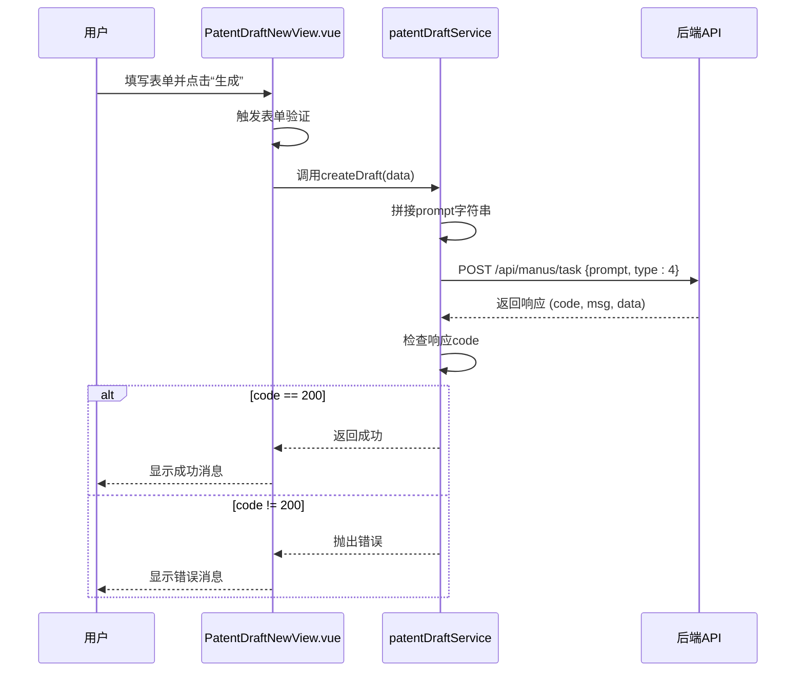

# 新建专利草稿

<cite>
**Referenced Files in This Document**   
- [PatentDraftNewView.vue](file://src/views/patent-draft/PatentDraftNewView.vue)
- [patentDraft.ts](file://src/services/patentDraft.ts)
- [PATENT_DRAFT_API_INTEGRATION.md](file://PATENT_DRAFT_API_INTEGRATION.md)
- [index.ts](file://src/types/index.ts)
</cite>

## 目录
1. [表单设计与字段验证](#表单设计与字段验证)
2. [Prompt拼接逻辑与API调用](#prompt拼接逻辑与api调用)
3. [后端接口请求参数结构](#后端接口请求参数结构)
4. [服务方法实现细节](#服务方法实现细节)
5. [提交成功后的用户体验](#提交成功后的用户体验)
6. [表单重置功能实现](#表单重置功能实现)
7. [异常处理路径分析](#异常处理路径分析)

## 表单设计与字段验证

新建专利草稿功能的核心界面由`PatentDraftNewView.vue`组件实现，提供了一个简洁直观的表单供用户填写技术交底信息。表单包含三个关键输入字段：发明名称、技术领域和技术方案。

在`PatentDraftNewView.vue`中，前端通过Element Plus的`el-form`组件实现了严格的输入验证机制。`formRules`对象定义了每个必填字段的验证规则：
- **发明名称**：要求用户必须填写，且长度在3至50个字符之间。此规则通过`required: true`和`min: 3, max: 50`的验证器实现。
- **技术领域**：作为必填项，要求用户输入至少20个字符以确保技术背景描述的充分性。
- **技术方案**：同样为必填项，要求内容不少于50个字符，鼓励用户提供详细的技术细节。

表单采用`ref="formRef"`进行引用，使得在提交时可以通过`formRef.value.validate()`方法触发整体验证。如果验证失败，系统会通过`ElMessage.warning`提示用户“请正确填写所有必填项”，确保用户在提交前修正输入错误。

**Section sources**
- [PatentDraftNewView.vue](file://src/views/patent-draft/PatentDraftNewView.vue#L1-L284)

## Prompt拼接逻辑与API调用

当用户提交表单时，系统会将用户输入的多个字段拼接成一个统一的`prompt`字符串，作为向后端AI服务传递上下文的核心数据。根据`PATENT_DRAFT_API_INTEGRATION.md`文档，`prompt`的拼接规则为：`发明名称 + \n + 技术领域 + \n + 技术方案`。

在`patentDraft.ts`服务文件中，`createDraft`方法接收一个包含`title`、`technicalField`和`technicalSolution`的对象。该方法内部通过模板字符串`${data.title}\n${data.technicalField}\n${data.technicalSolution}`将这三个字段按顺序用换行符`\n`连接，形成最终的`prompt`。这个`prompt`被作为`POST /api/manus/task`请求的`prompt`参数发送。

这种设计确保了后端AI模型能够接收到结构化的输入，从而更准确地理解发明的全貌，并生成高质量的专利文档。前端在调用此服务时，会将`draftData`对象中的相应字段传递给`createDraft`方法。

**Section sources**
- [patentDraft.ts](file://src/services/patentDraft.ts#L114-L149)
- [PATENT_DRAFT_API_INTEGRATION.md](file://PATENT_DRAFT_API_INTEGRATION.md#L0-L259)

## 后端接口请求参数结构

新建专利草稿功能通过调用`POST /api/manus/task`接口与后端进行通信。该接口的请求体包含两个核心参数：

1.  **`prompt` (string)**: 这是主要的输入内容，包含了由前端拼接的发明名称、技术领域和技术方案的完整文本。
2.  **`type` (number)**: 这是一个类型标识符，用于告诉后端本次请求的具体业务类型。在新建专利草稿的场景下，`type`的值固定为`4`。

`type=4`具有明确的业务含义，它标识了本次任务是“专利草稿”生成任务。后端服务根据这个`type`值，会选择相应的AI模型和处理流程来生成专利文档。这种设计使得同一个`/manus/task`接口可以支持多种不同类型的AI生成任务（例如，`type=5`可能用于“答辩支持”），通过`type`参数进行路由和区分。

**Section sources**
- [PATENT_DRAFT_API_INTEGRATION.md](file://PATENT_DRAFT_API_INTEGRATION.md#L0-L259)
- [patentDraft.ts](file://src/services/patentDraft.ts#L114-L149)

## 服务方法实现细节

`createDraft`服务方法是连接前端表单与后端API的关键桥梁，其定义位于`patentDraft.ts`文件中。该方法是一个异步函数，接收一个包含`title`和`technicalSolution`（根据代码，`technicalField`在当前实现中未被使用）的`data`对象。

方法的实现细节如下：
1.  **日志记录**：方法开始时会打印日志，记录“开始创建专利草稿”以及用户输入的发明名称和技术方案，便于调试和监控。
2.  **Prompt构建**：如前所述，将`data.title`和`data.technicalSolution`拼接成`prompt`字符串。
3.  **API调用**：使用`request.post`方法向`/manus/task`端点发起POST请求，将`prompt`和`type: 4`作为请求体。
4.  **响应处理**：检查后端返回的`response.code`。如果为`200`，则认为任务提交成功，返回响应数据；否则，抛出一个包含错误信息的`Error`对象。
5.  **错误处理**：在`catch`块中，对不同类型的错误进行精细化处理。例如，如果是“登录已过期”错误，则直接拒绝Promise，避免重复提示；对于其他错误，则从响应中提取错误信息或提供通用的网络错误提示。

**Diagram sources**
- [patentDraft.ts](file://src/services/patentDraft.ts#L114-L149)
- [PatentDraftNewView.vue](file://src/views/patent-draft/PatentDraftNewView.vue#L112-L174)

**Section sources**
- [patentDraft.ts](file://src/services/patentDraft.ts#L114-L149)

## 提交成功后的用户体验

为了提供流畅的用户体验，系统在成功提交专利草稿任务后，会执行一系列自动化的后续操作。

在`PatentDraftNewView.vue`的`generateDraft`方法中，一旦`createDraft`服务调用成功，系统会立即通过`ElMessage.success`显示一条提示信息：“专利草稿任务已提交，请在草稿管理中查看结果”。这条信息向用户清晰地传达了操作结果。

紧接着，系统会启动一个1.5秒（1500毫秒）的倒计时。倒计时结束后，通过`setTimeout`和`router.push('/app/patent-draft/manage')`，页面会自动跳转至“草稿管理”页面。这种设计避免了用户手动导航，极大地提升了操作效率，让用户能够无缝地从创建任务过渡到查看和管理任务结果。

**Section sources**
- [PatentDraftNewView.vue](file://src/views/patent-draft/PatentDraftNewView.vue#L112-L174)

## 表单重置功能实现

`resetForm`方法为用户提供了一键清空表单的功能。该方法的实现逻辑清晰且完整：
1.  **表单验证器重置**：首先检查`formRef.value`是否存在，如果存在，则调用其`resetFields()`方法。这会重置Element Plus表单验证器的状态，清除所有验证错误提示。
2.  **数据模型重置**：使用`Object.assign`方法，将`draftData`响应式对象的所有属性重置为初始的空值或默认值，包括`title`、`technicalField`、`technicalSolution`等所有字段。
3.  **用户反馈**：最后，通过`ElMessage.success('表单已重置')`向用户反馈操作成功。

值得注意的是，根据`PATENT_DRAFT_API_INTEGRATION.md`中的“修复的问题”部分，该文件中已修复了重复定义`resetForm`方法和引用无效变量`showPreview`的问题，确保了代码的健壮性和可维护性。

**Section sources**
- [PatentDraftNewView.vue](file://src/views/patent-draft/PatentDraftNewView.vue#L175-L195)
- [PATENT_DRAFT_API_INTEGRATION.md](file://PATENT_DRAFT_API_INTEGRATION.md#L0-L259)

## 异常处理路径分析

系统设计了完善的异常处理机制，以应对网络错误或后端验证失败等异常情况。

在`patentDraft.ts`的`createDraft`方法中，`try-catch`块捕获了所有可能的运行时错误。在`catch`分支中，系统会进行分层处理：
- **登录过期**：如果错误信息是“登录已过期”，则直接`return Promise.reject(error)`，将错误抛出，由上层的全局拦截器处理（如跳转到登录页）。
- **后端返回错误**：如果错误对象包含`response.data`，则从`msg`或`message`字段提取具体的错误信息并抛出。
- **其他错误**：直接使用错误的`message`属性，或在完全无法获取信息时，提供“网络错误，请检查网络连接”的通用提示。

在`PatentDraftNewView.vue`中，`generateDraft`方法的`catch`块会捕获这些错误，并通过`ElMessage.error(error.message || 'AI生成失败，请重试')`将错误信息以用户友好的方式展示在界面上，确保用户能够及时了解操作失败的原因。

**Section sources**
- [patentDraft.ts](file://src/services/patentDraft.ts#L114-L149)
- [PatentDraftNewView.vue](file://src/views/patent-draft/PatentDraftNewView.vue#L112-L174)