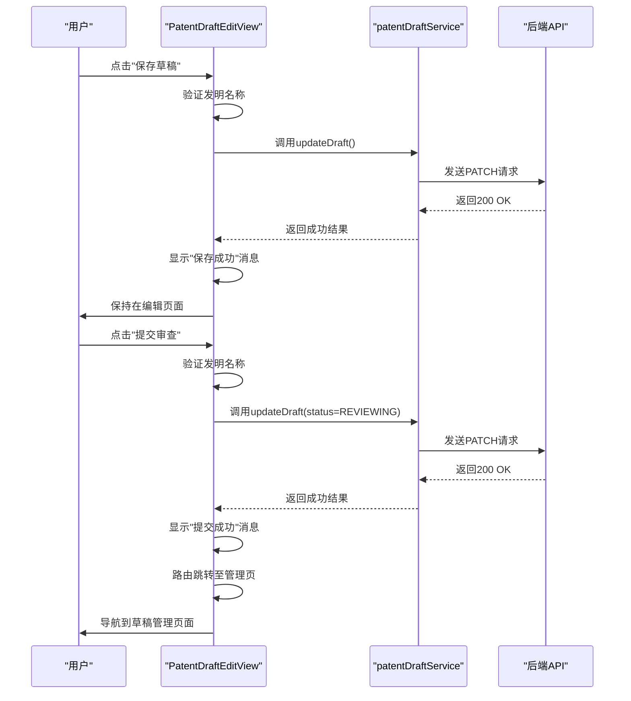
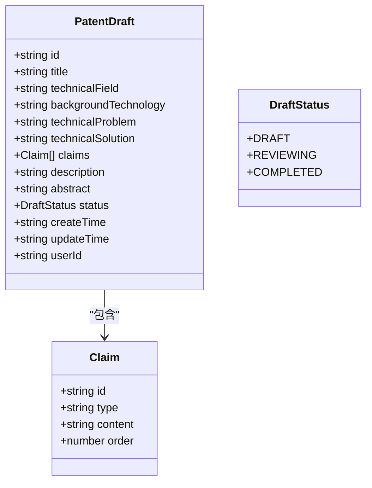

# 编辑专利草稿

<cite>
**Referenced Files in This Document**   
- [PatentDraftEditView.vue](file://src/views/patent-draft/PatentDraftEditView.vue)
- [patentDraft.ts](file://src/services/patentDraft.ts)
- [index.ts](file://src/types/index.ts)
- [PATENT_DRAFT_API_INTEGRATION.md](file://PATENT_DRAFT_API_INTEGRATION.md)
</cite>

## 目录
1. [简介](#简介)
2. [项目结构](#项目结构)
3. [核心组件](#核心组件)
4. [架构概述](#架构概述)
5. [详细组件分析](#详细组件分析)
6. [依赖分析](#依赖分析)
7. [性能考虑](#性能考虑)
8. [故障排除指南](#故障排除指南)
9. [结论](#结论)

## 简介
本文档旨在详细说明专利草稿编辑功能的技术实现，重点分析`PatentDraftEditView.vue`组件中的富文本编辑与内容持久化机制。该功能允许用户加载现有草稿内容并初始化编辑器状态，支持对发明名称、技术领域、背景技术、技术问题、技术方案、权利要求和说明书等专利核心要素的编辑。系统通过集成服务层与API接口，实现了草稿的加载、保存和提交审查等关键操作，为用户提供完整的专利撰写支持。

## 项目结构
专利草稿编辑功能位于`src/views/patent-draft/`目录下，是专利服务网站中一个独立的功能模块。该模块包含三个主要视图组件：`PatentDraftEditView.vue`用于编辑现有草稿，`PatentDraftManageView.vue`用于管理草稿列表，`PatentDraftNewView.vue`用于创建新草稿。业务逻辑由`src/services/patentDraft.ts`服务文件统一管理，该文件封装了与后端API通信的所有方法。类型定义则集中存放在`src/types/index.ts`中，确保了数据结构的一致性和类型安全。

**Section sources**
- [PatentDraftEditView.vue](file://src/views/patent-draft/PatentDraftEditView.vue)
- [patentDraft.ts](file://src/services/patentDraft.ts)

## 核心组件
`PatentDraftEditView.vue`是专利草稿编辑功能的核心组件，它负责渲染编辑界面、管理用户交互和协调数据持久化。该组件使用Vue 3的组合式API（`<script setup>`）进行开发，通过响应式数据`draftData`来绑定表单内容。组件在挂载时根据路由参数`id`判断是新建还是编辑模式，若为编辑模式则调用`loadDraftData`方法从服务器加载草稿详情。用户通过界面上的“保存草稿”和“提交审查”按钮触发相应的保存和提交逻辑，这些操作最终通过`patentDraftService`服务与后端进行通信。

**Section sources**
- [PatentDraftEditView.vue](file://src/views/patent-draft/PatentDraftEditView.vue#L1-L354)

## 架构概述
专利草稿编辑功能的架构遵循典型的分层模式，由视图层、服务层和API层组成。视图层（`PatentDraftEditView.vue`）负责用户界面的展示和用户输入的收集。服务层（`patentDraftService`）作为中间件，封装了所有与后端交互的业务逻辑，提供了`getDraftDetail`和`updateDraft`等方法。API层则通过`request`模块发送HTTP请求，与后端`/api/manus/task`和`/api/task/getPage`等端点进行通信。这种分层设计实现了关注点分离，使得代码更易于维护和测试。

```mermaid
graph TB
subgraph "前端"
A[PatentDraftEditView.vue] --> B[patentDraftService]
B --> C[HTTP Request]
end
subgraph "后端"
C --> D[/api/manus/task]
C --> E[/api/task/getPage]
end
```

**Diagram sources**
- [PatentDraftEditView.vue](file://src/views/patent-draft/PatentDraftEditView.vue)
- [patentDraft.ts](file://src/services/patentDraft.ts)

## 详细组件分析

### 组件分析
`PatentDraftEditView.vue`组件的实现展示了清晰的交互流程。当用户访问编辑页面时，组件首先检查路由参数`id`以确定操作模式。如果`id`存在，则进入编辑模式，调用`loadDraftData`方法。该方法通过`patentDraftService.getDraftDetail(id)`从服务器获取草稿的详细信息，并使用`Object.assign`将数据填充到`draftData`响应式对象中，从而自动更新视图。对于权利要求部分，组件使用`v-for`指令动态渲染一个可增删的表单项列表，每个权利要求包含类型选择和内容输入框。

**Section sources**
- [PatentDraftEditView.vue](file://src/views/patent-draft/PatentDraftEditView.vue#L1-L354)

### 保存与提交机制
组件的持久化机制通过`saveDraft`和`submitDraft`两个方法实现。两者都基于`patentDraftService.updateDraft`服务方法，区别在于提交时会将草稿状态`status`更新为`REVIEWING`。在调用服务前，方法会进行基本的前端验证，例如检查发明名称是否为空。服务调用被包裹在`try-catch`块中，以优雅地处理网络错误或后端异常，并通过`ElMessage`组件向用户展示成功或错误提示。保存操作完成后，用户停留在当前页面；而提交成功后，路由会自动跳转到草稿管理页面。



**Diagram sources**
- [PatentDraftEditView.vue](file://src/views/patent-draft/PatentDraftEditView.vue#L250-L350)
- [patentDraft.ts](file://src/services/patentDraft.ts#L250-L300)

### 数据模型与类型定义
系统的数据模型由`PatentDraft`接口定义，它位于`src/types/index.ts`文件中。该接口描述了专利草稿的所有属性，包括`id`、`title`、`technicalField`等文本字段，以及`claims`（权利要求）这样的复杂对象数组。`Claim`接口进一步定义了权利要求的`type`（独立或从属）和`content`。状态管理通过`DraftStatus`枚举实现，包含`DRAFT`、`REVIEWING`和`COMPLETED`三种状态。这些强类型的定义确保了在整个应用中数据结构的一致性，并为开发提供了良好的类型检查和自动补全支持。



**Diagram sources**
- [index.ts](file://src/types/index.ts#L141-L157)

## 依赖分析
`PatentDraftEditView.vue`组件依赖于多个外部模块。它直接导入了Element Plus的UI组件（如`el-button`、`el-input`、`el-card`）来构建用户界面，并使用`@element-plus/icons-vue`提供图标。在功能上，它依赖于`vue-router`进行页面导航，依赖于`element-plus`的`ElMessage`进行消息提示。最重要的业务依赖是`patentDraftService`，它被从`src/services/patentDraft.ts`导入，是与后端通信的唯一入口。此外，组件还依赖于`src/types`中的类型定义，以确保数据的类型安全。

```mermaid
graph TD
A[PatentDraftEditView.vue] --> B[Element Plus UI]
A --> C[@element-plus/icons-vue]
A --> D[vue-router]
A --> E[ElMessage]
A --> F[patentDraftService]
F --> G[HTTP Client]
A --> H[PatentDraft Type]
H --> I[index.ts]
```

**Diagram sources**
- [PatentDraftEditView.vue](file://src/views/patent-draft/PatentDraftEditView.vue#L1-L354)
- [patentDraft.ts](file://src/services/patentDraft.ts)

## 性能考虑
当前实现中，草稿的加载和保存都是在用户显式操作（进入页面或点击按钮）时触发的，没有实现自动保存功能。这虽然减少了不必要的网络请求，但也增加了用户因意外关闭页面而丢失数据的风险。服务层的`getDraftDetail`和`updateDraft`方法都包含了模拟的延迟（500ms和800ms），这在开发环境中用于模拟网络延迟，但在生产环境中应被移除。对于大型草稿，特别是包含大量文本或未来可能支持的图片/公式时，应考虑对`draftData`进行分块加载或优化，以避免一次性加载过多数据导致的性能问题。

## 故障排除指南
当用户无法加载草稿时，首先应检查浏览器的网络请求，确认`GET /api/manus/task/{id}`请求是否成功。如果返回404错误，说明服务器上不存在该ID的草稿，可能是ID错误或草稿已被删除。如果返回401错误，则表示用户未登录或登录已过期。在保存草稿失败时，应检查`PATCH /api/manus/task/{id}`请求的请求体是否符合API规范，特别是`title`字段不能为空。前端代码中的`ElMessage.error`会捕获并显示具体的错误信息，帮助用户理解问题所在。此外，应确保用户拥有编辑该草稿的权限，尽管当前实现中尚未包含权限校验逻辑。

**Section sources**
- [PatentDraftEditView.vue](file://src/views/patent-draft/PatentDraftEditView.vue#L200-L350)
- [patentDraft.ts](file://src/services/patentDraft.ts#L250-L320)

## 结论
`PatentDraftEditView.vue`组件成功实现了专利草稿的核心编辑功能，提供了一个结构清晰、易于使用的界面。通过与`patentDraftService`服务的集成，实现了草稿数据的加载和持久化。然而，当前实现仍存在一些可以改进的地方。首先，应实现自动保存功能，例如在用户停止输入一段时间后自动触发保存，以防止数据丢失。其次，应加入权限校验，确保只有草稿的创建者才能进行编辑。最后，文档中提到的富文本编辑器（如Quill）和实时预览功能在当前代码中并未体现，实际使用的是Element Plus的`el-input`多行文本框，这表明功能可能尚未完全开发或文档与代码存在脱节。未来的工作应集中在完善这些高级编辑功能上。