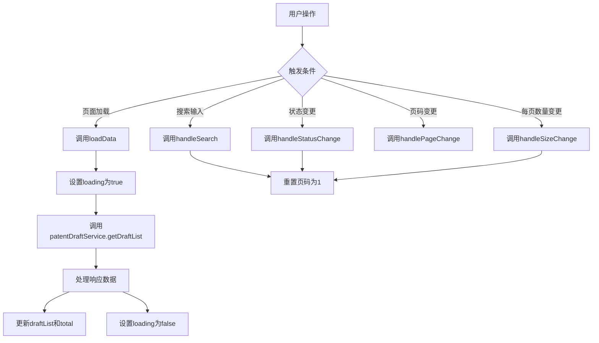
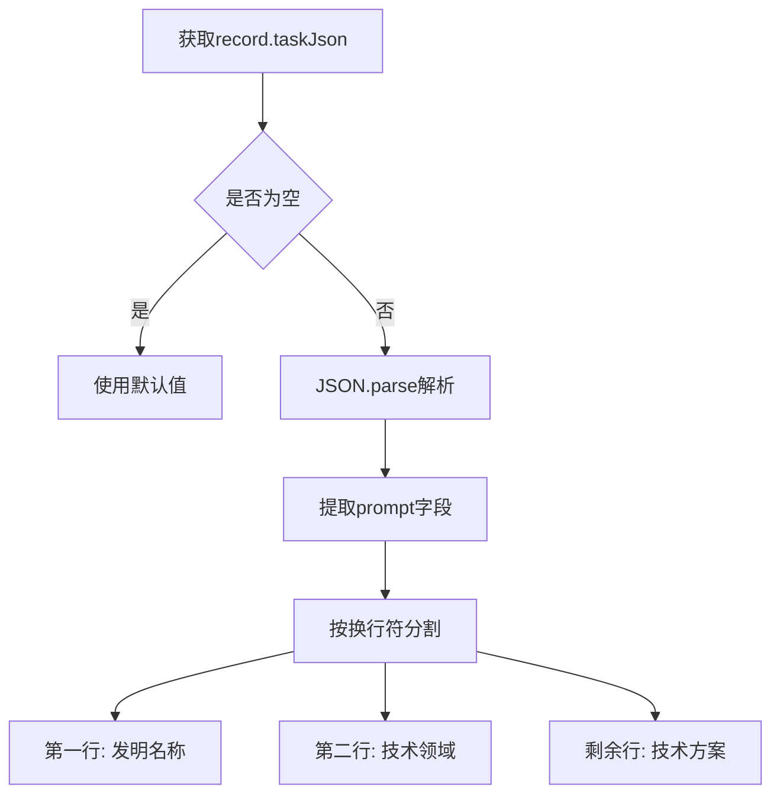
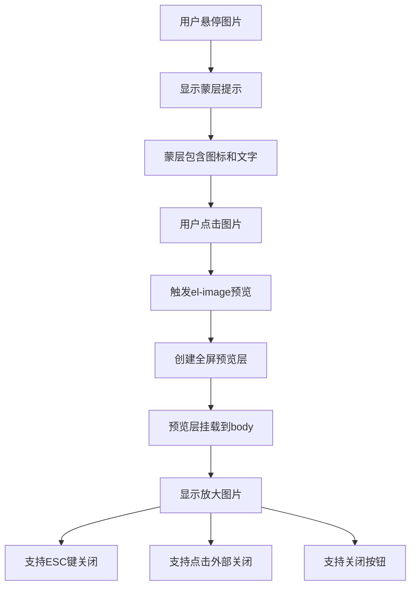
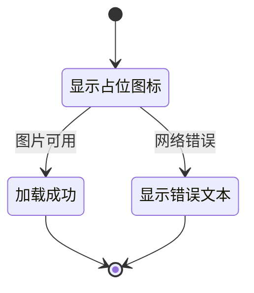
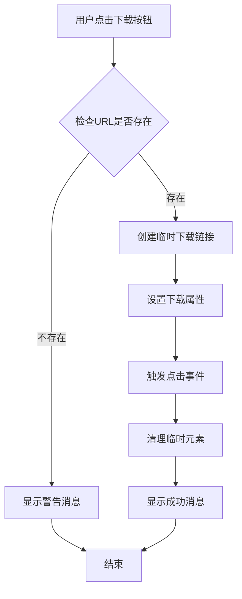
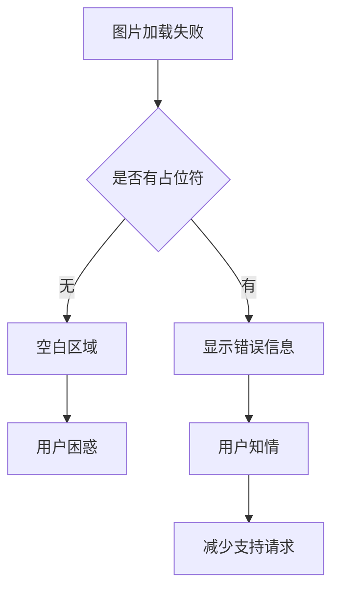
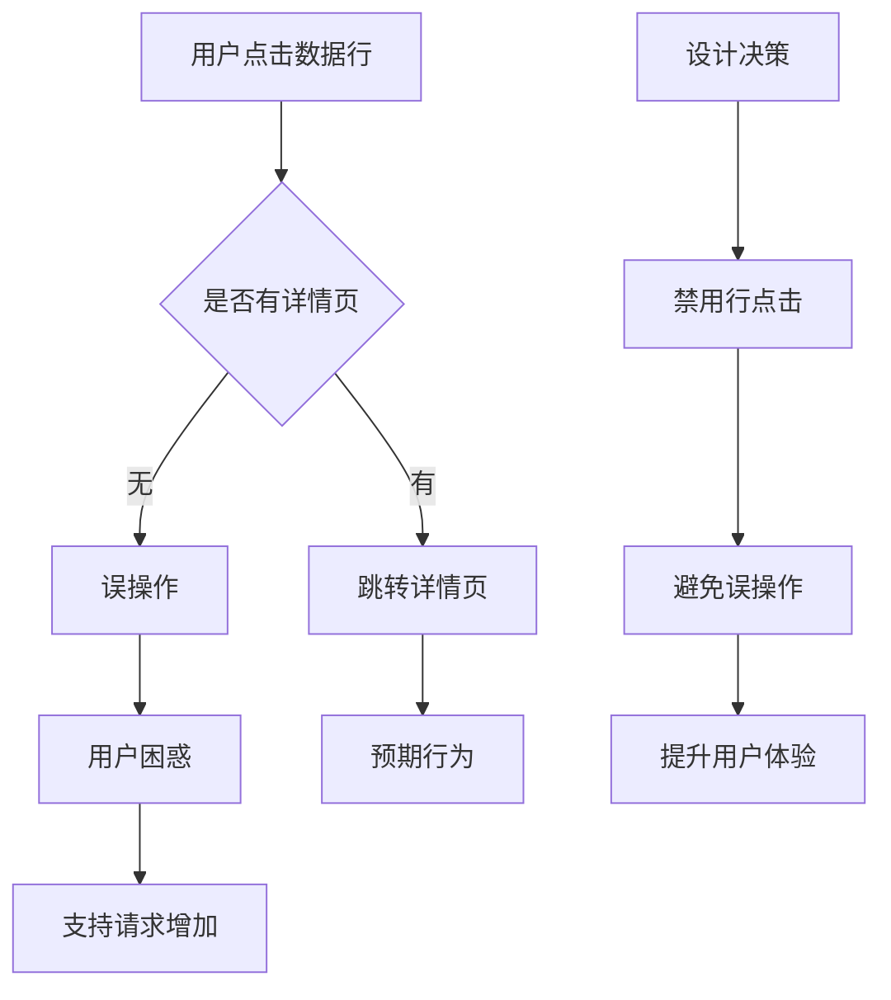

# 草稿管理列表

<cite>
**Referenced Files in This Document**  
- [PatentDraftManageView.vue](file://src/views/patent-draft/PatentDraftManageView.vue)
- [patentDraft.ts](file://src/services/patentDraft.ts)
- [index.ts](file://src/types/index.ts)
- [PATENT_DRAFT_API_INTEGRATION.md](file://PATENT_DRAFT_API_INTEGRATION.md)
</cite>

## 目录
1. [简介](#简介)
2. [核心功能](#核心功能)
3. [数据获取与分页](#数据获取与分页)
4. [数据解析与展示](#数据解析与展示)
5. [图片展示功能](#图片展示功能)
6. [文件下载功能](#文件下载功能)
7. [状态筛选机制](#状态筛选机制)
8. [性能与用户体验](#性能与用户体验)
9. [设计决策分析](#设计决策分析)

## 简介
草稿管理列表功能为用户提供了一个集中管理专利申请草稿的界面，支持查看、搜索、筛选和下载操作。该功能通过`PatentDraftManageView.vue`组件实现，集成了数据展示、交互控制和用户体验优化等多重特性。

## 核心功能
草稿管理列表提供了完整的草稿生命周期管理功能：
- 草稿列表展示与分页浏览
- 关键词搜索与状态筛选
- 图片预览与文件下载
- 草稿删除与列表刷新
- 响应式布局适配不同设备

**Section sources**
- [PatentDraftManageView.vue](file://src/views/patent-draft/PatentDraftManageView.vue#L1-L644)

## 数据获取与分页

### 分页机制
系统通过`POST /api/task/getPage`接口获取分页数据，使用以下参数控制分页行为：

| 参数 | 类型 | 描述 | 默认值 |
|------|------|------|-------|
| pageIndex | number | 当前页码 | 1 |
| pageSize | number | 每页记录数 | 10 |
| keyword | string | 搜索关键词 | 空字符串 |
| state | number | 状态筛选值 | 无 |
| type | number | 任务类型 | 4（专利草稿） |



**Diagram sources**
- [PatentDraftManageView.vue](file://src/views/patent-draft/PatentDraftManageView.vue#L280-L350)
- [patentDraft.ts](file://src/services/patentDraft.ts#L193-L223)

### 分页参数映射
前端分页参数与Element Plus组件的绑定关系：

```typescript
// 在PatentDraftManageView.vue中
v-model:current-page="pagination.page"
v-model:page-size="pagination.pageSize"
:total="total"
```

当用户更改每页显示数量时，系统会自动重置到第一页，确保用户体验的一致性。

**Section sources**
- [PatentDraftManageView.vue](file://src/views/patent-draft/PatentDraftManageView.vue#L570-L585)

## 数据解析与展示

### taskJson字段解析
后端返回的`taskJson`字段包含核心专利信息，前端通过以下逻辑进行解析：



解析代码实现：

```typescript
const taskData = JSON.parse(record.taskJson)
const promptLines = taskData.prompt ? taskData.prompt.split('\n') : []
const title = promptLines[0] || '专利草稿'
const technicalField = promptLines[1] || ''
const technicalSolution = promptLines.slice(2).join('\n')
```

**Diagram sources**
- [patentDraft.ts](file://src/services/patentDraft.ts#L205-L215)
- [PATENT_DRAFT_API_INTEGRATION.md](file://PATENT_DRAFT_API_INTEGRATION.md#L75-L85)

### 数据结构映射
将后端返回的原始数据映射为前端所需的`PatentDraft`类型：

```typescript
return {
  id: String(record.id),
  title,
  technicalField,
  technicalSolution,
  status: record.state === 1 ? DraftStatus.COMPLETED : DraftStatus.DRAFT,
  createTime: record.createTime,
  updateTime: record.updateTime,
  firstImgUrl: convertImageUrl(record.firstImgUrl),
  pdfUrl: record.pdfUrl,
  wordUrl: record.wordUrl
}
```

**Section sources**
- [patentDraft.ts](file://src/services/patentDraft.ts#L217-L245)

## 图片展示功能

### 图片渲染实现
图片展示组件采用Element Plus的`el-image`组件，配置了完整的展示和交互功能：

```vue
<el-image 
  :src="(draft as any).firstImgUrl" 
  fit="contain" 
  loading="lazy"
  :preview-src-list="[(draft as any).firstImgUrl]" 
  :initial-index="0" 
  preview-teleported 
  :z-index="3000"
  style="width: 280px; height: 210px; border-radius: 4px; cursor: pointer;">
</el-image>
```

**Section sources**
- [PatentDraftManageView.vue](file://src/views/patent-draft/PatentDraftManageView.vue#L108-L137)

### 图片预览机制
系统实现了完整的图片预览功能，包含以下特性：



**Diagram sources**
- [PatentDraftManageView.vue](file://src/views/patent-draft/PatentDraftManageView.vue#L108-L137)
- [IMAGE_PREVIEW_FIX.md](file://IMAGE_PREVIEW_FIX.md#L112-L182)

### 图片尺寸与样式
图片展示遵循统一的设计规范：

| 属性 | 值 | 说明 |
|------|-----|------|
| 宽度 | 280px | 固定宽度 |
| 高度 | 210px | 固定高度 |
| 圆角 | 4px | 轻微圆角 |
| 悬停效果 | 上移2px + 阴影 | 视觉反馈 |
| 边框 | 1px浅色边框 | 边界清晰 |

**Section sources**
- [PatentDraftManageView.vue](file://src/views/patent-draft/PatentDraftManageView.vue#L115-L116)

### 占位符与错误处理
系统提供了完善的图片加载状态处理：



占位符内容：
- 使用`Picture`图标作为加载占位
- 错误时显示"图片加载失败"文本
- 背景色与页面一致，确保视觉统一

**Diagram sources**
- [PatentDraftManageView.vue](file://src/views/patent-draft/PatentDraftManageView.vue#L120-L135)

## 文件下载功能

### 下载逻辑实现
系统提供了PDF和Word文件的下载功能，实现逻辑如下：



**Diagram sources**
- [PatentDraftManageView.vue](file://src/views/patent-draft/PatentDraftManageView.vue#L352-L437)

### 下载函数分析
以Word下载为例，详细实现如下：

```typescript
const downloadWord = async (draft: PatentDraft) => {
  const wordUrl = (draft as any).wordUrl
  if (!wordUrl) {
    ElMessage.warning('该草稿暂无Word文件')
    return
  }
  
  const loadingMessage = ElMessage({
    message: '正在准备下载...',
    type: 'info',
    duration: 0
  })
  
  try {
    const link = document.createElement('a')
    link.style.display = 'none'
    link.href = wordUrl
    link.download = `${draft.title}_专利草稿.docx`
    document.body.appendChild(link)
    link.click()
    setTimeout(() => {
      document.body.removeChild(link)
    }, 100)
    
    loadingMessage.close()
    ElMessage.success('下载已开始，请查看浏览器下载列表')
  } catch (error) {
    loadingMessage.close()
    ElMessage.warning('直接下载失败，正在尝试在新窗口打开...')
    setTimeout(() => {
      window.open(wordUrl, '_blank')
    }, 500)
  }
}
```

**Section sources**
- [PatentDraftManageView.vue](file://src/views/patent-draft/PatentDraftManageView.vue#L392-L437)

### 错误处理策略
系统采用了多层下载策略确保用户体验：

1. **首选策略**：创建`<a>`标签并触发下载
2. **备选策略**：使用`window.open`在新窗口打开
3. **用户反馈**：通过`ElMessage`提供实时状态

**Section sources**
- [PatentDraftManageView.vue](file://src/views/patent-draft/PatentDraftManageView.vue#L352-L437)

## 状态筛选机制

### 状态映射规则
前端状态与后端状态的映射关系：

| 前端状态 | 后端state值 | 显示文本 | Tag类型 |
|---------|-----------|---------|--------|
| DRAFT | 0 | 草稿 | info |
| REVIEWING | 1 | 审查中 | warning |
| COMPLETED | 1 | 已完成 | success |

```typescript
const statusMap: Record<string, number> = {
  'draft': 0,
  'reviewing': 1,
  'completed': 1
}
```

**Section sources**
- [patentDraft.ts](file://src/services/patentDraft.ts#L200-L203)

### 状态显示实现
通过`getStatusType`和`getStatusText`函数实现状态显示：

```typescript
const getStatusType = (status: DraftStatus): string => {
  switch (status) {
    case DraftStatus.DRAFT: return 'info'
    case DraftStatus.REVIEWING: return 'warning'
    case DraftStatus.COMPLETED: return 'success'
    default: return 'info'
  }
}

const getStatusText = (status: DraftStatus): string => {
  switch (status) {
    case DraftStatus.DRAFT: return '草稿'
    case DraftStatus.REVIEWING: return '审查中'
    case DraftStatus.COMPLETED: return '已完成'
    default: return '未知'
  }
}
```

**Section sources**
- [PatentDraftManageView.vue](file://src/views/patent-draft/PatentDraftManageView.vue#L532-L554)

### 筛选组件配置
使用Element Plus的`el-select`组件实现状态筛选：

```vue
<el-select v-model="statusFilter" placeholder="状态筛选" clearable @change="handleStatusChange">
  <el-option label="全部" value="" />
  <el-option label="草稿" value="draft" />
  <el-option label="审查中" value="reviewing" />
  <el-option label="已完成" value="completed" />
</el-select>
```

**Section sources**
- [PatentDraftManageView.vue](file://src/views/patent-draft/PatentDraftManageView.vue#L35-L43)

## 性能与用户体验

### 图片懒加载
系统采用`loading="lazy"`属性实现图片懒加载：

```vue
<el-image loading="lazy" />
```

优势：
- 只加载可视区域的图片
- 减少初始页面加载时间
- 降低网络带宽消耗
- 提升页面响应速度

**Section sources**
- [PatentDraftManageView.vue](file://src/views/patent-draft/PatentDraftManageView.vue#L114)

### 错误占位符价值
错误占位符提升了用户体验：



**Diagram sources**
- [PatentDraftManageView.vue](file://src/views/patent-draft/PatentDraftManageView.vue#L130-L135)

### 响应式设计
系统支持不同屏幕尺寸的适配：

```scss
@media (max-width: 768px) {
  .draft-actions {
    flex-direction: row;
    width: 100px;
  }
  
  .draft-meta {
    flex-direction: column;
  }
}
```

**Section sources**
- [PatentDraftManageView.vue](file://src/views/patent-draft/PatentDraftManageView.vue#L600-L644)

## 设计决策分析

### 禁用数据行点击事件
系统故意禁用了数据行的点击事件，主要原因如下：



**Section sources**
- [PatentDraftManageView.vue](file://src/views/patent-draft/PatentDraftManageView.vue#L90-L105)

### 统一交互规范
系统遵循统一的交互设计规范：

| 功能 | 规范 | 说明 |
|------|------|------|
| 图片尺寸 | 280x210px | 统一视觉比例 |
| 悬停效果 | 上移2px+阴影 | 一致的反馈 |
| 蒙层提示 | 放大镜图标+文字 | 明确的交互暗示 |
| 预览层级 | z-index: 3000 | 确保最上层 |

**Section sources**
- [IMAGE_MASK_ENHANCEMENT.md](file://IMAGE_MASK_ENHANCEMENT.md#L124-L167)

### 性能优化总结
系统实施了多项性能优化措施：

1. **图片懒加载**：减少初始加载资源
2. **错误占位符**：提供明确的失败反馈
3. **组件复用**：统一图片展示逻辑
4. **事件优化**：避免不必要的事件处理
5. **网络请求**：合理使用分页减少数据传输

这些优化共同提升了系统的整体性能和用户体验。

**Section sources**
- [PatentDraftManageView.vue](file://src/views/patent-draft/PatentDraftManageView.vue#L1-L644)
- [patentDraft.ts](file://src/services/patentDraft.ts#L1-L326)