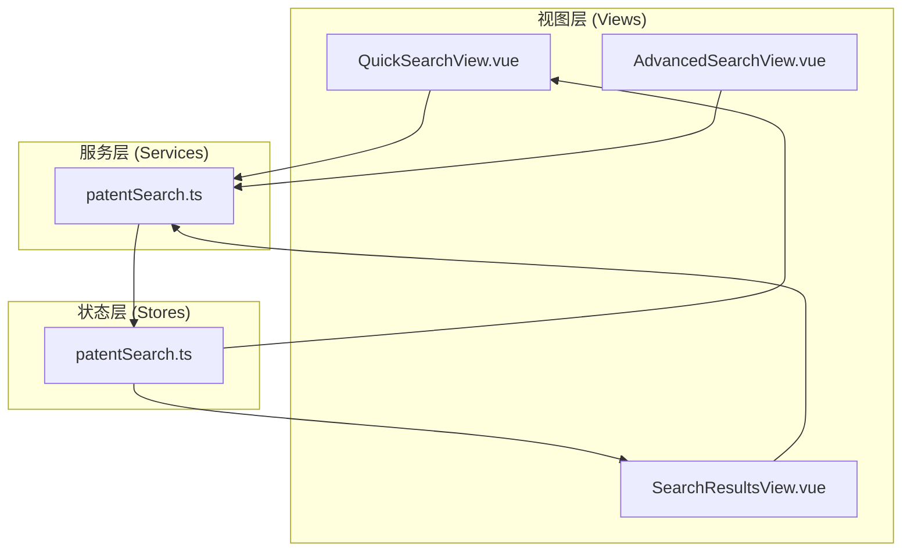
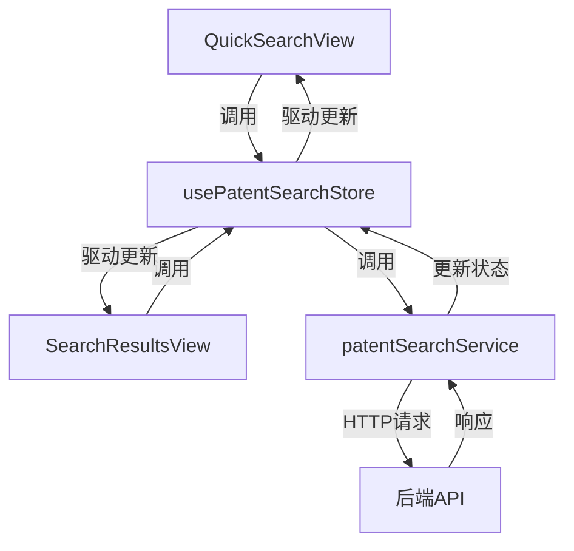
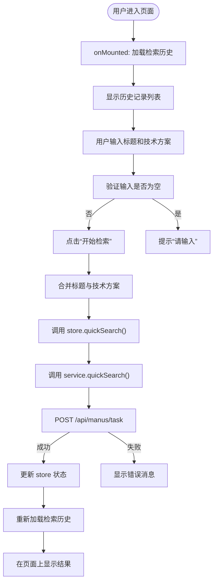
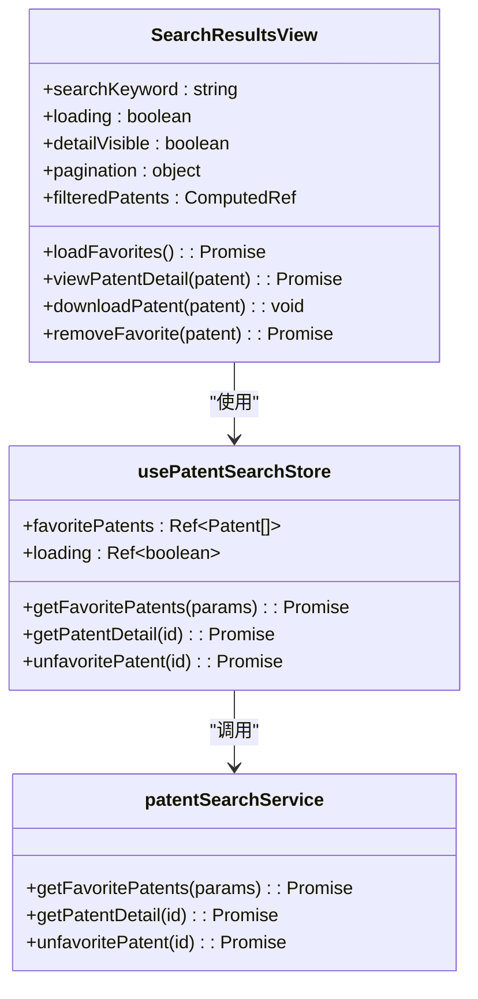
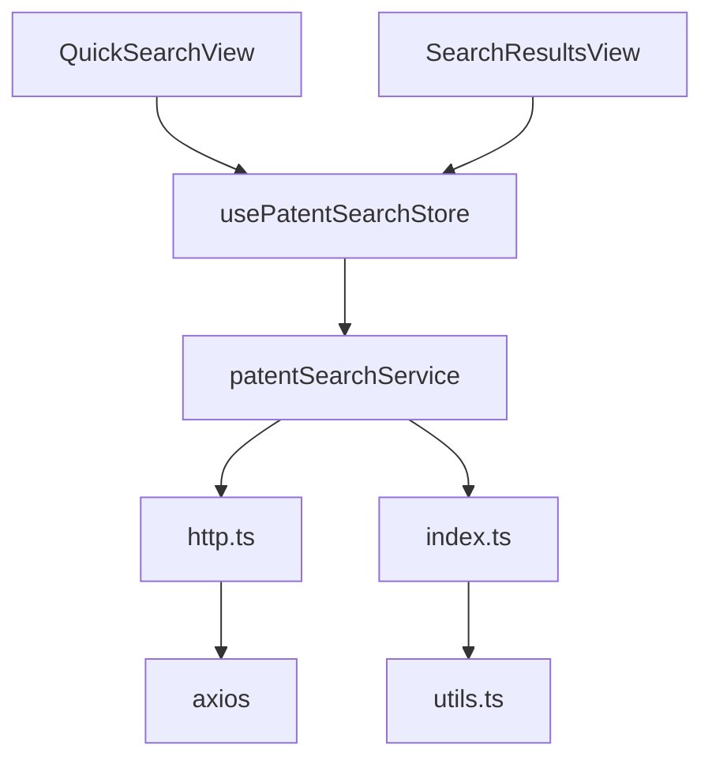

# 专利检索功能

<cite>
**本文档引用文件**  
- [PATENT_SEARCH_API.md](file://PATENT_SEARCH_API.md)
- [QuickSearchView.vue](file://src/views/patent-search/QuickSearchView.vue)
- [SearchResultsView.vue](file://src/views/patent-search/SearchResultsView.vue)
- [patentSearch.ts](file://src/services/patentSearch.ts)
- [patentSearch.ts](file://src/stores/patentSearch.ts)
</cite>

## 目录
1. [简介](#简介)
2. [项目结构](#项目结构)
3. [核心组件](#核心组件)
4. [架构概述](#架构概述)
5. [详细组件分析](#详细组件分析)
6. [依赖分析](#依赖分析)
7. [性能考虑](#性能考虑)
8. [故障排除指南](#故障排除指南)
9. [结论](#结论)

## 简介
本文档详细说明专利检索功能的实现机制，涵盖快速检索、高级检索和结果展示三大核心环节。系统基于Vue 3与Element Plus构建，采用Pinia进行状态管理，通过调用后端API实现专利文献的检索、收藏与管理。前端通过`QuickSearchView`实现关键词输入与搜索触发，`SearchResultsView`负责结果渲染与用户交互，而`patentSearch`服务模块封装了所有与后端通信的逻辑。文档还结合`PATENT_SEARCH_API.md`说明接口调用规范及大规模数据处理的优化策略。

## 项目结构
专利检索功能的相关文件集中于`src/views/patent-search`目录下，包含三个核心视图组件，并由`src/services`和`src/stores`中的服务与状态管理模块支撑。

**图示来源**  
- [QuickSearchView.vue](file://src/views/patent-search/QuickSearchView.vue)
- [SearchResultsView.vue](file://src/views/patent-search/SearchResultsView.vue)
- [patentSearch.ts](file://src/services/patentSearch.ts)
- [patentSearch.ts](file://src/stores/patentSearch.ts)

**本节来源**  
- [src/views/patent-search](file://src/views/patent-search)
- [src/services](file://src/services)
- [src/stores](file://src/stores)

## 核心组件
本功能的核心由三个部分构成：`QuickSearchView`负责快速检索的用户输入与触发，`SearchResultsView`管理用户的收藏列表与详情查看，`patentSearchService`则作为统一的服务接口，协调前端与后端的API交互。状态管理通过`usePatentSearchStore`实现，确保数据在不同组件间的一致性与响应性。

**本节来源**  
- [QuickSearchView.vue](file://src/views/patent-search/QuickSearchView.vue#L1-L50)
- [SearchResultsView.vue](file://src/views/patent-search/SearchResultsView.vue#L1-L50)
- [patentSearch.ts](file://src/services/patentSearch.ts#L1-L50)

## 架构概述
系统采用分层架构，清晰地分离了视图、状态和业务逻辑。视图层（View Layer）负责用户界面的展示与交互；状态层（Store Layer）使用Pinia集中管理应用状态，如检索结果、收藏列表和加载状态；服务层（Service Layer）封装了所有与后端API的通信细节。这种架构确保了代码的可维护性和可测试性。

**图示来源**  
- [QuickSearchView.vue](file://src/views/patent-search/QuickSearchView.vue)
- [SearchResultsView.vue](file://src/views/patent-search/SearchResultsView.vue)
- [patentSearch.ts](file://src/stores/patentSearch.ts)
- [patentSearch.ts](file://src/services/patentSearch.ts)

## 详细组件分析
本节深入分析专利检索功能的各个关键组件，解释其内部实现机制和工作流程。

### 快速检索视图分析
`QuickSearchView`是用户进行专利检索的主要入口，它实现了关键词输入、搜索触发和结果跳转的完整流程。

#### 用户交互流程

**图示来源**  
- [QuickSearchView.vue](file://src/views/patent-search/QuickSearchView.vue#L200-L300)
- [patentSearch.ts](file://src/stores/patentSearch.ts#L31-L50)
- [patentSearch.ts](file://src/services/patentSearch.ts#L138-L170)

#### 状态管理与服务调用
该组件通过`usePatentSearchStore`与`patentSearchService`进行交互。当用户点击“开始检索”时，`handleSearch`方法会验证输入，然后调用`patentSearchStore.quickSearch()`。此方法在`patentSearch.ts`的store中定义，它会设置`searching`状态为`true`，然后调用`patentSearchService.quickSearch()`。服务层最终向`/api/manus/task`发起POST请求，提交检索任务。

**本节来源**  
- [QuickSearchView.vue](file://src/views/patent-search/QuickSearchView.vue)
- [patentSearch.ts](file://src/stores/patentSearch.ts#L31-L50)
- [patentSearch.ts](file://src/services/patentSearch.ts#L138-L170)

### 结果展示视图分析
`SearchResultsView`负责管理用户的专利收藏，提供列表展示、搜索、分页、详情查看和下载等功能。

#### 功能实现机制

**图示来源**  
- [SearchResultsView.vue](file://src/views/patent-search/SearchResultsView.vue)
- [patentSearch.ts](file://src/stores/patentSearch.ts)
- [patentSearch.ts](file://src/services/patentSearch.ts)

#### 数据流与用户操作
当用户进入`SearchResultsView`时，`onMounted`钩子会调用`loadFavorites()`，该方法通过`patentSearchStore.getFavoritePatents()`从服务层获取收藏列表。用户可以在搜索框中输入关键词，`filteredPatents`计算属性会实时过滤`favoritePatents`。点击“在线浏览”会触发`viewPatentDetail()`，它会调用`getPatentDetail()`获取完整信息并显示在对话框中。

**本节来源**  
- [SearchResultsView.vue](file://src/views/patent-search/SearchResultsView.vue)
- [patentSearch.ts](file://src/stores/patentSearch.ts#L140-L156)

### 高级检索视图分析
`AdvancedSearchView`目前为占位文件，根据`PATENT_SEARCH_API.md`文档，其功能尚未实现。文档指出，未来需要在此视图中实现复杂的条件组合检索，包括字段筛选和逻辑运算。其设计应与`QuickSearchView`类似，但表单会包含更多字段，如申请人、申请日、IPC分类号等，并支持AND/OR等逻辑运算符。

**本节来源**  
- [AdvancedSearchView.vue](file://src/views/patent-search/AdvancedSearchView.vue)

## 依赖分析
专利检索功能的实现依赖于多个模块的协同工作，形成了一个清晰的依赖链。

**图示来源**  
- [QuickSearchView.vue](file://src/views/patent-search/QuickSearchView.vue)
- [SearchResultsView.vue](file://src/views/patent-search/SearchResultsView.vue)
- [patentSearch.ts](file://src/stores/patentSearch.ts)
- [patentSearch.ts](file://src/services/patentSearch.ts)
- [http.ts](file://src/services/http.ts)

**本节来源**  
- [patentSearch.ts](file://src/services/patentSearch.ts#L1-L10)

## 性能考虑
尽管当前代码中未显式实现防抖（Debounce）和懒加载（Lazy Loading），但系统设计为支持这些性能优化策略。

- **防抖**：在`QuickSearchView`的搜索输入框中，可以为`v-model`添加`.lazy`修饰符或使用`lodash.debounce`来延迟搜索请求，避免用户输入时频繁触发API调用。
- **懒加载**：`el-image`组件已使用`lazy`属性，实现了图片的懒加载。对于专利列表，当前采用分页加载（`pageIndex`和`pageSize`），这本身就是一种懒加载策略，避免一次性加载大量数据。
- **大规模数据处理**：后端API的`/task/getPage`接口支持分页查询，前端通过`getSearchHistory`方法传入分页参数，有效控制了单次请求的数据量，保证了页面性能。

**本节来源**  
- [QuickSearchView.vue](file://src/views/patent-search/QuickSearchView.vue#L100)
- [SearchResultsView.vue](file://src/views/patent-search/SearchResultsView.vue#L200)
- [patentSearch.ts](file://src/services/patentSearch.ts#L172-L200)

## 故障排除指南
本节提供常见问题的解决方案。

- **无结果**：如果`QuickSearchView`的检索历史为空，首先检查用户是否已进行过检索。如果已检索但无结果，请检查后端任务是否成功提交（查看`/api/manus/task`的响应）。如果后端返回成功，但`/task/getPage`无记录，可能是任务处理延迟或失败，需检查后端日志。
- **超时**：如果API请求超时，首先检查网络连接。在`patentSearchService`中，`request`函数可能需要配置超时时间。用户应检查输入的技术方案是否过于复杂，导致后端处理时间过长。
- **登录过期**：代码中已处理`"登录已过期"`的错误，不会弹出额外提示。系统应通过全局拦截器重定向到登录页。
- **图片加载失败**：`el-image`组件已内置错误处理，会显示“图片加载失败”的占位符。确保`firstImgUrl`字段返回的是有效的图片URL。

**本节来源**  
- [QuickSearchView.vue](file://src/views/patent-search/QuickSearchView.vue#L300-L350)
- [patentSearch.ts](file://src/services/patentSearch.ts#L150-L160)

## 结论
专利检索功能通过`QuickSearchView`、`SearchResultsView`和`patentSearch`服务模块的协同工作，实现了从检索到管理的完整流程。系统架构清晰，职责分离明确。虽然`AdvancedSearchView`尚未实现，但现有代码为未来扩展提供了良好的基础。通过利用后端API的分页能力，系统能够有效处理大规模数据。未来可进一步优化，如在高级检索中实现复杂的查询条件，并在前端增加防抖等用户体验优化。