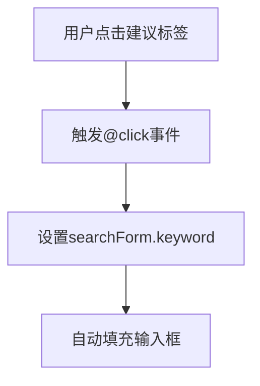
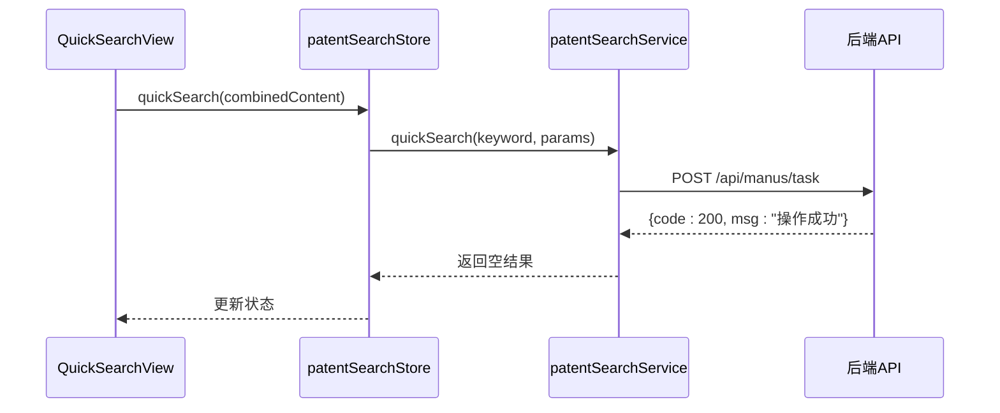

# 快速检索

<cite>
**Referenced Files in This Document**  
- [QuickSearchView.vue](file://src/views/patent-search/QuickSearchView.vue)
- [PATENT_SEARCH_API.md](file://PATENT_SEARCH_API.md)
- [patentSearch.ts](file://src/stores/patentSearch.ts)
- [patentSearch.ts](file://src/services/patentSearch.ts)
</cite>

## 目录
1. [简介](#简介)
2. [多行文本输入与字数限制](#多行文本输入与字数限制)
3. [快捷建议标签](#快捷建议标签)
4. [提交按钮状态管理](#提交按钮状态管理)
5. [检索请求封装](#检索请求封装)
6. [检索历史刷新机制](#检索历史刷新机制)
7. [防抖机制](#防抖机制)
8. [常见问题与解决方案](#常见问题与解决方案)

## 简介
本文档详细说明专利快速检索功能的实现机制，重点分析`QuickSearchView.vue`组件中的核心功能，包括多行文本输入、快捷建议、提交处理、API调用及错误处理等。系统通过调用`/api/manus/task`接口实现专利检索，并结合状态管理实现完整的用户交互流程。

## 多行文本输入与字数限制
`QuickSearchView.vue`组件通过`el-input`组件实现多行文本输入功能，支持技术方案的详细描述输入。

- **输入框配置**：使用`type="textarea"`属性创建多行文本输入区域，设置`rows="6"`提供足够的输入空间
- **字数限制**：通过`maxlength="10000"`属性限制最大输入字符数为10000，同时启用`show-word-limit`显示实时字数计数
- **用户体验**：提供`placeholder`提示用户输入建议（300-1000字效果最佳），并支持`clearable`清除功能
- **响应式设计**：设置`resize="vertical"`允许用户垂直调整输入框大小

**Section sources**
- [QuickSearchView.vue](file://src/views/patent-search/QuickSearchView.vue#L35-L40)

## 快捷建议标签
系统提供快捷搜索建议功能，帮助用户快速开始检索。

- **建议内容**：预设了"组装式食用菌种植棚"等典型技术方案作为示例
- **交互机制**：每个建议以`el-tag`组件显示，用户点击后自动填充到技术方案输入框
- **数据管理**：建议列表存储在`searchSuggestions`响应式变量中，便于动态扩展
- **视觉反馈**：鼠标悬停时标签背景色变为蓝色，提供清晰的可点击反馈

**Diagram sources**
- [QuickSearchView.vue](file://src/views/patent-search/QuickSearchView.vue#L54-L59)

**Section sources**
- [QuickSearchView.vue](file://src/views/patent-search/QuickSearchView.vue#L54-L59)

## 提交按钮状态管理
提交按钮实现了完善的状态管理和禁用控制策略。

- **加载状态**：通过`:loading="searching"`绑定`pinia`状态，检索时显示加载动画
- **禁用逻辑**：`:disabled`属性绑定双重验证条件，当专利标题或技术方案为空时禁用按钮
- **文本切换**：按钮文本根据`searching`状态动态切换，显示"开始检索"或"检索中..."
- **防重复提交**：加载状态下自动禁用，防止用户多次点击导致重复请求

**Section sources**
- [QuickSearchView.vue](file://src/views/patent-search/QuickSearchView.vue#L47-L50)

## 检索请求封装
`quickSearch()`方法封装了完整的请求处理逻辑，与后端API进行交互。

- **API端点**：调用`POST /api/manus/task`接口提交检索任务
- **参数封装**：将用户输入的专利标题和技术方案合并，作为`prompt`参数发送，同时设置`type=2`标识专利检索类型
- **状态同步**：通过`patentSearchStore`状态管理器协调UI状态和业务逻辑
- **错误处理**：捕获并处理各种异常情况，提供用户友好的错误提示

**Diagram sources**
- [QuickSearchView.vue](file://src/views/patent-search/QuickSearchView.vue#L128-L166)
- [patentSearch.ts](file://src/stores/patentSearch.ts#L25-L52)
- [patentSearch.ts](file://src/services/patentSearch.ts#L140-L186)
- [PATENT_SEARCH_API.md](file://PATENT_SEARCH_API.md#L6-L14)

**Section sources**
- [QuickSearchView.vue](file://src/views/patent-search/QuickSearchView.vue#L128-L166)
- [patentSearch.ts](file://src/stores/patentSearch.ts#L25-L52)
- [patentSearch.ts](file://src/services/patentSearch.ts#L140-L186)

## 检索历史刷新机制
用户提交检索后，系统自动刷新检索历史列表。

- **自动加载**：`handleSearch`方法在成功提交检索后调用`loadSearchHistory()`方法
- **分页管理**：刷新时重置分页为第一页，确保显示最新结果
- **状态同步**：通过`patentSearchStore.getSearchHistory()`获取最新历史记录
- **错误处理**：对登录过期等特定错误不显示额外提示，避免干扰用户体验

**Section sources**
- [QuickSearchView.vue](file://src/views/patent-search/QuickSearchView.vue#L159-L165)
- [patentSearch.ts](file://src/stores/patentSearch.ts#L229-L252)

## 防抖机制
虽然当前实现中未显式使用防抖，但系统通过合理的状态管理避免了高频输入问题。

- **状态控制**：`searching`状态在请求期间保持为`true`，防止连续提交
- **建议使用**：在高频输入场景下，建议实现防抖机制，延迟请求发送，减少不必要的API调用
- **性能优化**：防抖可有效降低服务器负载，提升系统整体性能

## 常见问题与解决方案
针对检索功能可能出现的问题，系统提供了相应的解决方案。

### 提交失败
- **原因**：网络异常、服务器错误或参数验证失败
- **解决方案**：捕获异常并显示`ElMessage.error()`提示，指导用户检查输入内容

### 网络超时
- **原因**：网络连接不稳定或服务器响应超时
- **解决方案**：提示"网络错误，请检查网络连接"，建议用户检查网络状态后重试

### 无结果返回
- **原因**：检索条件过于宽泛或系统正在处理中
- **解决方案**：显示空状态提示，提供"开始检索"按钮引导用户重新操作

### 登录过期
- **原因**：用户会话已过期
- **解决方案**：静默处理登录过期错误，不显示额外提示，由全局拦截器处理重定向

**Section sources**
- [QuickSearchView.vue](file://src/views/patent-search/QuickSearchView.vue#L148-L157)
- [patentSearch.ts](file://src/services/patentSearch.ts#L168-L185)