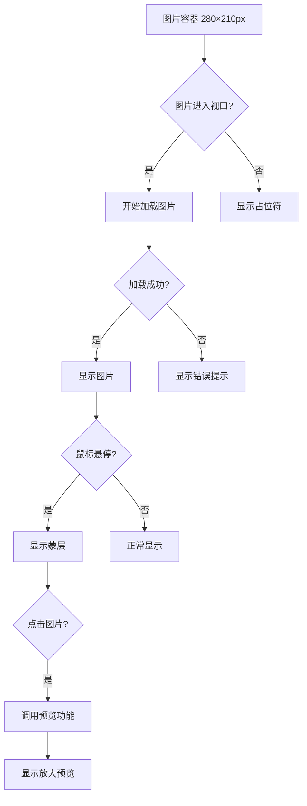
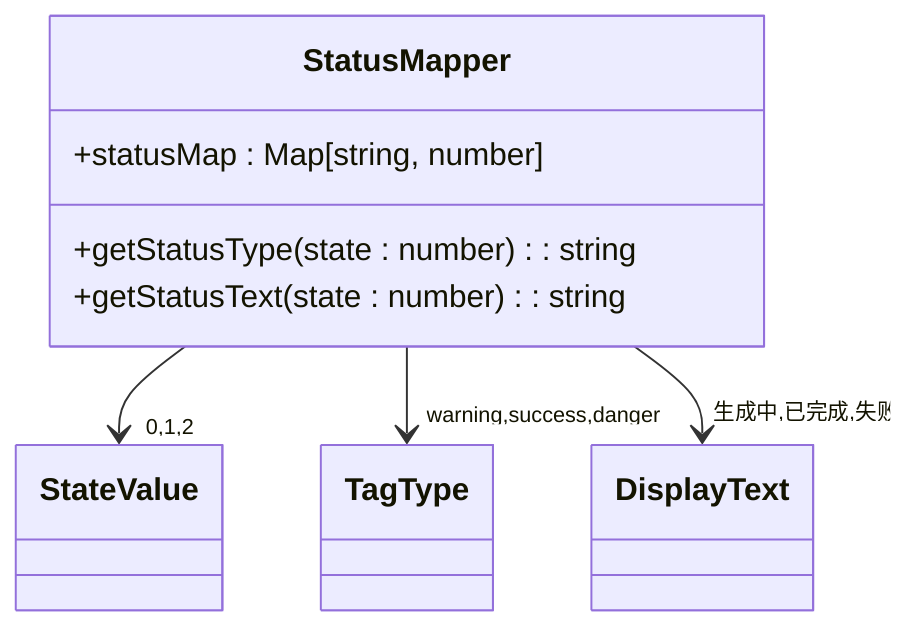
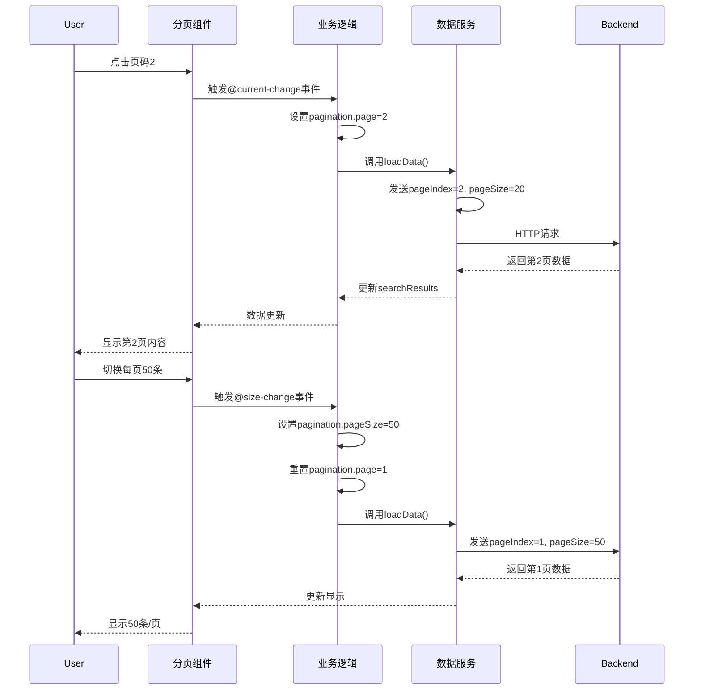
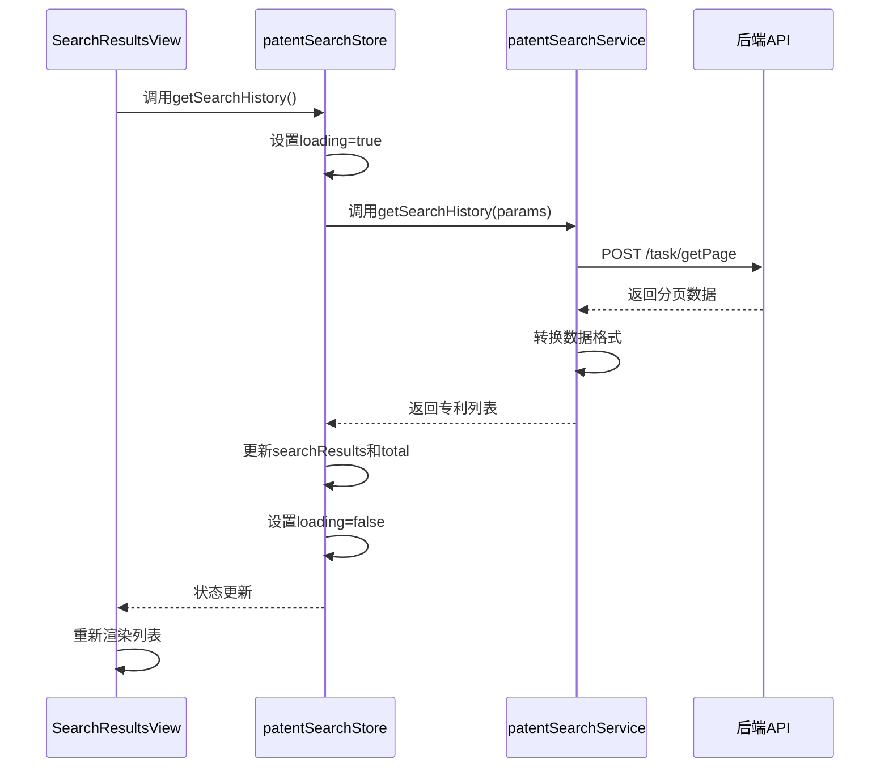

# 结果展示

<cite>
**Referenced Files in This Document**  
- [SearchResultsView.vue](file://src/views/patent-search/SearchResultsView.vue)
- [QuickSearchView.vue](file://src/views/patent-search/QuickSearchView.vue)
- [patentSearch.ts](file://src/services/patentSearch.ts)
- [patentSearch.ts](file://src/stores/patentSearch.ts)
- [FILE_DOWNLOAD_FIX.md](file://FILE_DOWNLOAD_FIX.md)
</cite>

## 目录
1. [简介](#简介)
2. [核心组件](#核心组件)
3. [图片展示机制](#图片展示机制)
4. [状态标签映射](#状态标签映射)
5. [分页功能实现](#分页功能实现)
6. [PDF下载功能](#pdf下载功能)
7. [数据流分析](#数据流分析)
8. [边界情况处理](#边界情况处理)

## 简介
本文档详细说明了专利检索结果展示功能的实现机制，重点阐述了SearchResultsView.vue组件中专利列表的渲染逻辑。文档涵盖了图片懒加载、状态标签映射、分页控制和PDF下载等核心功能的实现细节，以及从API响应到视图渲染的完整数据流。

## 核心组件

本文档主要分析`SearchResultsView.vue`组件的实现，该组件负责展示用户的专利收藏列表。组件采用Element Plus UI框架构建，包含搜索框、操作按钮、专利列表和分页控件等元素。专利列表项包含标题、元信息、摘要和操作按钮等区域，支持在线浏览、下载和移除收藏等操作。

**Section sources**
- [SearchResultsView.vue](file://src/views/patent-search/SearchResultsView.vue#L1-L639)

## 图片展示机制

### 懒加载与尺寸适配
专利首页图片通过`el-image`组件实现懒加载和尺寸适配。组件设置`lazy`属性启用懒加载功能，当图片进入视口时才开始加载，有效提升页面初始加载性能。图片容器固定为280×210px，通过CSS的`object-fit: contain`属性确保图片在保持宽高比的同时完整显示在容器内。

### 悬停蒙层与预览功能
图片区域实现悬停蒙层效果，当用户鼠标悬停时显示半透明黑色蒙层，包含放大图标和"点击放大"文字提示。蒙层通过CSS的`opacity`和`transition`属性实现平滑的显示/隐藏动画。点击图片可触发预览功能，通过`preview-src-list`属性将图片URL作为数组传入，实现点击放大预览。

### 错误处理
组件为图片加载过程提供了完整的状态反馈：加载中显示旋转图标，加载失败显示错误图标和文字提示。这些状态通过`el-image`组件的`#placeholder`和`#error`插槽实现，确保用户在各种网络条件下都能获得清晰的视觉反馈。



**Diagram sources**
- [QuickSearchView.vue](file://src/views/patent-search/QuickSearchView.vue#L80-L150)

**Section sources**
- [QuickSearchView.vue](file://src/views/patent-search/QuickSearchView.vue#L80-L150)

## 状态标签映射

### 状态映射逻辑
系统定义了三种检索状态：生成中(0)、已完成(1)和失败(2)。在API请求时，前端将状态字符串映射为数字：`generating`→0，`completed`→1，`failed`→2。这一映射通过`statusMap`对象实现，确保与后端状态码的一致性。

### 视觉呈现方式
状态标签通过`el-tag`组件呈现，采用不同的颜色编码：生成中为黄色警告色，已完成为绿色成功色，失败为红色危险色。标签文本根据状态值动态显示"生成中"、"已完成"或"失败"。这种视觉设计使用户能够快速识别每个检索任务的当前状态。



**Diagram sources**
- [QuickSearchView.vue](file://src/views/patent-search/QuickSearchView.vue#L240-L260)

**Section sources**
- [QuickSearchView.vue](file://src/views/patent-search/QuickSearchView.vue#L240-L260)

## 分页功能实现

### 参数传递
分页功能通过`pageIndex`和`pageSize`参数实现。组件使用响应式对象`pagination`管理分页状态，包含当前页码`page`和每页数量`pageSize`。当用户操作分页控件时，这些参数会作为`params`对象传递给数据加载方法。

### 页码联动
分页控件与数据加载实现双向绑定。`v-model:current-page`和`v-model:page-size`指令将分页组件的状态与`pagination`对象同步。当用户切换页码或每页数量时，会触发`@current-change`或`@size-change`事件，调用相应的处理方法重新加载数据。

### 每页数量切换
用户可通过下拉菜单选择每页显示10、20或50条记录。切换每页数量时，系统会自动重置当前页码为1，避免出现空页情况。这一逻辑在`handleSizeChange`方法中实现，确保用户体验的连贯性。



**Diagram sources**
- [SearchResultsView.vue](file://src/views/patent-search/SearchResultsView.vue#L430-L447)
- [QuickSearchView.vue](file://src/views/patent-search/QuickSearchView.vue#L380-L400)

**Section sources**
- [SearchResultsView.vue](file://src/views/patent-search/SearchResultsView.vue#L430-L447)

## PDF下载功能

### 下载链接生成
PDF下载功能基于`pdfUrl`字段生成下载链接。系统检查专利对象的`pdfUrl`属性是否存在，若存在则使用该URL创建下载。文件名采用`{标题}_专利.pdf`的命名规范，确保文件名具有描述性和一致性。

### 按钮禁用状态
下载按钮的禁用状态由`pdfUrl`字段决定。当`pdfUrl`为空或未定义时，按钮通过`:disabled="!(patent as any).pdfUrl"`表达式自动禁用，防止用户尝试下载不存在的文件。

### 用户操作反馈
系统提供多层次的用户反馈：开始下载时显示"正在准备下载..."的持续提示，下载成功后显示"下载已开始，请查看浏览器下载列表"的成功消息。若直接下载失败，系统会降级到新窗口打开方案，并提示用户。

### 浏览器下载行为
采用双重保障机制处理浏览器下载行为：优先使用`<a download>`属性实现直接下载，失败时自动降级到`window.open()`在新窗口打开。这种机制有效规避了浏览器弹窗拦截器的问题，提高了下载成功率。

```mermaid
flowchart TD
A[点击下载按钮] --> B{pdfUrl存在?}
B --> |否| C[显示"暂无PDF文件"提示]
B --> |是| D[创建隐藏a标签]
D --> E[设置href和download属性]
E --> F[添加到DOM并触发click]
F --> G{下载成功?}
G --> |是| H[清理DOM元素]
G --> |否| I[使用window.open打开]
I --> J[显示"正在尝试新窗口打开"]
H --> K[显示"下载已开始"提示]
K --> L[结束]
J --> L
```

**Diagram sources**
- [FILE_DOWNLOAD_FIX.md](file://FILE_DOWNLOAD_FIX.md#L17-L62)
- [QuickSearchView.vue](file://src/views/patent-search/QuickSearchView.vue#L300-L350)

**Section sources**
- [FILE_DOWNLOAD_FIX.md](file://FILE_DOWNLOAD_FIX.md#L17-L62)
- [QuickSearchView.vue](file://src/views/patent-search/QuickSearchView.vue#L300-L350)

## 数据流分析

### 完整数据链路
数据流从API响应到视图渲染的完整链路如下：首先调用`getSearchHistory`方法获取检索历史，该方法通过`patentSearchService`发送HTTP请求。响应数据经过转换后存储到Pinia store的`searchResults`状态中，最后由`SearchResultsView.vue`组件通过计算属性`filteredPatents`获取并渲染到视图。

### Store状态管理
系统使用Pinia进行状态管理，`patentSearchStore`包含`searchResults`、`total`等核心状态。`getSearchHistory`动作负责更新这些状态，确保数据的一致性和可预测性。组件通过`usePatentSearchStore`组合式函数访问store，实现响应式数据绑定。

### 异步处理
所有数据获取操作均为异步处理，通过`async/await`语法实现。加载过程中设置`loading`状态为true，配合`v-loading`指令显示加载动画，提升用户体验。错误处理通过try-catch块捕获，使用`ElMessage`组件向用户反馈错误信息。



**Diagram sources**
- [patentSearch.ts](file://src/stores/patentSearch.ts#L151-L169)
- [patentSearch.ts](file://src/services/patentSearch.ts#L189-L301)

**Section sources**
- [patentSearch.ts](file://src/stores/patentSearch.ts#L151-L169)
- [patentSearch.ts](file://src/services/patentSearch.ts#L189-L301)

## 边界情况处理

### 图片加载失败
当图片URL无效或网络异常导致加载失败时，系统显示预设的错误界面，包含错误图标和"图片加载失败"文字提示。这一机制通过`el-image`组件的`#error`插槽实现，确保用户不会看到空白区域。

### 网络异常处理
系统对网络异常进行了全面处理：请求超时、连接失败等情况会捕获错误并显示"网络错误，请检查网络连接"的友好提示。对于特定错误如"登录已过期"，系统会进行特殊处理，避免重复提示。

### 空状态处理
组件实现了多种空状态显示：当收藏列表为空时显示"暂无收藏的专利"并提供去检索的引导按钮；当搜索无结果时显示"未找到匹配的专利"并提供清除搜索的按钮。这些空状态通过条件渲染实现，提升了用户体验。

### 跨域问题
对于跨域文件下载，系统采用降级策略：当`<a download>`属性因跨域限制失效时，自动使用`window.open()`在新窗口打开文件链接，确保用户仍能访问文件内容。

**Section sources**
- [SearchResultsView.vue](file://src/views/patent-search/SearchResultsView.vue#L150-L200)
- [FILE_DOWNLOAD_FIX.md](file://FILE_DOWNLOAD_FIX.md#L200-L250)