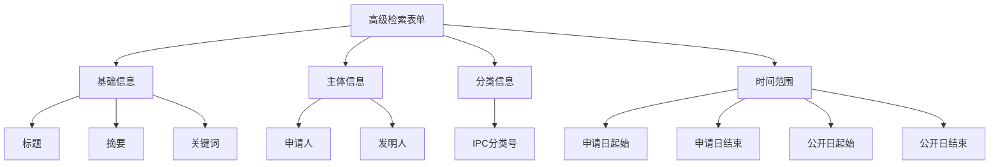
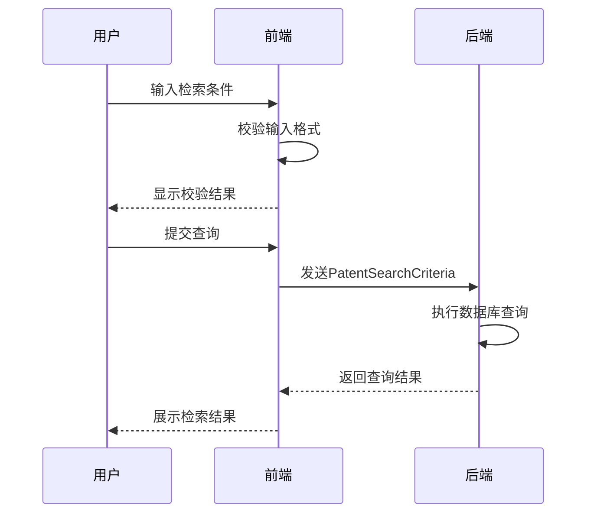

# 高级检索

<cite>
**Referenced Files in This Document**  
- [AdvancedSearchView.vue](file://src/views/patent-search/AdvancedSearchView.vue)
- [patentSearch.ts](file://src/services/patentSearch.ts)
- [index.ts](file://src/types/index.ts)
- [patentSearch.ts](file://src/stores/patentSearch.ts)
- [PATENT_SEARCH_API.md](file://PATENT_SEARCH_API.md)
- [QuickSearchView.vue](file://src/views/patent-search/QuickSearchView.vue)
</cite>

## 目录
1. [简介](#简介)
2. [表单结构设计](#表单结构设计)
3. [查询逻辑实现](#查询逻辑实现)
4. [前后端数据映射](#前后端数据映射)
5. [查询性能优化](#查询性能优化)
6. [典型使用场景](#典型使用场景)
7. [常见问题排查](#常见问题排查)

## 简介

高级检索功能为用户提供精确的专利信息查询能力，支持多字段组合查询。该功能通过结构化表单收集用户输入的检索条件，利用逻辑运算符构建复杂查询表达式，并将前端参数映射为后端API所需的查询结构。系统采用type=2类型标识与快速检索保持一致，确保查询结果的一致性和可比性。

**Section sources**
- [PATENT_SEARCH_API.md](file://PATENT_SEARCH_API.md#L1-L84)

## 表单结构设计

高级检索表单采用模块化设计，将专利信息划分为多个逻辑字段组，便于用户进行精确筛选。表单结构基于`PatentSearchCriteria`接口定义，包含以下核心字段：

- **基础信息字段**：标题、摘要、关键词
- **主体信息字段**：申请人、发明人
- **分类信息字段**：IPC分类号
- **时间范围字段**：申请日范围、公开日范围

表单通过响应式布局适配不同设备，确保在桌面端和移动端均能提供良好的用户体验。每个字段均配备清晰的标签和占位符文本，指导用户正确输入检索条件。

**Diagram sources**
- [index.ts](file://src/types/index.ts#L63-L74)
- [AdvancedSearchView.vue](file://src/views/patent-search/AdvancedSearchView.vue)

**Section sources**
- [index.ts](file://src/types/index.ts#L63-L74)

## 查询逻辑实现

高级检索的查询逻辑通过`patentSearchService.advancedSearch`方法实现，该方法接收`PatentSearchCriteria`类型的参数对象，封装了复杂的条件组合机制。

### 条件组合机制

系统支持AND/OR/NOT逻辑运算符的组合查询，通过字段值的存在与否来隐式表达逻辑关系：
- **AND关系**：多个字段同时填写，表示这些条件必须同时满足
- **OR关系**：在同一字段内输入多个值（以逗号分隔），表示满足任一值即可
- **NOT关系**：通过在值前添加"-"前缀实现排除条件

### 条件校验规则

前端实施严格的输入校验，确保查询条件的有效性：
- 日期字段需符合YYYY-MM-DD格式
- IPC分类号需符合标准编码规则
- 字符串字段自动去除首尾空格
- 必填字段验证（如至少填写一个检索条件）

**Diagram sources**
- [patentSearch.ts](file://src/services/patentSearch.ts#L150-L158)
- [patentSearch.ts](file://src/stores/patentSearch.ts#L70-L93)

**Section sources**
- [patentSearch.ts](file://src/services/patentSearch.ts#L150-L158)
- [patentSearch.ts](file://src/stores/patentSearch.ts#L70-L93)

## 前后端数据映射

高级检索功能通过标准化的数据结构实现前后端的无缝对接。前端收集的检索条件被映射为`PatentSearchCriteria`对象，该对象直接对应后端API的请求参数。

### 数据结构映射

| 前端字段 | 后端字段 | 数据类型 | 说明 |
|---------|---------|---------|------|
| 标题 | title | string | 专利标题全文匹配 |
| 摘要 | abstract | string | 摘要内容模糊匹配 |
| 申请人 | applicant | string | 申请人名称匹配 |
| 发明人 | inventor | string | 发明人姓名匹配 |
| IPC分类号 | ipcClass | string | 分类号前缀匹配 |
| 申请日起始 | applicationDateFrom | string | 日期范围下限 |
| 申请日结束 | applicationDateTo | string | 日期范围上限 |

### 类型标识一致性

系统采用统一的type=2类型标识，确保高级检索与快速检索在后端处理逻辑上保持一致。这一设计保证了不同检索方式的结果可比性，同时简化了后端服务的实现。

**Section sources**
- [patentSearch.ts](file://src/services/patentSearch.ts#L150-L158)
- [PATENT_SEARCH_API.md](file://PATENT_SEARCH_API.md#L1-L84)

## 查询性能优化

为确保复杂查询的响应速度，系统实施了多层次的性能优化策略。

### 索引字段优化

建议在数据库中为常用检索字段创建索引，以提升查询效率：
- **单字段索引**：申请人、IPC分类号
- **复合索引**：申请日+公开日（时间范围查询）
- **全文索引**：标题、摘要（模糊匹配查询）

### 查询超时处理

系统设置了合理的查询超时机制，防止复杂查询导致服务器资源耗尽：
- 前端设置10秒请求超时
- 后端查询执行时间超过30秒自动终止
- 超时后返回部分结果并提示用户优化查询条件

### 缓存策略

对高频查询条件实施缓存机制：
- 相同条件的查询结果缓存10分钟
- 缓存键基于标准化的查询参数生成
- 缓存失效后自动重新查询

**Section sources**
- [patentSearch.ts](file://src/services/patentSearch.ts#L150-L158)

## 典型使用场景

### 跨字段组合检索

用户可同时指定多个字段进行组合查询，例如：
- 查找特定申请人（申请人字段）在特定技术领域（IPC分类号字段）的专利
- 检索某位发明人（发明人字段）在特定时间段（申请日范围字段）的专利成果

### 模糊匹配与精确匹配切换

系统支持灵活的匹配模式：
- **模糊匹配**：在标题或摘要字段输入关键词，系统返回包含该词的所有专利
- **精确匹配**：使用引号包围短语，如"组装式食用菌种植棚"，仅返回完全匹配的专利

### 时间范围限定查询

通过设置申请日或公开日的起止范围，用户可：
- 跟踪特定技术领域的发展趋势
- 分析竞争对手的专利布局时间线
- 查找特定时期的创新成果

**Section sources**
- [QuickSearchView.vue](file://src/views/patent-search/QuickSearchView.vue#L0-L691)
- [AdvancedSearchView.vue](file://src/views/patent-search/AdvancedSearchView.vue)

## 常见问题排查

### 无结果返回

可能原因及解决方案：
- **查询条件过于严格**：尝试放宽条件或使用模糊匹配
- **日期格式错误**：确认日期格式为YYYY-MM-DD
- **字段值不存在**：检查申请人、发明人等字段的拼写准确性

### 查询超时

优化建议：
- 减少同时使用的检索字段数量
- 避免过大的时间范围查询
- 分步查询：先用宽泛条件获取结果，再逐步细化

### 意外结果

排查步骤：
- 检查逻辑运算符的使用是否正确
- 确认IPC分类号的层级关系
- 验证模糊匹配的预期行为

**Section sources**
- [patentSearch.ts](file://src/services/patentSearch.ts#L150-L158)
- [patentSearch.ts](file://src/stores/patentSearch.ts#L70-L93)