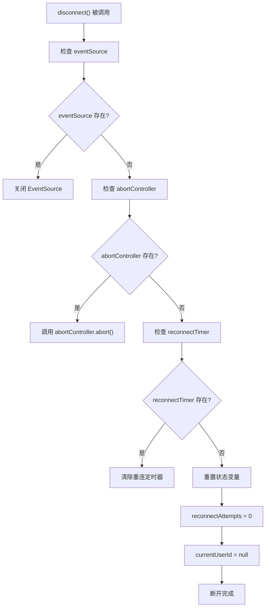
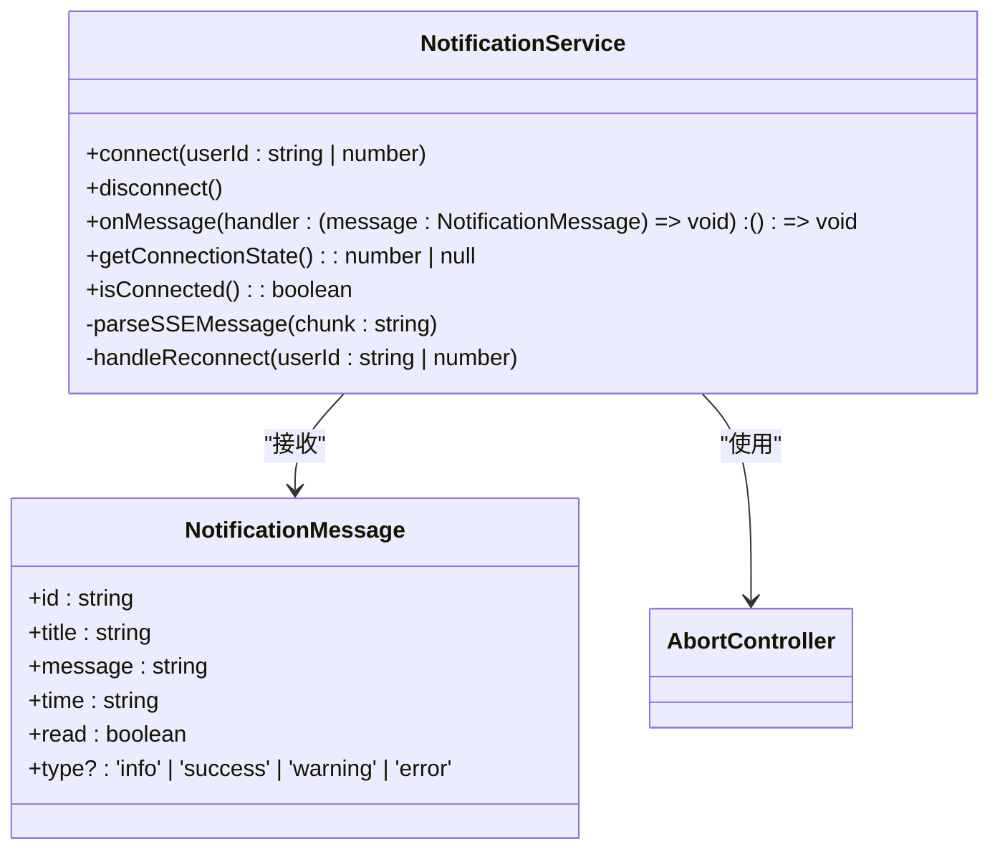
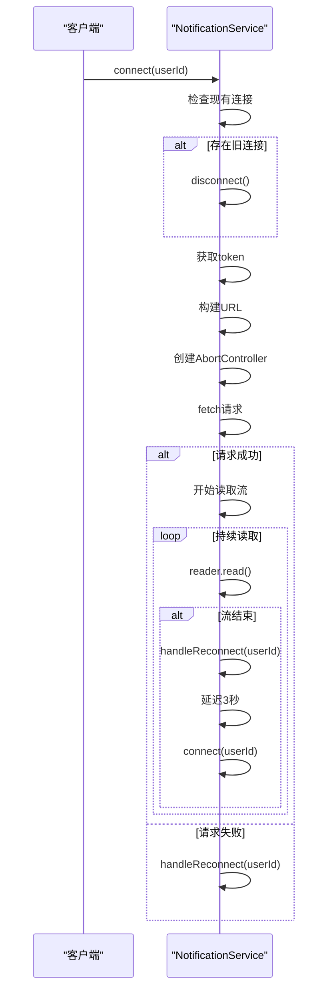

# SSE连接机制

<cite>
**Referenced Files in This Document**  
- [notification.ts](file://src/services/notification.ts)
- [SSE_DEBUG_GUIDE.md](file://SSE_DEBUG_GUIDE.md)
- [SSE_NOTIFICATION_INTEGRATION.md](file://SSE_NOTIFICATION_INTEGRATION.md)
- [index.ts](file://src/types/index.ts)
</cite>

## 目录
1. [连接建立流程](#连接建立流程)
2. [认证与用户绑定](#认证与用户绑定)
3. [连接冲突处理](#连接冲突处理)
4. [连接取消机制](#连接取消机制)
5. [连接状态识别](#连接状态识别)
6. [连接状态查询](#连接状态查询)
7. [自动重连策略](#自动重连策略)

## 连接建立流程

`notificationService.connect()` 方法通过 `fetch` API 和 `ReadableStream` 实现了支持自定义请求头的 SSE 连接。该方法首先检查是否存在现有连接，若存在则先断开旧连接，然后获取用户 token 并构建连接 URL。连接 URL 的格式为 `https://patent.langdetech.cn/api/sse/connect/{userId}`，其中用户 ID 作为路径参数传递，而认证 token 则通过请求头传递，避免了在 URL 中暴露敏感信息。

连接建立过程中，系统创建 `AbortController` 实例用于后续的连接取消操作，并通过 `fetch` 发起 GET 请求，设置 `Authorization`、`Accept` 和 `Cache-Control` 等必要请求头。成功建立连接后，系统通过 `response.body.getReader()` 获取流读取器，并使用递归函数持续读取数据流，实现持续的消息接收。

**Section sources**
- [notification.ts](file://src/services/notification.ts#L25-L145)

## 认证与用户绑定

SSE 连接采用基于 token 的认证机制。在建立连接前，系统从本地存储中获取用户 token，若未找到 token，则连接失败并记录错误日志。认证信息通过 `Authorization` 请求头传递，符合标准的 HTTP 认证规范。用户绑定通过 URL 路径参数实现，每个连接与特定用户 ID 关联，确保消息的准确路由和隔离。

系统在连接建立时将当前用户 ID 存储在 `currentUserId` 属性中，用于后续的连接管理和状态跟踪。这种设计确保了每个用户只能接收与其 ID 相关的通知消息，实现了多用户环境下的消息隔离。

**Section sources**
- [notification.ts](file://src/services/notification.ts#L25-L145)
- [index.ts](file://src/types/index.ts#L20-L35)

## 连接冲突处理

为防止多个连接实例同时存在导致资源浪费和状态混乱，系统实现了连接冲突处理机制。在 `connect()` 方法执行时，系统首先检查 `eventSource` 或 `abortController` 是否已存在，若存在则调用 `disconnect()` 方法主动断开现有连接。

这种"先断后连"的策略确保了同一时间只有一个有效的 SSE 连接存在，避免了连接冲突和消息重复接收的问题。该机制在用户切换账号、页面刷新或组件重新挂载等场景下尤为重要，保证了连接状态的一致性和可靠性。

**Section sources**
- [notification.ts](file://src/services/notification.ts#L30-L35)

## 连接取消机制

系统采用 `AbortController` 实现连接取消功能。在建立连接时创建 `AbortController` 实例，并将其 `signal` 属性传递给 `fetch` 请求。当需要断开连接时，调用 `abortController.abort()` 方法即可取消正在进行的请求。

`disconnect()` 方法不仅取消 `fetch` 请求，还会清理相关的定时器和状态变量，包括清除重连定时器、重置重连尝试次数和清除当前用户 ID。这种全面的清理机制确保了连接资源的完全释放，防止内存泄漏和状态残留。

**Diagram sources**
- [notification.ts](file://src/services/notification.ts#L236-L263)

**Section sources**
- [notification.ts](file://src/services/notification.ts#L236-L263)

## 连接状态识别

系统通过调试日志提供详细的连接状态识别信息。连接成功时，控制台输出"连接已建立成功!"日志，并显示响应状态码和响应头信息。连接断开时，输出"流结束"日志并触发重连机制。连接错误时，输出详细的错误信息，包括错误类型和堆栈跟踪。

在浏览器开发者工具的 Network 标签页中，可以查看名为 `sse/connect/{userId}` 的 EventStream 请求，通过检查请求状态、响应头和数据流来诊断连接问题。后端需要返回正确的 SSE 响应头，包括 `Content-Type: text/event-stream`、`Cache-Control: no-cache` 和 `Connection: keep-alive`。

**Section sources**
- [SSE_DEBUG_GUIDE.md](file://SSE_DEBUG_GUIDE.md#L100-L130)
- [SSE_NOTIFICATION_INTEGRATION.md](file://SSE_NOTIFICATION_INTEGRATION.md#L200-L220)

## 连接状态查询

系统提供了两种连接状态查询方法：`getConnectionState()` 和 `isConnected()`。`getConnectionState()` 返回连接的详细状态码：0 表示正在连接，1 表示已连接，2 表示已关闭。对于使用 `fetch` 实现的连接，该方法通过检查 `abortController` 的存在性来判断连接状态。

`isConnected()` 方法返回布尔值，用于快速判断连接是否处于活动状态。对于 `EventSource` 连接，检查其 `readyState` 是否为 `OPEN`；对于 `fetch` 连接，检查 `abortController` 是否存在且未被中止。这两个方法为上层应用提供了灵活的连接状态监控能力。

**Diagram sources**
- [notification.ts](file://src/services/notification.ts#L289-L308)

**Section sources**
- [notification.ts](file://src/services/notification.ts#L289-L308)

## 自动重连策略

系统实现了智能的自动重连策略，以应对网络波动或服务端临时中断。当连接意外断开时，`handleReconnect()` 方法被触发，启动重连机制。系统设置最大重连次数为 5 次，重试间隔为 3 秒，避免对服务端造成过大压力。

每次重连尝试都会递增 `reconnectAttempts` 计数器，并在达到最大重试次数后停止重连，防止无限循环。重连过程通过 `window.setTimeout()` 实现延迟执行，确保不会立即重试。成功建立新连接后，`reconnectAttempts` 计数器会被重置，为下一次可能的断开做好准备。

**Diagram sources**
- [notification.ts](file://src/services/notification.ts#L216-L231)

**Section sources**
- [notification.ts](file://src/services/notification.ts#L216-L231)