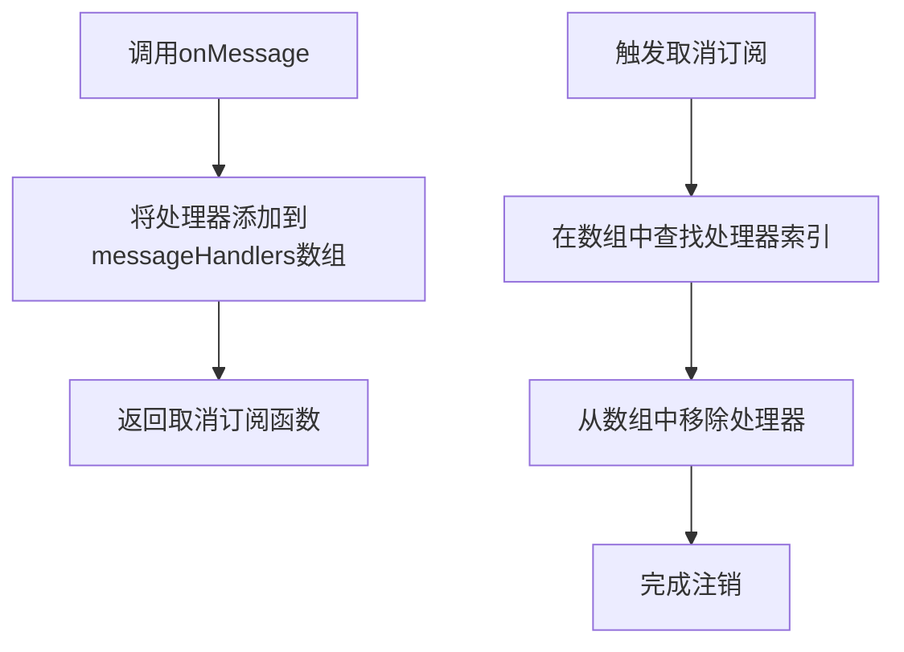
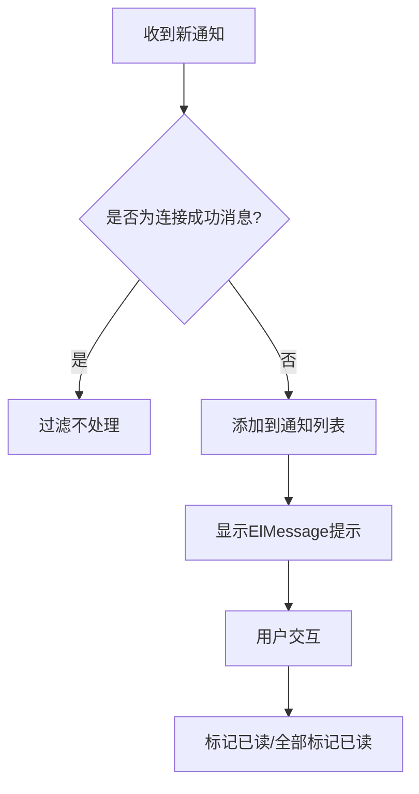
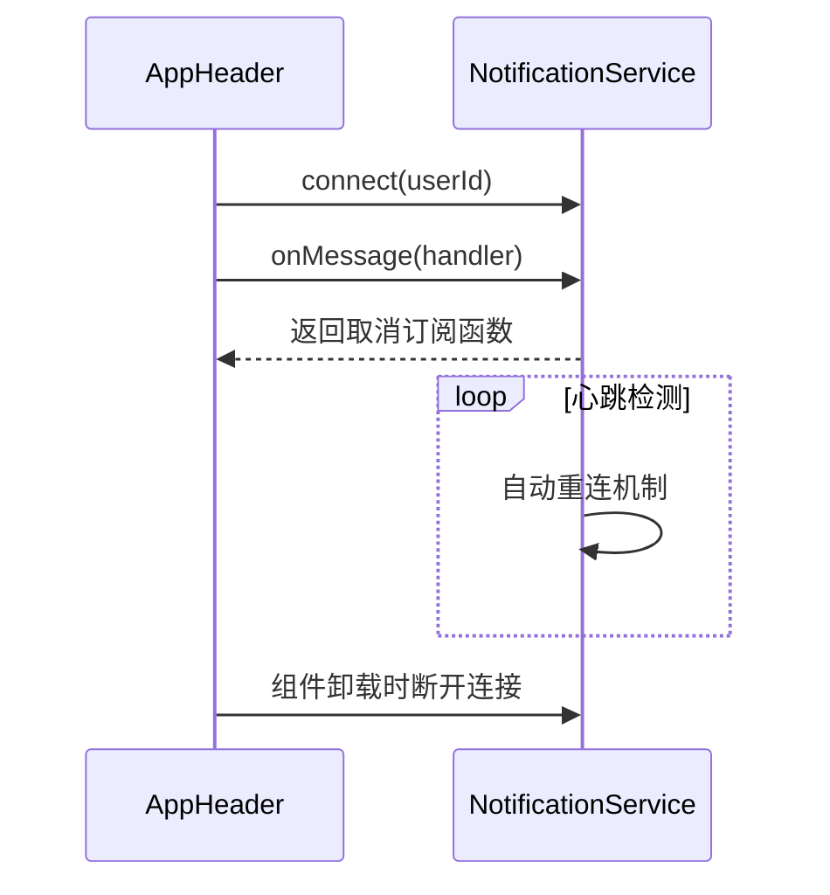

# 前端集成模式

<cite>
**Referenced Files in This Document**   
- [notification.ts](file://src/services/notification.ts)
- [AppHeader.vue](file://src/layouts/AppHeader.vue)
- [index.ts](file://src/types/index.ts)
- [auth.ts](file://src/services/auth.ts)
- [SSE_NOTIFICATION_INTEGRATION.md](file://SSE_NOTIFICATION_INTEGRATION.md)
- [SSE_CONNECTION_MESSAGE_FILTER.md](file://SSE_CONNECTION_MESSAGE_FILTER.md)
</cite>

## 目录
1. [消息订阅机制实现原理](#消息订阅机制实现原理)
2. [onMessage方法与取消订阅函数](#onmessage方法与取消订阅函数)
3. [AppHeader组件中的UI响应逻辑](#appheader组件中的ui响应逻辑)
4. [组件生命周期中的连接管理](#组件生命周期中的连接管理)
5. [多组件协同监听事件分发模式](#多组件协同监听事件分发模式)

## 消息订阅机制实现原理

前端集成模式基于SSE（Server-Sent Events）技术实现消息推送功能，通过`notificationService`服务类提供统一的消息订阅接口。该机制采用fetch + ReadableStream的方式替代标准EventSource API，以支持在请求头中传递Authorization token进行身份验证。

消息处理器数组`messageHandlers`是核心数据结构，用于存储所有注册的消息处理函数。当SSE连接接收到后端推送的数据时，`parseSSEMessage`方法会解析原始数据块，并将标准化后的通知对象分发给数组中的每个处理器。这种设计实现了发布-订阅模式，允许多个组件同时监听同一消息源。

消息格式遵循统一的`NotificationMessage`接口规范，包含id、title、message、time、read状态和type等字段。对于非JSON格式的纯文本消息（如"连接成功: 2"），系统会自动将其转换为标准通知格式，确保消息处理的一致性。

**Section sources**
- [notification.ts](file://src/services/notification.ts#L270-L284)
- [SSE_NOTIFICATION_INTEGRATION.md](file://SSE_NOTIFICATION_INTEGRATION.md#L54-L90)

## onMessage方法与取消订阅函数

`onMessage`方法是消息订阅的核心接口，接受一个消息处理函数作为参数并返回一个取消订阅函数。当调用`onMessage`时，传入的处理器会被添加到`messageHandlers`数组中，实现监听器的动态注册。

取消订阅函数通过闭包捕获了其对应的处理器引用，在执行时会在`messageHandlers`数组中查找该处理器的索引并将其移除。这种方式确保了监听器的精确注销，避免了内存泄漏问题。每个处理器的注册和注销都有详细的日志记录，便于调试和监控。

**Diagram sources**
- [notification.ts](file://src/services/notification.ts#L270-L284)

**Section sources**
- [notification.ts](file://src/services/notification.ts#L270-L284)

## AppHeader组件中的UI响应逻辑

`AppHeader.vue`组件作为应用头部，集成了实时通知功能，展示了完整的UI响应逻辑。当新消息到达时，系统会执行双重响应：更新通知列表和显示ElMessage提示。

通知列表使用`notifications`响应式数组存储消息，通过`unshift`方法将新消息插入数组头部，实现最新消息优先显示的效果。ElMessage提示则根据消息的type字段（info、success、warning、error）显示不同颜色的提示框，持续3秒后自动消失。

系统还实现了智能的消息过滤机制，通过正则表达式和字符串匹配识别"连接成功"类的系统消息并予以过滤，避免对用户造成干扰。这种过滤策略既保证了连接状态的可追溯性，又提升了用户体验。

**Diagram sources**
- [AppHeader.vue](file://src/layouts/AppHeader.vue#L215-L251)

**Section sources**
- [AppHeader.vue](file://src/layouts/AppHeader.vue#L215-L303)
- [SSE_CONNECTION_MESSAGE_FILTER.md](file://SSE_CONNECTION_MESSAGE_FILTER.md#L54-L90)

## 组件生命周期中的连接管理

在组件生命周期管理方面，`AppHeader.vue`遵循最佳实践，实现了完整的连接管理策略。在`onMounted`生命周期钩子中，检查用户登录状态并调用`connectSSE`方法建立SSE连接；在`onUnmounted`钩子中，执行清理工作，断开连接并注销监听器。

连接管理采用"先断后连"策略，每次建立新连接前都会先取消之前的订阅并断开旧连接，确保同一时间只有一个有效连接。这种设计避免了连接冲突和资源浪费，特别适用于用户频繁登录登出的场景。

此外，组件还通过`watch`监听用户信息变化，实现用户切换时的自动重连或断开，确保消息推送的准确性和安全性。

**Diagram sources**
- [AppHeader.vue](file://src/layouts/AppHeader.vue#L172-L217)

**Section sources**
- [AppHeader.vue](file://src/layouts/AppHeader.vue#L172-L217)

## 多组件协同监听事件分发模式

本系统支持多组件协同监听的事件分发模式，多个组件可以同时订阅同一消息源。`notificationService`作为全局单例，维护着唯一的`messageHandlers`数组，所有组件注册的处理器都存储在此数组中。

当消息到达时，系统会遍历整个数组，依次调用每个处理器。每个处理器都被try-catch包裹，确保一个处理器的错误不会影响其他处理器的执行，实现了错误隔离。这种设计模式提高了系统的健壮性和可扩展性。

对于需要特定消息类型处理的组件，可以在处理器内部添加条件判断，实现消息的定向处理。同时，每个组件都应维护自己的取消订阅函数，在组件销毁时及时注销监听，避免无效处理器积累导致性能下降。

**Section sources**
- [notification.ts](file://src/services/notification.ts#L270-L284)
- [AppHeader.vue](file://src/layouts/AppHeader.vue#L215-L251)