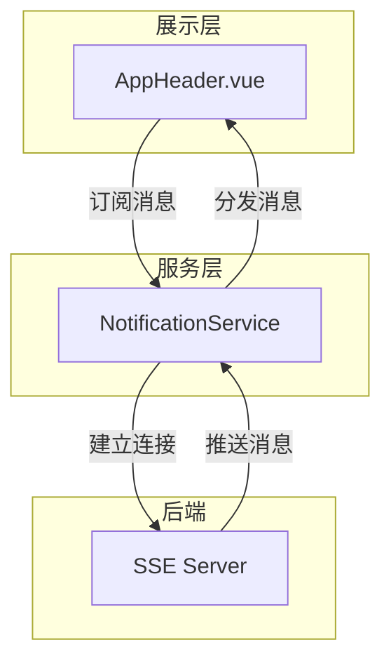
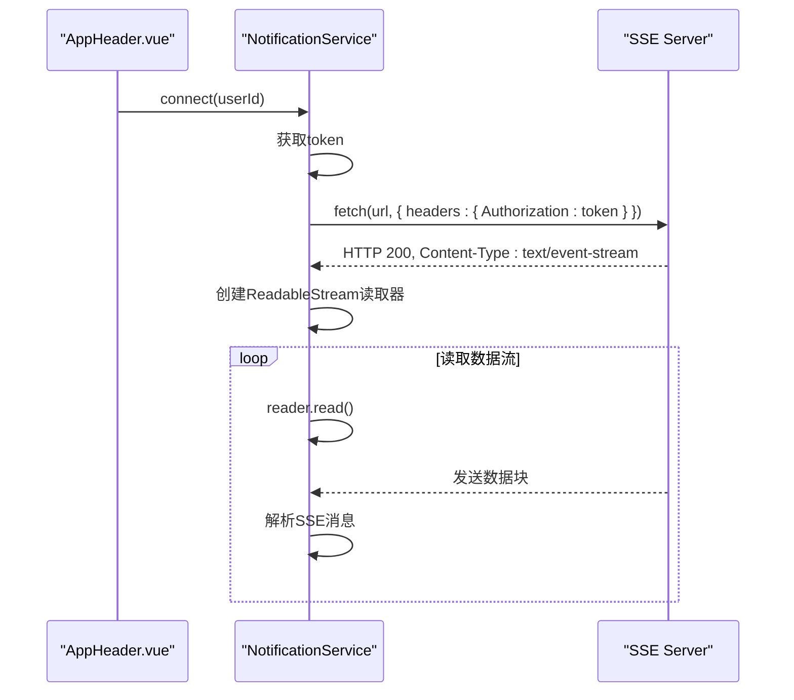
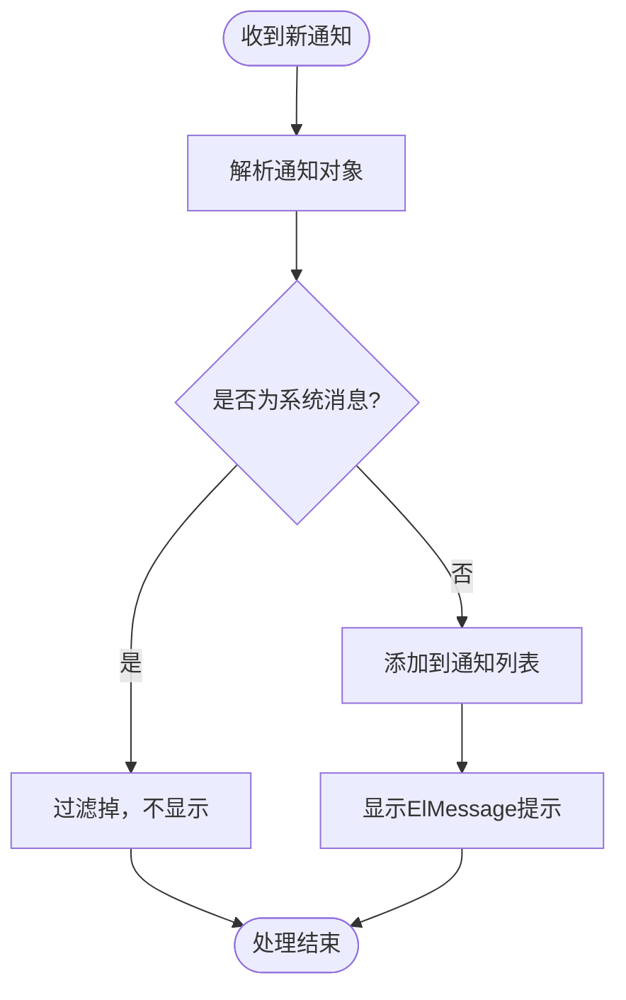
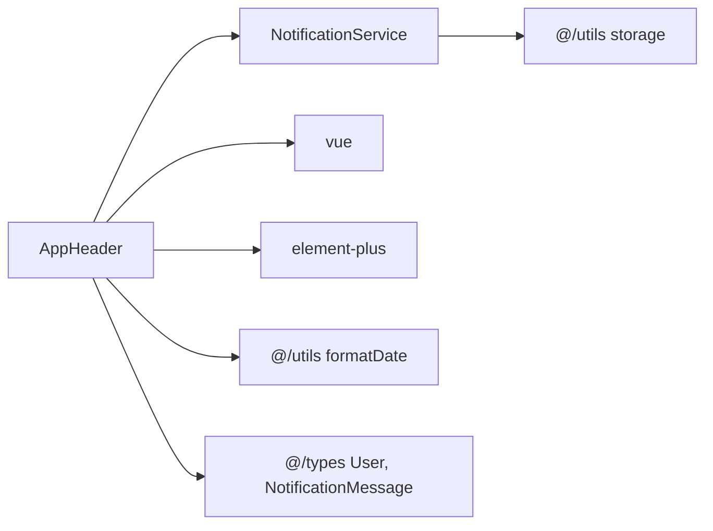

# 实时通知系统

<cite>
**Referenced Files in This Document**   
- [notification.ts](file://src/services/notification.ts)
- [AppHeader.vue](file://src/layouts/AppHeader.vue)
- [SSE_CONNECTION_MESSAGE_FILTER.md](file://SSE_CONNECTION_MESSAGE_FILTER.md)
- [SSE_DEBUG_GUIDE.md](file://SSE_DEBUG_GUIDE.md)
- [SSE_MESSAGE_PARSE_FIX.md](file://SSE_MESSAGE_PARSE_FIX.md)
- [SSE_NOTIFICATION_DISPLAY_FIX.md](file://SSE_NOTIFICATION_DISPLAY_FIX.md)
- [SSE_TOKEN_AUTH_CHANGE.md](file://SSE_TOKEN_AUTH_CHANGE.md)
</cite>

## 目录
1. [简介](#简介)
2. [项目结构](#项目结构)
3. [核心组件](#核心组件)
4. [架构概述](#架构概述)
5. [详细组件分析](#详细组件分析)
6. [依赖分析](#依赖分析)
7. [性能考虑](#性能考虑)
8. [故障排除指南](#故障排除指南)
9. [结论](#结论)

## 简介
本文档深入解析了专利服务平台的实时通知系统，重点阐述了基于SSE（Server-Sent Events）的推送机制。文档详细说明了`notification.ts`服务如何建立和维护与后端的SSE连接，处理连接重试、心跳检测和异常恢复。结合SSE系列文档，阐述了消息过滤规则、数据解析逻辑和通知展示优化方案。描述了前端如何订阅不同类型的通知事件（如报告生成完成、分析结果就绪），并更新UI状态。同时提供了SSE调试工具使用指南、常见连接问题排查方法和性能监控策略，确保实时通信的稳定性和可靠性。

## 项目结构
实时通知系统的核心文件位于`src/services`和`src/layouts`目录下。`notification.ts`是SSE连接的核心服务，负责建立连接、处理消息和管理重连。`AppHeader.vue`是通知的UI展示组件，负责接收消息、过滤系统消息并更新界面。此外，项目根目录下的多个`SSE_*.md`文档提供了详细的实现说明、调试指南和问题修复记录。

**Section sources**
- [notification.ts](file://src/services/notification.ts)
- [AppHeader.vue](file://src/layouts/AppHeader.vue)

## 核心组件
实时通知系统由两个核心组件构成：`NotificationService`和`AppHeader`组件。`NotificationService`负责底层的SSE连接管理，包括连接建立、消息解析、重连机制和异常处理。`AppHeader`组件则负责上层的UI展示，包括消息的过滤、通知列表的更新和用户提示的显示。

**Section sources**
- [notification.ts](file://src/services/notification.ts#L11-L309)
- [AppHeader.vue](file://src/layouts/AppHeader.vue#L89-L285)

## 架构概述
实时通知系统采用分层架构，分为服务层和展示层。服务层由`NotificationService`实现，负责与后端建立SSE长连接，接收服务器推送的消息，并进行解析和分发。展示层由`AppHeader`组件实现，负责订阅服务层的消息，进行业务逻辑处理（如过滤系统消息），并更新UI。

**Diagram sources **
- [notification.ts](file://src/services/notification.ts)
- [AppHeader.vue](file://src/layouts/AppHeader.vue)

## 详细组件分析

### NotificationService 分析
`NotificationService`是实时通知系统的核心，它使用`fetch API`和`ReadableStream`替代了标准的`EventSource`，以支持在请求头中传递`Authorization` token，解决了SSE认证的安全性问题。

#### 连接建立与认证
服务通过`connect(userId)`方法建立连接。它首先从本地存储中获取用户的token，并将其放入`Authorization`请求头中。然后使用`fetch`发起一个GET请求到`https://patent.langdetech.cn/api/sse/connect/{userId}`。由于标准的`EventSource`不支持自定义请求头，因此采用了`fetch`+`ReadableStream`的方式，实现了安全的token认证。

**Diagram sources **
- [notification.ts](file://src/services/notification.ts#L45-L130)

#### 消息解析与容错
服务通过`parseSSEMessage(chunk)`方法解析接收到的数据块。它首先尝试将数据解析为JSON对象，如果解析失败（例如后端发送的是纯文本），则将整个字符串作为消息内容，并创建一个默认的通知对象。这种容错机制确保了即使后端消息格式不规范，前端也能正确处理。

**Section sources**
- [notification.ts](file://src/services/notification.ts#L132-L197)
- [SSE_MESSAGE_PARSE_FIX.md](file://SSE_MESSAGE_PARSE_FIX.md)

#### 重连机制与异常恢复
服务实现了健壮的重连机制。当连接断开或发生错误时，`handleReconnect(userId)`方法会被调用。它会记录重连次数，最多尝试5次，每次间隔3秒。如果重连次数达到上限，则停止重连。此外，服务还通过`AbortController`来主动取消连接，确保资源的正确释放。

**Section sources**
- [notification.ts](file://src/services/notification.ts#L199-L237)
- [SSE_DEBUG_GUIDE.md](file://SSE_DEBUG_GUIDE.md)

### AppHeader 组件分析
`AppHeader`组件是通知的UI展示中心，它负责监听`NotificationService`的消息，并将其展示给用户。

#### 消息订阅与过滤
组件通过`onMessage(handler)`方法订阅`NotificationService`的消息。在消息处理器中，它实现了消息过滤逻辑，通过正则表达式和字符串匹配，过滤掉“连接成功”等系统消息，只将业务相关的通知（如报告生成完成）展示给用户。

**Diagram sources **
- [AppHeader.vue](file://src/layouts/AppHeader.vue#L203-L284)
- [SSE_CONNECTION_MESSAGE_FILTER.md](file://SSE_CONNECTION_MESSAGE_FILTER.md)

#### UI状态更新与优化
组件使用Vue的响应式系统来更新UI状态。当收到新通知时，它会将通知添加到`notifications`数组的开头，并触发UI更新。同时，它使用`ElMessage`组件在屏幕上方弹出提示，增强用户体验。为了确保显示的可靠性，代码中添加了详细的错误处理和降级方案。

**Section sources**
- [AppHeader.vue](file://src/layouts/AppHeader.vue#L370-L450)
- [SSE_NOTIFICATION_DISPLAY_FIX.md](file://SSE_NOTIFICATION_DISPLAY_FIX.md)

## 依赖分析
实时通知系统主要依赖于以下几个外部模块：`vue`用于UI框架和响应式系统，`element-plus`提供UI组件（如`ElMessage`、`el-badge`），`@/utils`提供工具函数（如`formatDate`），`@/types`定义类型（如`User`、`NotificationMessage`）。这些依赖关系确保了系统的功能完整性和类型安全。

**Diagram sources **
- [notification.ts](file://src/services/notification.ts#L1)
- [AppHeader.vue](file://src/layouts/AppHeader.vue#L10-L15)

## 性能考虑
为了确保实时通知系统的性能和稳定性，系统实现了以下策略：
1. **连接管理**：在组件销毁或用户登出时，及时断开SSE连接，释放资源。
2. **消息处理**：对每个消息处理器进行错误隔离，防止一个处理器的失败影响其他处理器。
3. **UI优化**：建议限制通知列表的最大数量（如100条），并定期清理已读通知，避免内存泄漏。
4. **监控**：提供`isConnected()`和`getConnectionState()`方法，方便监控连接状态。

**Section sources**
- [SSE_DEBUG_GUIDE.md](file://SSE_DEBUG_GUIDE.md)

## 故障排除指南
当遇到SSE连接问题时，可以按照以下步骤进行排查：
1. **检查连接状态**：在浏览器控制台执行`notificationService.isConnected()`，确认连接状态。
2. **查看网络请求**：在开发者工具的Network标签页中，查找`EventStream`类型的请求，检查其状态码和响应头。
3. **检查认证信息**：确认`localStorage`中存在有效的`token`和`user`信息，且`user`包含`userId`。
4. **查看控制台日志**：根据详细的调试日志，定位问题发生的具体环节。

**Section sources**
- [SSE_DEBUG_GUIDE.md](file://SSE_DEBUG_GUIDE.md)

## 结论
专利服务平台的实时通知系统通过`fetch`+`ReadableStream`的创新方案，成功解决了SSE认证的难题，并实现了稳定可靠的实时消息推送。系统具备完善的重连机制、消息解析容错、UI展示优化和详细的调试日志，为用户提供了流畅的实时通知体验。未来可考虑将通知持久化到`localStorage`，并实现更精细的性能监控。