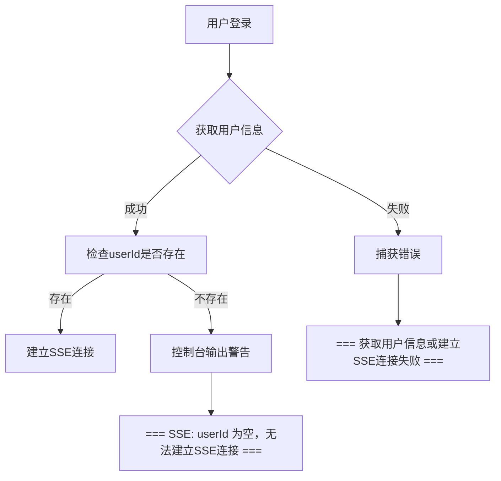
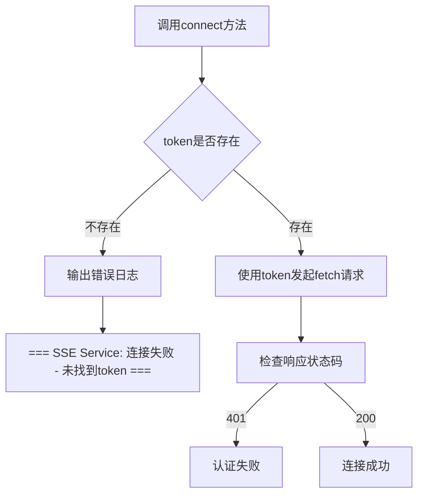
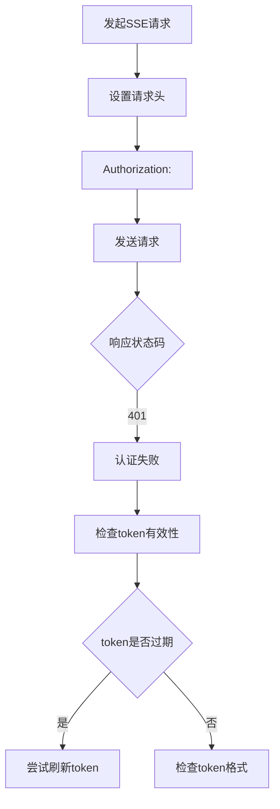
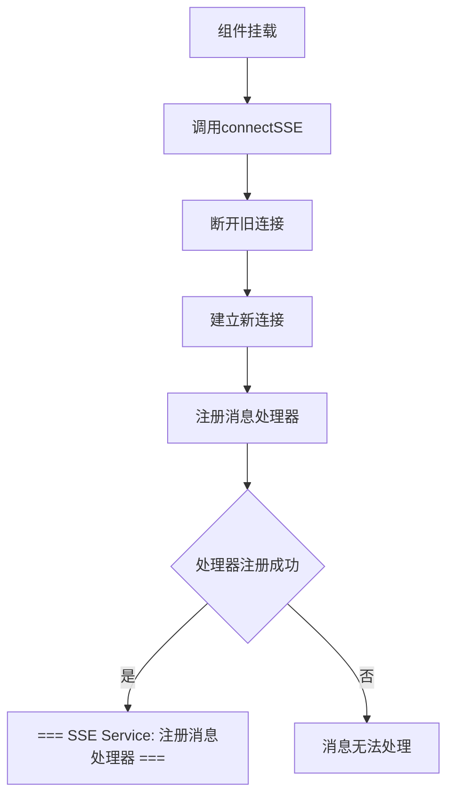
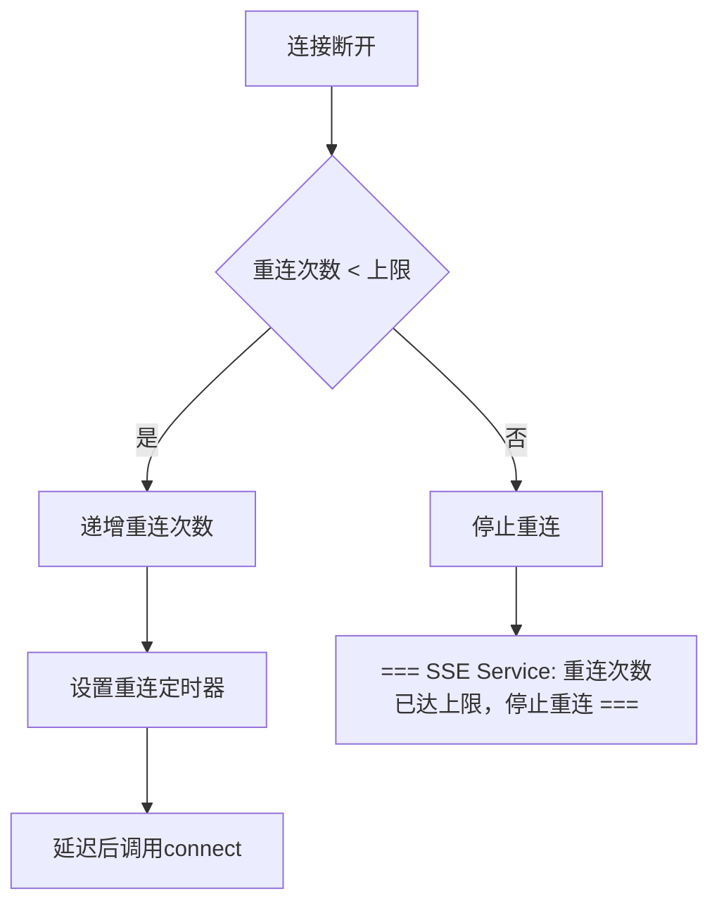
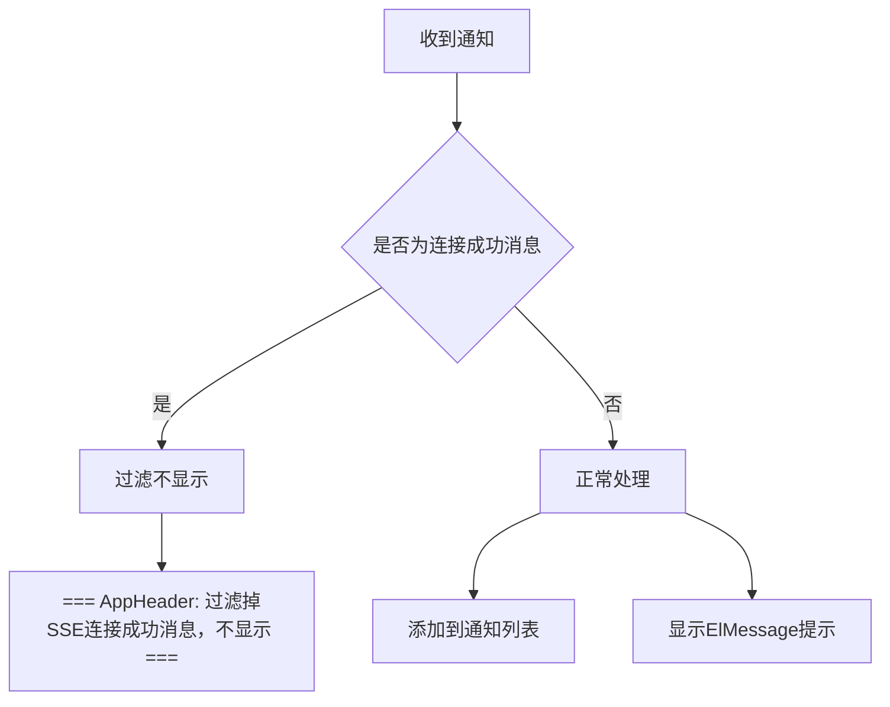

# 故障排查与诊断

<cite>
**Referenced Files in This Document**   
- [src/services/notification.ts](file://src/services/notification.ts)
- [src/stores/auth.ts](file://src/stores/auth.ts)
- [src/layouts/AppHeader.vue](file://src/layouts/AppHeader.vue)
- [src/services/auth.ts](file://src/services/auth.ts)
- [SSE_DEBUG_GUIDE.md](file://SSE_DEBUG_GUIDE.md)
- [SSE_CONNECTION_MESSAGE_FILTER.md](file://SSE_CONNECTION_MESSAGE_FILTER.md)
- [SSE_MESSAGE_PARSE_FIX.md](file://SSE_MESSAGE_PARSE_FIX.md)
- [SSE_NOTIFICATION_DISPLAY_FIX.md](file://SSE_NOTIFICATION_DISPLAY_FIX.md)
</cite>

## 目录
1. [连接问题排查](#连接问题排查)
2. [消息接收异常处理](#消息接收异常处理)
3. [频繁重连问题分析](#频繁重连问题分析)
4. [诊断技巧与工具](#诊断技巧与工具)
5. [最佳实践与修复方案](#最佳实践与修复方案)

## 连接问题排查

### 连接失败：无userId
当SSE连接失败且控制台显示`userId`为空时，表明用户信息获取不完整。该问题通常发生在登录后未正确获取用户详细信息。

**排查路径：**
1. 检查登录流程中`getUserInfo`接口调用是否成功
2. 确认后端`/api/getInfo`接口返回的用户数据包含`userId`字段
3. 验证`authStore`中的用户状态是否正确更新



**Section sources**
- [src/stores/auth.ts](file://src/stores/auth.ts#L78-L95)
- [SSE_DEBUG_GUIDE.md](file://SSE_DEBUG_GUIDE.md#L225-L284)

### 连接失败：token缺失
SSE连接需要有效的认证token，若token缺失会导致连接立即终止。

**排查路径：**
1. 检查localStorage中是否存在`token`项
2. 验证登录流程中token是否正确保存
3. 确认`notificationService.connect`方法能否正确读取token



**Section sources**
- [src/services/notification.ts](file://src/services/notification.ts#L82-L95)
- [src/stores/auth.ts](file://src/stores/auth.ts#L78-L95)

### 连接失败：401错误
HTTP 401错误表示认证失败，通常是token无效或已过期。

**排查路径：**
1. 检查token的有效期
2. 验证token格式是否正确
3. 确认请求头中`Authorization`字段是否正确设置
4. 检查后端认证服务状态



**Section sources**
- [src/services/notification.ts](file://src/services/notification.ts#L102-L112)
- [SSE_DEBUG_GUIDE.md](file://SSE_DEBUG_GUIDE.md#L225-L284)

## 消息接收异常处理

### 处理器未注册
消息处理器未正确注册会导致接收到的消息无法被处理。

**排查路径：**
1. 检查`AppHeader.vue`中`onMounted`生命周期是否正确执行
2. 验证`notificationService.onMessage`是否被调用
3. 确认处理器函数是否正确绑定



**Section sources**
- [src/layouts/AppHeader.vue](file://src/layouts/AppHeader.vue#L225-L275)
- [src/services/notification.ts](file://src/services/notification.ts#L250-L275)

### 消息格式错误
后端发送的消息格式不符合前端解析要求时，会导致消息解析失败。

**排查路径：**
1. 检查消息是否为有效JSON格式
2. 验证消息字段命名是否符合规范
3. 确认消息编码是否正确

```mermaid
flowchart TD
A[收到数据块] --> B{是否以"data:"开头}
B --> |是| C[提取数据字符串]
C --> D{是否为有效JSON}
D --> |是| E[解析JSON数据]
D --> |否| F[作为纯文本处理]
E --> G[转换为NotificationMessage]
F --> G
G --> H[触发消息处理器]
```

**Diagram sources**
- [src/services/notification.ts](file://src/services/notification.ts#L150-L211)

**Section sources**
- [src/services/notification.ts](file://src/services/notification.ts#L150-L211)
- [SSE_MESSAGE_PARSE_FIX.md](file://SSE_MESSAGE_PARSE_FIX.md#L255-L317)

## 频繁重连问题分析

### 重连机制工作原理
系统内置了自动重连机制，当连接意外断开时会尝试重新连接。

**重连流程：**
1. 连接断开时触发`handleReconnect`方法
2. 递增重连尝试次数
3. 设置定时器延迟重连
4. 达到最大重连次数后停止



**Section sources**
- [src/services/notification.ts](file://src/services/notification.ts#L216-L231)
- [SSE_DEBUG_GUIDE.md](file://SSE_DEBUG_GUIDE.md#L225-L284)

### 重连问题排查
频繁重连可能由网络不稳定或服务端主动断开引起。

**排查路径：**
1. 检查网络连接稳定性
2. 查看服务端日志确认是否主动断开
3. 验证心跳机制是否正常工作
4. 检查浏览器标签页是否处于非活动状态

**Section sources**
- [src/services/notification.ts](file://src/services/notification.ts#L216-L231)
- [SSE_DEBUG_GUIDE.md](file://SSE_DEBUG_GUIDE.md#L225-L284)

## 诊断技巧与工具

### 控制台状态检查
通过JavaScript命令检查SSE连接状态：

```javascript
// 检查连接状态
notificationService.isConnected()
// true: 已连接, false: 未连接

// 获取详细状态码
notificationService.getConnectionState()
// 0: CONNECTING (正在连接)
// 1: OPEN (已连接)
// 2: CLOSED (已关闭)
```

**Section sources**
- [src/services/notification.ts](file://src/services/notification.ts#L280-L295)
- [SSE_DEBUG_GUIDE.md](file://SSE_DEBUG_GUIDE.md#L147-L155)

### 网络请求分析
使用浏览器开发者工具分析网络请求：

1. 打开Network标签页
2. 筛选EventStream类型请求
3. 查找`sse/connect/{userId}`请求
4. 检查请求头、响应头和数据流

**Section sources**
- [SSE_DEBUG_GUIDE.md](file://SSE_DEBUG_GUIDE.md#L178-L183)

### 手动连接测试
通过控制台手动测试连接：

```javascript
// 获取用户信息
const user = JSON.parse(localStorage.getItem('user'))
console.log('userId:', user.userId)

// 手动建立连接
notificationService.connect(user.userId)
```

**Section sources**
- [SSE_DEBUG_GUIDE.md](file://SSE_DEBUG_GUIDE.md#L167-L176)

## 最佳实践与修复方案

### 消息过滤规则
为避免系统消息干扰用户体验，实现了连接成功消息的过滤机制。

**过滤条件：**
- 消息内容包含"连接成功"
- 消息格式为"连接成功: 数字"
- 标题为"系统通知"且内容包含"连接"



**Section sources**
- [src/layouts/AppHeader.vue](file://src/layouts/AppHeader.vue#L255-L265)
- [SSE_CONNECTION_MESSAGE_FILTER.md](file://SSE_CONNECTION_MESSAGE_FILTER.md#L22-L45)

### 显示异常修复
针对消息显示问题，实施了多重保护机制。

**修复措施：**
1. 消息内容保护：优先使用message，其次title，最后默认值
2. 类型验证：确保type为有效值（success/warning/info/error）
3. 错误隔离：独立处理列表添加和消息显示
4. 降级处理：主显示失败时尝试简单提示

**Section sources**
- [src/layouts/AppHeader.vue](file://src/layouts/AppHeader.vue#L267-L295)
- [SSE_NOTIFICATION_DISPLAY_FIX.md](file://SSE_NOTIFICATION_DISPLAY_FIX.md#L126-L155)

### 连接中断处理
优化了连接中断的处理策略，提升用户体验。

**处理策略：**
1. 断开连接时清除相关资源
2. 登出时主动断开SSE连接
3. 组件销毁时清理事件监听
4. 重连失败时提供明确提示

**Section sources**
- [src/services/notification.ts](file://src/services/notification.ts#L235-L265)
- [src/stores/auth.ts](file://src/stores/auth.ts#L175-L185)
- [src/layouts/AppHeader.vue](file://src/layouts/AppHeader.vue#L205-L215)