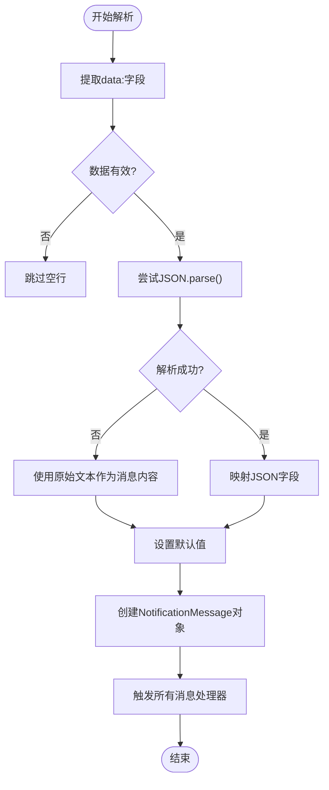
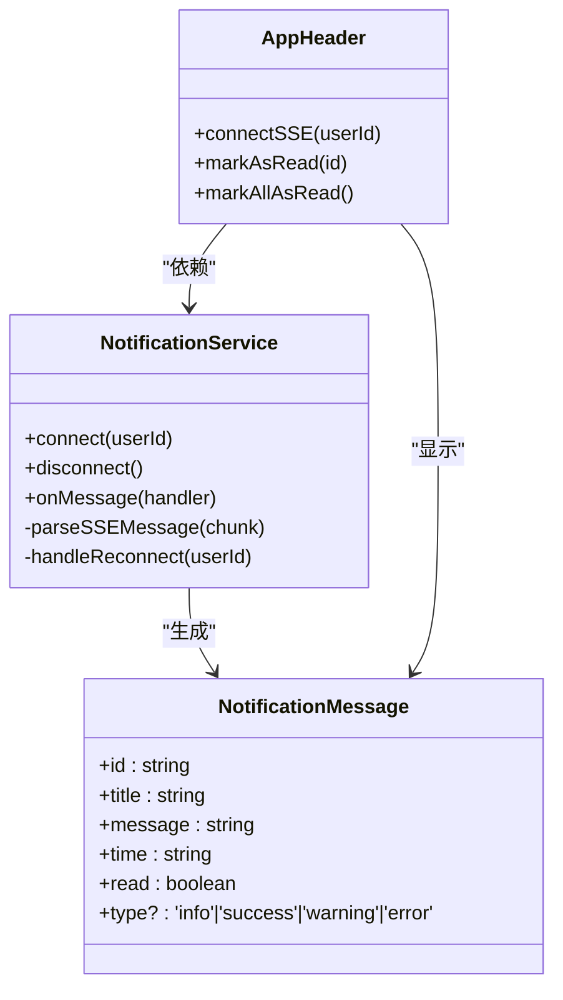

# 消息协议与解析

<cite>
**Referenced Files in This Document**   
- [notification.ts](file://src/services/notification.ts)
- [index.ts](file://src/types/index.ts)
- [AppHeader.vue](file://src/layouts/AppHeader.vue)
- [SSE_MESSAGE_PARSE_FIX.md](file://SSE_MESSAGE_PARSE_FIX.md)
- [SSE_NOTIFICATION_INTEGRATION.md](file://SSE_NOTIFICATION_INTEGRATION.md)
</cite>

## 目录
1. [引言](#引言)
2. [核心消息处理流程](#核心消息处理流程)
3. [SSE消息解析机制](#sse消息解析机制)
4. [通知消息接口定义](#通知消息接口定义)
5. [后端消息格式规范](#后端消息格式规范)
6. [异常与兼容性处理](#异常与兼容性处理)
7. [系统集成与生命周期](#系统集成与生命周期)
8. [最佳实践与建议](#最佳实践与建议)

## 引言

本专项文档深入解析专利服务平台中基于SSE（Server-Sent Events）的实时消息协议与解析逻辑。文档聚焦于`parseSSEMessage`方法对SSE数据流的处理机制，详细说明了从原始文本块中提取'data:'字段并进行JSON解析的完整流程，以及在解析失败时的降级处理策略。同时，文档阐述了`NotificationMessage`接口的字段映射规则、默认值设置与优先级，并结合API规范，为后端开发提供了明确的消息格式标准和异常兼容性处理方案。

## 核心消息处理流程

系统通过SSE实现后端到前端的实时消息推送。整个流程始于用户登录后，前端通过`notificationService.connect(userId)`方法建立连接。连接建立后，后端持续推送以`data:`开头的文本块。前端的`parseSSEMessage`方法负责监听和解析这些数据流，将其转换为标准化的`NotificationMessage`对象，并分发给所有注册的消息处理器，最终在UI层（如`AppHeader.vue`）展示给用户。

```mermaid
flowchart TD
A[后端推送] --> |data: {...}\n\n| B[前端接收数据块]
B --> C{解析SSE消息}
C --> D[提取data:字段]
D --> E{尝试JSON解析}
E --> |成功| F[映射为NotificationMessage]
E --> |失败| G[降级为纯文本消息]
F --> H[触发所有消息处理器]
G --> H
H --> I[UI组件更新状态]
I --> J[用户界面展示通知]
```

**Diagram sources**
- [notification.ts](file://src/services/notification.ts#L150-L211)
- [AppHeader.vue](file://src/layouts/AppHeader.vue#L200-L250)

## SSE消息解析机制

`parseSSEMessage`方法是整个消息处理的核心，其逻辑严谨且具备强大的容错能力。

### 数据提取与预处理
方法首先将接收到的文本块（chunk）按换行符`\n`分割成多行。对于每一行，它检查是否以`data:`前缀开头。如果匹配，则使用`substring(5)`移除前缀，并通过`trim()`去除首尾空白字符，得到核心数据字符串`dataStr`。若`dataStr`为空，则跳过该行，避免处理无效数据。

### 双重解析策略
解析过程采用“先JSON后文本”的双重策略，确保消息的高可用性。

#### 1. 优先JSON解析
系统首先尝试将`dataStr`作为JSON字符串进行解析。如果解析成功，将根据预设的映射规则填充`NotificationMessage`对象。

#### 2. 降级纯文本处理
当`JSON.parse()`抛出异常时（例如，后端发送了纯文本如`data: 连接成功: 2`），系统不会丢弃消息，而是进入降级处理模式。此时，原始的`dataStr`将被直接用作通知的`message`字段，同时使用预设的默认值填充其他字段。



**Diagram sources**
- [notification.ts](file://src/services/notification.ts#L150-L211)

**Section sources**
- [notification.ts](file://src/services/notification.ts#L150-L211)
- [SSE_MESSAGE_PARSE_FIX.md](file://SSE_MESSAGE_PARSE_FIX.md#L39-L74)

## 通知消息接口定义

`NotificationMessage`接口定义了前端通知系统的标准数据结构，所有消息最终都会被转换为此格式。

### 接口字段说明
| 字段 | 类型 | 是否必需 | 说明 |
| :--- | :--- | :--- | :--- |
| `id` | string | 是 | 消息唯一标识符 |
| `title` | string | 是 | 通知的标题 |
| `message` | string | 是 | 通知的详细内容 |
| `time` | string | 是 | 消息的创建时间，ISO 8601格式 |
| `read` | boolean | 是 | 消息的已读状态 |
| `type` | 'info' \| 'success' \| 'warning' \| 'error' | 否 | 消息类型，用于UI样式 |

**Section sources**
- [index.ts](file://src/types/index.ts#L2-L9)

### 字段映射规则与默认值
当从JSON数据构建`NotificationMessage`时，系统遵循以下映射规则和默认值优先级：

1.  **`id`字段**:
    *   **优先级**: `data.id`
    *   **默认值**: 若`data.id`不存在，则生成`notification_${Date.now()}`作为唯一ID。

2.  **`title`字段**:
    *   **优先级**: `data.title`
    *   **默认值**: 若`data.title`不存在，则使用"新消息"。

3.  **`message`字段**:
    *   **优先级**: `data.message` > `data.content` > `data.msg`
    *   **默认值**: 若以上所有字段均不存在，则使用空字符串`''`。
    *   **说明**: 此设计极大地增强了对后端不同消息格式的兼容性。

4.  **`time`字段**:
    *   **优先级**: `data.time`
    *   **默认值**: 若`data.time`不存在，则使用`new Date().toISOString()`获取当前时间。

5.  **`read`字段**:
    *   **默认值**: 始终为`false`，表示新消息。

6.  **`type`字段**:
    *   **优先级**: `data.type`
    *   **默认值**: 若`data.type`不存在，则使用`'info'`。

**Section sources**
- [notification.ts](file://src/services/notification.ts#L170-L178)

## 后端消息格式规范

为确保消息的正确解析和最佳用户体验，后端应遵循以下消息格式规范。

### 推荐的JSON格式
后端应优先推送结构化的JSON消息，以充分利用前端的字段映射能力。

**标准格式示例**:
```json
data: {"id":"123","title":"任务完成","message":"您的专利检索已完成","type":"success","time":"2024-12-09T12:00:00Z"}
```

**支持的字段**:
- `id` (可选): 消息的唯一标识。
- `title` (可选): 通知标题，若未提供，前端将显示"新消息"。
- `message` | `content` | `msg`: 消息内容，按优先级顺序解析。
- `type` (可选): 消息类型，建议使用`info`, `success`, `warning`, `error`。
- `time` (可选): 消息时间戳，ISO 8601格式。

### 连接URL与认证
- **URL**: `https://patent.langdetech.cn/api/sse/connect/{userId}`
- **方法**: GET
- **认证**: 通过`Authorization`请求头传递JWT Token。

**Section sources**
- [SSE_NOTIFICATION_INTEGRATION.md](file://SSE_NOTIFICATION_INTEGRATION.md#L100-L130)
- [SSE_MESSAGE_PARSE_FIX.md](file://SSE_MESSAGE_PARSE_FIX.md#L255-L317)

## 异常与兼容性处理

系统设计了完善的异常处理机制，以应对各种非标准或错误的消息格式。

### JSON解析失败的降级处理
如前所述，当`JSON.parse()`失败时，系统会将整个`dataStr`作为`message`字段的值，并使用默认值填充`title`为"系统通知"，`type`为`'info'`。这确保了即使后端发送了纯文本消息（如调试信息），用户也能收到通知，而非消息丢失。

### 消息处理器的错误隔离
每个注册的消息处理器都被`try-catch`块包裹。这意味着，如果某个处理器在处理消息时抛出异常，该错误会被捕获并记录，但不会影响其他处理器的执行。这种设计保证了系统的健壮性，避免因单个组件的错误导致整个通知系统瘫痪。

### 空消息与无效数据的过滤
在解析流程的早期，系统会检查`dataStr`是否为空。如果为空，该行数据会被直接跳过，不会进行后续的解析和处理，有效防止了无效数据的传播。

**Section sources**
- [notification.ts](file://src/services/notification.ts#L179-L197)
- [SSE_MESSAGE_PARSE_FIX.md](file://SSE_MESSAGE_PARSE_FIX.md#L76-L132)

## 系统集成与生命周期

消息系统与前端应用的生命周期紧密集成，确保了资源的合理分配和连接的稳定性。

### 组件集成
`AppHeader.vue`是消息的主要展示组件。它在`onMounted`钩子中根据用户信息建立SSE连接，并在`onUnmounted`钩子中断开连接和取消监听，防止内存泄漏。

### 连接管理
系统实现了自动重连机制。当连接意外断开时，服务会尝试最多5次重连，每次间隔3秒，提高了在不稳定网络环境下的可用性。

### 消息过滤
`AppHeader.vue`中的消息处理器会主动过滤掉特定的系统消息（如"连接成功: 2"），避免向用户展示无关的调试信息，提升用户体验。



**Diagram sources**
- [notification.ts](file://src/services/notification.ts)
- [AppHeader.vue](file://src/layouts/AppHeader.vue)

**Section sources**
- [AppHeader.vue](file://src/layouts/AppHeader.vue#L150-L250)

## 最佳实践与建议

1.  **后端优先使用JSON**: 始终以JSON格式推送消息，以便前端能精确控制通知的标题、内容和类型。
2.  **提供有意义的ID**: 为消息提供`id`，便于前端实现消息去重或状态管理。
3.  **使用正确的消息类型**: 根据消息的性质选择`success`, `warning`, `error`等类型，以提供直观的视觉反馈。
4.  **避免发送纯文本**: 除非是临时调试，否则应避免发送纯文本消息，因为它会丢失结构化信息。
5.  **前端无需修改**: 当前的`parseSSEMessage`实现已具备极强的容错性，前端代码无需再为兼容性做额外修改。