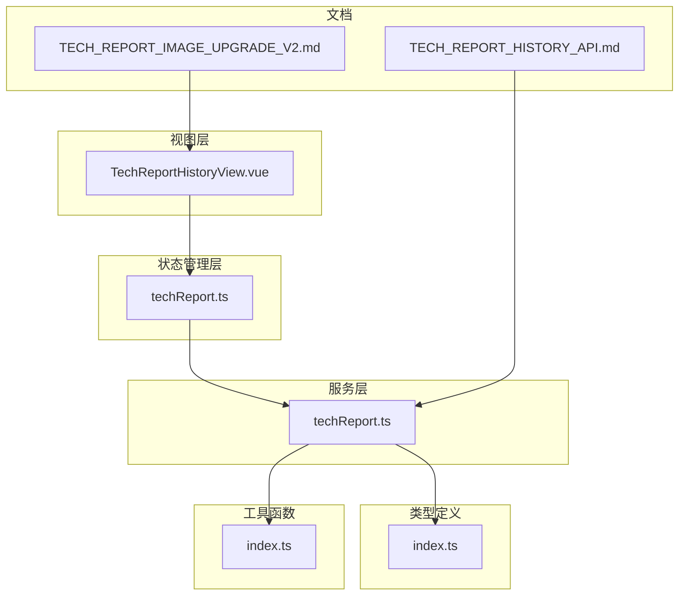
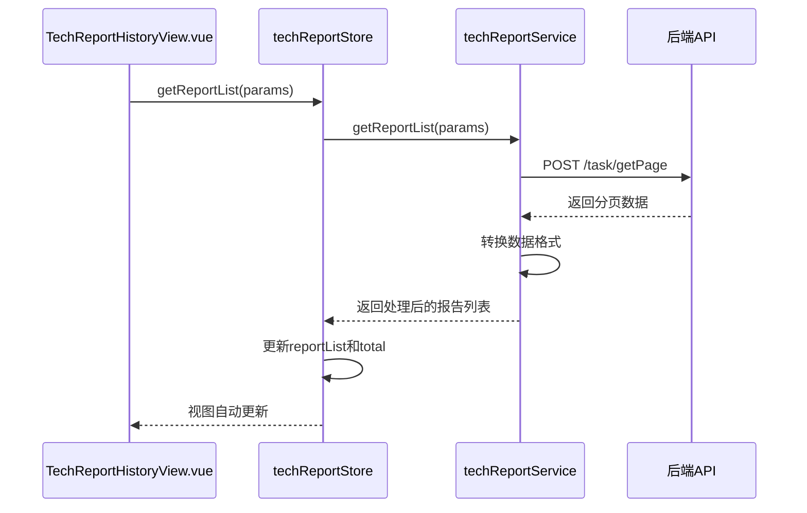
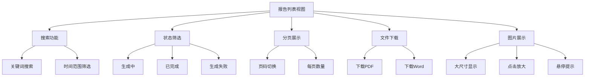
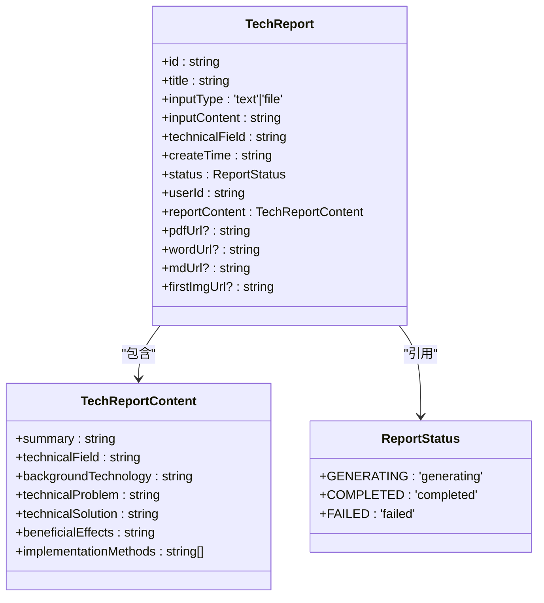
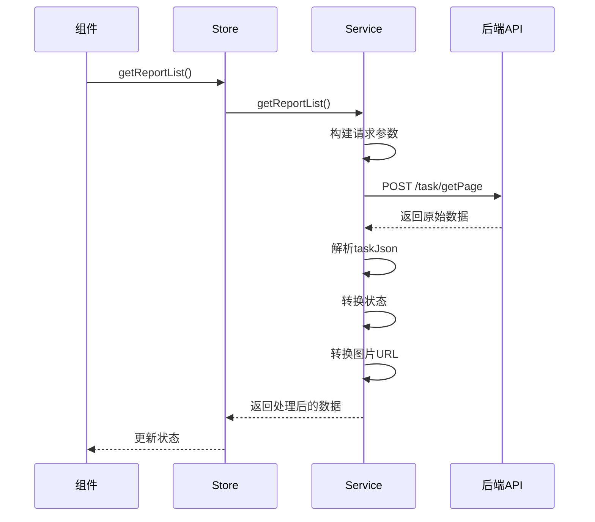
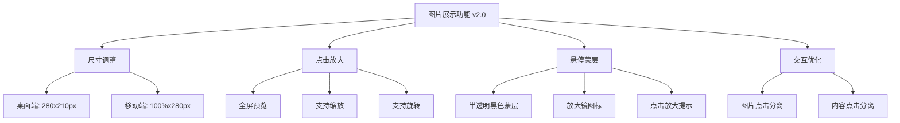
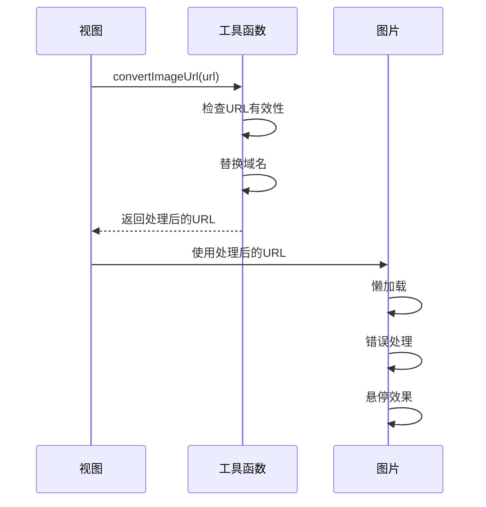
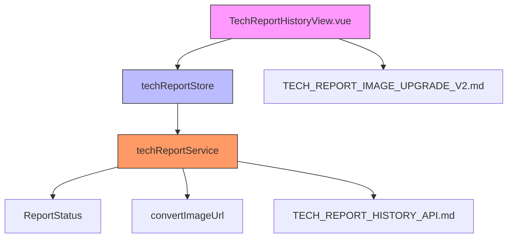

# 技术方案报告历史记录

<cite>
**Referenced Files in This Document**   
- [TechReportHistoryView.vue](file://src/views/tech-report/TechReportHistoryView.vue)
- [techReport.ts](file://src/services/techReport.ts)
- [techReport.ts](file://src/stores/techReport.ts)
- [TECH_REPORT_HISTORY_API.md](file://TECH_REPORT_HISTORY_API.md)
- [TECH_REPORT_IMAGE_UPGRADE_V2.md](file://TECH_REPORT_IMAGE_UPGRADE_V2.md)
- [index.ts](file://src/types/index.ts)
- [index.ts](file://src/utils/index.ts)
</cite>

## 目录
1. [介绍](#介绍)
2. [项目结构](#项目结构)
3. [核心组件](#核心组件)
4. [架构概述](#架构概述)
5. [详细组件分析](#详细组件分析)
6. [依赖分析](#依赖分析)
7. [性能考虑](#性能考虑)
8. [故障排除指南](#故障排除指南)
9. [结论](#结论)

## 介绍

技术方案报告历史记录功能为用户提供了一个完整的报告管理界面，支持分页列表展示、关键词搜索、状态筛选和文件下载等核心功能。该功能通过 `techReportStore.getReportList()` 方法获取数据，并将后端返回的 `taskJson`、`state` 等字段转换为前端可读的报告信息。特别值得一提的是首页图片展示功能，实现了280x210px的大尺寸显示、懒加载、错误占位，以及v2.0版本新增的点击放大预览和悬停蒙层交互效果。这些改进显著提升了用户体验，使用户能够更方便地预览和管理技术方案报告。

## 项目结构

技术方案报告历史记录功能主要分布在以下几个目录中：
- `src/views/tech-report/`: 包含历史记录视图组件
- `src/stores/`: 包含报告状态管理
- `src/services/`: 包含与后端API的交互逻辑
- 根目录文档: 包含API对接和功能升级说明

**Diagram sources**
- [TechReportHistoryView.vue](file://src/views/tech-report/TechReportHistoryView.vue)
- [techReport.ts](file://src/stores/techReport.ts)
- [techReport.ts](file://src/services/techReport.ts)
- [index.ts](file://src/types/index.ts)
- [index.ts](file://src/utils/index.ts)
- [TECH_REPORT_HISTORY_API.md](file://TECH_REPORT_HISTORY_API.md)
- [TECH_REPORT_IMAGE_UPGRADE_V2.md](file://TECH_REPORT_IMAGE_UPGRADE_V2.md)

**Section sources**
- [TechReportHistoryView.vue](file://src/views/tech-report/TechReportHistoryView.vue)
- [techReport.ts](file://src/stores/techReport.ts)
- [techReport.ts](file://src/services/techReport.ts)

## 核心组件

技术方案报告历史记录功能的核心组件包括视图组件、状态管理器和服务层。视图组件 `TechReportHistoryView.vue` 负责展示报告列表，提供搜索、筛选和下载功能。状态管理器 `techReport.ts` 在 `stores` 目录下，负责管理报告列表的状态和获取逻辑。服务层 `techReport.ts` 在 `services` 目录下，负责与后端API进行通信，获取和处理报告数据。这些组件协同工作，实现了完整的报告管理功能。

**Section sources**
- [TechReportHistoryView.vue](file://src/views/tech-report/TechReportHistoryView.vue)
- [techReport.ts](file://src/stores/techReport.ts)
- [techReport.ts](file://src/services/techReport.ts)

## 架构概述

技术方案报告历史记录功能采用典型的分层架构，从视图层到服务层再到后端API，形成了清晰的数据流。用户在视图层进行操作，触发状态管理器中的方法，状态管理器调用服务层的方法，服务层与后端API通信获取数据，数据经过处理后返回给状态管理器，最终更新视图。

**Diagram sources**
- [TechReportHistoryView.vue](file://src/views/tech-report/TechReportHistoryView.vue#L0-L655)
- [techReport.ts](file://src/stores/techReport.ts#L0-L209)
- [techReport.ts](file://src/services/techReport.ts#L0-L345)

## 详细组件分析

### 报告列表视图分析

报告列表视图组件实现了分页展示、搜索、筛选和下载等核心功能，为用户提供了一个完整的报告管理界面。

#### 功能特性

**Diagram sources**
- [TechReportHistoryView.vue](file://src/views/tech-report/TechReportHistoryView.vue#L0-L655)

#### 数据转换逻辑

**Diagram sources**
- [index.ts](file://src/types/index.ts#L0-L307)

### 报告获取服务分析

报告获取服务负责与后端API通信，获取报告列表数据，并将其转换为前端可用的格式。

#### 服务调用流程

**Diagram sources**
- [techReport.ts](file://src/services/techReport.ts#L0-L345)

#### 状态映射关系
| 后端 state | 前端状态 | 显示文本 | 标签类型 |
|-----------|---------|---------|---------|
| 0 | generating | 生成中 | warning |
| 1 | completed | 已完成 | success |
| 2 | failed | 生成失败 | danger |

**Section sources**
- [techReport.ts](file://src/services/techReport.ts#L0-L345)
- [TECH_REPORT_HISTORY_API.md](file://TECH_REPORT_HISTORY_API.md#L0-L268)

### 首页图片展示功能分析

首页图片展示功能在v2.0版本进行了重大升级，显著提升了用户体验。

#### v2.0升级内容

**Diagram sources**
- [TECH_REPORT_IMAGE_UPGRADE_V2.md](file://TECH_REPORT_IMAGE_UPGRADE_V2.md#L0-L428)

#### 图片处理流程

**Diagram sources**
- [index.ts](file://src/utils/index.ts#L0-L271)
- [TechReportHistoryView.vue](file://src/views/tech-report/TechReportHistoryView.vue#L0-L655)

**Section sources**
- [index.ts](file://src/utils/index.ts#L40-L45)
- [TechReportHistoryView.vue](file://src/views/tech-report/TechReportHistoryView.vue)

## 依赖分析

技术方案报告历史记录功能涉及多个组件之间的依赖关系，这些依赖确保了功能的完整性和数据的一致性。

**Diagram sources**
- [TechReportHistoryView.vue](file://src/views/tech-report/TechReportHistoryView.vue)
- [techReport.ts](file://src/stores/techReport.ts)
- [techReport.ts](file://src/services/techReport.ts)
- [index.ts](file://src/types/index.ts)
- [index.ts](file://src/utils/index.ts)
- [TECH_REPORT_HISTORY_API.md](file://TECH_REPORT_HISTORY_API.md)
- [TECH_REPORT_IMAGE_UPGRADE_V2.md](file://TECH_REPORT_IMAGE_UPGRADE_V2.md)

## 性能考虑

技术方案报告历史记录功能在设计时充分考虑了性能优化，主要体现在以下几个方面：

1. **懒加载**：图片采用懒加载策略，只加载可视区域的图片，减少初始页面加载时间。
2. **分页查询**：报告列表采用分页查询，避免一次性加载大量数据。
3. **状态管理**：使用Pinia进行状态管理，避免不必要的组件重新渲染。
4. **图片优化**：通过`convertImageUrl`函数优化图片URL，确保使用正确的CDN地址。
5. **CSS动画**：使用GPU加速的CSS动画，确保交互流畅。

这些优化措施共同确保了即使在报告数量较多的情况下，用户界面依然能够保持良好的响应速度和流畅的用户体验。

## 故障排除指南

### 常见问题及解决方案

1. **图片无法显示**
   - 检查`firstImgUrl`是否为空
   - 确认`convertImageUrl`函数是否正确处理了URL
   - 检查网络连接和图片服务器状态

2. **报告列表加载失败**
   - 检查用户是否已登录
   - 确认API地址和请求参数是否正确
   - 检查网络连接

3. **文件下载失败**
   - 确认`pdfUrl`或`wordUrl`是否为空
   - 检查文件服务器状态
   - 确认用户权限

4. **状态显示不正确**
   - 检查后端返回的`state`值
   - 确认状态映射逻辑是否正确
   - 检查`ReportStatus`枚举定义

**Section sources**
- [techReport.ts](file://src/services/techReport.ts)
- [index.ts](file://src/utils/index.ts)
- [TechReportHistoryView.vue](file://src/views/tech-report/TechReportHistoryView.vue)

## 结论

技术方案报告历史记录功能通过分层架构和组件化设计，实现了完整的报告管理功能。从视图层到服务层，各组件职责明确，协同工作。v2.0版本的图片展示功能升级显著提升了用户体验，大尺寸显示、点击放大和悬停蒙层等特性使用户能够更方便地预览报告内容。通过`techReportStore.getReportList()`方法，系统能够高效地获取和展示报告数据，并将后端返回的`taskJson`、`state`等字段转换为前端可读的信息。整体设计充分考虑了性能优化和用户体验，为用户提供了一个高效、易用的报告管理界面。