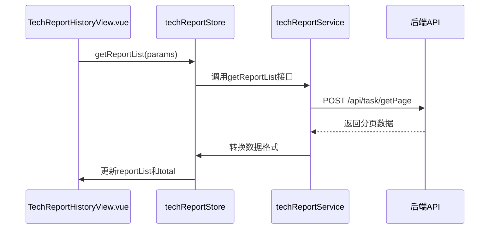
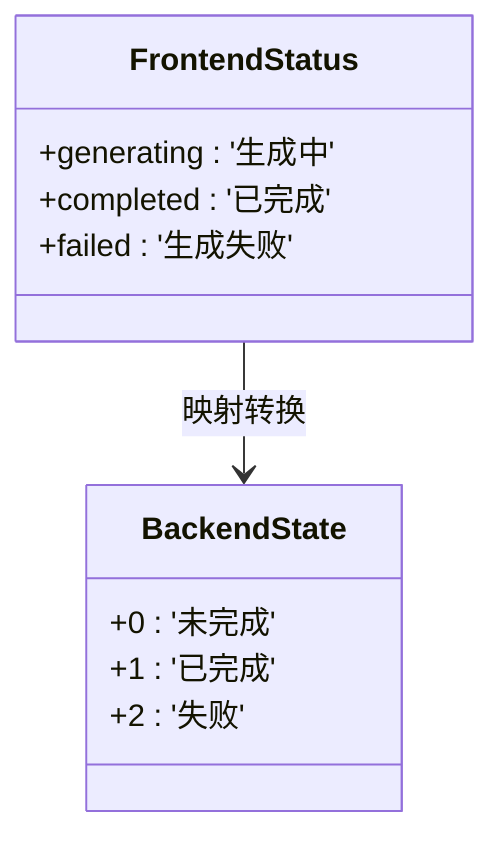
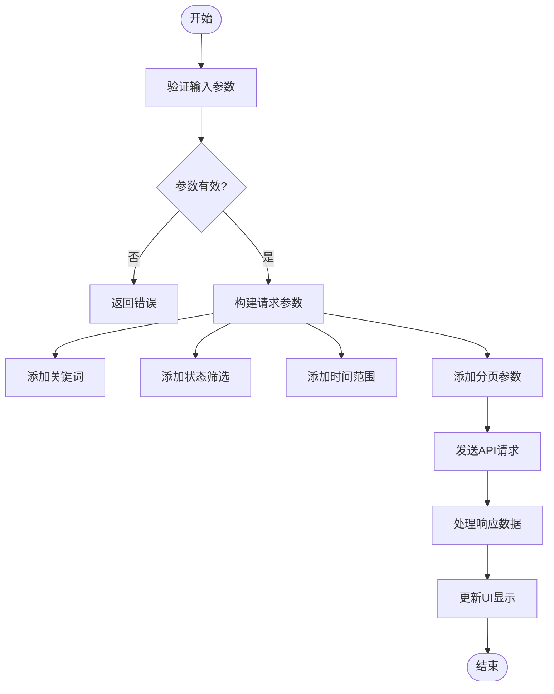
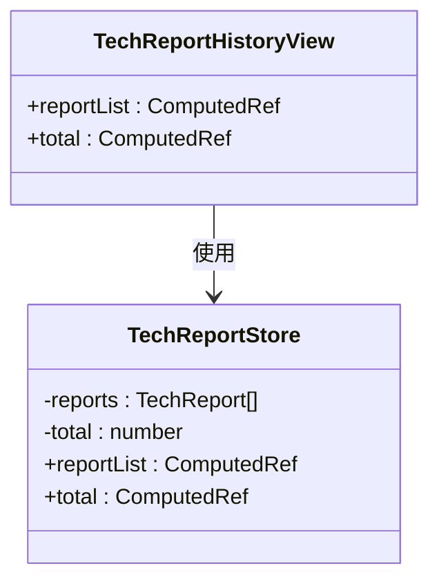
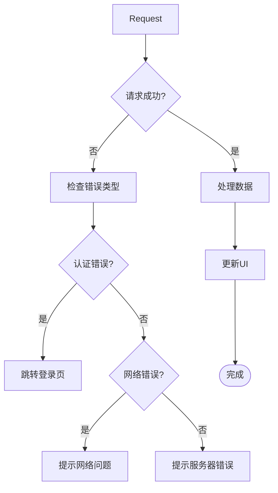
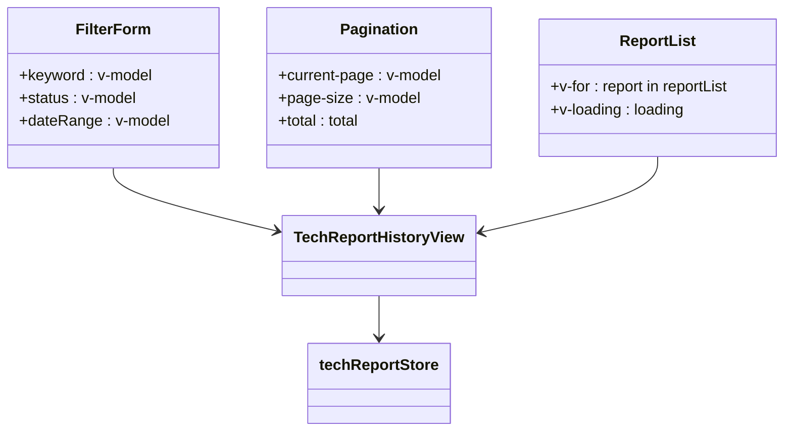

# 技术方案报告历史记录列表

<cite>
**Referenced Files in This Document**  
- [TechReportHistoryView.vue](file://src/views/tech-report/TechReportHistoryView.vue)
- [techReport.ts](file://src/stores/techReport.ts)
- [techReport.ts](file://src/services/techReport.ts)
- [TECH_REPORT_HISTORY_API.md](file://TECH_REPORT_HISTORY_API.md)
- [index.ts](file://src/types/index.ts)
</cite>

## 目录
1. [功能概述](#功能概述)
2. [数据加载流程](#数据加载流程)
3. [状态映射机制](#状态映射机制)
4. [分页与筛选功能](#分页与筛选功能)
5. [响应式数据绑定](#响应式数据绑定)
6. [错误处理策略](#错误处理策略)
7. [UI组件绑定](#ui组件绑定)

## 功能概述

技术方案报告历史记录功能提供了一个完整的报告管理界面，支持分页展示、关键词搜索、状态筛选（生成中/已完成/失败）、时间范围过滤等核心功能。用户可以通过该界面查看、下载和删除已生成的技术方案报告。

该功能主要由 `TechReportHistoryView.vue` 视图组件驱动，通过 Pinia 状态管理库与后端 API 进行数据交互。前端通过 `techReportStore.getReportList()` 方法发起请求，获取报告列表数据，并在界面上进行展示。

**Section sources**
- [TechReportHistoryView.vue](file://src/views/tech-report/TechReportHistoryView.vue#L1-L50)

## 数据加载流程

报告列表的数据加载流程遵循典型的请求-响应模式，通过多层服务调用实现前后端数据交互。

**Diagram sources**
- [TechReportHistoryView.vue](file://src/views/tech-report/TechReportHistoryView.vue#L150-L200)
- [techReport.ts](file://src/stores/techReport.ts#L50-L80)
- [techReport.ts](file://src/services/techReport.ts#L150-L200)

当页面加载或用户执行搜索操作时，`loadReports()` 方法被调用，该方法会收集当前的筛选条件（关键词、状态、日期范围等）和分页参数，然后调用 `techReportStore.getReportList()` 方法发起请求。

**Section sources**
- [TechReportHistoryView.vue](file://src/views/tech-report/TechReportHistoryView.vue#L150-L200)
- [techReport.ts](file://src/stores/techReport.ts#L50-L80)

## 状态映射机制

前端与后端之间存在明确的状态映射关系，确保状态信息在系统各层之间正确传递。

**Diagram sources**
- [techReport.ts](file://src/services/techReport.ts#L180-L190)
- [index.ts](file://src/types/index.ts#L56-L60)

前端使用 `ReportStatus` 枚举类型表示报告状态：
- `generating`：生成中
- `completed`：已完成
- `failed`：生成失败

在请求时，前端状态会通过 `statusMap` 对象转换为后端对应的数值：
- `generating` → 0
- `completed` → 1
- `failed` → 2

响应时，后端返回的 `state` 值会通过 `convertState` 函数转换回前端状态枚举。

**Section sources**
- [techReport.ts](file://src/services/techReport.ts#L180-L190)
- [index.ts](file://src/types/index.ts#L56-L60)

## 分页与筛选功能

分页与筛选功能通过 `filterForm` 和 `pagination` 两个响应式对象实现，提供了灵活的数据查询能力。

**Diagram sources**
- [TechReportHistoryView.vue](file://src/views/tech-report/TechReportHistoryView.vue#L80-L150)
- [techReport.ts](file://src/services/techReport.ts#L160-L180)

`filterForm` 对象包含以下筛选条件：
- `keyword`：关键词搜索
- `status`：状态筛选（空值表示全部）
- `dateRange`：时间范围（数组格式）

`pagination` 对象管理分页信息：
- `page`：当前页码
- `pageSize`：每页大小

当用户点击搜索或更改分页时，这些参数会被整合并传递给 `getReportList()` 方法。

**Section sources**
- [TechReportHistoryView.vue](file://src/views/tech-report/TechReportHistoryView.vue#L80-L150)

## 响应式数据绑定

报告列表和总数通过 Pinia store 的计算属性实现响应式绑定，确保视图与状态的同步。

**Diagram sources**
- [techReport.ts](file://src/stores/techReport.ts#L20-L30)
- [TechReportHistoryView.vue](file://src/views/tech-report/TechReportHistoryView.vue#L100-L110)

在 `techReportStore` 中，`reportList` 和 `total` 被定义为计算属性：
- `reportList`：基于 `reports` 状态的计算属性
- `total`：直接暴露 `total` 状态

在视图组件中，通过 `computed()` 函数创建本地计算属性，引用 store 中的数据，实现响应式更新。

**Section sources**
- [techReport.ts](file://src/stores/techReport.ts#L20-L30)
- [TechReportHistoryView.vue](file://src/views/tech-report/TechReportHistoryView.vue#L100-L110)

## 错误处理策略

系统实现了完善的错误处理机制，能够优雅地处理各种异常情况。

**Diagram sources**
- [techReport.ts](file://src/services/techReport.ts#L250-L300)
- [techReport.ts](file://src/stores/techReport.ts#L60-L70)

当请求失败时，系统会根据错误类型采取不同的处理策略：
- 认证过期（401）：自动跳转到登录页面
- 网络连接错误：提示用户检查网络连接
- 服务器错误：显示服务器错误提示
- 其他错误：显示相应的错误消息

特别地，当错误消息为"登录已过期"时，系统不会显示额外的错误提示，而是直接处理认证过期逻辑。

**Section sources**
- [techReport.ts](file://src/services/techReport.ts#L250-L300)
- [techReport.ts](file://src/stores/techReport.ts#L60-L70)

## UI组件绑定

UI组件通过 Vue 的响应式系统与数据模型进行绑定，实现动态更新。

**Diagram sources**
- [TechReportHistoryView.vue](file://src/views/tech-report/TechReportHistoryView.vue#L1-L50)
- [TechReportHistoryView.vue](file://src/views/tech-report/TechReportHistoryView.vue#L300-L350)

`el-pagination` 组件通过 `v-model:current-page` 和 `v-model:page-size` 与 `pagination` 对象双向绑定，同时 `:total` 属性绑定到 `total` 计算属性。

`el-table`（在代码中以 `v-for` 实现）通过 `v-for="report in reportList"` 绑定到报告列表数据，`v-loading="loading"` 控制加载状态的显示。

**Section sources**
- [TechReportHistoryView.vue](file://src/views/tech-report/TechReportHistoryView.vue#L1-L50)
- [TechReportHistoryView.vue](file://src/views/tech-report/TechReportHistoryView.vue#L300-L350)