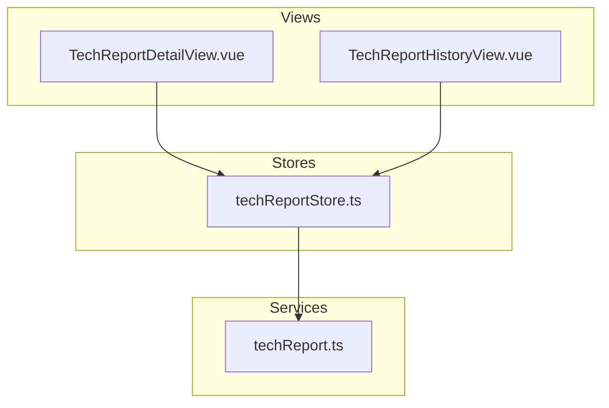
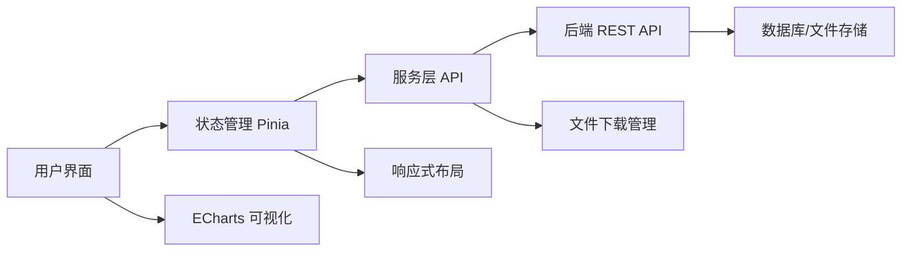
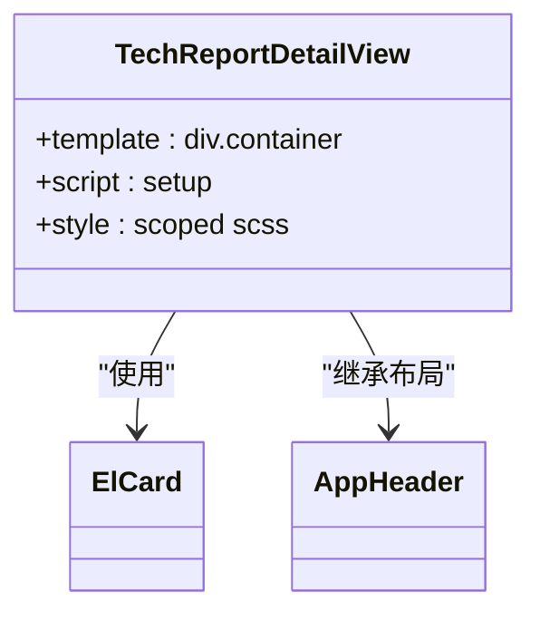
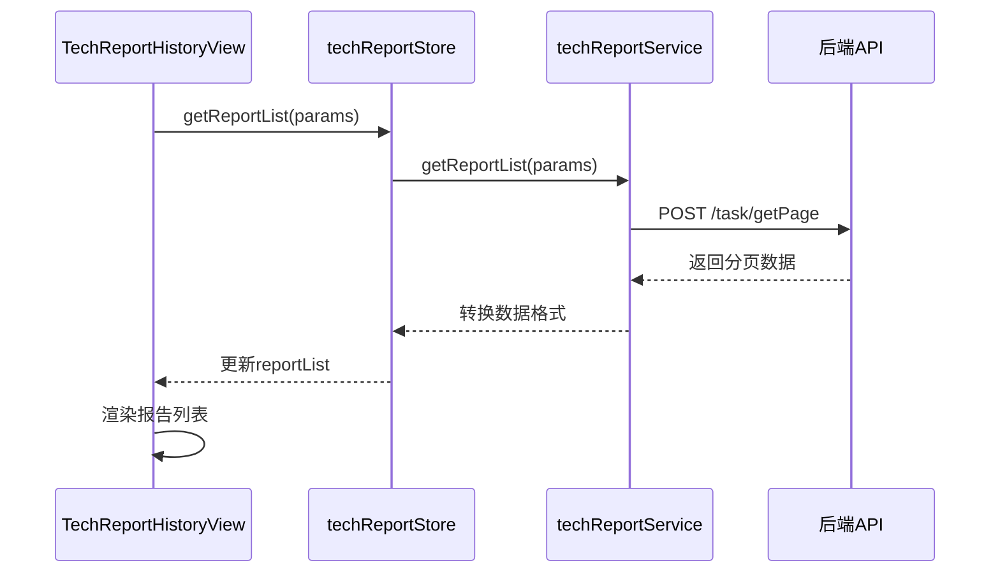
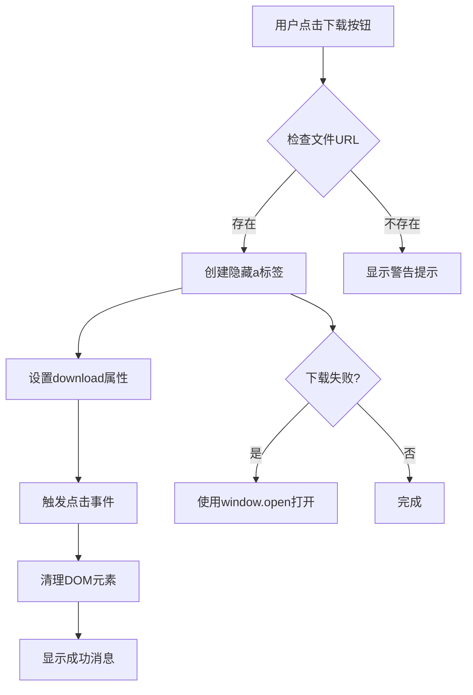
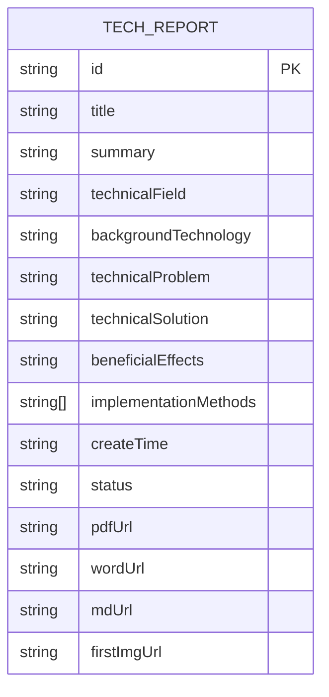
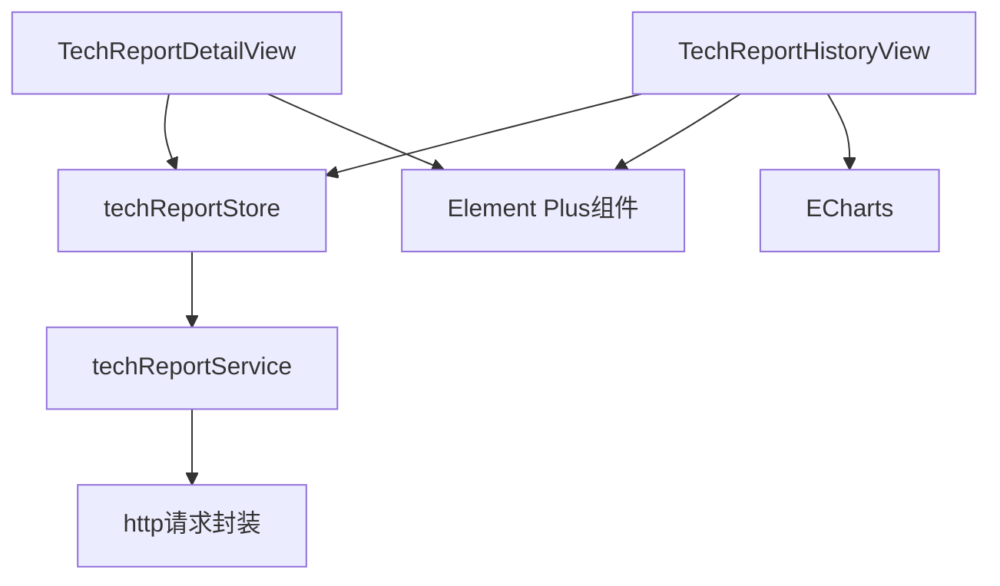

# 技术方案报告详情查看

<cite>
**本文档引用文件**  
- [TechReportDetailView.vue](file://src/views/tech-report/TechReportDetailView.vue)
- [techReport.ts](file://src/services/techReport.ts)
- [techReportStore.ts](file://src/stores/techReport.ts)
- [TechReportHistoryView.vue](file://src/views/tech-report/TechReportHistoryView.vue)
- [TECH_REPORT_API.md](file://TECH_REPORT_API.md)
- [FILE_DOWNLOAD_FIX.md](file://FILE_DOWNLOAD_FIX.md)
- [TECH_REPORT_IMAGE_FEATURE.md](file://TECH_REPORT_IMAGE_FEATURE.md)
</cite>

## 目录
1. [简介](#简介)
2. [项目结构](#项目结构)
3. [核心组件](#核心组件)
4. [架构概览](#架构概览)
5. [详细组件分析](#详细组件分析)
6. [依赖分析](#依赖分析)
7. [性能考虑](#性能考虑)
8. [故障排除指南](#故障排除指南)
9. [结论](#结论)

## 简介
本技术方案报告详情查看功能旨在为用户提供一个全面、直观的界面，用于查看和管理已生成的技术方案报告。系统支持报告内容的结构化展示、多格式文件下载、响应式布局适配以及内容安全处理。通过集成ECharts实现数据可视化，并采用现代化的前端架构确保高性能和良好的用户体验。

## 项目结构
该功能主要由视图组件、服务层和状态管理三部分构成，遵循Vue 3 + TypeScript + Pinia的现代前端架构模式。

**图示来源**  
- [TechReportDetailView.vue](file://src/views/tech-report/TechReportDetailView.vue)
- [TechReportHistoryView.vue](file://src/views/tech-report/TechReportHistoryView.vue)
- [techReportStore.ts](file://src/stores/techReport.ts)
- [techReport.ts](file://src/services/techReport.ts)

## 核心组件
核心功能围绕技术方案报告的查看、下载和管理展开，主要包括详情页面、历史记录列表、状态管理和服务接口调用等关键模块。系统通过Pinia进行全局状态管理，实现组件间的数据共享与同步。

**本节来源**  
- [TechReportDetailView.vue](file://src/views/tech-report/TechReportDetailView.vue#L1-L36)
- [techReportStore.ts](file://src/stores/techReport.ts#L6-L207)
- [techReport.ts](file://src/services/techReport.ts#L101-L343)

## 架构概览
系统采用分层架构设计，从前端视图到服务接口再到后端API，形成清晰的数据流和职责划分。

**图示来源**  
- [techReport.ts](file://src/services/techReport.ts#L101-L343)
- [techReportStore.ts](file://src/stores/techReport.ts#L6-L207)
- [TechReportHistoryView.vue](file://src/views/tech-report/TechReportHistoryView.vue#L0-L654)

## 详细组件分析

### 技术方案报告详情页面分析
该页面负责展示单个技术方案报告的完整内容，目前处于开发阶段，基础结构已搭建完成。

#### 组件结构

**图示来源**  
- [TechReportDetailView.vue](file://src/views/tech-report/TechReportDetailView.vue#L1-L36)

### 技术方案报告历史记录分析
该页面实现了报告列表的展示、搜索、筛选和下载功能，是用户访问报告的主要入口。

#### 数据获取流程

**图示来源**  
- [TechReportHistoryView.vue](file://src/views/tech-report/TechReportHistoryView.vue#L183-L241)
- [techReportStore.ts](file://src/stores/techReport.ts#L42-L102)
- [techReport.ts](file://src/services/techReport.ts#L101-L343)

#### 报告下载流程

**图示来源**  
- [TechReportHistoryView.vue](file://src/views/tech-report/TechReportHistoryView.vue#L234-L284)
- [FILE_DOWNLOAD_FIX.md](file://FILE_DOWNLOAD_FIX.md#L17-L62)

### 报告内容结构化渲染
系统支持将技术方案报告的内容按模块化方式进行结构化展示，包括摘要、背景、创新点等核心要素。

**图示来源**  
- [techReport.ts](file://src/services/techReport.ts#L219-L262)
- [TECH_REPORT_API.md](file://TECH_REPORT_API.md#L1-L261)

## 依赖分析
系统各组件之间存在明确的依赖关系，形成了稳定的数据流和调用链路。

**图示来源**  
- [techReportStore.ts](file://src/stores/techReport.ts#L6-L207)
- [techReport.ts](file://src/services/techReport.ts#L101-L343)
- [TechReportHistoryView.vue](file://src/views/tech-report/TechReportHistoryView.vue#L0-L654)

## 性能考虑
系统在设计时充分考虑了性能优化，特别是在大文件处理、图片加载和响应式布局方面采用了多种优化策略。

- **图片懒加载**：采用Element Plus的`lazy`属性实现图片滚动加载
- **响应式设计**：通过CSS媒体查询适配不同设备尺寸
- **内存管理**：下载完成后及时清理DOM元素，避免内存泄漏
- **错误降级**：文件下载失败时自动降级到新窗口打开方案

**本节来源**  
- [TECH_REPORT_IMAGE_FEATURE.md](file://TECH_REPORT_IMAGE_FEATURE.md#L0-L42)
- [FILE_DOWNLOAD_FIX.md](file://FILE_DOWNLOAD_FIX.md#L80-L129)

## 故障排除指南
针对常见的使用问题，系统提供了相应的解决方案和错误处理机制。

### 常见问题及解决方案
| 问题现象 | 可能原因 | 解决方案 |
|---------|--------|--------|
| 报告无法下载 | 浏览器弹窗拦截 | 检查浏览器设置，允许弹出窗口 |
| 图片加载失败 | 网络问题或URL失效 | 检查网络连接，刷新页面重试 |
| 登录过期 | Token失效 | 重新登录系统 |
| 搜索无结果 | 关键词不匹配 | 调整搜索关键词或筛选条件 |

**本节来源**  
- [FILE_DOWNLOAD_FIX.md](file://FILE_DOWNLOAD_FIX.md#L0-L15)
- [TECH_REPORT_API.md](file://TECH_REPORT_API.md#L1-L261)

## 结论
技术方案报告详情查看功能通过合理的架构设计和组件划分，实现了报告内容的结构化展示、多格式文件下载和响应式布局适配。系统采用现代化的前端技术栈，确保了良好的用户体验和可维护性。未来可进一步完善详情页面的内容展示，集成ECharts实现数据可视化分析功能。