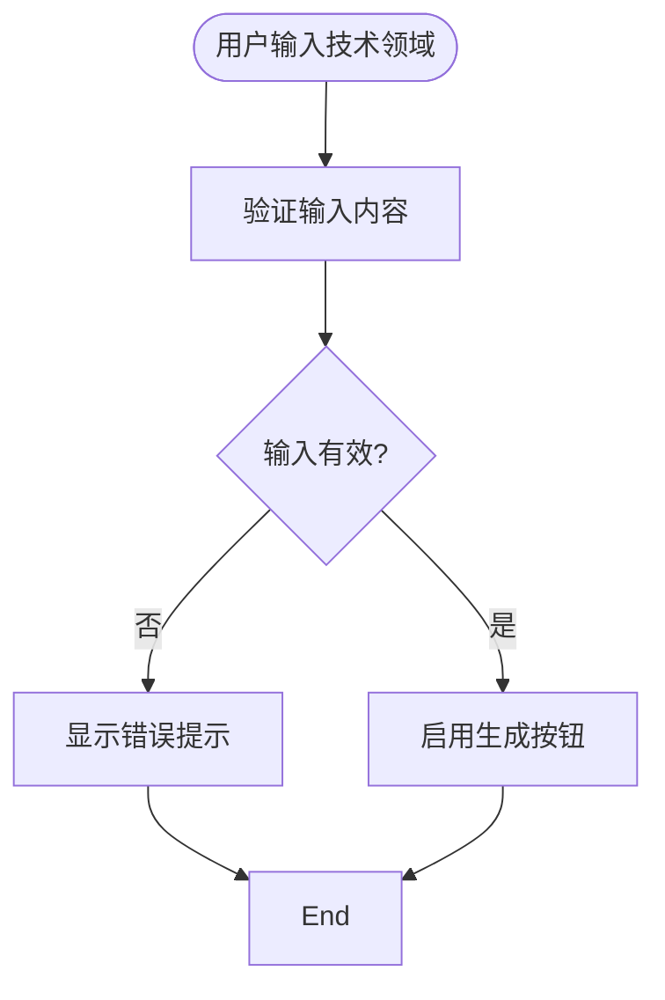
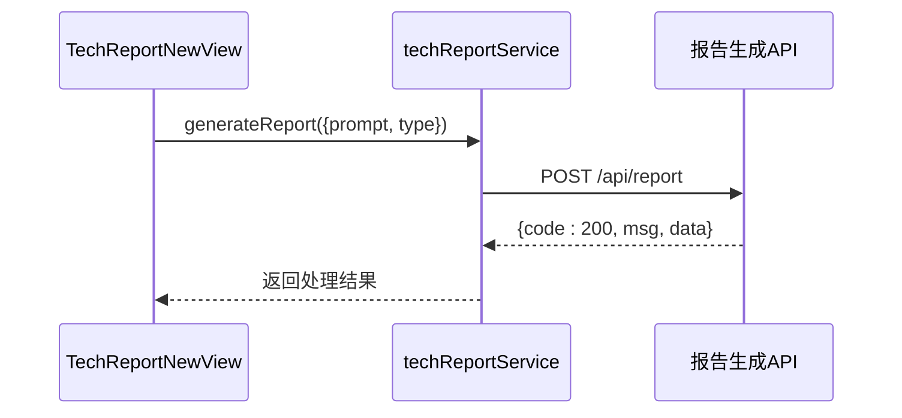
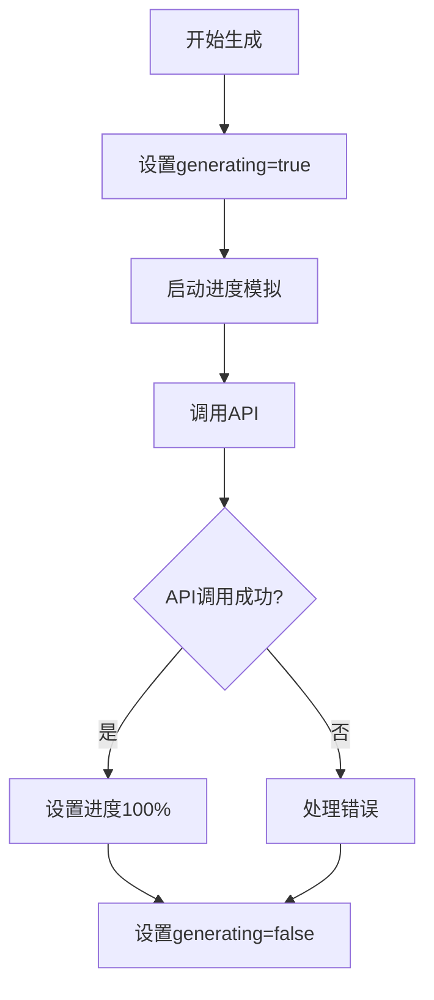
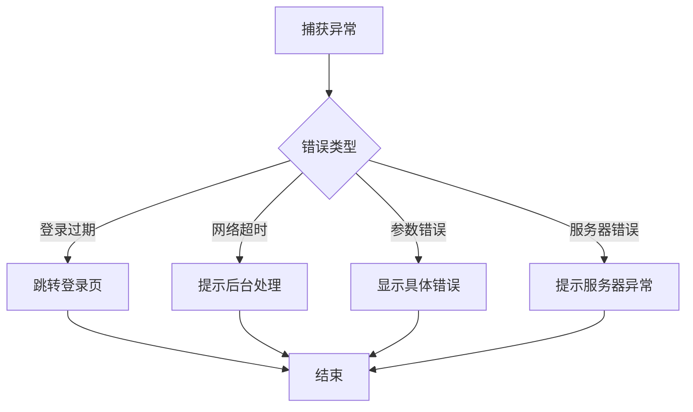
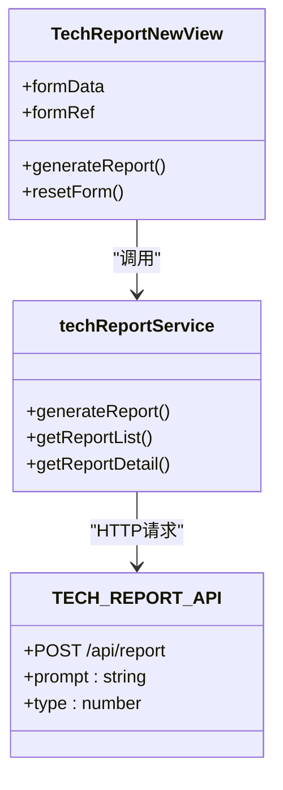

# 新建技术方案报告

<cite>
**Referenced Files in This Document**   
- [TechReportNewView.vue](file://src/views/tech-report/TechReportNewView.vue)
- [techReport.ts](file://src/services/techReport.ts)
- [techReport.ts](file://src/stores/techReport.ts)
- [TECH_REPORT_API.md](file://TECH_REPORT_API.md)
</cite>

## 目录
1. [创建流程概述](#创建流程概述)
2. [用户输入与表单验证](#用户输入与表单验证)
3. [API请求机制](#api请求机制)
4. [状态管理与用户反馈](#状态管理与用户反馈)
5. [错误处理机制](#错误处理机制)
6. [数据展示逻辑](#数据展示逻辑)
7. [服务层调用流程](#服务层调用流程)

## 创建流程概述

技术方案报告的创建流程始于用户在`TechReportNewView`界面输入技术领域描述。系统通过完整的交互流程，将用户输入传递至后端服务进行处理。整个流程包括用户输入、前端验证、API调用、状态管理和结果展示等关键环节。

**Section sources**
- [TechReportNewView.vue](file://src/views/tech-report/TechReportNewView.vue#L1-L50)

## 用户输入与表单验证

用户在"技术领域"输入框中提供技术方案的描述信息。系统对输入内容进行严格验证，确保数据质量。验证规则包括：输入不能为空、描述至少包含5个字符。这些验证规则通过Element Plus的表单验证机制实现，确保只有符合要求的输入才能触发报告生成流程。

**Diagram sources**
- [TechReportNewView.vue](file://src/views/tech-report/TechReportNewView.vue#L120-L140)

**Section sources**
- [TechReportNewView.vue](file://src/views/tech-report/TechReportNewView.vue#L120-L140)

## API请求机制

系统通过`techReportService.generateReport()`方法发起API请求。根据`TECH_REPORT_API.md`文档，POST `/api/report`接口接收两个核心参数：`prompt`和`type`。其中`prompt`为用户输入的技术领域描述，`type`为报告类型标识（默认值为1）。请求通过HTTP POST方法发送，Content-Type为application/json，并在请求头中自动携带用户认证token。

**Diagram sources**
- [techReport.ts](file://src/services/techReport.ts#L50-L80)
- [TECH_REPORT_API.md](file://TECH_REPORT_API.md#L20-L30)

**Section sources**
- [techReport.ts](file://src/services/techReport.ts#L50-L80)
- [TECH_REPORT_API.md](file://TECH_REPORT_API.md#L20-L30)

## 状态管理与用户反馈

系统采用精细化的loading状态管理机制提升用户体验。当报告生成过程中，界面显示进度条和分步提示，包括"分析技术内容"、"检索相关专利"、"评估技术特点"等五个阶段。当前步骤通过`currentStep`变量跟踪，进度通过`generateProgress`变量控制。这种渐进式反馈让用户清晰了解处理进度，避免重复提交。

**Diagram sources**
- [TechReportNewView.vue](file://src/views/tech-report/TechReportNewView.vue#L200-L250)

**Section sources**
- [TechReportNewView.vue](file://src/views/tech-report/TechReportNewView.vue#L200-L250)

## 错误处理机制

系统实现了全面的错误处理机制，通过`ElMessage`组件向用户展示友好的提示信息。错误处理包括：未登录状态自动跳转至登录页、Token过期处理、网络连接错误、后端服务异常等。特别针对长时间处理的请求，系统会捕获超时错误并提示"报告已提交后台处理，请稍后在历史记录中查看结果"，确保用户体验的连续性。

**Diagram sources**
- [techReport.ts](file://src/services/techReport.ts#L60-L100)

**Section sources**
- [techReport.ts](file://src/services/techReport.ts#L60-L100)

## 数据展示逻辑

报告生成成功后，系统根据后端返回的数据决定展示方式。如果`response.data`包含具体内容，则直接在预览区域展示报告的各个章节，包括技术方案摘要、技术背景、创新点分析等。如果后端返回`data: null`（表示异步处理），则显示提示信息引导用户到历史记录页面查看结果。预览区域采用卡片式布局，清晰展示报告标题和各部分内容。

**Section sources**
- [TechReportNewView.vue](file://src/views/tech-report/TechReportNewView.vue#L300-L350)

## 服务层调用流程

`techReportService`服务层封装了与后端API的交互逻辑。`generateReport`方法接收用户输入，构造符合API要求的请求参数，并处理HTTP响应。服务层统一处理认证、错误转换和数据格式化，为上层组件提供简洁的调用接口。通过这种分层设计，实现了业务逻辑与UI逻辑的分离，提高了代码的可维护性和复用性。

**Diagram sources**
- [techReport.ts](file://src/services/techReport.ts#L50-L90)
- [TechReportNewView.vue](file://src/views/tech-report/TechReportNewView.vue#L180-L220)

**Section sources**
- [techReport.ts](file://src/services/techReport.ts#L50-L90)
- [TechReportNewView.vue](file://src/views/tech-report/TechReportNewView.vue#L180-L220)