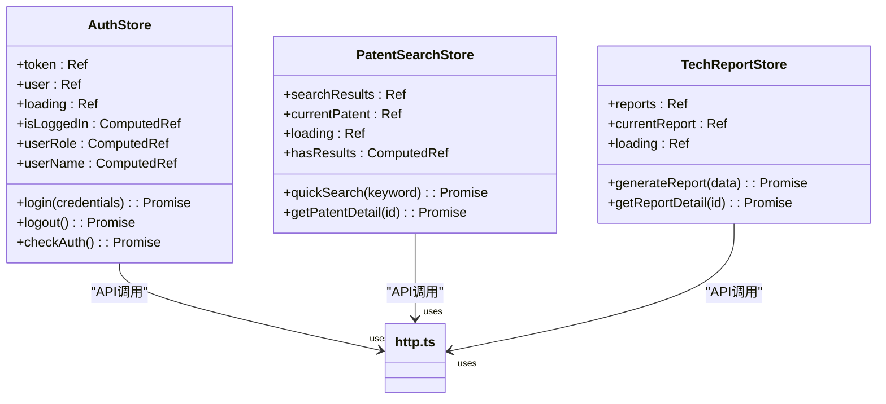
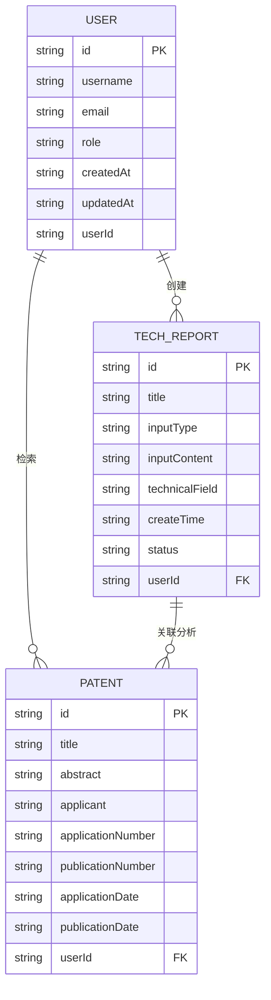
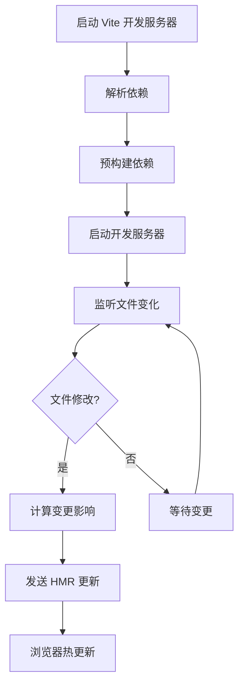
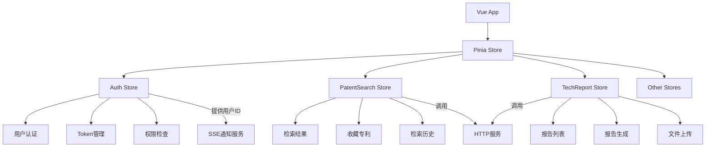
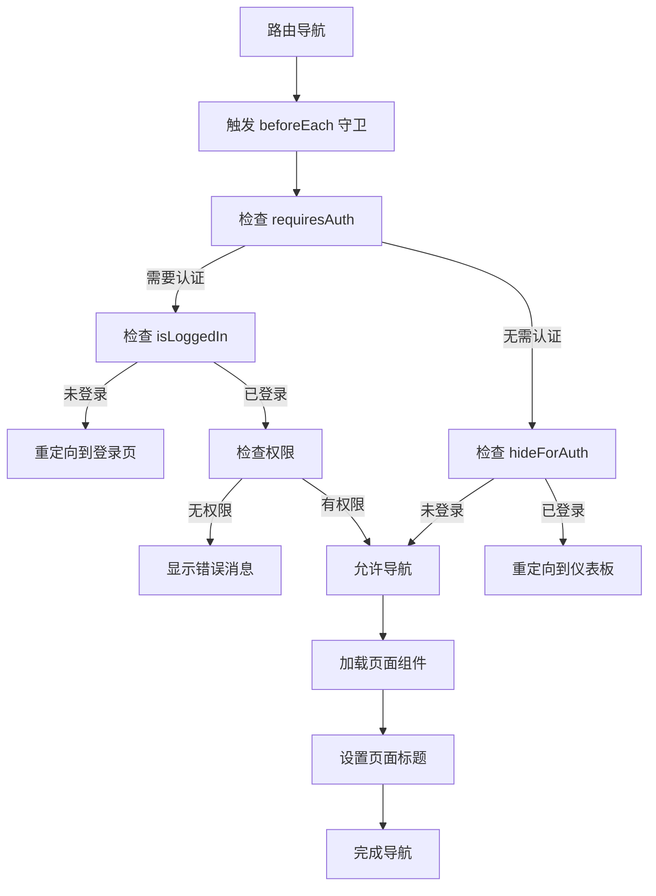
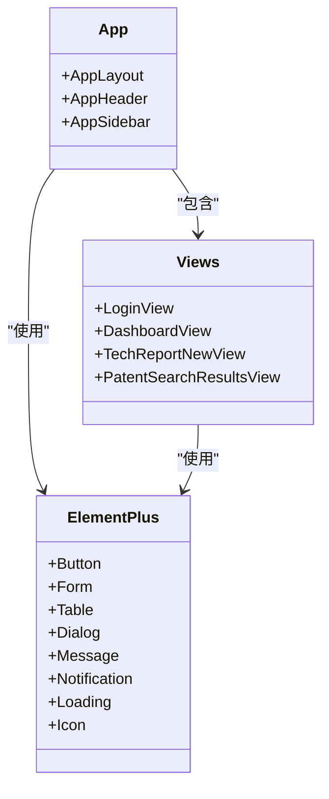
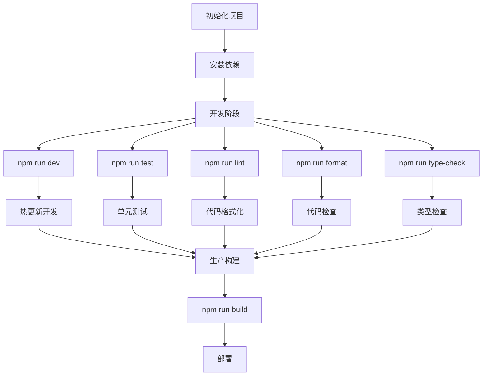

# 技术栈与依赖

<cite>
**本文档引用的文件**  
- [package.json](file://package.json)
- [vite.config.ts](file://vite.config.ts)
- [tsconfig.json](file://tsconfig.json)
- [main.ts](file://src/main.ts)
- [router/index.ts](file://src/router/index.ts)
- [stores/auth.ts](file://src/stores/auth.ts)
- [stores/patentSearch.ts](file://src/stores/techReport.ts)
- [stores/techReport.ts](file://src/stores/techReport.ts)
- [types/index.ts](file://src/types/index.ts)
- [utils/index.ts](file://src/utils/index.ts)
- [services/http.ts](file://src/services/http.ts)
- [services/auth.ts](file://src/services/auth.ts)
- [services/patentSearch.ts](file://src/services/patentSearch.ts)
- [services/techReport.ts](file://src/services/techReport.ts)
- [services/notification.ts](file://src/services/notification.ts)
</cite>

## 目录
1. [项目技术栈概述](#项目技术栈概述)
2. [Vue 3 Composition API 优势与应用](#vue-3-composition-api-优势与应用)
3. [TypeScript 提升代码质量](#typescript-提升代码质量)
4. [Vite 构建工具优势](#vite-构建工具优势)
5. [Pinia 状态管理集成](#pinia-状态管理集成)
6. [Vue Router 路由系统](#vue-router-路由系统)
7. [Element Plus UI 组件库](#element-plus-ui-组件库)
8. [关键依赖项与版本要求](#关键依赖项与版本要求)
9. [依赖管理最佳实践](#依赖管理最佳实践)
10. [技术选型决策依据](#技术选型决策依据)

## 项目技术栈概述

本项目采用现代化的前端技术栈，基于 Vue 3 框架构建，结合 TypeScript 提供类型安全，使用 Vite 作为构建工具以提升开发效率。项目架构采用模块化设计，通过 Pinia 进行状态管理，Vue Router 实现路由控制，并集成 Element Plus 提供丰富的 UI 组件。整体技术选型旨在提高开发效率、代码质量和用户体验。

**Section sources**
- [package.json](file://package.json#L1-L54)
- [vite.config.ts](file://vite.config.ts#L1-L18)

## Vue 3 Composition API 优势与应用

Vue 3 的 Composition API 提供了更灵活的代码组织方式，允许开发者按逻辑关注点组织代码，而非传统的 Options API 按选项类型组织。在本项目中，Composition API 被广泛应用于组件和状态管理中，通过 `ref`、`computed` 和 `defineStore` 等函数式 API 实现响应式数据管理。

在 Pinia 状态管理器中，`defineStore` 函数结合 Composition API 风格，使状态、计算属性和操作能够清晰地组织在一起。例如，在 `auth.ts` 中，认证状态的管理通过 `ref` 定义响应式状态，`computed` 定义派生状态，`actions` 定义异步操作，实现了逻辑的高内聚和可维护性。

**Diagram sources**
- [src/stores/auth.ts](file://src/stores/auth.ts#L7-L261)
- [src/stores/patentSearch.ts](file://src/stores/patentSearch.ts#L7-L277)
- [src/stores/techReport.ts](file://src/stores/techReport.ts#L7-L208)

**Section sources**
- [src/stores/auth.ts](file://src/stores/auth.ts#L7-L261)
- [src/stores/patentSearch.ts](file://src/stores/patentSearch.ts#L7-L277)
- [src/stores/techReport.ts](file://src/stores/techReport.ts#L7-L208)

## TypeScript 提升代码质量

TypeScript 在本项目中发挥了关键作用，通过静态类型检查显著提升了代码质量和开发体验。项目定义了完整的类型系统，包括用户、报告、专利等核心数据结构，确保了数据的一致性和可预测性。

在 `types/index.ts` 中，项目定义了 `User`、`TechReport`、`Patent` 等接口，以及 `ApiResponse` 通用响应格式。这些类型在服务层、状态管理器和组件中被广泛使用，提供了编译时的类型检查和 IDE 的智能提示，减少了运行时错误。

**Diagram sources**
- [src/types/index.ts](file://src/types/index.ts#L1-L306)

**Section sources**
- [src/types/index.ts](file://src/types/index.ts#L1-L306)
- [src/utils/index.ts](file://src/utils/index.ts#L1-L270)

## Vite 构建工具优势

Vite 作为本项目的构建工具，带来了显著的开发效率提升。通过利用浏览器原生 ES 模块导入，Vite 实现了极快的冷启动和热模块替换（HMR）。在 `vite.config.ts` 中，项目配置了别名 `@` 指向 `src` 目录，简化了模块导入路径。

Vite 的开发服务器启动时间极短，HMR 更新几乎是即时的，极大地提升了开发体验。同时，Vite 支持 TypeScript、JSX、CSS 预处理器等现代前端技术，无需复杂的配置即可开箱即用。

**Diagram sources**
- [vite.config.ts](file://vite.config.ts#L1-L18)

**Section sources**
- [vite.config.ts](file://vite.config.ts#L1-L18)
- [package.json](file://package.json#L10-L12)

## Pinia 状态管理集成

Pinia 作为 Vue 官方推荐的状态管理库，在本项目中被用于管理全局应用状态。项目通过 `defineStore` 创建了多个模块化 store，包括 `auth`、`patentSearch`、`techReport` 等，实现了状态的集中管理和逻辑复用。

在 `main.ts` 中，Pinia 实例被注册到 Vue 应用中，使所有组件都能访问全局状态。各 store 之间通过清晰的 API 进行通信，避免了状态的混乱和耦合。例如，`auth` store 管理用户认证状态，其他 store 可以通过 `useAuthStore()` 获取当前用户信息。

**Diagram sources**
- [src/main.ts](file://src/main.ts#L1-L23)
- [src/stores/auth.ts](file://src/stores/auth.ts#L7-L261)

**Section sources**
- [src/main.ts](file://src/main.ts#L1-L23)
- [src/stores/auth.ts](file://src/stores/auth.ts#L7-L261)
- [src/stores/patentSearch.ts](file://src/stores/patentSearch.ts#L7-L277)
- [src/stores/techReport.ts](file://src/stores/techReport.ts#L7-L208)

## Vue Router 路由系统

Vue Router 在本项目中实现了完整的前端路由控制，支持嵌套路由、路由守卫和动态导入。在 `router/index.ts` 中，项目定义了基于布局的路由结构，通过 `AppLayout` 组件实现统一的页面布局。

路由配置中包含了丰富的元信息（meta），如页面标题、图标、权限要求等。路由守卫 `beforeEach` 实现了权限控制，检查用户登录状态和页面访问权限，未登录用户将被重定向到登录页。

**Diagram sources**
- [src/router/index.ts](file://src/router/index.ts#L1-L293)

**Section sources**
- [src/router/index.ts](file://src/router/index.ts#L1-L293)
- [src/main.ts](file://src/main.ts#L1-L23)

## Element Plus UI 组件库

Element Plus 作为本项目的 UI 组件库，提供了丰富且美观的组件，包括布局、表单、表格、弹窗等。在 `main.ts` 中，Element Plus 被全局注册，同时通过 `@element-plus/icons-vue` 注册了所有图标组件。

项目充分利用了 Element Plus 的组件能力，如 `ElMessage` 用于消息提示，`ElLoading` 用于加载状态，`ElDialog` 用于模态对话框等。组件的样式通过 SCSS 变量进行定制，确保与项目整体设计风格一致。

**Diagram sources**
- [src/main.ts](file://src/main.ts#L1-L23)
- [src/layouts/AppLayout.vue](file://src/layouts/AppLayout.vue)
- [src/components/icons](file://src/components/icons)

**Section sources**
- [src/main.ts](file://src/main.ts#L1-L23)
- [package.json](file://package.json#L25-L26)

## 关键依赖项与版本要求

项目的关键依赖项及其版本要求如下表所示，确保了技术栈的稳定性和兼容性。

| 依赖项 | 版本 | 说明 |
|-------|------|------|
| Node.js | ^20.19.0 或 >=22.12.0 | 运行环境 |
| npm | 任意 | 包管理器 |
| vue | ^3.5.22 | 核心框架 |
| typescript | ~5.9.0 | 类型系统 |
| vite | ^7.1.7 | 构建工具 |
| pinia | ^3.0.3 | 状态管理 |
| vue-router | ^4.5.1 | 路由系统 |
| element-plus | ^2.11.4 | UI 组件库 |
| axios | ^1.12.2 | HTTP 客户端 |
| sass | ^1.93.2 | CSS 预处理器 |

**Section sources**
- [package.json](file://package.json#L1-L54)
- [tsconfig.json](file://tsconfig.json#L1-L11)

## 依赖管理最佳实践

项目遵循依赖管理的最佳实践，通过 `package.json` 明确声明所有依赖项，区分 `dependencies` 和 `devDependencies`。开发脚本通过 `npm-run-all2` 并行执行，提高构建效率。

建议的依赖管理流程：
1. 安装依赖：`npm install`
2. 启动开发：`npm run dev`
3. 构建生产：`npm run build`
4. 类型检查：`npm run type-check`
5. 代码格式化：`npm run format`
6. 代码检查：`npm run lint`

**Diagram sources**
- [package.json](file://package.json#L10-L20)

**Section sources**
- [package.json](file://package.json#L1-L54)
- [vite.config.ts](file://vite.config.ts#L1-L18)

## 技术选型决策依据

本项目的技术选型基于以下决策依据：

1. **Vue 3**：选择 Vue 3 因其优秀的性能、灵活的 Composition API 和活跃的社区支持。
2. **TypeScript**：引入 TypeScript 以提高代码质量和开发效率，减少运行时错误。
3. **Vite**：选择 Vite 作为构建工具，因其极快的启动速度和现代化的开发体验。
4. **Pinia**：采用 Pinia 作为状态管理方案，因其轻量、类型安全和与 Vue 3 的完美集成。
5. **Element Plus**：选择 Element Plus 作为 UI 库，因其丰富的组件、良好的文档和企业级应用的成熟度。

这些技术的协同工作机制确保了项目的高效开发、稳定运行和良好维护性。

**Section sources**
- [package.json](file://package.json#L1-L54)
- [vite.config.ts](file://vite.config.ts#L1-L18)
- [tsconfig.json](file://tsconfig.json#L1-L11)