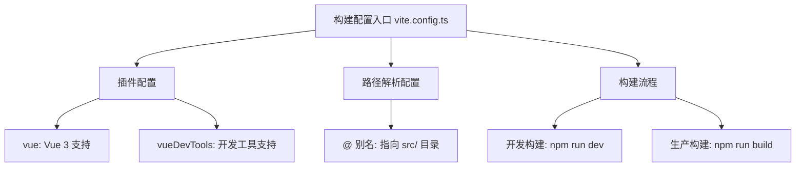
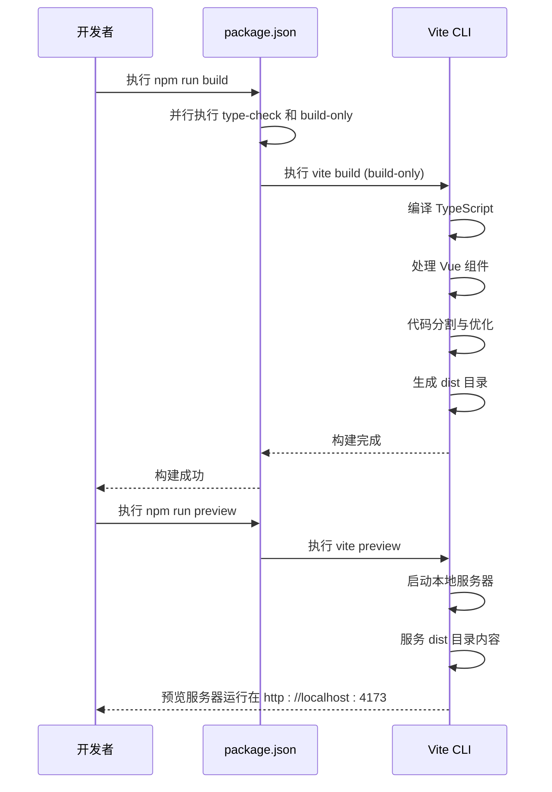

# 构建与部署

<cite>
**Referenced Files in This Document**   
- [vite.config.ts](file://vite.config.ts)
- [package.json](file://package.json)
- [README.md](file://README.md)
- [tsconfig.app.json](file://tsconfig.app.json)
- [tsconfig.node.json](file://tsconfig.node.json)
</cite>

## 目录
1. [项目构建配置](#项目构建配置)
2. [构建与预览脚本](#构建与预览脚本)
3. [环境配置与变量处理](#环境配置与变量处理)
4. [静态资源与部署策略](#静态资源与部署策略)
5. [构建错误与性能优化](#构建错误与性能优化)

## 项目构建配置

当前项目的构建配置基于 Vite 构建工具，通过 `vite.config.ts` 文件进行核心配置。配置中包含了项目插件和路径别名设置，为开发和生产构建提供了基础支持。

在 `vite.config.ts` 中，配置了 Vue 3 的官方插件 `@vitejs/plugin-vue` 和 Vue DevTools 插件，确保了 Vue 组件的正确解析和开发调试支持。同时，通过 `resolve.alias` 配置了 `@` 路径别名，指向 `src` 目录，简化了模块导入路径。

**Diagram sources**
- [vite.config.ts](file://vite.config.ts#L1-L17)

**Section sources**
- [vite.config.ts](file://vite.config.ts#L1-L17)

## 构建与预览脚本

`package.json` 文件中的 `scripts` 字段定义了项目的核心构建和预览命令，形成了完整的开发到生产的工作流。

`build` 脚本执行 `run-p type-check "build-only {@}" --` 命令，这是一个并行执行的复合命令，首先运行 `type-check` 进行 TypeScript 类型检查，然后执行 `build-only` 进行实际的构建。这种设计确保了在构建生产版本之前，代码的类型安全性得到验证。`build-only` 脚本直接调用 `vite build` 命令，触发 Vite 的生产构建流程。

`preview` 脚本执行 `vite preview` 命令，用于在本地启动一个静态服务器来预览生产构建后的应用。这对于在部署前验证构建产物的正确性至关重要，可以模拟生产环境的行为，检查资源路径、路由和功能是否正常。

**Diagram sources**
- [package.json](file://package.json#L10-L15)

**Section sources**
- [package.json](file://package.json#L10-L24)
- [README.md](file://README.md#L40-L42)

## 环境配置与变量处理

项目通过 TypeScript 配置文件和 Vite 的内置机制来管理不同环境的配置。`tsconfig.json` 作为根配置文件，引用了两个特定的配置文件：`tsconfig.node.json` 和 `tsconfig.app.json`。这种分层配置方式将构建工具的配置与应用代码的配置分离。

`tsconfig.app.json` 专门用于配置应用代码的编译，它扩展了 `@vue/tsconfig` 提供的 DOM 环境配置，并通过 `compilerOptions.paths` 设置了 `@/*` 到 `./src/*` 的路径映射，这与 `vite.config.ts` 中的别名配置保持一致，确保了开发和构建时路径解析的一致性。

`tsconfig.node.json` 用于配置运行在 Node.js 环境下的脚本，如 `vite.config.*` 和 `eslint.config.*` 等。它设置了 `moduleResolution` 为 `Bundler`，这与现代打包工具的行为相匹配。

环境变量的处理遵循 Vite 的标准实践。虽然 `vite.config.ts` 中未显式配置环境变量，但 Vite 会自动加载 `.env` 文件。根据项目结构搜索结果，未发现 `.env` 文件，这表明环境变量可能通过 CI/CD 系统或运行时环境直接注入。

**Section sources**
- [tsconfig.app.json](file://tsconfig.app.json#L1-L12)
- [tsconfig.node.json](file://tsconfig.node.json#L1-L19)
- [tsconfig.json](file://tsconfig.json#L1-L10)

## 静态资源与部署策略

根据现有代码分析，项目的静态资源部署策略主要依赖于 Vite 的默认行为和标准的 Web 服务器配置。`index.html` 文件位于项目根目录，是应用的入口点，其中通过 `` 引用了源代码。

在生产构建后，Vite 会将所有资源（包括 JavaScript、CSS、图片等）输出到 `dist` 目录。虽然 `vite.config.ts` 中未显式指定 `build.outDir`，但 Vite 默认使用 `dist` 作为输出目录。`README.md` 中的构建命令 `npm run build` 也印证了这一点。

关于 CDN 集成和缓存策略，当前代码库中没有直接的配置。通常，这类配置会在生产构建后由部署脚本或云服务（如 AWS S3 + CloudFront, Nginx 等）处理。开发者需要在部署阶段配置 CDN，将 `dist` 目录的内容上传至 CDN，并设置适当的缓存头（如对静态资源设置较长的 `Cache-Control`）。

版本控制通常通过文件名哈希实现。Vite 在生产构建时会自动为生成的 JavaScript 和 CSS 文件名添加内容哈希（例如 `main.abc123.js`），这确保了当文件内容改变时，浏览器会下载新版本，从而实现有效的缓存失效。

**Section sources**
- [index.html](file://index.html#L1-L12)
- [README.md](file://README.md#L40-L42)

## 构建错误与性能优化

### 常见构建错误解决方案

1.  **内存溢出 (Out of Memory)**: Vite 基于 ESBuild 和 Rollup，处理大型项目时可能遇到内存不足问题。解决方案是增加 Node.js 的内存限制，例如在运行构建命令前设置环境变量 `NODE_OPTIONS=--max-old-space-size=8192`，将内存上限提升至 8GB。

2.  **依赖冲突**: 项目依赖项在 `package.json` 中明确定义。若出现冲突，应使用 `npm ls <package-name>` 检查依赖树，并通过 `npm dedupe` 或手动调整 `package.json` 来解决。确保 `@types/node` 的版本与 `engines.node` 字段指定的 Node.js 版本兼容。

### 性能优化建议

1.  **Gzip 压缩**: 虽然 Vite 构建本身不直接生成 Gzip 文件，但应在部署服务器（如 Nginx）上启用 Gzip 压缩。服务器会在响应时动态压缩 `.js`, `.css`, `.html` 等文本资源，显著减少传输体积。

2.  **预加载 (Preload)**: Vite 支持智能的代码分割和预加载提示。通过在路由配置中使用动态导入（`import('./views/Home.vue')`），Vite 会自动生成 `<link rel="modulepreload">` 标签，提前加载关键模块，提升页面加载速度。

3.  **代码分割**: Vite 默认根据动态导入进行代码分割。建议在路由级别和大型组件上使用动态导入，避免生成过大的单一 bundle。

4.  **依赖预构建**: Vite 在开发启动时会自动预构建依赖项，这已由 `vite.config.ts` 中的默认配置处理，无需额外操作。

**Section sources**
- [package.json](file://package.json#L10-L24)
- [vite.config.ts](file://vite.config.ts#L1-L17)