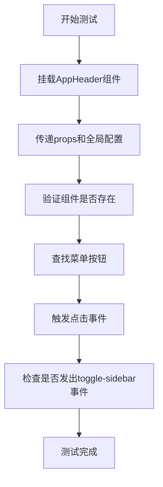
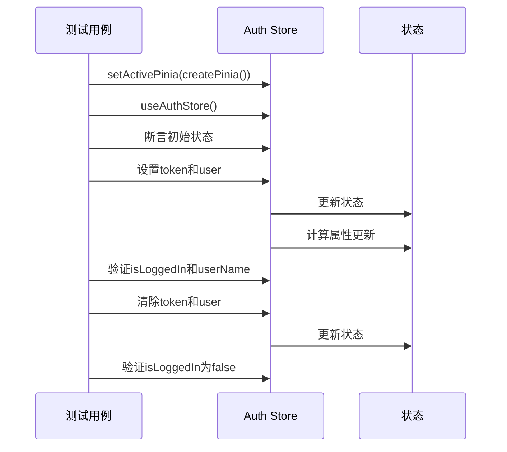

# 测试策略

<cite>
**Referenced Files in This Document**   
- [vitest.config.ts](file://vitest.config.ts)
- [tests/components/AppHeader.test.ts](file://tests/components/AppHeader.test.ts)
- [tests/unit/stores/auth.test.ts](file://tests/unit/stores/auth.test.ts)
- [tests/setup.ts](file://tests/setup.ts)
- [src/layouts/AppHeader.vue](file://src/layouts/AppHeader.vue)
- [src/stores/auth.ts](file://src/stores/auth.ts)
- [package.json](file://package.json)
</cite>

## 目录
1. [测试环境配置](#测试环境配置)
2. [组件测试分析](#组件测试分析)
3. [Pinia Store单元测试](#pinia-store单元测试)
4. [测试工具链与最佳实践](#测试工具链与最佳实践)

## 测试环境配置

项目采用Vitest作为主要测试框架，其配置文件`vitest.config.ts`定义了测试运行的核心环境。测试环境设置为`jsdom`，模拟浏览器环境，使组件能够在无头浏览器环境中正确渲染和交互。通过`globals: true`配置，Vitest的全局API（如`describe`、`it`、`expect`）无需显式导入即可在测试文件中使用，简化了测试代码的编写。

测试的初始化文件通过`setupFiles`选项指定为`./tests/setup.ts`，该文件负责全局测试配置，包括对Vue Router和Element Plus组件的模拟。项目通过`@`别名将`src`目录映射为根路径，确保测试文件能够正确解析模块路径。

**Section sources**
- [vitest.config.ts](file://vitest.config.ts#L1-L17)
- [tests/setup.ts](file://tests/setup.ts#L1-L33)

## 组件测试分析

`AppHeader.test.ts`文件展示了Vue组件的完整测试策略。测试使用`@vue/test-utils`提供的`mount`函数对`AppHeader`组件进行挂载，通过`createPinia()`为组件提供Pinia store支持，确保组件在有状态管理的环境下进行测试。

测试用例首先验证组件的正确渲染。通过传递`user`和`collapsed`等props，模拟不同状态下的组件表现，并使用`expect(wrapper.exists()).toBe(true)`和`expect(wrapper.find('.app-header').exists()).toBe(true)`断言组件及其关键元素的存在性。

其次，测试验证了组件的事件触发机制。通过`find`方法定位菜单切换按钮，使用`trigger('click')`模拟用户点击事件，并通过检查`wrapper.emitted('toggle-sidebar')`是否为真来确认组件正确触发了`toggle-sidebar`自定义事件。测试中对Element Plus的UI组件（如`el-button`、`el-icon`等）进行了存根（stubs），避免了对第三方组件实现细节的依赖，使测试更加专注和稳定。

**Diagram sources**
- [tests/components/AppHeader.test.ts](file://tests/components/AppHeader.test.ts#L1-L70)
- [src/layouts/AppHeader.vue](file://src/layouts/AppHeader.vue#L1-L452)

**Section sources**
- [tests/components/AppHeader.test.ts](file://tests/components/AppHeader.test.ts#L1-L70)
- [src/layouts/AppHeader.vue](file://src/layouts/AppHeader.vue#L1-L452)

## Pinia Store单元测试

`auth.test.ts`文件展示了对Pinia store的单元测试方法。测试使用`setActivePinia(createPinia())`在每个测试用例前创建并激活一个新的Pinia实例，确保测试之间的状态隔离，避免了状态污染。

测试用例覆盖了store的初始状态、状态变更和业务逻辑。首先，通过`useAuthStore()`获取store实例，断言其初始状态（如`token`为`null`，`isLoggedIn`为`false`）符合预期。接着，测试模拟了用户登录流程，通过直接修改`store.token`和`store.user`来触发`isLoggedIn`和`userName`等计算属性的更新，并验证其结果的正确性。最后，测试验证了登出逻辑，通过将`token`和`user`置为`null`来模拟登出，并检查`isLoggedIn`等状态的变更。

这种直接操作store状态的方式，使得测试能够专注于store内部逻辑的验证，而无需依赖复杂的API调用或网络请求。

**Diagram sources**
- [tests/unit/stores/auth.test.ts](file://tests/unit/stores/auth.test.ts#L1-L58)
- [src/stores/auth.ts](file://src/stores/auth.ts#L1-L263)

**Section sources**
- [tests/unit/stores/auth.test.ts](file://tests/unit/stores/auth.test.ts#L1-L58)
- [src/stores/auth.ts](file://src/stores/auth.ts#L1-L263)

## 测试工具链与最佳实践

项目构建了一个现代化的前端测试工具链。核心工具包括：
- **Vitest**: 作为测试运行器，提供快速的测试执行和丰富的功能，如测试覆盖率报告（`test:coverage`脚本）和UI测试界面（`test:ui`脚本）。
- **@vue/test-utils**: Vue官方的测试工具库，用于挂载和交互Vue组件。
- **jsdom**: 在Node.js环境中模拟DOM和浏览器API，为组件测试提供运行环境。

`package.json`中的脚本定义了清晰的测试工作流：
- `test`: 运行所有测试用例。
- `test:ui`: 启动Vitest的Web UI界面，便于交互式开发和调试测试。
- `test:run`: 以非监视模式运行测试，适用于CI/CD流水线。
- `test:coverage`: 运行测试并生成代码覆盖率报告，帮助评估测试的完整性。

最佳实践包括：
1. **全局配置**: 在`setup.ts`中集中配置全局模拟（如`$router`、`$t`）和第三方库（如Element Plus），减少重复代码。
2. **状态隔离**: 对于Pinia store测试，使用`setActivePinia`确保每个测试用例拥有独立的store实例。
3. **组件存根**: 对复杂的第三方UI组件进行存根，聚焦于被测组件自身的逻辑。
4. **持续集成**: 将`test:run`和`test:coverage`集成到CI/CD流程中，确保代码质量。

**Section sources**
- [package.json](file://package.json#L1-L55)
- [tests/setup.ts](file://tests/setup.ts#L1-L33)
- [vitest.config.ts](file://vitest.config.ts#L1-L17)