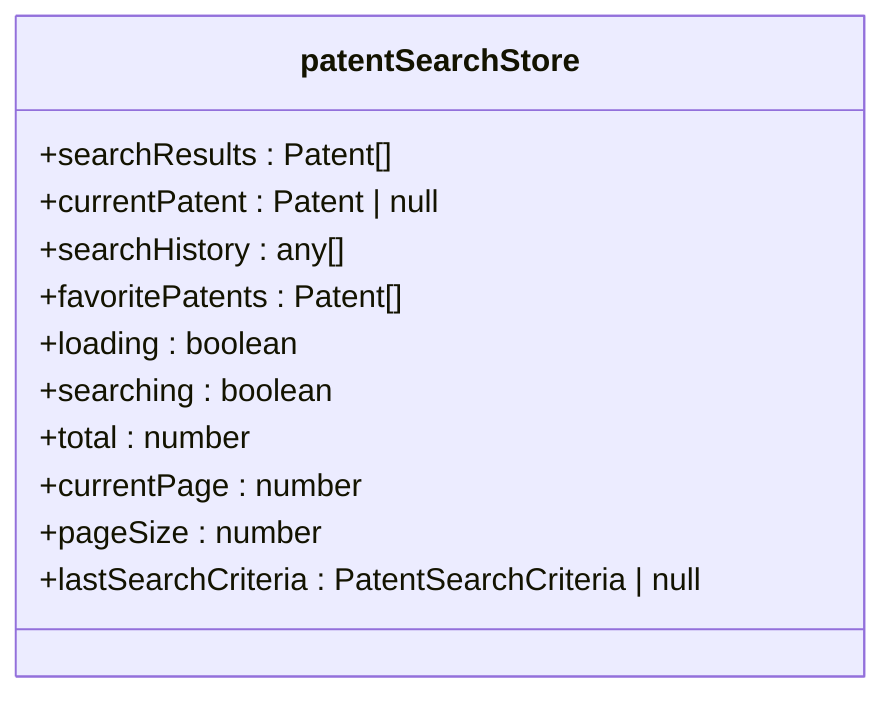
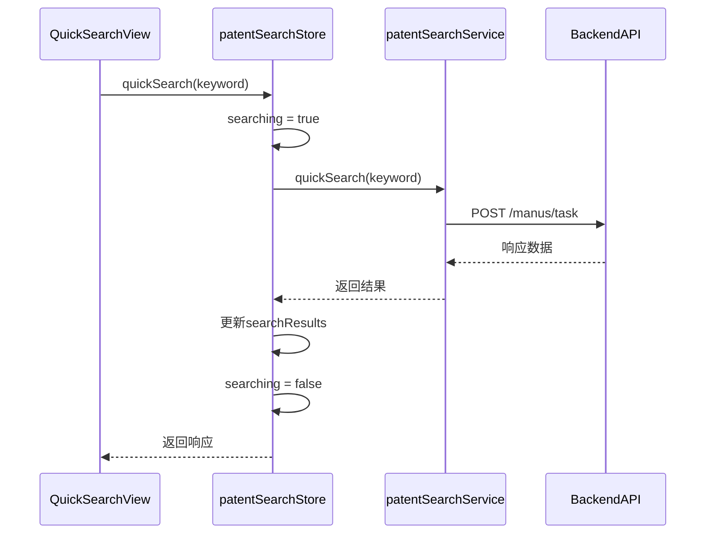
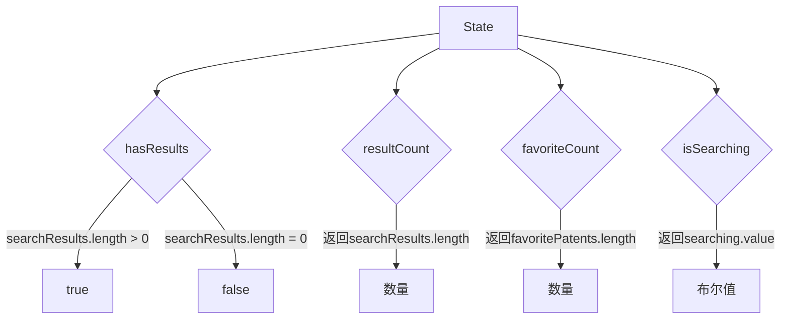
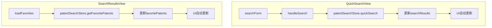

# 专利检索状态管理

<cite>
**Referenced Files in This Document**   
- [patentSearch.ts](file://src/stores/patentSearch.ts)
- [patentSearch.ts](file://src/services/patentSearch.ts)
- [QuickSearchView.vue](file://src/views/patent-search/QuickSearchView.vue)
- [SearchResultsView.vue](file://src/views/patent-search/SearchResultsView.vue)
</cite>

## 目录
1. [引言](#引言)
2. [核心状态模型](#核心状态模型)
3. [业务逻辑实现](#业务逻辑实现)
4. [计算属性与过滤逻辑](#计算属性与过滤逻辑)
5. [UI组件中的状态使用](#ui组件中的状态使用)
6. [高级功能与优化策略](#高级功能与优化策略)
7. [结论](#结论)

## 引言
`patentSearchStore` 是专利检索功能的核心状态管理模块，采用 Pinia 实现全局状态管理。该模块封装了专利检索的所有状态和业务逻辑，为 QuickSearchView 和 SearchResultsView 等视图组件提供统一的状态访问接口。通过 `usePatentSearchStore` 组合式函数，各组件可以方便地访问和操作检索状态，实现响应式更新。

**Section sources**
- [patentSearch.ts](file://src/stores/patentSearch.ts#L5-L276)

## 核心状态模型

`patentSearchStore` 的状态模型设计全面，涵盖了专利检索功能所需的所有数据类型。状态主要分为检索结果、用户偏好、加载状态和分页信息四大类。

**Diagram sources**
- [patentSearch.ts](file://src/stores/patentSearch.ts#L7-L25)

**Section sources**
- [patentSearch.ts](file://src/stores/patentSearch.ts#L7-L25)

### 检索条件与结果
状态中存储的检索条件主要通过 `lastSearchCriteria` 字段保存，该字段记录了最近一次检索的完整条件，包括关键词、筛选器等。搜索结果集由 `searchResults` 数组存储，包含当前页的专利数据。分页信息通过 `total`、`currentPage` 和 `pageSize` 三个字段管理，支持分页浏览。

### 加载状态管理
加载状态通过 `loading` 和 `searching` 两个布尔值字段进行精细化管理。`loading` 表示通用的数据加载状态（如获取专利详情），而 `searching` 专门表示检索操作的进行状态，用于在 UI 中显示"检索中..."的提示。

## 业务逻辑实现

`patentSearchStore` 的 actions 封装了专利检索的核心业务逻辑，通过调用 `patentSearchService` 服务层实现与后端 API 的交互。

**Diagram sources**
- [patentSearch.ts](file://src/stores/patentSearch.ts#L29-L72)
- [patentSearch.ts](file://src/services/patentSearch.ts#L50-L80)

**Section sources**
- [patentSearch.ts](file://src/stores/patentSearch.ts#L29-L276)

### 检索操作
`quickSearch` 和 `advancedSearch` 方法分别处理快速检索和高级检索。执行时，首先设置 `searching` 状态为 `true`，然后调用服务层方法。根据分页参数决定是替换还是追加搜索结果，最后更新分页信息并保存检索条件。

### 收藏管理
`favoritePatent` 和 `unfavoritePatent` 方法实现收藏功能。除了调用服务层 API 外，还会同步更新本地的 `favoritePatents` 状态数组，确保 UI 能立即响应状态变化。

### 历史记录管理
`getSearchHistory` 方法获取用户的检索历史，并将其存储在 `searchResults` 中，实现了历史记录的展示功能。

## 计算属性与过滤逻辑

`patentSearchStore` 提供了多个计算属性，用于对状态数据进行过滤和计算，避免在组件中重复实现相同的逻辑。

**Diagram sources**
- [patentSearch.ts](file://src/stores/patentSearch.ts#L27-L31)

**Section sources**
- [patentSearch.ts](file://src/stores/patentSearch.ts#L27-L31)

### 核心计算属性
- `hasResults`: 判断是否有搜索结果，用于条件渲染
- `resultCount`: 返回当前结果数量
- `favoriteCount`: 返回收藏专利的数量
- `isSearching`: 返回当前是否正在检索

### 收藏状态判断
`isFavorite` 方法检查指定专利是否已被收藏，通过在 `favoritePatents` 数组中查找实现。

## UI组件中的状态使用

在 `QuickSearchView` 和 `SearchResultsView` 中，通过 `usePatentSearchStore` 使用全局状态，实现响应式更新。

**Diagram sources**
- [QuickSearchView.vue](file://src/views/patent-search/QuickSearchView.vue#L176)
- [SearchResultsView.vue](file://src/views/patent-search/SearchResultsView.vue#L235)

**Section sources**
- [QuickSearchView.vue](file://src/views/patent-search/QuickSearchView.vue#L176)
- [SearchResultsView.vue](file://src/views/patent-search/SearchResultsView.vue#L235)

### QuickSearchView 中的使用
在 `QuickSearchView.vue` 中，通过 `const patentSearchStore = usePatentSearchStore()` 获取 store 实例。组件使用 `searching` 状态控制按钮的加载状态，使用 `searchResults` 和 `total` 显示检索结果和总数。

### SearchResultsView 中的使用
在 `SearchResultsView.vue` 中，同样通过 `usePatentSearchStore` 获取 store 实例。组件使用 `favoritePatents` 显示收藏列表，并通过 `getFavoritePatents` 方法加载数据。

## 高级功能与优化策略

`patentSearchStore` 实现了多项高级功能和优化策略，提升用户体验和系统性能。

### 搜索状态缓存
通过 `lastSearchCriteria` 字段缓存最近的搜索条件，支持搜索条件的恢复和重复使用。

### 输入防抖处理
虽然在 store 中未直接实现防抖，但通过 `searching` 状态的管理，配合组件中的防抖逻辑，可以有效防止频繁的搜索请求。

### 高级检索联动
`advancedSearch` 方法支持完整的检索条件对象，与高级检索表单实现无缝联动，确保复杂的筛选条件能够正确传递和处理。

### 状态重置机制
提供 `resetStore` 方法，用于完全重置所有状态，适用于用户登出或需要清除所有检索状态的场景。

**Section sources**
- [patentSearch.ts](file://src/stores/patentSearch.ts#L250-L258)

## 结论
`patentSearchStore` 作为专利检索功能的核心状态管理模块，通过 Pinia 实现了高效、可维护的状态管理。其设计充分考虑了实际使用场景，提供了完整的状态模型、业务逻辑和计算属性。通过与服务层的清晰分离和在 UI 组件中的便捷使用，该模块有效支撑了专利检索功能的稳定运行，为用户提供流畅的检索体验。