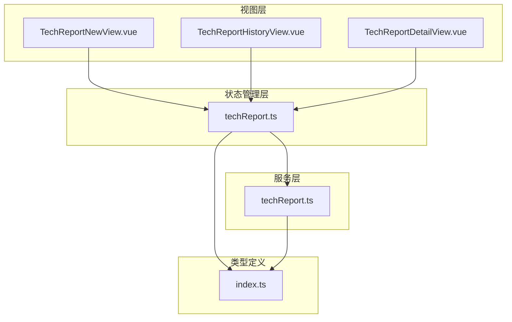
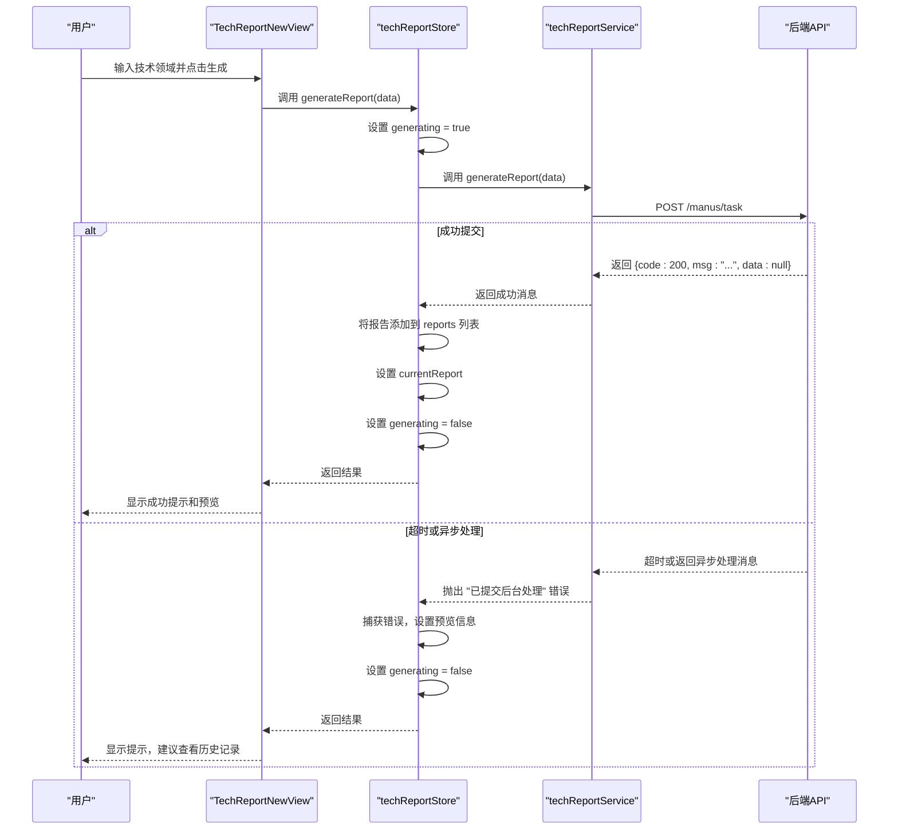
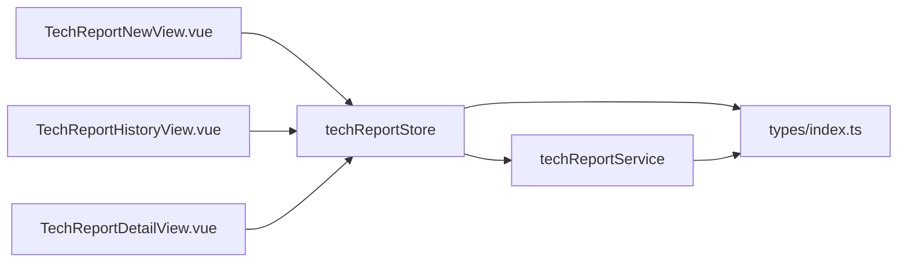

# 技术报告状态管理

<cite>
**Referenced Files in This Document**   
- [techReport.ts](file://src/stores/techReport.ts)
- [techReport.ts](file://src/services/techReport.ts)
- [index.ts](file://src/types/index.ts)
- [TechReportNewView.vue](file://src/views/tech-report/TechReportNewView.vue)
- [TechReportHistoryView.vue](file://src/views/tech-report/TechReportHistoryView.vue)
</cite>

## 目录
1. [简介](#简介)
2. [项目结构](#项目结构)
3. [核心组件](#核心组件)
4. [架构概述](#架构概述)
5. [详细组件分析](#详细组件分析)
6. [依赖分析](#依赖分析)
7. [性能考虑](#性能考虑)
8. [故障排除指南](#故障排除指南)
9. [结论](#结论)

## 简介
本技术文档全面阐述了专利服务网站中技术报告状态管理的架构与行为。文档聚焦于 `techReportStore` 的设计与实现，深入分析了技术报告数据结构、异步操作流程、状态转换机制以及在视图层的集成实践。通过系统化的分析，本文档旨在为开发者提供一个清晰、完整的参考，以理解并维护技术报告功能模块。

## 项目结构
技术报告功能模块遵循清晰的分层架构，主要由视图层、状态管理层和服务层构成。视图组件负责用户界面展示与交互，状态管理模块集中处理业务逻辑与状态，服务层则封装了与后端API的通信细节。



**Diagram sources**
- [TechReportNewView.vue](file://src/views/tech-report/TechReportNewView.vue)
- [TechReportHistoryView.vue](file://src/views/tech-report/TechReportHistoryView.vue)
- [techReport.ts](file://src/stores/techReport.ts)
- [techReport.ts](file://src/services/techReport.ts)
- [index.ts](file://src/types/index.ts)

**Section sources**
- [src/views/tech-report](file://src/views/tech-report)
- [src/stores](file://src/stores)
- [src/services](file://src/services)
- [src/types](file://src/types)

## 核心组件
技术报告状态管理的核心是 `useTechReportStore`，它是一个基于 Pinia 的状态管理模块。该模块统一管理技术报告的整个生命周期，包括新建、生成、查询、删除和导出等操作。其核心职责是作为视图层与服务层之间的桥梁，处理异步逻辑、管理本地状态，并提供计算属性以优化数据访问。

**Section sources**
- [techReport.ts](file://src/stores/techReport.ts)

## 架构概述
技术报告功能的架构采用典型的分层模式，确保了关注点分离和代码的可维护性。用户在视图层发起操作，状态管理模块接收并处理这些操作，调用服务层与后端进行通信，并将结果更新到自身的状态中。视图层通过响应式绑定自动更新UI，形成一个闭环。



**Diagram sources**
- [TechReportNewView.vue](file://src/views/tech-report/TechReportNewView.vue#L200-L250)
- [techReport.ts](file://src/stores/techReport.ts#L50-L80)
- [techReport.ts](file://src/services/techReport.ts#L101-L130)

## 详细组件分析

### 状态管理分析
`techReportStore` 的状态管理模块是整个功能的核心，它通过定义清晰的 state、actions 和 getters 来组织业务逻辑。

#### State 数据结构
state 定义了技术报告功能所需的所有本地状态，包括报告列表、当前报告、加载状态和分页信息。

```mermaid
classDiagram
class TechReportStore {
+reports : TechReport[]
+currentReport : TechReport | null
+loading : boolean
+generating : boolean
+total : number
+currentPage : number
+pageSize : number
}
class TechReport {
+id : string
+title : string
+inputType : 'text' | 'file'
+inputContent : string
+technicalField : string
+createTime : string
+status : ReportStatus
+userId : string
+reportContent : TechReportContent
}
class TechReportContent {
+summary : string
+backgroundTechnology : string
+technicalProblem : string
+technicalSolution : string
+beneficialEffects : string
+implementationMethods : string[]
}
enum ReportStatus {
GENERATING
COMPLETED
FAILED
}
TechReportStore --> TechReport : "包含"
TechReport --> TechReportContent : "包含"
TechReport --> ReportStatus : "引用"
```

**Diagram sources**
- [techReport.ts](file://src/stores/techReport.ts#L10-L20)
- [index.ts](file://src/types/index.ts#L34-L60)

#### Actions 异步流程分析
actions 方法封装了所有与后端交互的异步操作。`generateReport` 是核心方法，它处理报告生成的整个流程，包括状态管理、服务调用和错误处理。

```mermaid
flowchart TD
Start([generateReport(data)]) --> SetGenerating["设置 generating = true"]
SetGenerating --> CallService["调用 techReportService.generateReport(data)"]
CallService --> CheckResult{"调用成功?"}
CheckResult --> |是| AddToStore["将新报告添加到 reports 列表<br/>设置 currentReport"]
CheckResult --> |否| HandleError["捕获并处理错误"]
HandleError --> CheckTimeout{"错误是超时吗?"}
CheckTimeout --> |是| SetPreview["设置预览信息，提示用户查看历史记录"]
CheckTimeout --> |否| LogError["记录错误日志"]
LogError --> ShowError["向用户显示错误信息"]
SetPreview --> ResetGenerating["设置 generating = false"]
AddToStore --> ResetGenerating
ResetGenerating --> End([返回结果])
```

**Diagram sources**
- [techReport.ts](file://src/stores/techReport.ts#L50-L80)
- [techReport.ts](file://src/services/techReport.ts#L101-L130)

#### Getters 查询优化
getters 提供了对 state 中数据的派生访问，通过计算属性实现了查询的优化。例如，`completedReports` getter 会自动过滤出所有状态为“已完成”的报告，避免了在视图层重复编写过滤逻辑。

**Section sources**
- [techReport.ts](file://src/stores/techReport.ts#L25-L35)

### 视图层集成分析
`techReportStore` 在 `TechReportNewView` 和 `TechReportHistoryView` 中被集成使用，实现了表单数据绑定和列表渲染。

#### 新建视图集成
在 `TechReportNewView.vue` 中，`techReportStore` 被用于管理生成报告的流程。表单数据 `formData` 与 store 的状态分离，但在提交时，store 的 `generateReport` action 被调用，其返回结果用于更新视图上的预览区域。

**Section sources**
- [TechReportNewView.vue](file://src/views/tech-report/TechReportNewView.vue#L190-L250)

#### 历史记录视图集成
在 `TechReportHistoryView.vue` 中，`techReportStore` 的 `reportList` getter 被直接用于渲染报告列表。`getReportList` action 在组件挂载时被调用以加载数据，`deleteReport` action 用于处理删除操作，实现了列表的实时更新。

**Section sources**
- [TechReportHistoryView.vue](file://src/views/tech-report/TechReportHistoryView.vue#L150-L200)

## 依赖分析
`techReportStore` 模块具有清晰的依赖关系，体现了良好的模块化设计。



**Diagram sources**
- [TechReportNewView.vue](file://src/views/tech-report/TechReportNewView.vue#L91)
- [TechReportHistoryView.vue](file://src/views/tech-report/TechReportHistoryView.vue#L153)
- [techReport.ts](file://src/stores/techReport.ts#L1-L5)
- [techReport.ts](file://src/services/techReport.ts#L1-L5)

## 性能考虑
该状态管理方案在性能方面表现良好。通过使用 Pinia 的响应式系统，视图层能够高效地监听状态变化。`getters` 的使用避免了重复计算，`getReportList` 方法支持分页加载，有效防止了大量数据一次性加载导致的性能问题。此外，`exportReport` 方法优先使用后端提供的直接下载链接，避免了不必要的 Blob 创建和内存占用。

## 故障排除指南
在使用技术报告功能时，可能会遇到以下常见问题：

*   **报告生成超时**：由于报告生成是耗时操作，API 调用可能会超时。此时，store 会捕获特定的超时错误，并向用户提示“报告已提交后台处理，请稍后在历史记录中查看结果”。这是一种正常行为，而非系统故障。
*   **文件下载失败**：`exportReport` 方法实现了优雅降级。如果通过 Blob 下载失败，它会尝试在新窗口打开文件链接。如果报告的 `pdfUrl` 或 `wordUrl` 为空，则说明该格式的文件尚未生成或不存在。
*   **登录过期**：服务层在捕获到“登录已过期”错误时，会直接抛出，由上层路由或全局错误处理机制处理，不会在 store 内部显示错误信息，保证了用户体验的连贯性。

**Section sources**
- [techReport.ts](file://src/stores/techReport.ts#L60-L80)
- [techReport.ts](file://src/services/techReport.ts#L110-L120)
- [techReport.ts](file://src/services/techReport.ts#L250-L270)

## 结论
`techReportStore` 是一个设计良好、职责清晰的状态管理模块。它有效地协调了视图层与服务层之间的交互，管理了技术报告从创建到归档的完整生命周期。通过合理的状态定义、异步流程控制和错误处理机制，该模块为用户提供了一个稳定、可靠的技术报告生成功能。其模块化的设计也便于未来的维护和扩展。