# 状态管理

<cite>
**本文档引用的文件**
- [auth.ts](file://src/stores/auth.ts)
- [patentSearch.ts](file://src/stores/patentSearch.ts)
- [techReport.ts](file://src/stores/techReport.ts)
- [auth.ts](file://src/services/auth.ts)
- [patentSearch.ts](file://src/services/patentSearch.ts)
- [techReport.ts](file://src/services/techReport.ts)
- [index.ts](file://src/types/index.ts)
- [index.ts](file://src/utils/index.ts)
- [LoginView.vue](file://src/views/auth/LoginView.vue)
- [SearchResultsView.vue](file://src/views/patent-search/SearchResultsView.vue)
- [TechReportNewView.vue](file://src/views/tech-report/TechReportNewView.vue)
</cite>

## 目录
1. [项目结构](#项目结构)
2. [核心状态管理模块](#核心状态管理模块)
3. [用户认证状态管理](#用户认证状态管理)
4. [专利检索状态管理](#专利检索状态管理)
5. [技术报告状态管理](#技术报告状态管理)
6. [模块化组织与职责划分](#模块化组织与职责划分)
7. [组件中使用Store](#组件中使用store)
8. [状态持久化与错误处理](#状态持久化与错误处理)
9. [测试策略](#测试策略)

## 项目结构

项目采用模块化的状态管理架构，所有Pinia store集中存放在`src/stores`目录下，每个业务模块拥有独立的store文件。这种组织方式实现了关注点分离，便于维护和扩展。

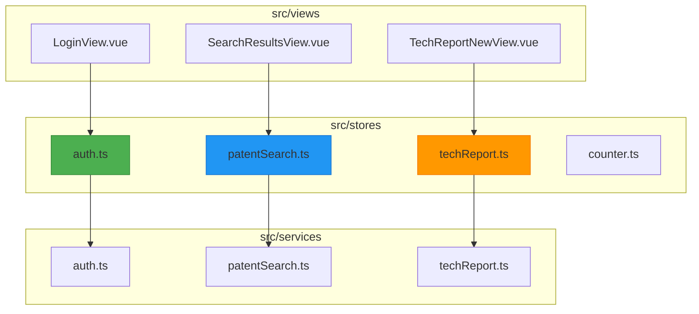

**图示来源**
- [auth.ts](file://src/stores/auth.ts)
- [patentSearch.ts](file://src/stores/patentSearch.ts)
- [techReport.ts](file://src/stores/techReport.ts)

**本节来源**
- [auth.ts](file://src/stores/auth.ts)
- [patentSearch.ts](file://src/stores/patentSearch.ts)
- [techReport.ts](file://src/stores/techReport.ts)

## 核心状态管理模块

项目采用Pinia作为状态管理解决方案，实现了三个核心业务模块的独立状态管理：用户认证、专利检索和技术报告。每个store都遵循Vue 3的Composition API模式，使用`defineStore`函数创建，通过`ref`定义状态，`computed`定义计算属性，以及`async`函数定义异步操作。

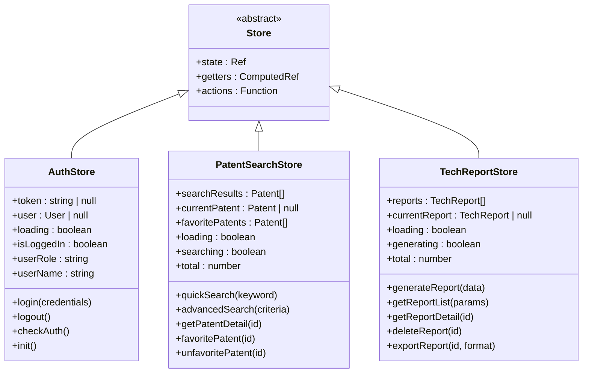

**图示来源**
- [auth.ts](file://src/stores/auth.ts)
- [patentSearch.ts](file://src/stores/patentSearch.ts)
- [techReport.ts](file://src/stores/techReport.ts)

**本节来源**
- [auth.ts](file://src/stores/auth.ts)
- [patentSearch.ts](file://src/stores/patentSearch.ts)
- [techReport.ts](file://src/stores/techReport.ts)

## 用户认证状态管理

用户认证状态管理模块（`auth.ts`）负责处理用户登录、登出、权限验证等核心认证功能。该模块通过`useAuthStore`定义，实现了完整的用户会话管理生命周期。

### 状态与计算属性

认证状态模块维护了三个核心状态：`token`、`user`和`loading`。其中`token`和`user`从本地存储中初始化，确保页面刷新后用户状态的持久化。

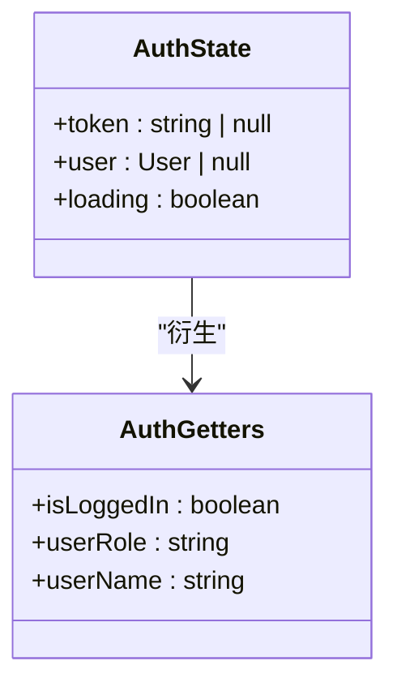

**图示来源**
- [auth.ts](file://src/stores/auth.ts)

### 认证操作流程

登录操作是认证模块的核心功能，通过`login` action实现。该操作不仅处理用户凭证验证，还负责SSE（Server-Sent Events）连接的建立，确保用户能够实时接收系统通知。

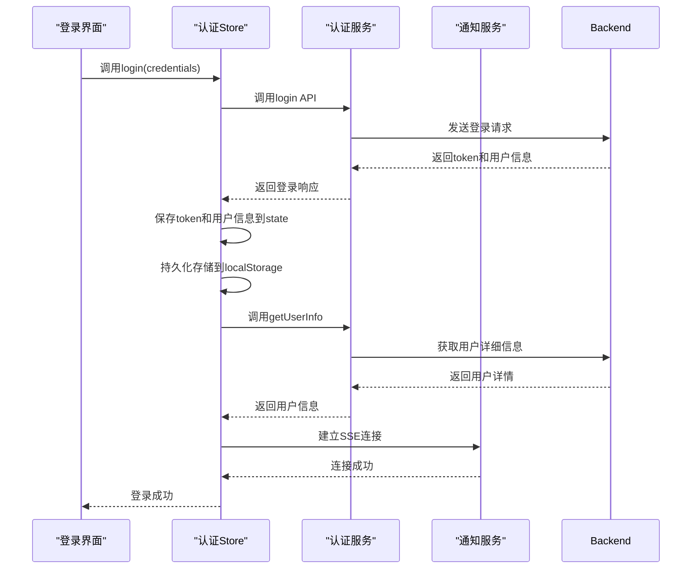

**图示来源**
- [auth.ts](file://src/stores/auth.ts)
- [auth.ts](file://src/services/auth.ts)
- [LoginView.vue](file://src/views/auth/LoginView.vue)

### 登出与会话清理

登出操作不仅清除认证状态，还负责清理相关资源，包括断开SSE连接和清除本地存储的认证信息。

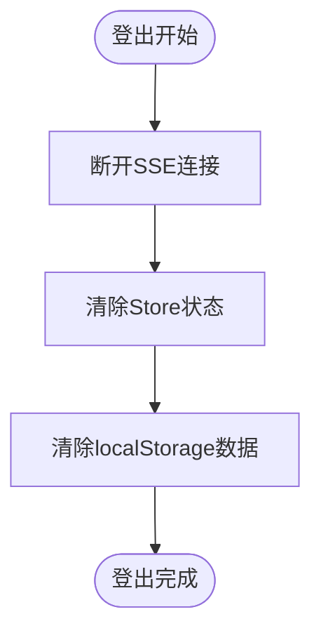

**图示来源**
- [auth.ts](file://src/stores/auth.ts)

**本节来源**
- [auth.ts](file://src/stores/auth.ts)
- [auth.ts](file://src/services/auth.ts)
- [LoginView.vue](file://src/views/auth/LoginView.vue)

## 专利检索状态管理

专利检索状态管理模块（`patentSearch.ts`）封装了专利检索领域的所有状态和逻辑，实现了从快速检索到收藏管理的完整功能链。

### 状态结构

该模块维护了多个状态变量，包括检索结果、当前专利、收藏专利列表、搜索历史等，为专利检索功能提供了全面的状态支持。

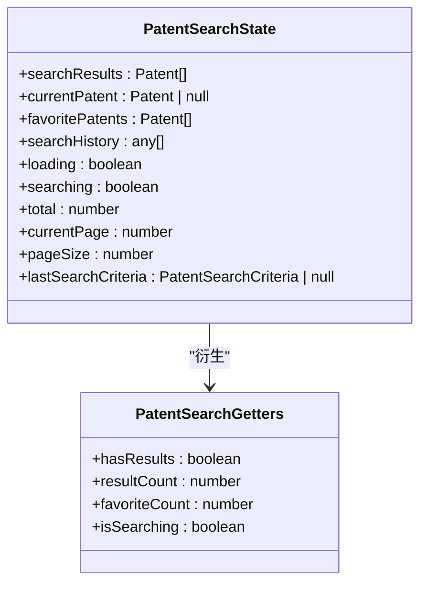

**图示来源**
- [patentSearch.ts](file://src/stores/patentSearch.ts)

### 检索与收藏流程

专利检索和收藏功能通过一系列action实现，形成了完整的用户操作流程。

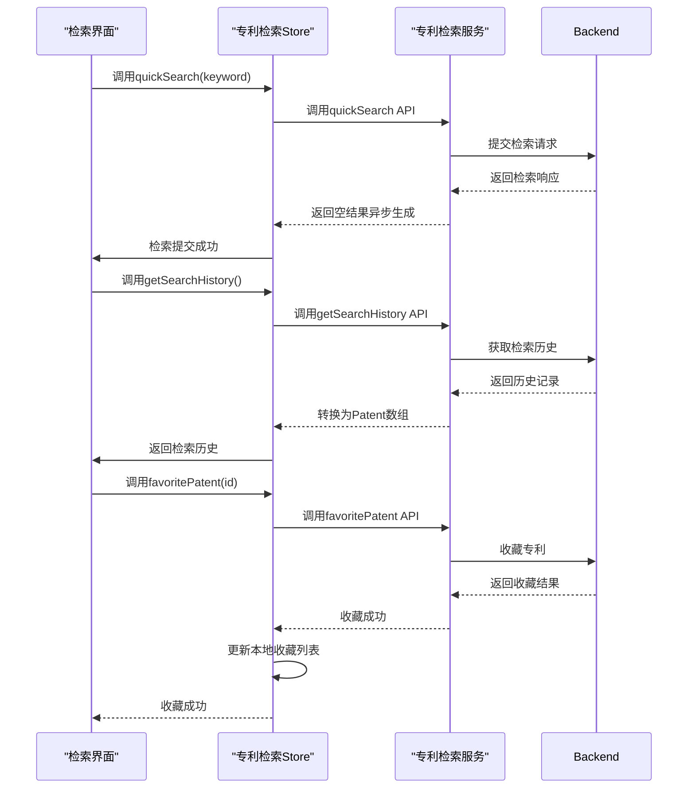

**图示来源**
- [patentSearch.ts](file://src/stores/patentSearch.ts)
- [patentSearch.ts](file://src/services/patentSearch.ts)
- [SearchResultsView.vue](file://src/views/patent-search/SearchResultsView.vue)

**本节来源**
- [patentSearch.ts](file://src/stores/patentSearch.ts)
- [patentSearch.ts](file://src/services/patentSearch.ts)
- [SearchResultsView.vue](file://src/views/patent-search/SearchResultsView.vue)

## 技术报告状态管理

技术报告状态管理模块（`techReport.ts`）负责技术方案报告的生成、管理和导出，为用户提供专业的技术分析服务。

### 状态与功能

该模块维护了报告列表、当前报告、生成状态等核心状态，支持报告的全生命周期管理。

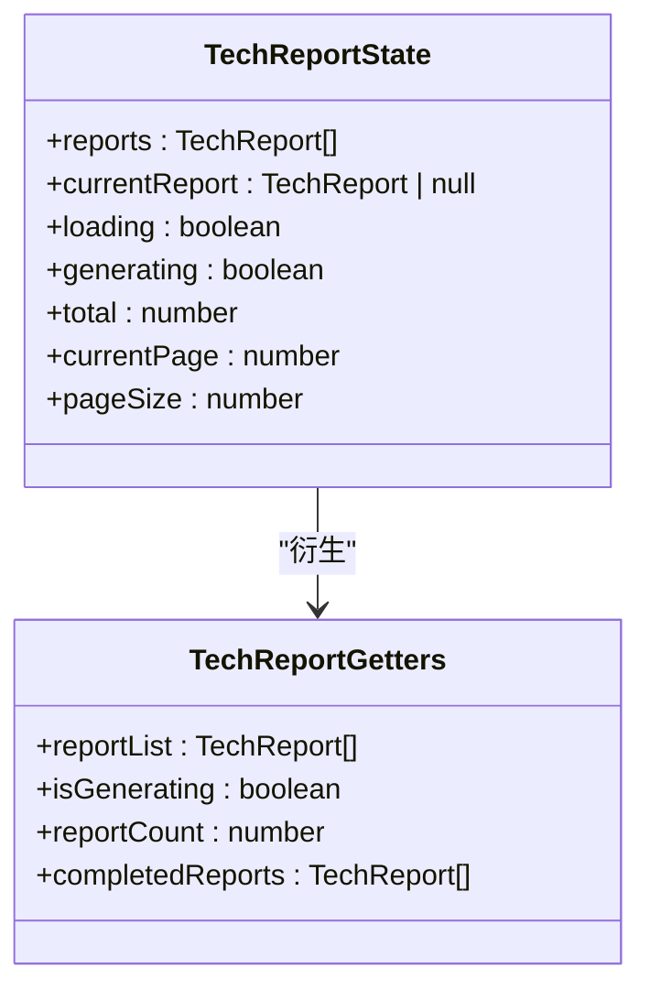

**图示来源**
- [techReport.ts](file://src/stores/techReport.ts)

### 报告生成流程

报告生成是技术报告模块的核心功能，通过`generateReport` action实现，支持异步生成和进度反馈。

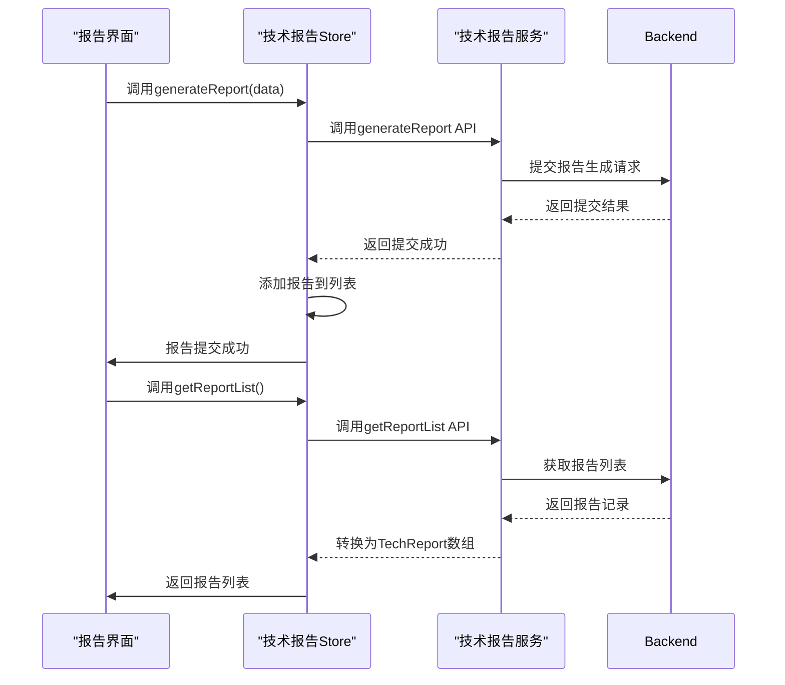

**图示来源**
- [techReport.ts](file://src/stores/techReport.ts)
- [techReport.ts](file://src/services/techReport.ts)
- [TechReportNewView.vue](file://src/views/tech-report/TechReportNewView.vue)

**本节来源**
- [techReport.ts](file://src/stores/techReport.ts)
- [techReport.ts](file://src/services/techReport.ts)
- [TechReportNewView.vue](file://src/views/tech-report/TechReportNewView.vue)

## 模块化组织与职责划分

项目采用模块化的状态管理设计，每个store文件对应一个业务领域，实现了清晰的职责划分。

### State、Getters、Actions职责

Pinia store的三个核心组成部分具有明确的职责划分：

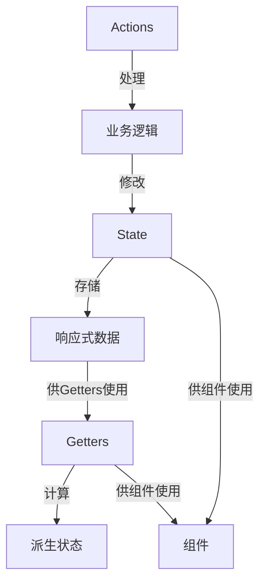

- **State**：存储组件的响应式数据，如`token`、`user`、`searchResults`等
- **Getters**：计算派生状态，如`isLoggedIn`、`hasResults`等，具有缓存特性
- **Actions**：处理业务逻辑，包括同步和异步操作，如`login`、`quickSearch`等

### 类型定义与服务分离

项目通过类型定义和服务分离实现了良好的类型安全和关注点分离。

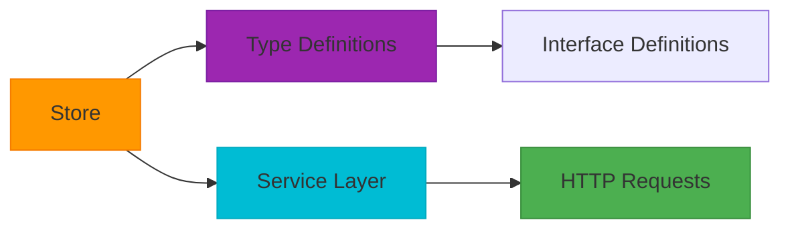

**本节来源**
- [auth.ts](file://src/stores/auth.ts)
- [patentSearch.ts](file://src/stores/patentSearch.ts)
- [techReport.ts](file://src/stores/techReport.ts)
- [index.ts](file://src/types/index.ts)
- [auth.ts](file://src/services/auth.ts)
- [patentSearch.ts](file://src/services/patentSearch.ts)
- [techReport.ts](file://src/services/techReport.ts)

## 组件中使用Store

在Vue组件中使用Pinia store非常简单，通过`setup`语法糖可以方便地访问store实例。

### 使用示例

在组件中导入并使用store的典型模式：

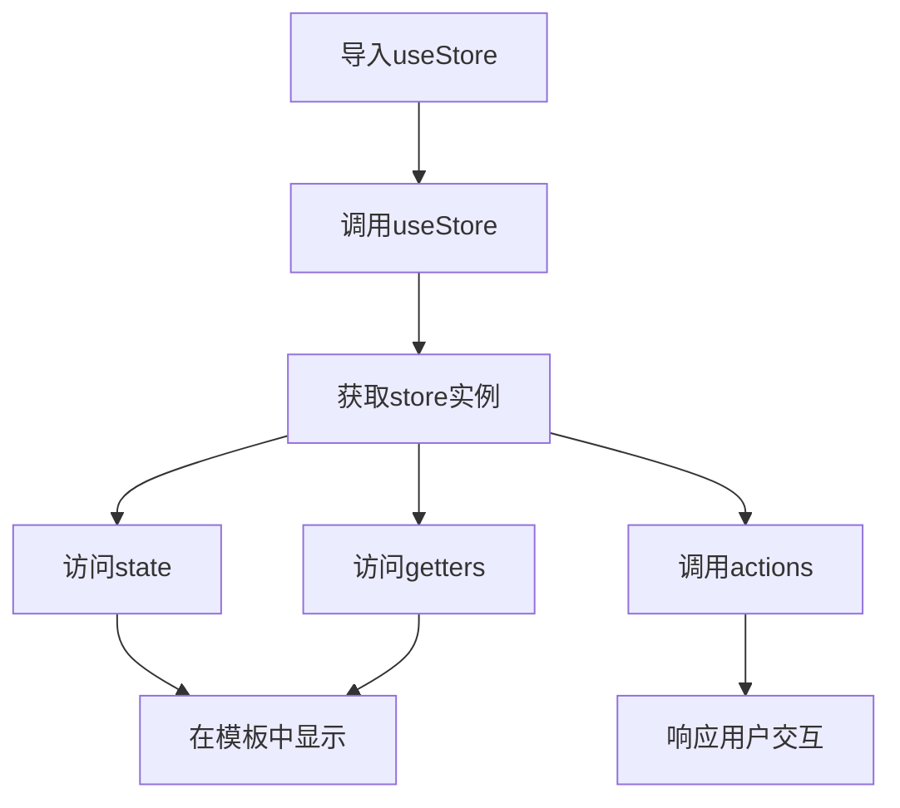

**本节来源**
- [LoginView.vue](file://src/views/auth/LoginView.vue)
- [SearchResultsView.vue](file://src/views/patent-search/SearchResultsView.vue)
- [TechReportNewView.vue](file://src/views/tech-report/TechReportNewView.vue)

## 状态持久化与错误处理

项目实现了完善的状态持久化和错误处理机制，确保用户体验的连续性和系统的健壮性。

### 状态持久化

通过`storage`工具类实现状态的本地持久化，确保页面刷新后用户状态不丢失。

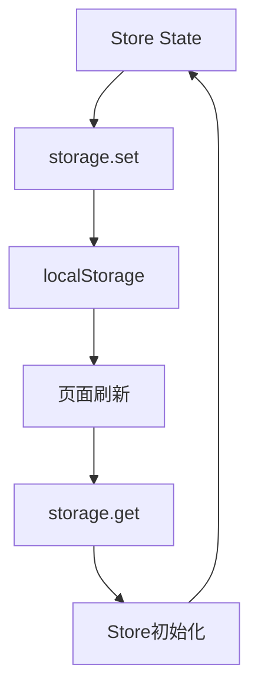

**本节来源**
- [auth.ts](file://src/stores/auth.ts)
- [index.ts](file://src/utils/index.ts)

## 测试策略

项目为关键状态管理模块提供了单元测试，确保核心功能的正确性和稳定性。

### 测试覆盖

测试策略包括：
- Store初始化状态验证
- Actions的异步操作测试
- Getters的计算逻辑验证
- 错误处理路径测试

**本节来源**
- [auth.test.ts](file://tests/unit/stores/auth.test.ts)