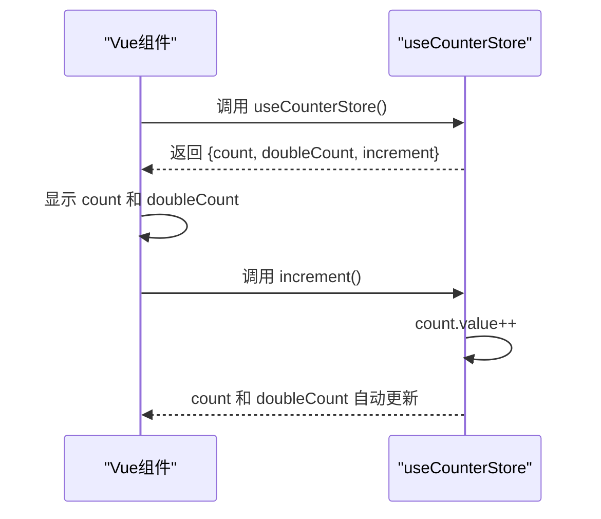
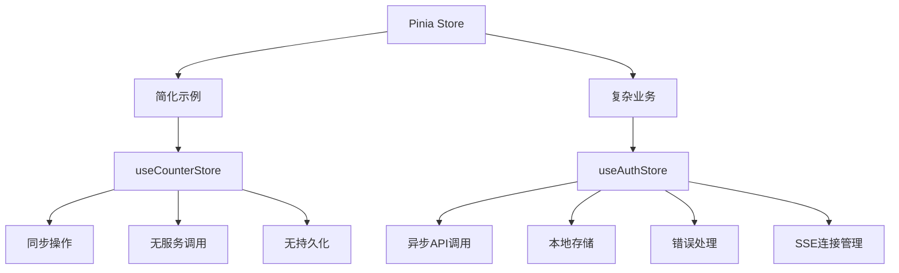

# 计数器状态管理（示例模块）

<cite>
**Referenced Files in This Document**  
- [counter.ts](file://src/stores/counter.ts)
- [main.ts](file://src/main.ts)
- [auth.ts](file://src/stores/auth.ts)
</cite>

## 目录
1. [简介](#简介)
2. [核心状态定义](#核心状态定义)
3. [Store 架构与实现](#store-架构与实现)
4. [在组件中使用 Store](#在组件中使用-store)
5. [开发与测试用途](#开发与测试用途)
6. [与复杂业务 Store 的对比](#与复杂业务-store-的对比)
7. [结论](#结论)

## 简介
`useCounterStore` 是本项目中用于演示 Pinia 状态管理基本用法的简化示例模块。该 store 提供了一个极简的状态管理模式，旨在作为学习 Pinia 核心概念的入门参考。通过一个计数器功能，它清晰地展示了状态（state）、计算属性（getter）和动作（action）的基本定义与交互方式。此模块不涉及任何业务逻辑，专注于呈现 Pinia 最基础的 API 使用方法。

**Section sources**
- [counter.ts](file://src/stores/counter.ts#L3-L11)

## 核心状态定义
`useCounterStore` 的核心在于其内部定义的三个关键部分：响应式状态 `count`、计算属性 `doubleCount` 和用于修改状态的动作 `increment`。

- **状态 (State)**: 使用 `ref(0)` 定义了一个名为 `count` 的响应式变量，初始值为 0。这是 store 的核心数据。
- **计算属性 (Getter)**: 使用 `computed(() => count.value * 2)` 定义了 `doubleCount`。它是一个派生状态，其值始终是 `count` 的两倍，自动响应 `count` 的变化。
- **动作 (Action)**: `increment` 函数封装了修改状态的逻辑，通过 `count.value++` 来增加计数。

这种结构清晰地分离了数据、派生数据和状态变更逻辑，是 Pinia 的标准实践。

**Section sources**
- [counter.ts](file://src/stores/counter.ts#L3-L11)

## Store 架构与实现

```mermaid
classDiagram
class useCounterStore {
+count : Ref<number>
+doubleCount : ComputedRef<number>
+increment() : void
}
note right of useCounterStore
简化版 Pinia Store 示例
- count : 基础状态
- doubleCount : 派生状态 (getter)
- increment() : 状态变更方法 (action)
end
```

**Diagram sources**
- [counter.ts](file://src/stores/counter.ts#L3-L11)

该 store 通过 `defineStore` 函数创建，遵循组合式 API 的风格。它将 `count`、`doubleCount` 和 `increment` 作为公共接口返回，使得其他组件可以安全地访问和使用这些功能。与项目中复杂的业务 store（如 `auth.ts`）相比，此模块省略了异步请求、错误处理、持久化存储和复杂的业务逻辑，纯粹用于教学目的。

**Section sources**
- [counter.ts](file://src/stores/counter.ts#L3-L11)
- [auth.ts](file://src/stores/auth.ts#L1-L262)

## 在组件中使用 Store

要在 Vue 组件中使用 `useCounterStore`，首先需要从 `src/stores/counter.ts` 导入 `useCounterStore` 函数。然后在组件的 `setup` 函数或 `<script setup>` 中调用它来获取 store 实例。之后，即可直接访问 `count`、`doubleCount` 并调用 `increment` 方法。



**Diagram sources**
- [counter.ts](file://src/stores/counter.ts#L3-L11)

这种使用模式体现了 Pinia 的简洁性：状态是响应式的，当 `increment` 被调用时，`count` 发生变化，依赖于 `count` 的 `doubleCount` 以及所有使用它们的组件视图都会自动更新。

**Section sources**
- [counter.ts](file://src/stores/counter.ts#L3-L11)

## 开发与测试用途
`useCounterStore` 主要用于演示和教学场景。在开发环境中，它可以作为一个快速原型，帮助开发者理解 Pinia 的工作原理，例如状态的响应性是如何工作的。在单元测试中，由于其逻辑简单且无外部依赖，可以很容易地被完全隔离和测试，是编写和验证 Pinia 测试用例的理想起点。

**Section sources**
- [counter.ts](file://src/stores/counter.ts#L3-L11)

## 与复杂业务 Store 的对比
此计数器 store 与项目中的 `useAuthStore` 形成了鲜明对比。`useAuthStore` 处理用户认证，包含了异步的登录、登出、刷新 Token 等操作，管理了 `token`、`user` 等多个状态，并与 `authService` 服务和 `localStorage` 进行交互。而 `useCounterStore` 则是一个纯粹的、同步的、内存中的状态管理示例，没有副作用，这突显了 Pinia 既能处理简单状态，也能驾驭复杂业务逻辑的灵活性。



**Diagram sources**
- [counter.ts](file://src/stores/counter.ts#L3-L11)
- [auth.ts](file://src/stores/auth.ts#L1-L262)

## 结论
`useCounterStore` 模块是学习 Pinia 状态管理的绝佳起点。它以最简化的形式展示了定义状态、计算属性和动作的核心模式。通过理解这个模块，开发者可以快速掌握 Pinia 的基础，并在此基础上构建更复杂的、处理真实业务需求的状态 store。其存在的价值在于提供一个清晰、无干扰的学习范本，与项目中功能丰富的业务 store 相辅相成。