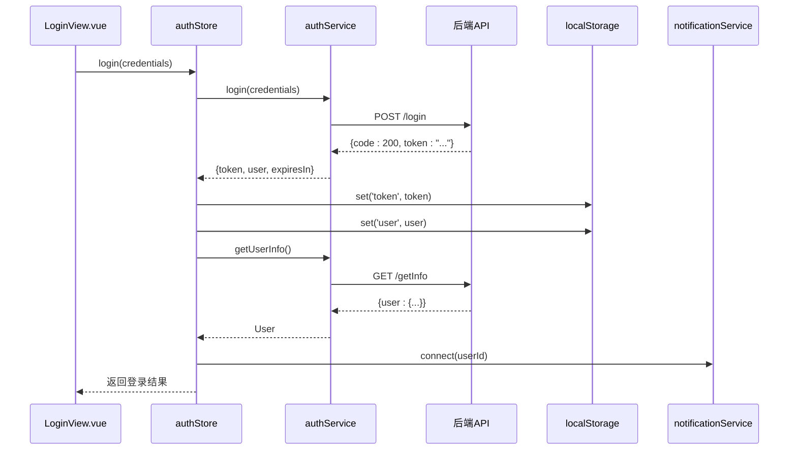
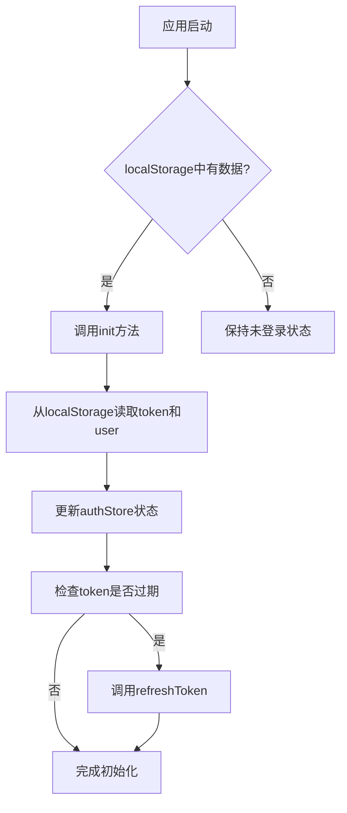
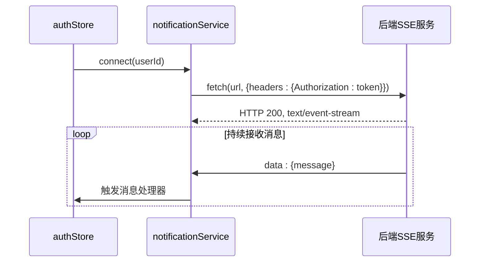
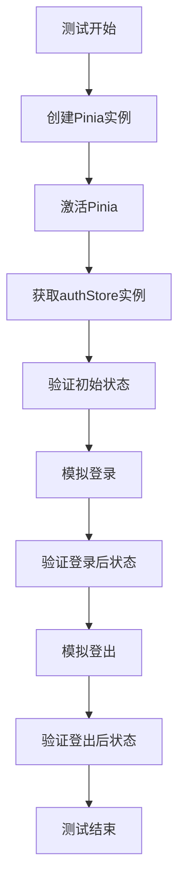
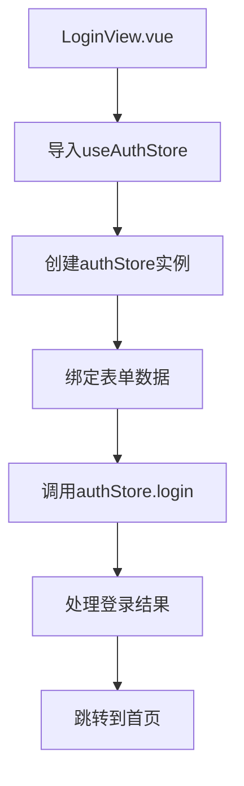
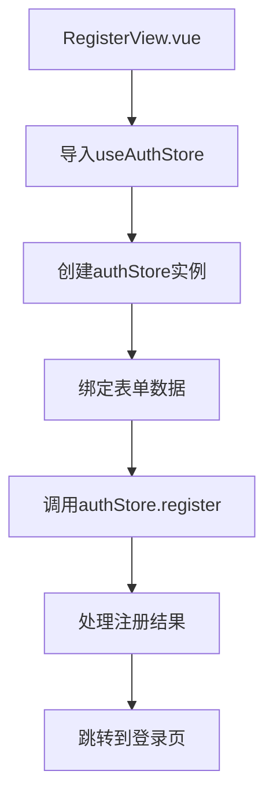

# 认证状态管理

<cite>
**Referenced Files in This Document**   
- [auth.ts](file://src/stores/auth.ts)
- [auth.ts](file://src/services/auth.ts)
- [LoginView.vue](file://src/views/auth/LoginView.vue)
- [RegisterView.vue](file://src/views/auth/RegisterView.vue)
- [auth.test.ts](file://tests/unit/stores/auth.test.ts)
- [index.ts](file://src/types/index.ts)
- [index.ts](file://src/utils/index.ts)
- [notification.ts](file://src/services/notification.ts)
</cite>

## 目录
1. [简介](#简介)
2. [核心组件](#核心组件)
3. [认证状态设计](#认证状态设计)
4. [认证逻辑实现](#认证逻辑实现)
5. [状态持久化与自动登录](#状态持久化与自动登录)
6. [SSE通知集成](#sse通知集成)
7. [错误处理机制](#错误处理机制)
8. [单元测试策略](#单元测试策略)
9. [组件调用示例](#组件调用示例)
10. [结论](#结论)

## 简介
本文档详细阐述了专利服务平台中的认证状态管理机制，重点分析`authStore`的设计与实现。文档深入探讨了用户认证状态的数据结构、初始化逻辑，以及登录、登出、令牌刷新等核心方法的实现机制。同时，文档还涵盖了状态持久化方案、SSE通知集成、错误处理和测试策略等关键方面，为开发者提供全面的技术参考。

## 核心组件

`authStore`是基于Pinia的状态管理模块，负责集中管理用户认证相关的状态和业务逻辑。它与`authService`服务层紧密协作，处理与后端的认证交互，并通过`storage`工具实现状态的持久化。`authStore`在多个视图组件中被广泛使用，是整个应用安全体系的核心。

**Section sources**
- [auth.ts](file://src/stores/auth.ts#L1-L262)
- [auth.ts](file://src/services/auth.ts#L1-L247)

## 认证状态设计

### 状态结构
`authStore`定义了以下核心状态变量：
- `token`: 存储JWT令牌，初始化时从`localStorage`读取
- `user`: 存储用户信息对象，初始化时从`localStorage`读取
- `loading`: 布尔值，用于控制UI加载状态

这些状态通过`ref`函数创建，确保了响应式特性。

### 初始化逻辑
`authStore`通过`init`方法实现状态初始化，该方法在应用启动时被调用。初始化过程从`localStorage`中读取持久化的`token`和`user`信息，并将其赋值给相应的状态变量。如果读取过程中发生错误，会清除损坏的数据，确保状态的一致性。

### 计算属性
`authStore`定义了多个计算属性来派生状态：
- `isLoggedIn`: 基于`token`和`user`的存在性判断用户是否已登录
- `userRole`: 提取用户角色信息
- `userName`: 提取用户名信息

这些计算属性通过`computed`函数创建，确保了数据的自动更新。

```mermaid
classDiagram
class AuthStore {
+token : Ref<string | null>
+user : Ref<User | null>
+loading : Ref<boolean>
+isLoggedIn : ComputedRef<boolean>
+userRole : ComputedRef<string>
+userName : ComputedRef<string>
+login(credentials) : Promise<LoginResponse>
+logout() : Promise<void>
+refreshToken() : Promise<string>
+checkAuth() : Promise<boolean>
+init() : void
}
class User {
+id : string
+username : string
+email : string
+role : UserRole
+createdAt : string
+updatedAt : string
+userId : string | number
}
class AuthService {
+login(data : LoginRequest) : Promise<LoginResponse>
+getCaptcha() : Promise<CaptchaResponse>
+register(data : RegisterRequest) : Promise<any>
+refreshToken() : Promise<{ token : string; expiresIn : number }>
+getUserInfo() : Promise<User>
+logout() : Promise<void>
}
class Storage {
+get(key : string, defaultValue? : T) : T | null
+set(key : string, value : any) : void
+remove(key : string) : void
}
AuthStore --> AuthService : "依赖"
AuthStore --> Storage : "依赖"
AuthStore --> User : "包含"
```

**Diagram sources**
- [auth.ts](file://src/stores/auth.ts#L1-L262)
- [types/index.ts](file://src/types/index.ts#L1-L306)
- [auth.ts](file://src/services/auth.ts#L1-L247)
- [utils/index.ts](file://src/utils/index.ts#L1-L270)

**Section sources**
- [auth.ts](file://src/stores/auth.ts#L1-L262)
- [types/index.ts](file://src/types/index.ts#L1-L306)

## 认证逻辑实现

### 登录流程
`login`方法是认证流程的核心，其执行步骤如下：
1. 设置`loading`状态为`true`
2. 调用`authService.login`与后端交互
3. 成功后，将返回的`token`和`user`信息更新到状态中
4. 使用`storage.set`将数据持久化到`localStorage`
5. 如果用户选择"记住我"，则设置`tokenExpireTime`
6. 调用`authService.getUserInfo`获取完整用户信息
7. 使用`notificationService.connect`建立SSE连接
8. 最后将`loading`状态重置为`false`

### 登出流程
`logout`方法的执行流程包括：
1. 调用`authService.logout`通知后端
2. 调用`notificationService.disconnect`断开SSE连接
3. 清除所有本地状态和持久化数据
4. 重置`loading`状态

### 令牌刷新
`refreshToken`方法用于在令牌过期前刷新令牌。当检测到令牌即将过期时，该方法会被自动调用。如果刷新失败，会自动执行登出流程，确保应用状态的安全。

### 认证检查
`checkAuth`方法用于验证当前认证状态的有效性。它会检查`token`是否存在，以及`tokenExpireTime`是否已过期。如果令牌已过期，会自动调用`refreshToken`进行刷新。



**Diagram sources**
- [auth.ts](file://src/stores/auth.ts#L1-L262)
- [auth.ts](file://src/services/auth.ts#L1-L247)
- [LoginView.vue](file://src/views/auth/LoginView.vue#L1-L524)

**Section sources**
- [auth.ts](file://src/stores/auth.ts#L1-L262)
- [auth.ts](file://src/services/auth.ts#L1-L247)

## 状态持久化与自动登录

`authStore`通过`storage`工具实现状态的持久化。`storage`是一个封装了`localStorage`操作的工具，提供了`get`、`set`、`remove`等方法。在用户登录成功后，`token`和`user`信息会被存储到`localStorage`中。当用户下次访问应用时，`init`方法会从`localStorage`中读取这些信息，实现自动登录。



**Diagram sources**
- [auth.ts](file://src/stores/auth.ts#L1-L262)
- [utils/index.ts](file://src/utils/index.ts#L1-L270)

**Section sources**
- [auth.ts](file://src/stores/auth.ts#L1-L262)
- [utils/index.ts](file://src/utils/index.ts#L1-L270)

## SSE通知集成

`authStore`在用户登录成功后，会通过`notificationService.connect`建立SSE（Server-Sent Events）连接，实现服务器向客户端的实时消息推送。这一集成在`login`和`checkAuth`方法中实现，确保用户在登录或刷新认证状态后都能建立连接。

`notificationService`使用`fetch` API和`ReadableStream`实现SSE连接，支持在请求头中携带`Authorization`令牌，提高了安全性。连接建立后，服务端可以向客户端推送通知消息，如系统公告、任务进度等。



**Diagram sources**
- [auth.ts](file://src/stores/auth.ts#L1-L262)
- [notification.ts](file://src/services/notification.ts#L1-L313)

**Section sources**
- [auth.ts](file://src/stores/auth.ts#L1-L262)
- [notification.ts](file://src/services/notification.ts#L1-L313)

## 错误处理机制

`authStore`实现了完善的错误处理机制。所有异步操作都包裹在`try-catch`块中，确保错误不会导致应用崩溃。在`catch`块中，错误信息会被记录到控制台，便于调试。对于用户相关的错误，会通过`ElMessage.error`显示友好的错误提示。

`authService`对不同类型的错误进行了精细化处理：
- 对于HTTP响应错误，提取后端返回的错误信息
- 对于网络错误，提供通用的错误提示
- 对于其他未知错误，进行适当的降级处理

## 单元测试策略

`authStore`的单元测试位于`tests/unit/stores/auth.test.ts`文件中。测试使用Vitest框架，通过`createPinia`创建Pinia实例，并使用`setActivePinia`激活。测试用例覆盖了以下场景：
- 初始状态的正确性
- 登录后状态的更新
- 登出后状态的清除

测试通过直接修改`store`的状态来模拟登录和登出，验证计算属性的正确性。



**Diagram sources**
- [auth.test.ts](file://tests/unit/stores/auth.test.ts#L1-L57)

**Section sources**
- [auth.test.ts](file://tests/unit/stores/auth.test.ts#L1-L57)

## 组件调用示例

### LoginView中的使用
在`LoginView.vue`中，通过`useAuthStore`导入`authStore`，并在`setup`函数中创建实例。登录表单提交时，调用`authStore.login`方法处理登录逻辑。



**Section sources**
- [LoginView.vue](file://src/views/auth/LoginView.vue#L1-L524)

### RegisterView中的使用
在`RegisterView.vue`中，同样通过`useAuthStore`导入`authStore`，并在注册表单提交时调用`authStore.register`方法处理注册逻辑。



**Section sources**
- [RegisterView.vue](file://src/views/auth/RegisterView.vue#L1-L374)

## 结论
`authStore`作为专利服务平台的认证状态管理中心，设计合理，功能完善。它不仅实现了基本的认证功能，还集成了状态持久化、SSE通知、错误处理等高级特性。通过Pinia的状态管理机制，确保了应用状态的一致性和可预测性。完善的单元测试保证了代码的可靠性。整体设计体现了现代前端应用的最佳实践，为平台的安全性和用户体验提供了坚实保障。