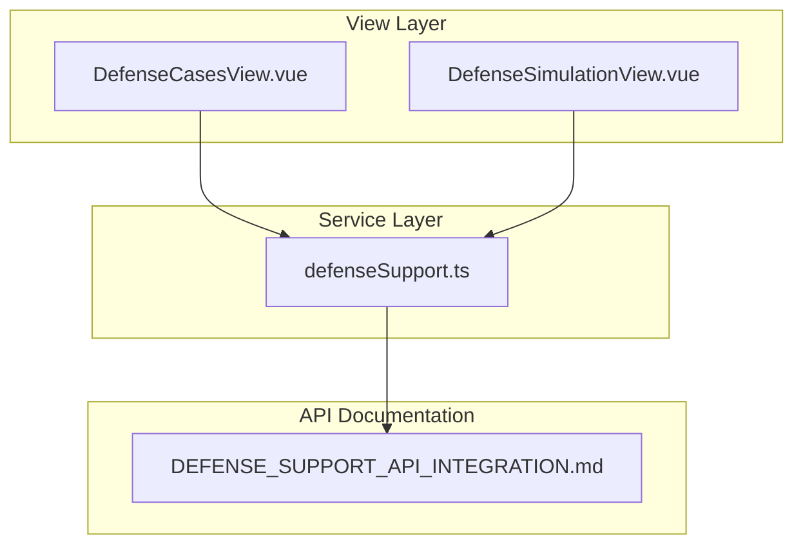
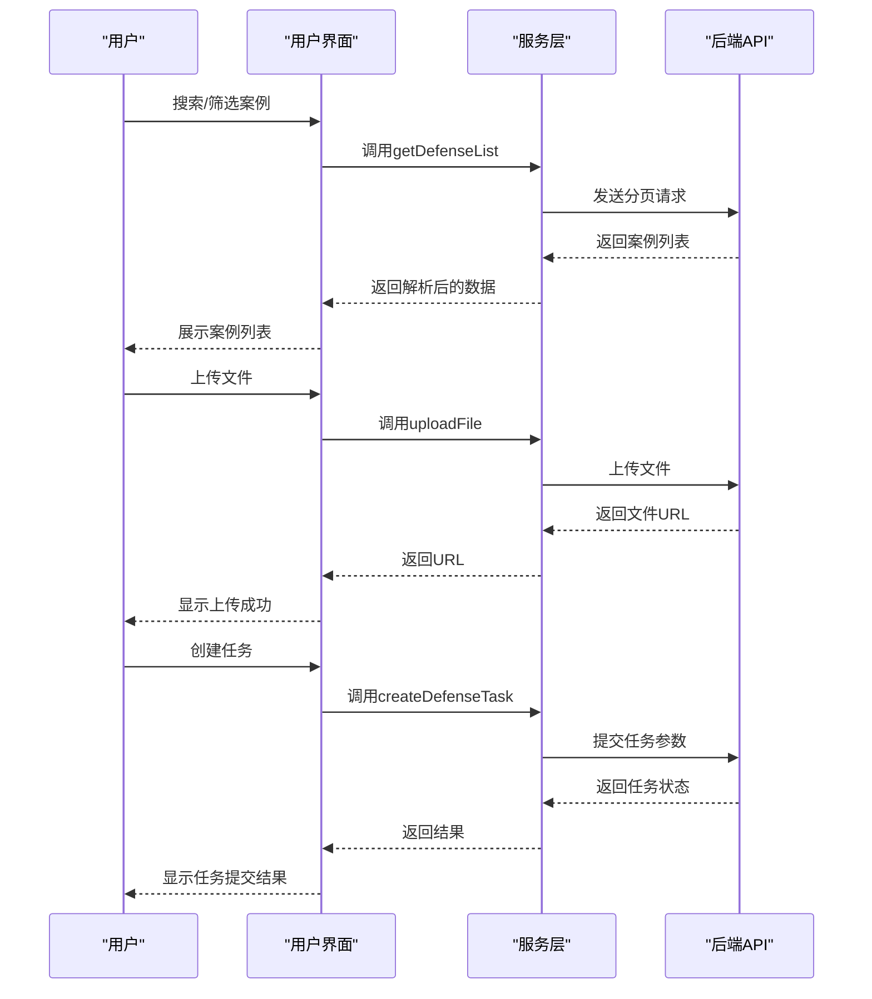
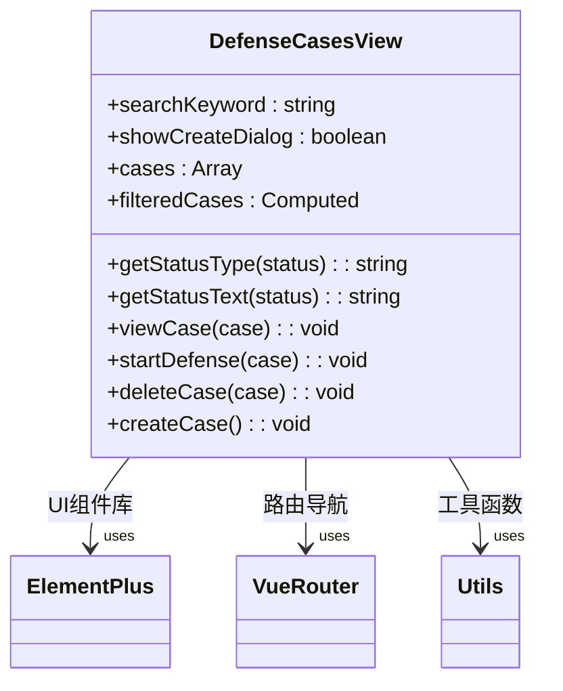
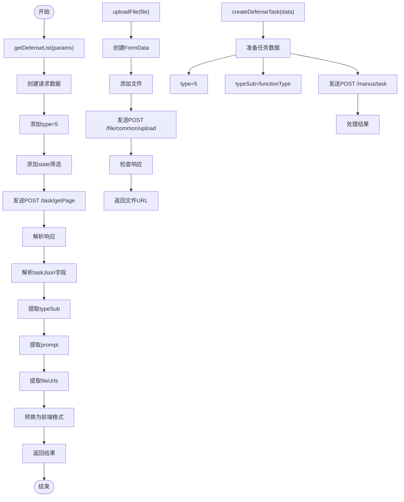
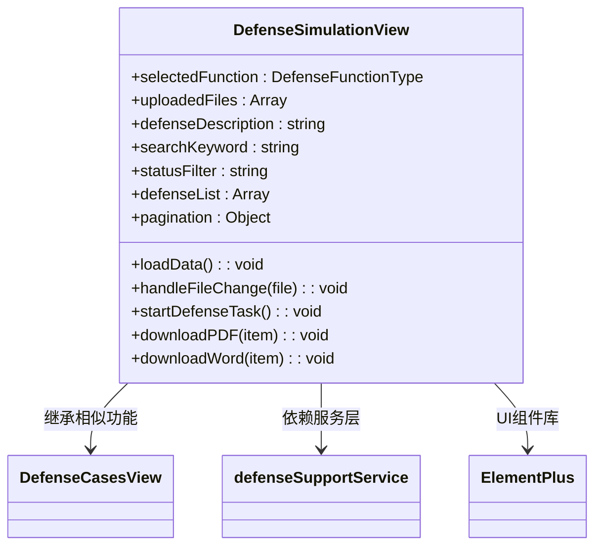
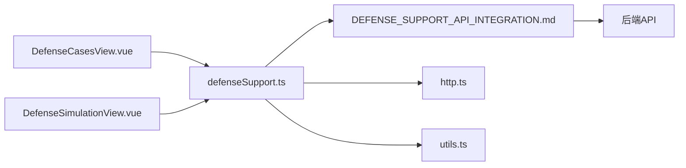

# 案例管理

<cite>
**Referenced Files in This Document**   
- [DefenseCasesView.vue](file://src/views/defense-support/DefenseCasesView.vue)
- [DefenseSimulationView.vue](file://src/views/defense-support/DefenseSimulationView.vue)
- [defenseSupport.ts](file://src/services/defenseSupport.ts)
- [DEFENSE_SUPPORT_API_INTEGRATION.md](file://DEFENSE_SUPPORT_API_INTEGRATION.md)
</cite>

## 目录
1. [引言](#引言)
2. [项目结构](#项目结构)
3. [核心组件](#核心组件)
4. [架构概述](#架构概述)
5. [详细组件分析](#详细组件分析)
6. [依赖分析](#依赖分析)
7. [性能考虑](#性能考虑)
8. [故障排除指南](#故障排除指南)
9. [结论](#结论)

## 引言
本文件详细说明了答辩案例管理功能的设计与实现，重点阐述了案例的分类体系、检索机制和归档逻辑。文档涵盖了从用户界面设计到后端API集成的完整技术实现，包括关键词搜索、状态筛选、分页功能以及文件解析等核心功能。

## 项目结构
答辩案例管理功能主要由视图组件、服务层和API文档三部分构成，形成了清晰的分层架构。



**Diagram sources**
- [DefenseCasesView.vue](file://src/views/defense-support/DefenseCasesView.vue)
- [DefenseSimulationView.vue](file://src/views/defense-support/DefenseSimulationView.vue)
- [defenseSupport.ts](file://src/services/defenseSupport.ts)
- [DEFENSE_SUPPORT_API_INTEGRATION.md](file://DEFENSE_SUPPORT_API_INTEGRATION.md)

**Section sources**
- [DefenseCasesView.vue](file://src/views/defense-support/DefenseCasesView.vue)
- [DefenseSimulationView.vue](file://src/views/defense-support/DefenseSimulationView.vue)
- [defenseSupport.ts](file://src/services/defenseSupport.ts)
- [DEFENSE_SUPPORT_API_INTEGRATION.md](file://DEFENSE_SUPPORT_API_INTEGRATION.md)

## 核心组件
核心组件包括答辩案例视图（DefenseCasesView.vue）、答辩模拟视图（DefenseSimulationView.vue）和服务层（defenseSupport.ts），共同实现了完整的案例管理功能。

**Section sources**
- [DefenseCasesView.vue](file://src/views/defense-support/DefenseCasesView.vue)
- [DefenseSimulationView.vue](file://src/views/defense-support/DefenseSimulationView.vue)
- [defenseSupport.ts](file://src/services/defenseSupport.ts)

## 架构概述
系统采用前后端分离架构，前端通过服务层与后端API进行通信，实现了答辩案例的全生命周期管理。



**Diagram sources**
- [defenseSupport.ts](file://src/services/defenseSupport.ts)
- [DEFENSE_SUPPORT_API_INTEGRATION.md](file://DEFENSE_SUPPORT_API_INTEGRATION.md)

## 详细组件分析

### 答辩案例视图分析
DefenseCasesView.vue是答辩案例管理的主要界面组件，提供了案例的展示、搜索和创建功能。



**Diagram sources**
- [DefenseCasesView.vue](file://src/views/defense-support/DefenseCasesView.vue)

**Section sources**
- [DefenseCasesView.vue](file://src/views/defense-support/DefenseCasesView.vue)

### 答辩支持服务分析
defenseSupport.ts服务层封装了与后端API的交互逻辑，提供了文件上传、任务创建和列表获取等核心功能。

#### 服务方法调用流程


**Diagram sources**
- [defenseSupport.ts](file://src/services/defenseSupport.ts)
- [DEFENSE_SUPPORT_API_INTEGRATION.md](file://DEFENSE_SUPPORT_API_INTEGRATION.md)

**Section sources**
- [defenseSupport.ts](file://src/services/defenseSupport.ts)

### 答辩模拟视图分析
DefenseSimulationView.vue提供了更丰富的答辩支持功能，包括文件上传、任务创建和结果展示。



**Diagram sources**
- [DefenseSimulationView.vue](file://src/views/defense-support/DefenseSimulationView.vue)

**Section sources**
- [DefenseSimulationView.vue](file://src/views/defense-support/DefenseSimulationView.vue)

## 依赖分析
系统各组件之间存在明确的依赖关系，形成了稳定的功能链条。



**Diagram sources**
- [DefenseCasesView.vue](file://src/views/defense-support/DefenseCasesView.vue)
- [DefenseSimulationView.vue](file://src/views/defense-support/DefenseSimulationView.vue)
- [defenseSupport.ts](file://src/services/defenseSupport.ts)
- [DEFENSE_SUPPORT_API_INTEGRATION.md](file://DEFENSE_SUPPORT_API_INTEGRATION.md)

**Section sources**
- [defenseSupport.ts](file://src/services/defenseSupport.ts)

## 性能考虑
系统在设计时充分考虑了性能优化，特别是在UI渲染和数据处理方面。

### UI性能优化策略
```mermaid
flowchart TD
A[图片懒加载] --> B[设置loading=\"lazy\"]
B --> C[减少初始加载时间]
D[图片放大预览] --> E[使用preview-src-list]
E --> F[避免重复请求]
G[条件渲染] --> H[v-if控制PDF/Word按钮]
H --> I[避免无效DOM元素]
J[事件冒泡控制] --> K[@click.stop阻止冒泡]
K --> L[提高交互响应速度]
M[计算属性优化] --> N[filteredCases使用computed]
N --> O[避免重复计算]
```

**Diagram sources**
- [DefenseSimulationView.vue](file://src/views/defense-support/DefenseSimulationView.vue)

**Section sources**
- [DefenseSimulationView.vue](file://src/views/defense-support/DefenseSimulationView.vue)

## 故障排除指南
本节提供常见问题的解决方案，帮助开发者快速定位和解决问题。

### 常见问题及解决方案
| 问题现象 | 可能原因 | 解决方案 |
|---------|--------|---------|
| 文件上传失败 | 文件格式不支持 | 确认文件为PDF/DOC/DOCX格式 |
| | 文件大小超过限制 | 确保文件小于10MB |
| | Token过期 | 重新登录获取新Token |
| 任务列表为空 | 筛选条件过严 | 检查状态筛选和关键词搜索 |
| | 数据加载失败 | 检查网络连接和API状态 |
| PDF/Word下载失败 | 文件URL为空 | 确认任务已成功生成结果文件 |
| 图片加载失败 | URL无效 | 检查firstImgUrl字段是否正确 |

**Section sources**
- [defenseSupport.ts](file://src/services/defenseSupport.ts)
- [DEFENSE_SUPPORT_API_INTEGRATION.md](file://DEFENSE_SUPPORT_API_INTEGRATION.md)

## 结论
答辩案例管理功能通过清晰的分层架构和完善的API集成，实现了高效的案例管理。系统支持关键词搜索、多状态筛选和分页功能，结合从taskJson字段解析功能类型、描述信息和文件路径的技术实现，为用户提供了完整的答辩支持体验。UI设计注重用户体验，实现了图片展示、文件下载、放大预览和懒加载等优化策略，确保了系统的高性能和易用性。