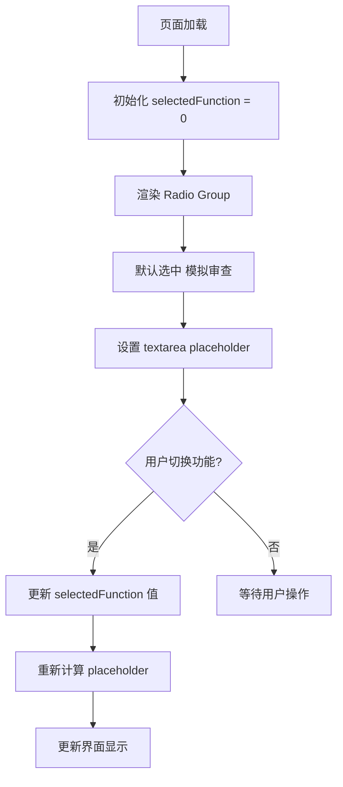
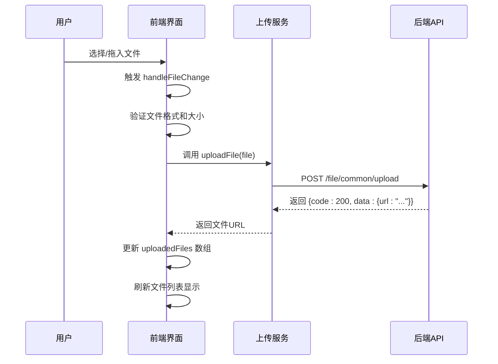
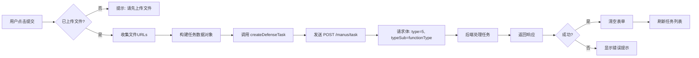
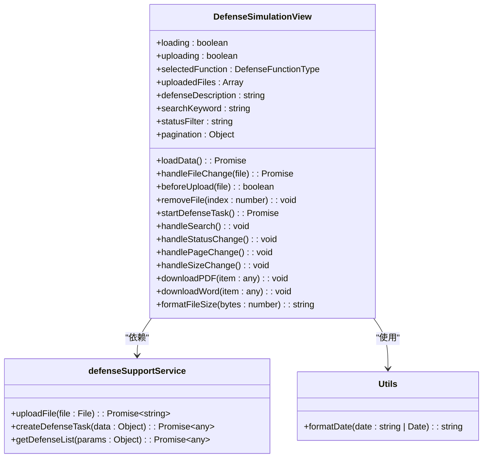

# 模拟审查

<cite>
**Referenced Files in This Document**   
- [DefenseSimulationView.vue](file://src/views/defense-support/DefenseSimulationView.vue)
- [defenseSupport.ts](file://src/services/defenseSupport.ts)
- [DEFENSE_SUPPORT_API_INTEGRATION.md](file://DEFENSE_SUPPORT_API_INTEGRATION.md)
</cite>

## 目录
1. [功能概述](#功能概述)
2. [功能选择区交互设计](#功能选择区交互设计)
3. [多文件上传逻辑](#多文件上传逻辑)
4. [任务创建请求流程](#任务创建请求流程)
5. [用户体验优化措施](#用户体验优化措施)

## 功能概述

本系统实现了专利文件的模拟审查功能，用户可通过上传专利文件并选择相应功能，生成审查意见通知书或答辩意见回复。系统采用前后端分离架构，前端通过Vue 3与Element Plus构建用户界面，后端通过RESTful API提供服务支持。核心功能包括功能选择、文件上传、任务提交、结果展示与下载等模块。

**Section sources**
- [DefenseSimulationView.vue](file://src/views/defense-support/DefenseSimulationView.vue#L1-L723)
- [defenseSupport.ts](file://src/services/defenseSupport.ts#L4-L268)

## 功能选择区交互设计

功能选择区采用`el-radio-group`组件实现单选按钮组，包含“模拟审查”和“答辩意见回复”两个选项。默认情况下，系统将`selectedFunction`变量初始化为`DefenseFunctionType.SIMULATION_REVIEW`（值为0），确保“模拟审查”功能被默认选中。

当用户切换功能时，系统通过`v-model`绑定的`selectedFunction`响应式变量捕获选择变化，并动态更新描述输入框的placeholder内容。该逻辑通过三元表达式实现：当`selectedFunction === 0`时显示“请描述需要模拟审查的重点内容（可选）...”，否则显示“请输入答辩信息描述...”。这种设计提升了用户交互体验，使提示信息与当前功能上下文保持一致。

**Diagram sources**
- [DefenseSimulationView.vue](file://src/views/defense-support/DefenseSimulationView.vue#L25-L38)
- [defenseSupport.ts](file://src/services/defenseSupport.ts#L4-L7)

**Section sources**
- [DefenseSimulationView.vue](file://src/views/defense-support/DefenseSimulationView.vue#L25-L45)
- [defenseSupport.ts](file://src/services/defenseSupport.ts#L4-L7)

## 多文件上传逻辑

系统实现了完整的多文件上传机制，支持拖拽上传和点击上传两种方式。上传区域基于`el-upload`组件构建，配置`drag`属性启用拖拽功能，`accept=".pdf,.doc,.docx"`限制文件类型，`show-file-list="false"`关闭默认文件列表以实现自定义展示。

文件上传流程如下：当用户选择或拖入文件后，`handleFileChange`方法被触发，首先验证文件格式和大小（不超过10MB）。验证通过后，调用`defenseSupportService.uploadFile`方法将文件上传至服务器。上传成功后，系统将返回的文件URL与文件元数据（名称、大小）一同存入`uploadedFiles`数组，并在界面中渲染自定义文件列表。

用户可通过点击文件项中的删除按钮调用`removeFile(index)`方法移除已上传文件。该设计实现了文件管理的灵活性，同时通过即时上传机制确保了文件URL的及时获取，为后续任务提交做好准备。

**Diagram sources**
- [DefenseSimulationView.vue](file://src/views/defense-support/DefenseSimulationView.vue#L50-L100)
- [defenseSupport.ts](file://src/services/defenseSupport.ts#L62-L85)

**Section sources**
- [DefenseSimulationView.vue](file://src/views/defense-support/DefenseSimulationView.vue#L50-L150)
- [defenseSupport.ts](file://src/services/defenseSupport.ts#L62-L85)

## 任务创建请求流程

当用户完成文件上传并填写描述信息后，点击提交按钮触发`startDefenseTask`方法。该方法首先校验是否已上传文件，随后收集`uploadedFiles`数组中的所有文件URL，构建包含`functionType`、`fileUrls`和`prompt`的任务数据对象。

系统通过`defenseSupportService.createDefenseTask`方法向后端提交任务创建请求。根据API规范，请求体中`type`字段固定为5（表示答辩支持功能），`typeSub`字段取值为`selectedFunction.value`（0表示模拟审查，1表示答辩意见回复）。该请求通过`POST /manus/task`接口发送，携带认证Token以确保安全性。

后端接收到请求后，根据`typeSub`值判断功能类型并启动相应的处理流程。任务提交成功后，系统会清空上传文件列表和描述输入框，并调用`loadData`方法刷新任务记录列表，确保用户能够及时查看新提交的任务状态。

**Diagram sources**
- [DefenseSimulationView.vue](file://src/views/defense-support/DefenseSimulationView.vue#L200-L250)
- [defenseSupport.ts](file://src/services/defenseSupport.ts#L87-L110)
- [DEFENSE_SUPPORT_API_INTEGRATION.md](file://DEFENSE_SUPPORT_API_INTEGRATION.md#L92-L105)

**Section sources**
- [DefenseSimulationView.vue](file://src/views/defense-support/DefenseSimulationView.vue#L200-L250)
- [defenseSupport.ts](file://src/services/defenseSupport.ts#L87-L110)
- [DEFENSE_SUPPORT_API_INTEGRATION.md](file://DEFENSE_SUPPORT_API_INTEGRATION.md#L92-L105)

## 用户体验优化措施

系统在多个层面实施了用户体验优化措施。在表单处理方面，任务提交成功后自动清空`uploadedFiles`数组和`defenseDescription`输入框，避免用户重复提交。在列表刷新方面，通过调用`loadData`方法即时更新任务记录，确保界面状态与服务器数据同步。

加载状态提示通过`loading`和`uploading`两个响应式变量实现。在加载任务列表时显示全局加载动画，在文件上传和任务提交过程中显示按钮级加载状态（"处理中..."），给予用户明确的操作反馈。错误处理采用`ElMessage`组件统一展示提示信息，区分成功、警告和错误等级别。

此外，系统还实现了智能placeholder切换、文件格式/大小验证、下载按钮状态控制（根据`pdfUrl`/`wordUrl`是否存在自动启用/禁用）等细节优化，全面提升了用户操作的流畅性和友好性。

**Diagram sources**
- [DefenseSimulationView.vue](file://src/views/defense-support/DefenseSimulationView.vue#L10-L300)
- [defenseSupport.ts](file://src/services/defenseSupport.ts#L62-L268)
- [utils/index.ts](file://src/utils/index.ts#L5-L21)

**Section sources**
- [DefenseSimulationView.vue](file://src/views/defense-support/DefenseSimulationView.vue#L10-L300)
- [defenseSupport.ts](file://src/services/defenseSupport.ts#L62-L268)
- [utils/index.ts](file://src/utils/index.ts#L5-L21)