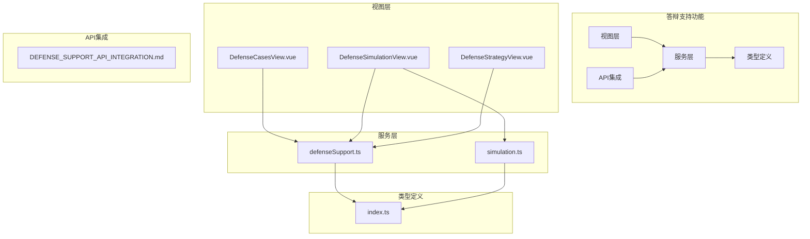
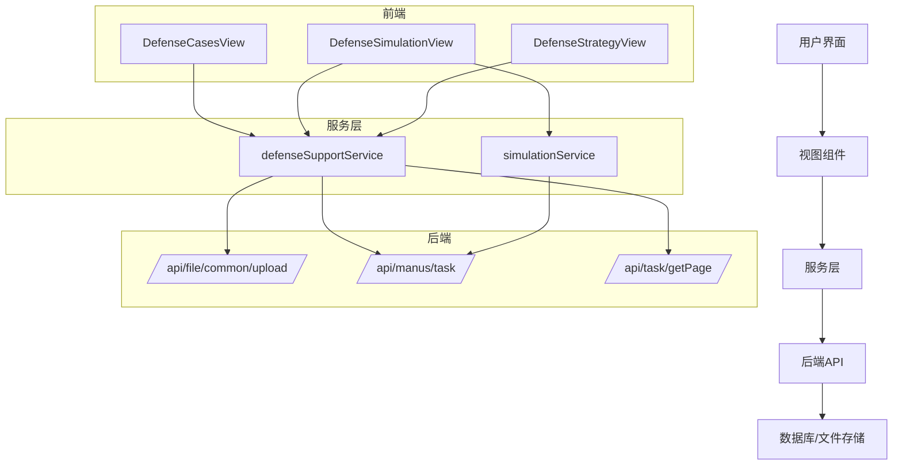
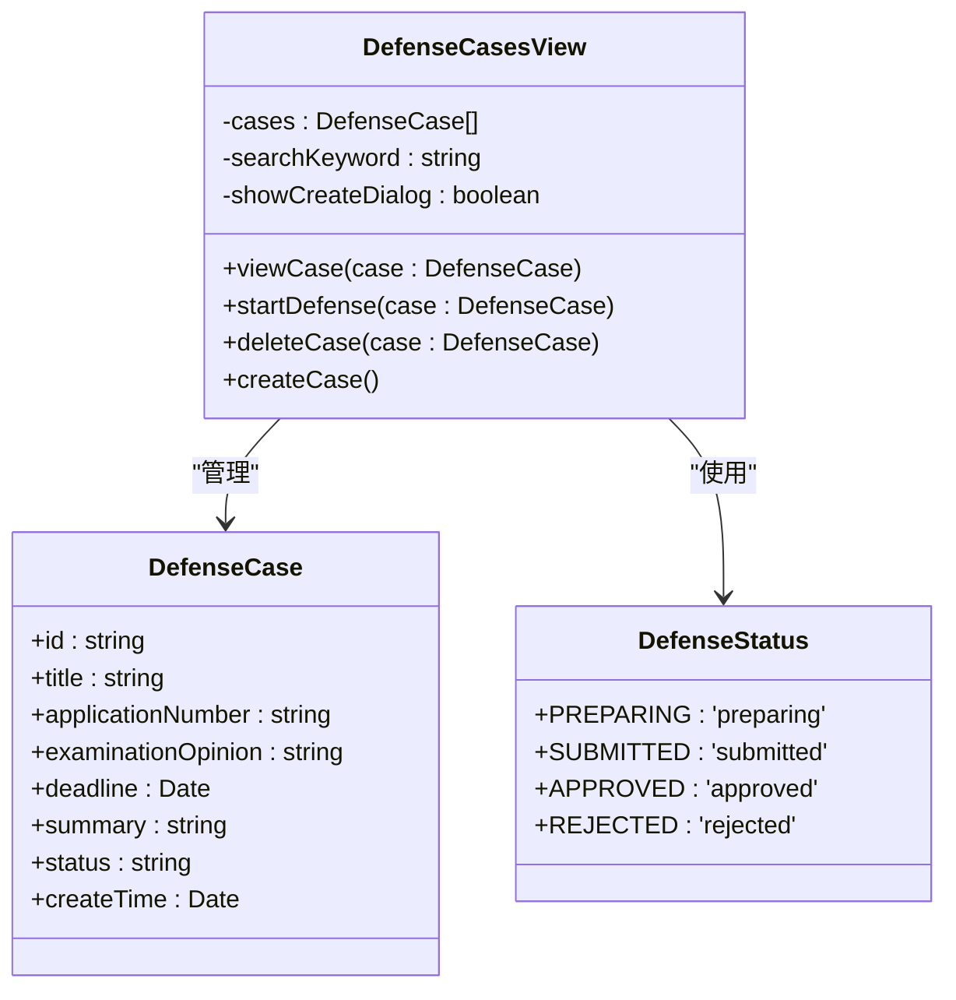
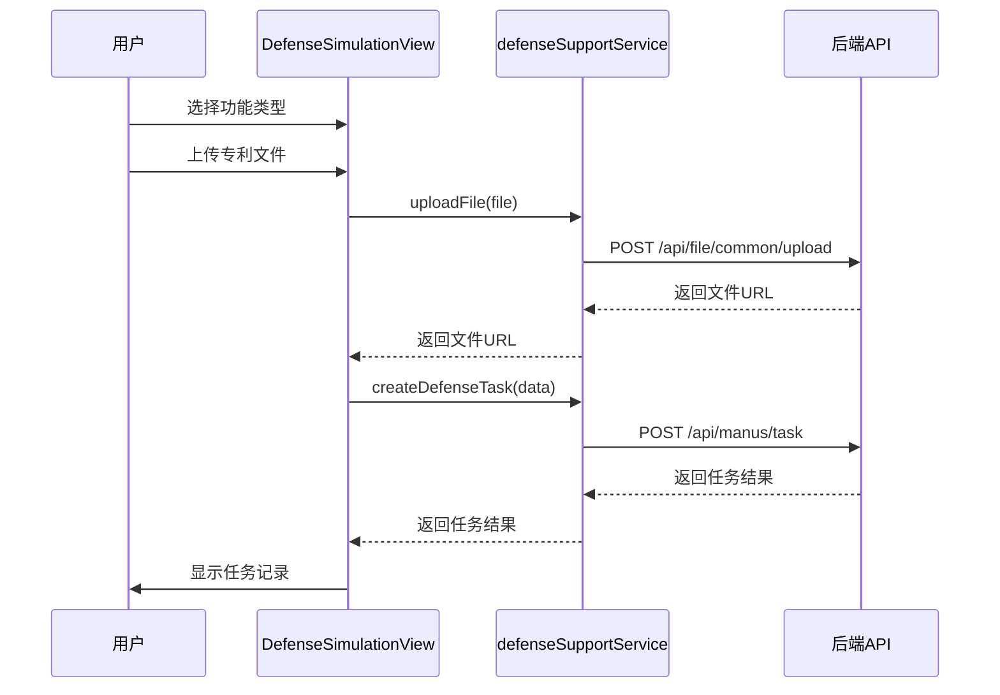
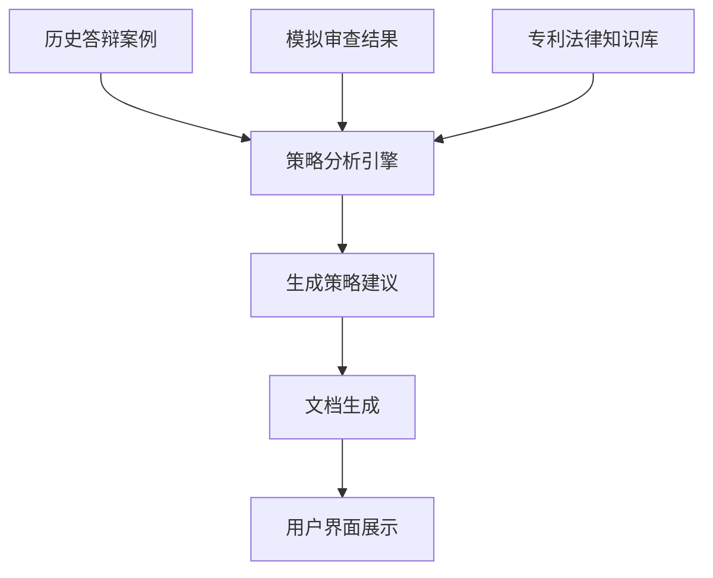
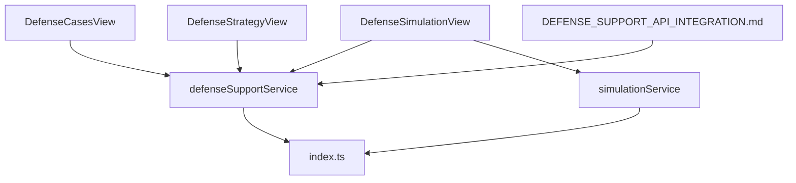

# 答辩支持功能

<cite>
**Referenced Files in This Document**   
- [DEFENSE_SUPPORT_API_INTEGRATION.md](file://DEFENSE_SUPPORT_API_INTEGRATION.md)
- [DefenseCasesView.vue](file://src/views/defense-support/DefenseCasesView.vue)
- [DefenseSimulationView.vue](file://src/views/defense-support/DefenseSimulationView.vue)
- [DefenseStrategyView.vue](file://src/views/defense-support/DefenseStrategyView.vue)
- [defenseSupport.ts](file://src/services/defenseSupport.ts)
- [simulation.ts](file://src/services/simulation.ts)
- [index.ts](file://src/types/index.ts)
</cite>

## 目录
1. [引言](#引言)
2. [项目结构](#项目结构)
3. [核心组件](#核心组件)
4. [架构概述](#架构概述)
5. [详细组件分析](#详细组件分析)
6. [依赖分析](#依赖分析)
7. [性能考量](#性能考量)
8. [故障排除指南](#故障排除指南)
9. [结论](#结论)

## 引言
答辩支持功能是专利服务网站中的核心模块，旨在为用户提供全面的专利答辩辅助服务。该功能涵盖三大核心能力：案例管理、模拟审查和策略建议。通过系统化的案例管理，用户可以高效组织和检索历史答辩案例；模拟审查功能能够生成审查意见通知书或答辩意见回复，帮助用户预判审查结果；策略建议功能则基于历史数据提供智能化的答辩策略和文档生成。本文档将详细阐述这些功能的实现机制、交互流程和API集成方式，并探讨用户体验设计的关键考量。

## 项目结构
答辩支持功能的代码组织遵循模块化设计原则，主要包含视图组件、服务层和类型定义三个部分。视图组件位于`src/views/defense-support/`目录下，包括案例管理、模拟审查和策略建议三个核心视图。服务层位于`src/services/`目录下，提供与后端API的交互接口。类型定义位于`src/types/index.ts`中，为整个功能提供类型安全支持。

**Diagram sources**
- [DefenseCasesView.vue](file://src/views/defense-support/DefenseCasesView.vue)
- [DefenseSimulationView.vue](file://src/views/defense-support/DefenseSimulationView.vue)
- [DefenseStrategyView.vue](file://src/views/defense-support/DefenseStrategyView.vue)
- [defenseSupport.ts](file://src/services/defenseSupport.ts)
- [simulation.ts](file://src/services/simulation.ts)
- [index.ts](file://src/types/index.ts)

**Section sources**
- [DefenseCasesView.vue](file://src/views/defense-support/DefenseCasesView.vue)
- [DefenseSimulationView.vue](file://src/views/defense-support/DefenseSimulationView.vue)
- [DefenseStrategyView.vue](file://src/views/defense-support/DefenseStrategyView.vue)
- [defenseSupport.ts](file://src/services/defenseSupport.ts)
- [simulation.ts](file://src/services/simulation.ts)
- [index.ts](file://src/types/index.ts)

## 核心组件
答辩支持功能的核心组件包括案例管理、模拟审查和策略建议三大模块。案例管理模块通过`DefenseCasesView`组件实现，提供答辩案例的创建、检索和归档功能。模拟审查模块由`DefenseSimulationView`组件和`simulationService`服务构成，支持模拟审查和答辩意见回复两种功能模式。策略建议模块基于`defenseSupportService`提供的数据，通过`DefenseStrategyView`组件展示智能化的答辩策略。这些组件通过统一的服务层与后端API进行交互，确保数据的一致性和安全性。

**Section sources**
- [DefenseCasesView.vue](file://src/views/defense-support/DefenseCasesView.vue)
- [DefenseSimulationView.vue](file://src/views/defense-support/DefenseSimulationView.vue)
- [DefenseStrategyView.vue](file://src/views/defense-support/DefenseStrategyView.vue)
- [defenseSupport.ts](file://src/services/defenseSupport.ts)
- [simulation.ts](file://src/services/simulation.ts)

## 架构概述
答辩支持功能采用分层架构设计，从前端视图到后端服务形成清晰的调用链路。前端视图层负责用户交互和界面展示，服务层封装API调用逻辑，类型定义层提供类型安全支持。整个架构通过RESTful API与后端系统集成，支持文件上传、任务创建和结果查询等核心操作。

**Diagram sources**
- [DefenseCasesView.vue](file://src/views/defense-support/DefenseCasesView.vue)
- [DefenseSimulationView.vue](file://src/views/defense-support/DefenseSimulationView.vue)
- [DefenseStrategyView.vue](file://src/views/defense-support/DefenseStrategyView.vue)
- [defenseSupport.ts](file://src/services/defenseSupport.ts)
- [simulation.ts](file://src/services/simulation.ts)
- [DEFENSE_SUPPORT_API_INTEGRATION.md](file://DEFENSE_SUPPORT_API_INTEGRATION.md)

## 详细组件分析

### 案例管理分析
`DefenseCasesView`组件实现了答辩案例的全生命周期管理，包括案例的创建、检索、查看和删除功能。用户可以通过搜索框按标题、申请号或摘要检索案例，系统支持按状态（准备中、已提交、已批准、被驳回）进行筛选。新建案例时，用户需要填写案例标题、专利申请号、审查意见和答辩截止日期等关键信息。

**Diagram sources**
- [DefenseCasesView.vue](file://src/views/defense-support/DefenseCasesView.vue)
- [index.ts](file://src/types/index.ts)

**Section sources**
- [DefenseCasesView.vue](file://src/views/defense-support/DefenseCasesView.vue)
- [index.ts](file://src/types/index.ts)

### 模拟审查分析
`DefenseSimulationView`组件提供了模拟审查和答辩意见回复两大功能。用户可以选择功能类型，上传专利文件（支持PDF、DOC、DOCX格式），并填写相关描述信息。系统通过`defenseSupportService`将文件上传到服务器，然后创建相应的答辩支持任务。任务状态包括已完成、生成中和失败，用户可以下载生成的PDF或Word文档。

**Diagram sources**
- [DefenseSimulationView.vue](file://src/views/defense-support/DefenseSimulationView.vue)
- [defenseSupport.ts](file://src/services/defenseSupport.ts)
- [DEFENSE_SUPPORT_API_INTEGRATION.md](file://DEFENSE_SUPPORT_API_INTEGRATION.md)

**Section sources**
- [DefenseSimulationView.vue](file://src/views/defense-support/DefenseSimulationView.vue)
- [defenseSupport.ts](file://src/services/defenseSupport.ts)

### 策略建议分析
`DefenseStrategyView`组件目前为占位文件，但根据系统设计，它将基于历史答辩案例和模拟审查结果，为用户提供智能化的答辩策略建议。策略建议算法将分析历史数据中的成功案例，提取有效的答辩论点和修改建议，生成个性化的策略文档。该组件将与`defenseSupportService`和`simulationService`集成，获取必要的数据支持。

**Diagram sources**
- [DefenseStrategyView.vue](file://src/views/defense-support/DefenseStrategyView.vue)
- [defenseSupport.ts](file://src/services/defenseSupport.ts)
- [simulation.ts](file://src/services/simulation.ts)

**Section sources**
- [DefenseStrategyView.vue](file://src/views/defense-support/DefenseStrategyView.vue)
- [defenseSupport.ts](file://src/services/defenseSupport.ts)
- [simulation.ts](file://src/services/simulation.ts)

## 依赖分析
答辩支持功能的组件之间存在明确的依赖关系。视图组件依赖于服务层提供的API接口，服务层依赖于类型定义提供的数据结构。`DefenseCasesView`和`DefenseSimulationView`都依赖`defenseSupportService`进行数据操作，而`DefenseSimulationView`还依赖`simulationService`提供模拟审查功能。类型定义文件`index.ts`被所有组件和服务共享，确保了类型的一致性。

**Diagram sources**
- [DefenseCasesView.vue](file://src/views/defense-support/DefenseCasesView.vue)
- [DefenseSimulationView.vue](file://src/views/defense-support/DefenseSimulationView.vue)
- [DefenseStrategyView.vue](file://src/views/defense-support/DefenseStrategyView.vue)
- [defenseSupport.ts](file://src/services/defenseSupport.ts)
- [simulation.ts](file://src/services/simulation.ts)
- [index.ts](file://src/types/index.ts)
- [DEFENSE_SUPPORT_API_INTEGRATION.md](file://DEFENSE_SUPPORT_API_INTEGRATION.md)

**Section sources**
- [DefenseCasesView.vue](file://src/views/defense-support/DefenseCasesView.vue)
- [DefenseSimulationView.vue](file://src/views/defense-support/DefenseSimulationView.vue)
- [DefenseStrategyView.vue](file://src/views/defense-support/DefenseStrategyView.vue)
- [defenseSupport.ts](file://src/services/defenseSupport.ts)
- [simulation.ts](file://src/services/simulation.ts)
- [index.ts](file://src/types/index.ts)

## 性能考量
在性能方面，答辩支持功能需要考虑文件上传和处理的效率。系统支持最大10MB的文件上传，对于大文件需要优化上传体验，如显示进度条。任务列表采用分页加载，避免一次性加载过多数据影响页面性能。图片展示使用懒加载技术，并支持点击放大预览，平衡了加载速度和用户体验。API调用采用异步处理，确保界面响应性。

## 故障排除指南
常见问题包括文件上传失败、任务提交失败和数据加载异常。文件上传失败可能由于文件格式不支持或大小超过限制，系统应提供明确的错误提示。任务提交失败可能与网络连接或认证状态有关，需要检查Token有效性。数据加载异常可能由于后端服务不可用，建议检查网络连接并重试。对于复杂的错误情况，可以查看浏览器控制台的日志信息进行诊断。

**Section sources**
- [defenseSupport.ts](file://src/services/defenseSupport.ts)
- [simulation.ts](file://src/services/simulation.ts)

## 结论
答辩支持功能通过案例管理、模拟审查和策略建议三大核心能力，为用户提供全面的专利答辩辅助服务。系统采用清晰的分层架构，前端视图与后端API通过服务层进行解耦，确保了代码的可维护性和扩展性。未来可以进一步优化用户体验，如添加任务详情页面、支持批量操作和提供更智能的策略建议算法。