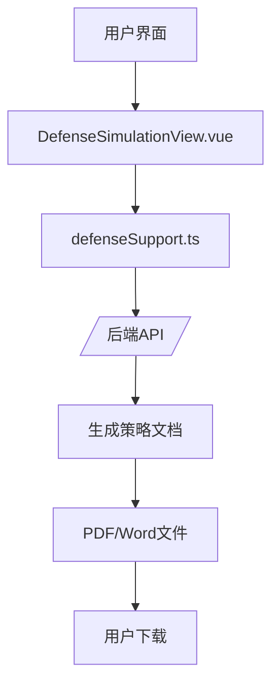
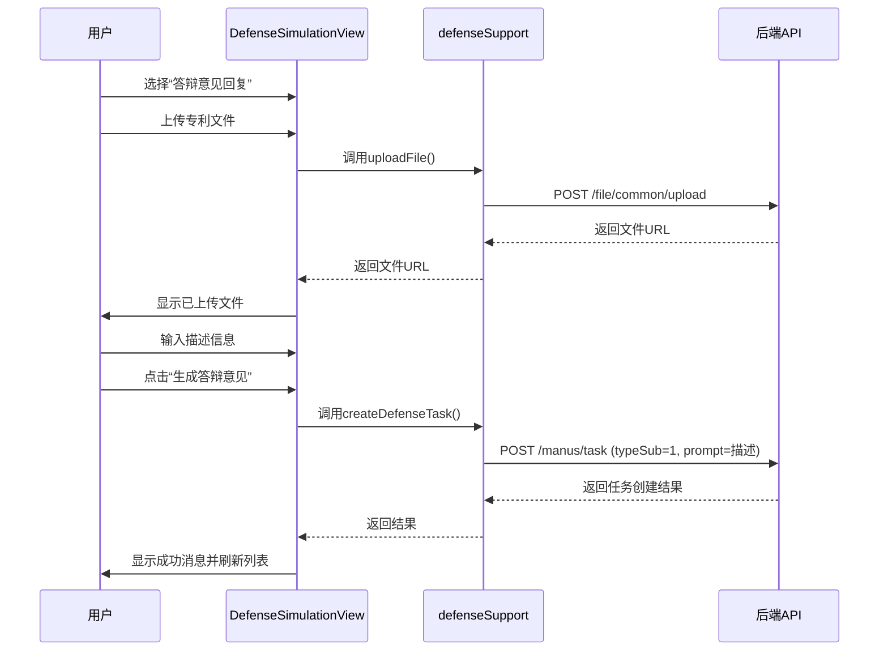
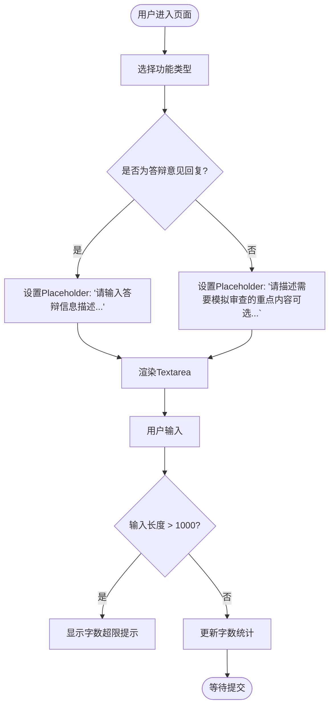
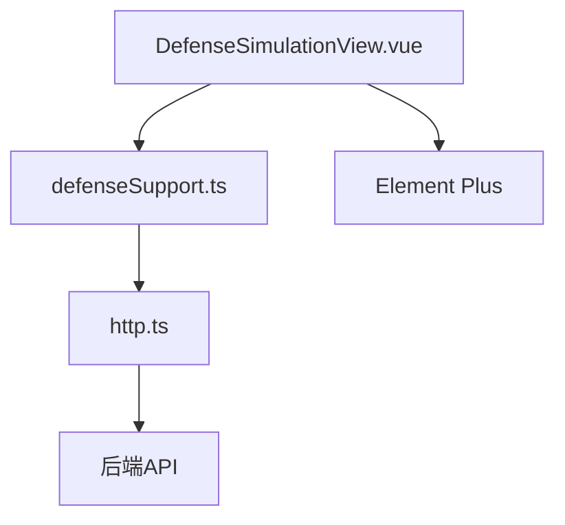

# 策略建议

<cite>
**本文档引用文件**  
- [DefenseStrategyView.vue](file://src/views/defense-support/DefenseStrategyView.vue)
- [DefenseSimulationView.vue](file://src/views/defense-support/DefenseSimulationView.vue)
- [defenseSupport.ts](file://src/services/defenseSupport.ts)
- [DEFENSE_SUPPORT_API_INTEGRATION.md](file://DEFENSE_SUPPORT_API_INTEGRATION.md)
</cite>

## 目录
1. [简介](#简介)
2. [项目结构](#项目结构)
3. [核心组件](#核心组件)
4. [架构概述](#架构概述)
5. [详细组件分析](#详细组件分析)
6. [依赖分析](#依赖分析)
7. [性能考虑](#性能考虑)
8. [故障排除指南](#故障排除指南)
9. [结论](#结论)

## 简介
本文档详细说明了答辩支持功能中“策略建议”模块的设计与实现机制，重点阐述了系统如何基于历史答辩案例数据生成优化建议。特别针对用户选择“答辩意见回复”（typeSub=1）场景，描述了系统如何结合上传的专利文件和用户输入的描述信息（prompt），通过后端API生成针对性的答辩策略。文档还涵盖了描述输入区的交互设计、API集成机制、文件下载功能及有效性校验流程。

## 项目结构
系统采用基于Vue 3的组件化架构，答辩支持功能位于`src/views/defense-support/`目录下，主要包含三个核心视图组件：`DefenseCasesView.vue`（案例管理）、`DefenseSimulationView.vue`（模拟审查与答辩意见回复）和`DefenseStrategyView.vue`（策略建议）。业务逻辑通过`src/services/defenseSupport.ts`服务层与后端API进行交互，相关接口规范定义在`DEFENSE_SUPPORT_API_INTEGRATION.md`文档中。

**文档来源**
- [DefenseStrategyView.vue](file://src/views/defense-support/DefenseStrategyView.vue)
- [DefenseSimulationView.vue](file://src/views/defense-support/DefenseSimulationView.vue)
- [defenseSupport.ts](file://src/services/defenseSupport.ts)

## 核心组件
核心功能由`DefenseSimulationView.vue`组件实现，该组件集成了功能选择、文件上传、描述输入和任务列表展示等关键功能。`defenseSupport.ts`服务提供了文件上传、创建答辩任务和获取任务列表的核心方法。`DefenseStrategyView.vue`作为策略建议的占位组件，目前尚未实现具体功能。

**核心组件来源**
- [DefenseSimulationView.vue](file://src/views/defense-support/DefenseSimulationView.vue#L1-L723)
- [defenseSupport.ts](file://src/services/defenseSupport.ts#L1-L270)

## 架构概述
系统采用前后端分离架构，前端通过Vue组件实现用户界面，利用Element Plus UI库构建交互元素。用户操作通过`defenseSupport.ts`服务层封装的API方法与后端通信。后端根据`typeSub`参数区分“模拟审查”和“答辩意见回复”两种模式，并结合上传的文件和用户输入的`prompt`生成相应的策略文档。

**架构来源**
- [DefenseSimulationView.vue](file://src/views/defense-support/DefenseSimulationView.vue)
- [defenseSupport.ts](file://src/services/defenseSupport.ts)

## 详细组件分析

### 功能选择与策略生成流程
当用户在`DefenseSimulationView.vue`中选择“答辩意见回复”（typeSub=1）时，系统进入策略建议生成模式。此模式要求用户上传专利文件并输入描述信息，系统将这些信息提交至后端以生成针对性的答辩策略。

#### 策略生成序列图

**序列图来源**
- [DefenseSimulationView.vue](file://src/views/defense-support/DefenseSimulationView.vue#L227-L370)
- [defenseSupport.ts](file://src/services/defenseSupport.ts#L100-L150)
- [DEFENSE_SUPPORT_API_INTEGRATION.md](file://DEFENSE_SUPPORT_API_INTEGRATION.md#L110-L131)

### 描述输入区交互设计
描述输入区采用`<el-input type="textarea">`实现，其交互设计遵循用户体验优化原则。

#### 交互设计要点
- **字符限制**：通过`maxlength="1000"`属性严格限制输入长度为1000个字符。
- **字数统计**：通过`show-word-limit`属性自动显示当前输入字数和上限。
- **自适应Placeholder**：使用Vue的`v-bind`绑定`placeholder`属性，根据`selectedFunction`的值动态切换提示文本。
  - 当`selectedFunction === 0`（模拟审查）时，提示为“请描述需要模拟审查的重点内容（可选）...”
  - 当`selectedFunction === 1`（答辩意见回复）时，提示为“请输入答辩信息描述...”

**流程图来源**
- [DefenseSimulationView.vue](file://src/views/defense-support/DefenseSimulationView.vue#L112-L120)

### API集成与Prompt字段作用
`createDefenseTask`接口是生成策略建议的核心，`prompt`字段在其中扮演着至关重要的角色。

#### API请求参数表
| 参数名 | 类型 | 必填 | 说明 |
| :--- | :--- | :--- | :--- |
| `fileUrls` | string[] | 是 | 上传的专利文件URL数组 |
| `prompt` | string | 是 | 用户输入的描述信息，用于指导策略生成 |
| `type` | number | 是 | 固定值5，表示“答辩支持”功能 |
| `typeSub` | number | 是 | 子类型：0=模拟审查，1=答辩意见回复 |

`prompt`字段作为必填参数，是后端AI模型生成个性化策略建议的主要依据。它包含了用户对当前专利和审查意见的具体描述，使生成的策略更具针对性和实用性。

**表格来源**
- [DEFENSE_SUPPORT_API_INTEGRATION.md](file://DEFENSE_SUPPORT_API_INTEGRATION.md#L110-L131)
- [defenseSupport.ts](file://src/services/defenseSupport.ts#L100-L150)

### 策略文档下载与校验
生成的策略文档以PDF和Word格式提供下载，系统内置了有效性校验机制。

#### 下载功能实现
- **下载按钮**：在任务列表中，为每个已完成的任务提供“下载PDF”和“下载Word”按钮。
- **禁用逻辑**：按钮通过`:disabled="!item.pdfUrl"`（或`!item.wordUrl`）进行绑定，当对应文件URL为空时，按钮自动禁用。
- **下载流程**：
  1. 用户点击下载按钮。
  2. 前端检查文件URL是否存在。
  3. 若URL存在，则创建一个隐藏的`<a>`标签，设置其`href`为文件URL，并触发点击事件进行下载。
  4. 若直接下载失败，则在新窗口打开文件链接。

#### 文件链接有效性校验
系统的有效性校验是隐式的，主要通过以下方式实现：
1. **前端校验**：在渲染下载按钮时，检查`pdfUrl`和`wordUrl`字段是否为空。
2. **后端保障**：后端在任务状态为“已完成”（state=1）时，确保已生成并存储了PDF和Word文件，并将正确的URL写入数据库。

**功能来源**
- [DefenseSimulationView.vue](file://src/views/defense-support/DefenseSimulationView.vue#L121-L148)

## 依赖分析
前端组件间存在明确的依赖关系。`DefenseSimulationView.vue`依赖于`defenseSupport.ts`服务来处理所有API通信。`defenseSupport.ts`服务又依赖于`http.ts`中的`request`对象进行底层HTTP请求。UI组件依赖Element Plus库。后端API是整个功能的核心依赖，其稳定性和正确性直接决定了前端功能的可用性。

**依赖来源**
- [DefenseSimulationView.vue](file://src/views/defense-support/DefenseSimulationView.vue#L227)
- [defenseSupport.ts](file://src/services/defenseSupport.ts#L1)

## 性能考虑
系统在性能方面进行了多项优化：
- **图片懒加载**：任务列表中的图片使用`loading="lazy"`属性，仅在进入视口时才加载，减少初始页面加载时间。
- **即时上传**：文件采用即时上传模式，用户选择文件后立即上传至服务器，避免了在提交大表单时的长时间等待。
- **分页查询**：任务列表采用分页机制（`pageIndex`, `pageSize`），避免一次性加载过多数据。
- **状态筛选**：提供状态筛选功能，允许用户快速定位特定状态的任务，减少数据处理量。

## 故障排除指南
当策略建议功能出现问题时，可按以下步骤排查：

1. **文件上传失败**
   - 检查文件格式是否为PDF、DOC或DOCX。
   - 检查文件大小是否超过10MB。
   - 检查网络连接是否正常。
   - 检查用户是否已登录（Token是否过期）。

2. **任务提交失败**
   - 确认至少上传了一个文件。
   - 确认`prompt`字段已填写（答辩意见回复模式下为必填）。
   - 检查浏览器控制台是否有JavaScript错误。

3. **无法下载文件**
   - 检查任务状态是否为“已完成”。未完成的任务不会生成文件。
   - 检查`pdfUrl`/`wordUrl`字段是否为空。若为空，说明后端生成文件失败。
   - 尝试刷新任务列表，看文件是否已生成。

**故障排除来源**
- [DEFENSE_SUPPORT_API_INTEGRATION.md](file://DEFENSE_SUPPORT_API_INTEGRATION.md#L250-L298)
- [defenseSupport.ts](file://src/services/defenseSupport.ts#L10-L98)

## 结论
本系统通过`DefenseSimulationView.vue`组件和`defenseSupport.ts`服务的协同工作，实现了基于用户输入和上传文件的智能策略建议生成功能。当用户选择“答辩意见回复”时，系统通过`createDefenseTask` API，将`prompt`描述作为关键输入，驱动后端生成高度个性化的答辩策略。交互设计上，通过自适应的placeholder和实时字数统计提升了用户体验。文件下载功能通过前端校验和后端保障相结合的方式，确保了链接的有效性。整体设计合理，功能完整，为用户提供了一套高效、便捷的答辩支持工具。