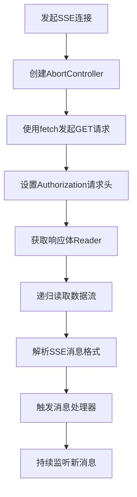
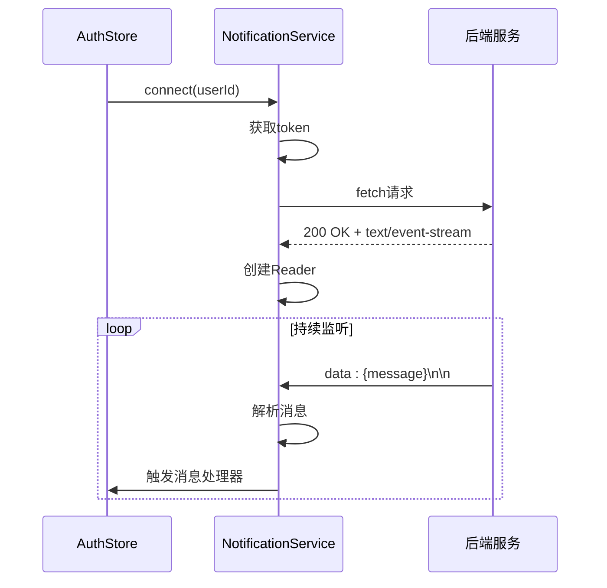
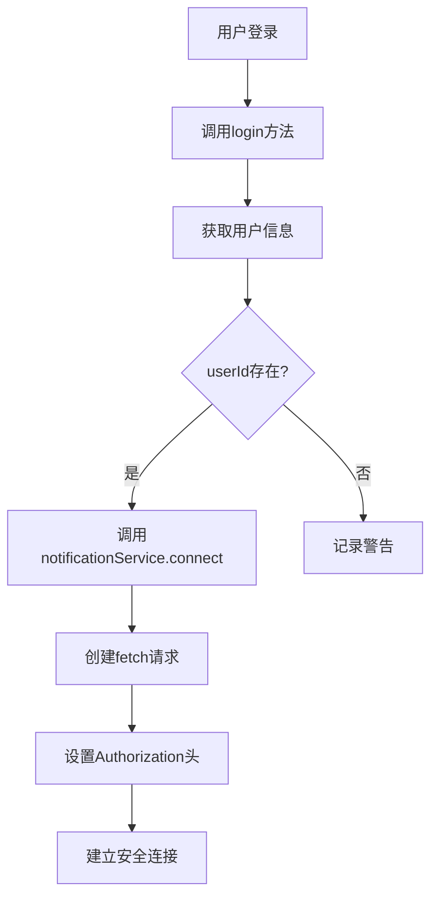
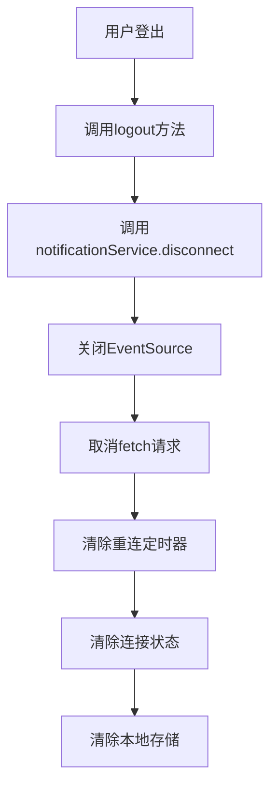
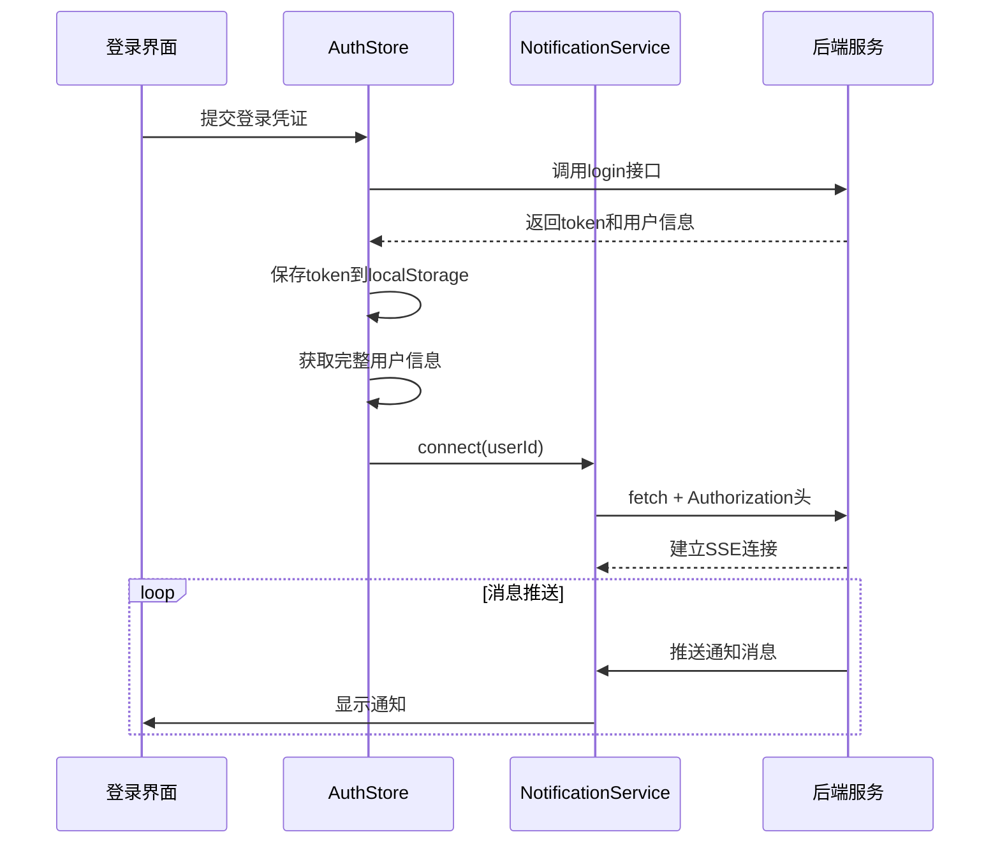
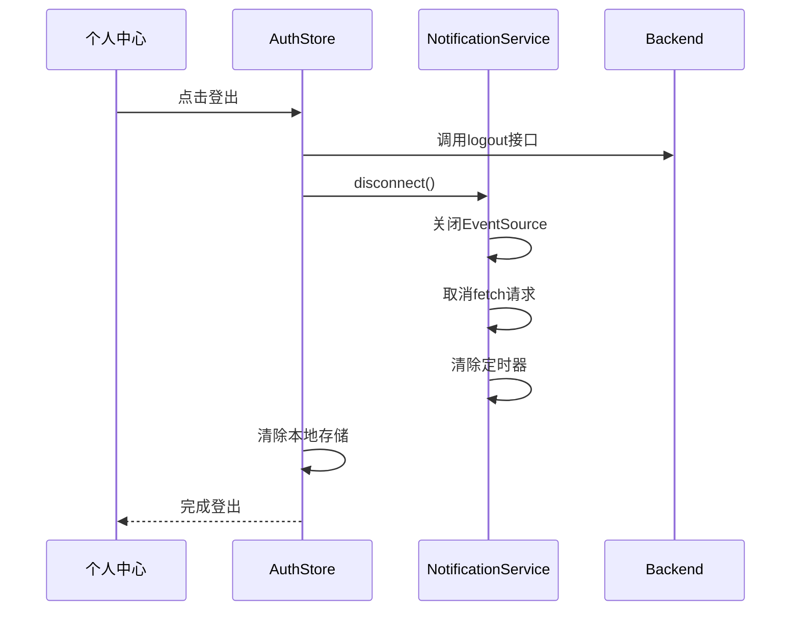
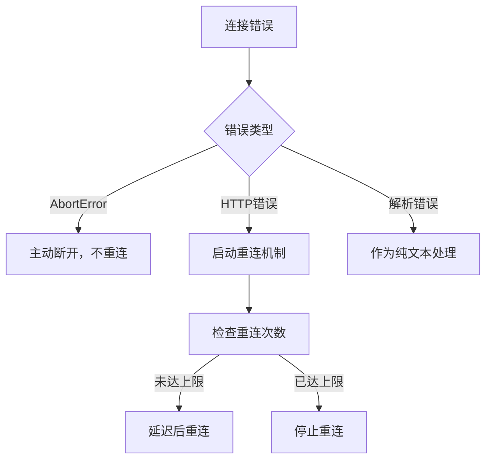

# SSE安全集成机制

<cite>
**Referenced Files in This Document**   
- [SSE_TOKEN_AUTH_CHANGE.md](file://SSE_TOKEN_AUTH_CHANGE.md)
- [src/stores/auth.ts](file://src/stores/auth.ts)
- [src/services/notification.ts](file://src/services/notification.ts)
</cite>

## 目录
1. [引言](#引言)
2. [认证方式演进](#认证方式演进)
3. [技术挑战与解决方案](#技术挑战与解决方案)
4. [核心组件分析](#核心组件分析)
5. [SSE连接生命周期管理](#sse连接生命周期管理)
6. [安全连接实现流程](#安全连接实现流程)
7. [错误处理与重连机制](#错误处理与重连机制)
8. [最佳实践与注意事项](#最佳实践与注意事项)
9. [结论](#结论)

## 引言
本文档深入解析专利服务平台中基于token的SSE（Server-Sent Events）连接安全机制。随着系统安全要求的提升，原有的URL参数传递token方式已被弃用，转而采用符合标准的Authorization请求头认证方式。本文档详细阐述了这一安全机制的演进过程、技术实现细节以及完整的连接管理流程。

## 认证方式演进

### 从URL参数到请求头
在系统早期版本中，SSE连接通过URL查询参数传递token：
```
https://patent.langdetech.cn/api/sse/connect/1?token=xxx
```
这种方式存在明显的安全缺陷，因为token会暴露在浏览器历史记录、服务器日志和网络监控中。

### 标准化认证方式
根据后端接口规范，token应通过标准的`Authorization`请求头传递：
```
Authorization: <token>
Accept: text/event-stream
Cache-Control: no-cache
```
这种方式符合HTTP认证标准，有效保护了敏感信息。

**Section sources**
- [SSE_TOKEN_AUTH_CHANGE.md](file://SSE_TOKEN_AUTH_CHANGE.md#L1-L50)

## 技术挑战与解决方案

### EventSource的限制
标准的`EventSource` API存在一个关键限制：**不支持自定义请求头**。这使得无法通过`Authorization`头传递token，迫使系统寻找替代方案。

### fetch API + ReadableStream方案
采用fetch API结合ReadableStream的解决方案，完美解决了这一限制：



**Diagram sources**
- [src/services/notification.ts](file://src/services/notification.ts#L50-L150)

**Section sources**
- [SSE_TOKEN_AUTH_CHANGE.md](file://SSE_TOKEN_AUTH_CHANGE.md#L50-L100)

## 核心组件分析

### NotificationService实现
`NotificationService`类是SSE连接的核心管理组件，实现了完整的连接生命周期管理。

#### 连接建立流程


**Diagram sources**
- [src/services/notification.ts](file://src/services/notification.ts#L50-L200)

#### 消息解析机制
服务端发送的SSE消息格式为：
```
data: {"id":"123","title":"标题","message":"内容","type":"info"}
```
客户端通过`parseSSEMessage`方法解析该格式，提取JSON数据并转换为通知对象。

**Section sources**
- [src/services/notification.ts](file://src/services/notification.ts#L200-L250)

## SSE连接生命周期管理

### 连接建立
当用户成功登录后，系统立即建立SSE连接：



**Diagram sources**
- [src/stores/auth.ts](file://src/stores/auth.ts#L50-L100)

### 连接断开
用户登出时，系统安全断开SSE连接：



**Diagram sources**
- [src/stores/auth.ts](file://src/stores/auth.ts#L180-L200)

**Section sources**
- [src/stores/auth.ts](file://src/stores/auth.ts#L50-L200)

## 安全连接实现流程

### 完整连接流程


**Diagram sources**
- [src/stores/auth.ts](file://src/stores/auth.ts#L50-L100)
- [src/services/notification.ts](file://src/services/notification.ts#L50-L150)

### 安全断开流程


**Diagram sources**
- [src/stores/auth.ts](file://src/stores/auth.ts#L180-L200)

## 错误处理与重连机制

### 错误处理策略
系统实现了多层次的错误处理机制：



**Section sources**
- [src/services/notification.ts](file://src/services/notification.ts#L150-L250)

### 重连机制
系统实现了智能重连机制，最多尝试5次，每次间隔3秒：

```typescript
private maxReconnectAttempts = 5
private reconnectDelay = 3000
```

**Section sources**
- [src/services/notification.ts](file://src/services/notification.ts#L20-L30)

## 最佳实践与注意事项

### CORS配置
后端必须正确配置CORS，允许前端域名访问，并允许`Authorization`请求头：

```
Access-Control-Allow-Origin: *
Access-Control-Allow-Headers: Authorization, Accept, Cache-Control
```

### Token管理
确保token不包含双引号，从localStorage读取时需正确解析。

### 连接保持
SSE连接会长时间保持，后端需支持长连接，前端需实现心跳机制。

**Section sources**
- [SSE_TOKEN_AUTH_CHANGE.md](file://SSE_TOKEN_AUTH_CHANGE.md#L200-L250)

## 结论
通过采用fetch API + ReadableStream方案，系统成功实现了基于Authorization请求头的安全SSE连接机制。该方案不仅解决了EventSource不支持自定义请求头的技术限制，还提升了系统的整体安全性。结合完善的连接生命周期管理、错误处理和重连机制，为用户提供了稳定可靠的消息推送服务。