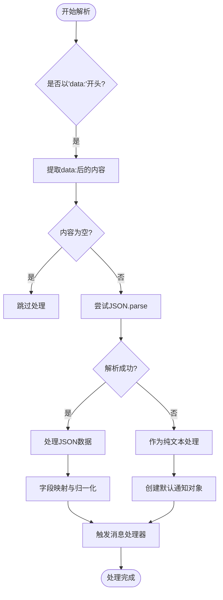
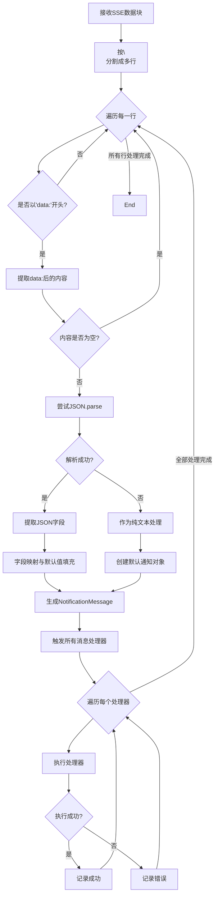

# SSE消息解析机制

<cite>
**本文档引用文件**   
- [notification.ts](file://src/services/notification.ts)
- [AppHeader.vue](file://src/layouts/AppHeader.vue)
- [index.ts](file://src/types/index.ts)
- [SSE_MESSAGE_PARSE_FIX.md](file://SSE_MESSAGE_PARSE_FIX.md)
- [SSE_CONNECTION_MESSAGE_FILTER.md](file://SSE_CONNECTION_MESSAGE_FILTER.md)
- [SSE_NOTIFICATION_DISPLAY_FIX.md](file://SSE_NOTIFICATION_DISPLAY_FIX.md)
</cite>

## 目录
1. [引言](#引言)
2. [核心数据结构](#核心数据结构)
3. [SSE消息解析流程](#sse消息解析流程)
4. [异常处理策略](#异常处理策略)
5. [消息处理器机制](#消息处理器机制)
6. [实际日志分析](#实际日志分析)
7. [字段映射与类型归一化](#字段映射与类型归一化)
8. [完整处理流程图](#完整处理流程图)

## 引言
本文档详细说明了专利服务平台中SSE（Server-Sent Events）消息的解析流程与实现逻辑。基于`src/services/notification.ts`中的`parseSSEMessage`方法，深入分析了SSE标准格式消息块的处理机制，包括数据流分割、前缀识别、JSON安全解析等关键技术点。文档还阐述了异常处理策略、消息对象转换规则以及消息处理器的触发机制，确保系统能够可靠地接收和处理各类通知消息。

## 核心数据结构

### 通知消息接口定义
系统定义了标准的`NotificationMessage`接口，用于统一消息格式：

```typescript
export interface NotificationMessage {
  id: string
  title: string
  message: string
  time: string
  read: boolean
  type?: 'info' | 'success' | 'warning' | 'error'
}
```

该接口规定了通知消息必须包含的基本属性，包括唯一标识、标题、内容、时间戳、已读状态和消息类型。

**Section sources**
- [index.ts](file://src/types/index.ts#L2-L9)

## SSE消息解析流程

### 数据流分割机制
SSE消息解析的第一步是将接收到的数据块按换行符分割。系统采用`split('\n')`方法将数据流分解为多行，逐行处理：

```typescript
const lines = chunk.split('\n')
```

这种处理方式能够有效应对SSE协议中可能存在的多行消息块，确保每条消息都能被正确识别和处理。

### 前缀识别与数据提取
系统通过`startsWith('data:')`方法识别SSE消息的标准前缀，然后使用`substring(5).trim()`提取实际消息内容：

```typescript
if (line.startsWith('data:')) {
  const dataStr = line.substring(5).trim()
  if (!dataStr) continue
}
```

此机制能够准确识别并提取以`data:`开头的消息行，同时通过`trim()`方法去除首尾空白字符，确保数据的纯净性。

**Section sources**
- [notification.ts](file://src/services/notification.ts#L152-L155)

## 异常处理策略

### JSON解析容错机制
系统采用双重解析策略，优先尝试JSON解析，失败时自动降级为纯文本处理：



**Diagram sources**
- [notification.ts](file://src/services/notification.ts#L150-L211)

当JSON解析失败时，系统不会丢弃消息，而是将其作为纯文本内容处理，确保消息不丢失：

```typescript
notification = {
  id: `notification_${Date.now()}`,
  title: '系统通知',
  message: dataStr,
  time: new Date().toISOString(),
  read: false,
  type: 'info'
}
```

这种容错机制极大地提高了系统的健壮性，能够处理各种格式的消息。

**Section sources**
- [notification.ts](file://src/services/notification.ts#L174-L186)
- [SSE_MESSAGE_PARSE_FIX.md](file://SSE_MESSAGE_PARSE_FIX.md#L0-L37)

## 消息处理器机制

### 处理器注册与管理
系统提供`onMessage`方法用于注册消息处理器，支持动态添加和移除：

```typescript
onMessage(handler: (message: NotificationMessage) => void): () => void {
  this.messageHandlers.push(handler)
  return () => {
    const index = this.messageHandlers.indexOf(handler)
    if (index > -1) {
      this.messageHandlers.splice(index, 1)
    }
  }
}
```

该方法返回一个取消注册函数，便于组件在销毁时清理资源，避免内存泄漏。

### 消息广播机制
系统采用广播模式，确保所有注册的处理器都能接收到通知：

```typescript
this.messageHandlers.forEach((handler, index) => {
  try {
    handler(notification)
  } catch (error) {
    console.error(`处理器 ${index + 1} 执行失败:`, error)
  }
})
```

每个处理器都被try-catch包裹，实现错误隔离，确保一个处理器的失败不会影响其他处理器的执行。

**Section sources**
- [notification.ts](file://src/services/notification.ts#L270-L284)

## 实际日志分析

### 解析过程日志
系统通过详细的日志输出，便于调试和监控消息解析过程：

```
=== SSE Service: 解析消息 ===
数据字符串: 连接成功: 2
=== SSE Service: JSON 解析失败，将消息作为纯文本处理 ===
作为纯文本处理: {
  id: "notification_1234567890",
  title: "系统通知",
  message: "连接成功: 2",
  type: "info"
}
转换后的通知对象: { ... }
=== SSE Service: 触发消息处理器 ===
处理器数量: 1
执行处理器 1
处理器 1 执行成功
```

这些日志清晰地展示了从原始数据到最终通知对象的完整转换过程。

**Section sources**
- [SSE_MESSAGE_PARSE_FIX.md](file://SSE_MESSAGE_PARSE_FIX.md#L172-L254)

## 字段映射与类型归一化

### 灵活的字段映射
系统支持多种字段名称的兼容，提高了与不同后端服务的兼容性：

```typescript
message: data.message || data.content || data.msg || ''
```

这种"或"操作符链式调用的方式，能够识别`message`、`content`、`msg`等多种字段名，确保消息内容不丢失。

### 默认值填充
系统为可能缺失的字段提供了合理的默认值：

```typescript
notification = {
  id: data.id || `notification_${Date.now()}`,
  title: data.title || '新消息',
  message: data.message || data.content || data.msg || '',
  time: data.time || new Date().toISOString(),
  read: false,
  type: data.type || 'info'
}
```

这种设计确保了即使后端消息不完整，也能生成符合规范的`NotificationMessage`对象。

**Section sources**
- [SSE_MESSAGE_PARSE_FIX.md](file://SSE_MESSAGE_PARSE_FIX.md#L76-L132)

## 完整处理流程图



**Diagram sources**
- [notification.ts](file://src/services/notification.ts#L150-L211)
- [SSE_MESSAGE_PARSE_FIX.md](file://SSE_MESSAGE_PARSE_FIX.md#L76-L170)