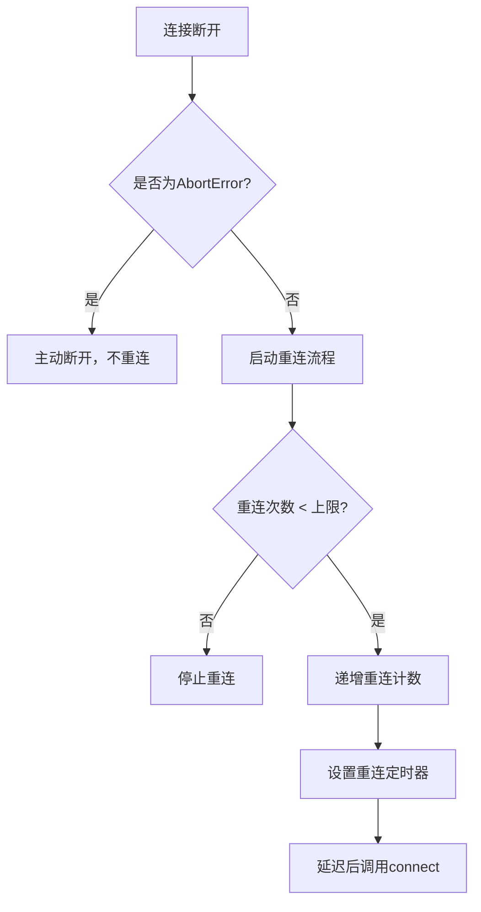
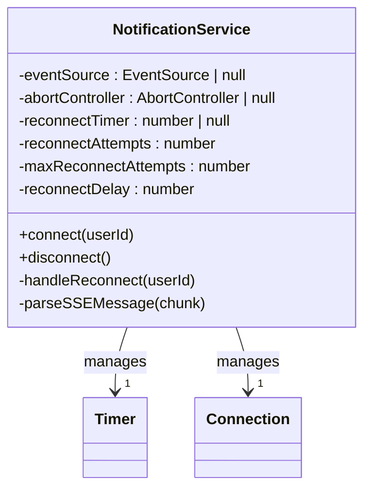
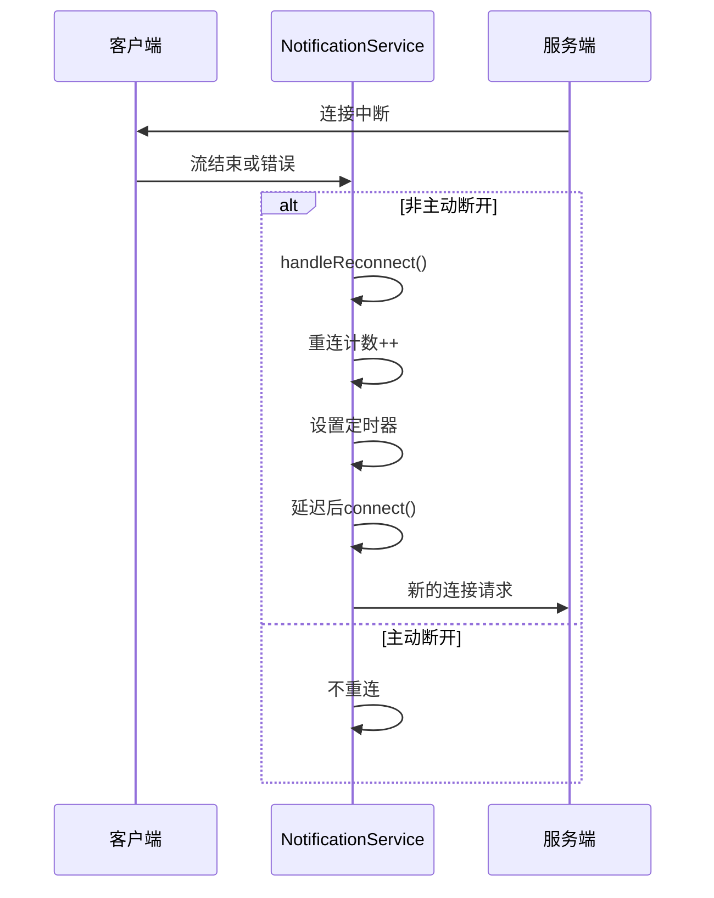

# SSE自动重连策略

<cite>
**Referenced Files in This Document**  
- [notification.ts](file://src/services/notification.ts)
- [AppHeader.vue](file://src/layouts/AppHeader.vue)
- [SSE_NOTIFICATION_INTEGRATION.md](file://SSE_NOTIFICATION_INTEGRATION.md)
- [SSE_DEBUG_GUIDE.md](file://SSE_DEBUG_GUIDE.md)
</cite>

## 目录
1. [引言](#引言)
2. [核心重连机制](#核心重连机制)
3. [重连参数配置](#重连参数配置)
4. [定时器管理与内存安全](#定时器管理与内存安全)
5. [重连失败处理策略](#重连失败处理策略)
6. [用户无感知体验设计](#用户无感知体验设计)
7. [实际错误场景应对](#实际错误场景应对)
8. [系统集成与生命周期管理](#系统集成与生命周期管理)
9. [调试与监控](#调试与监控)
10. [总结](#总结)

## 引言

SSE（Server-Sent Events）自动重连机制是保障实时通知系统稳定性的核心组件。当网络中断或服务端异常导致连接断开时，该机制能够自动尝试重新建立连接，确保用户不会错过重要通知。本文档深入解析基于`src/services/notification.ts`中`handleReconnect`方法实现的重连策略，涵盖重试逻辑、定时器管理、失败处理和用户体验设计等多个方面。

**Section sources**
- [notification.ts](file://src/services/notification.ts#L216-L231)

## 核心重连机制

SSE自动重连机制的核心是`handleReconnect`方法，它在连接意外断开时被触发。该方法通过递归调用`connect`方法实现自动重连，确保在各种异常情况下都能尝试恢复连接。

重连流程在多个关键点被触发：
- 当`fetch`请求的响应流被关闭（`done`为`true`）时
- 当读取响应流过程中发生非`AbortError`的错误时
- 当`fetch`请求本身发生网络或服务器错误时

这种设计确保了无论是服务端主动关闭连接、网络中断还是其他异常情况，系统都能立即启动重连流程。



**Diagram sources**
- [notification.ts](file://src/services/notification.ts#L216-L231)
- [notification.ts](file://src/services/notification.ts#L25-L145)

**Section sources**
- [notification.ts](file://src/services/notification.ts#L25-L145)
- [notification.ts](file://src/services/notification.ts#L216-L231)

## 重连参数配置

重连机制通过两个关键参数进行配置：最大重试次数和重试间隔，这些参数在`NotificationService`类中作为私有属性定义。

### 最大重试次数 (maxReconnectAttempts)

`maxReconnectAttempts`属性设置为5，表示系统最多尝试5次重连。这一限制防止了在网络长期不可用的情况下无限重试，消耗客户端资源。

```typescript
private maxReconnectAttempts = 5
```

当重连次数达到上限时，系统将停止重连并记录错误日志，避免无谓的资源消耗。

### 重试间隔 (reconnectDelay)

`reconnectDelay`属性设置为3000毫秒（3秒），表示每次重连尝试之间的基本延迟时间。

```typescript
private reconnectDelay = 3000
```

虽然当前实现使用固定延迟，但代码结构为未来实现指数退避策略提供了基础。指数退避策略可以进一步优化，在连续重试失败时逐渐增加延迟时间，减轻服务器压力并提高在网络波动时的成功率。

**Section sources**
- [notification.ts](file://src/services/notification.ts#L216-L231)

## 定时器管理与内存安全

重连定时器的管理是防止内存泄漏和重复调度的关键。系统通过`reconnectTimer`属性来跟踪当前的定时器ID，并在适当的时候进行清理。

### 避免重复调度

在每次建立新连接时，系统会检查并清除任何现有的重连定时器：

```typescript
if (this.reconnectTimer) {
  clearTimeout(this.reconnectTimer)
  this.reconnectTimer = null
}
```

这一机制确保了即使在短时间内多次调用`connect`方法，也不会创建多个重连定时器，避免了重复调度问题。

### 内存泄漏防护

系统在多个关键点清理定时器，确保不会发生内存泄漏：

1. **成功连接时**：在收到有效响应后，立即清除重连定时器
2. **手动断开时**：在`disconnect`方法中清除重连定时器
3. **重连前**：在每次重连尝试前检查并清除旧定时器

这种全面的清理策略确保了无论连接是正常断开、异常断开还是成功重建，都不会留下悬挂的定时器。



**Diagram sources**
- [notification.ts](file://src/services/notification.ts#L216-L231)
- [notification.ts](file://src/services/notification.ts#L236-L263)

**Section sources**
- [notification.ts](file://src/services/notification.ts#L216-L231)
- [notification.ts](file://src/services/notification.ts#L236-L263)

## 重连失败处理策略

当重连机制达到最大重试次数后，系统采取明确的失败处理策略，确保系统的稳定性和可预测性。

### 停止重连

一旦`reconnectAttempts`达到`maxReconnectAttempts`的上限，系统将停止所有重连尝试：

```typescript
if (this.reconnectAttempts >= this.maxReconnectAttempts) {
  console.error('=== SSE Service: 重连次数已达上限，停止重连 ===')
  console.error(`已尝试 ${this.reconnectAttempts} 次重连`)
  return
}
```

这种设计避免了在网络长期不可用的情况下持续消耗客户端资源。

### 错误日志记录

系统在重连失败时记录详细的错误日志，包括：
- 重连次数已达上限的明确提示
- 已尝试的重连次数统计
- 相关的错误信息

这些日志为后续的故障排查和系统监控提供了重要依据。

### 状态重置

虽然在达到重连上限时不会自动重置重连计数器，但系统提供了`disconnect`方法来手动重置状态。当用户重新登录或手动触发连接时，系统会重置重连计数器，允许新的重连周期开始。

**Section sources**
- [notification.ts](file://src/services/notification.ts#L216-L231)

## 用户无感知体验设计

SSE重连机制的设计目标之一是为用户提供无感知的后台重连体验，确保用户不会因为短暂的网络波动而中断服务。

### 后台静默重连

重连过程完全在后台进行，不会弹出任何提示或中断用户当前的操作。用户可能只会注意到通知的短暂延迟，而不会感知到连接的中断和恢复过程。

### 连接状态透明

虽然重连是静默的，但系统提供了查询连接状态的接口：

```typescript
getConnectionState()
isConnected()
```

这些方法允许上层应用在需要时检查连接状态，实现更精细的用户体验控制。

### 消息完整性保障

重连成功后，系统会继续接收新的通知消息。虽然当前实现不保证重连期间丢失消息的补发，但通过快速重连机制最小化了消息丢失的窗口期。

**Section sources**
- [notification.ts](file://src/services/notification.ts#L216-L231)

## 实际错误场景应对

SSE重连机制针对多种实际错误场景进行了专门设计，确保在各种异常情况下都能正确处理。

### 网络中断

当网络连接中断时，`fetch`请求会超时或失败，触发`catch`块中的错误处理逻辑，进而调用`handleReconnect`方法启动重连流程。

### 服务端异常

如果服务端返回非200状态码，系统会抛出HTTP错误，同样触发重连机制。这包括服务端内部错误、认证失败等各种情况。

### 连接被主动断开

系统能够区分主动断开和被动断开：
- **主动断开**：由`AbortController.abort()`触发，`error.name`为`AbortError`，此时不进行重连
- **被动断开**：由网络问题或服务端关闭触发，会启动重连流程

这种区分确保了在用户登出或页面关闭等正常场景下不会进行不必要的重连尝试。



**Diagram sources**
- [notification.ts](file://src/services/notification.ts#L25-L145)
- [notification.ts](file://src/services/notification.ts#L216-L231)

**Section sources**
- [notification.ts](file://src/services/notification.ts#L25-L145)
- [notification.ts](file://src/services/notification.ts#L216-L231)

## 系统集成与生命周期管理

SSE重连机制与应用的生命周期紧密集成，确保在各种场景下都能正确管理连接状态。

### 组件挂载时

在`AppHeader.vue`组件的`onMounted`生命周期钩子中，如果用户已登录，则调用`connectSSE`方法建立连接。

### 组件卸载时

在`onUnmounted`钩子中，系统会取消消息监听并断开SSE连接，避免内存泄漏。

### 用户状态变化时

通过`watch`监听用户信息变化，当用户登录时建立连接，登出时断开连接。

```typescript
watch(() => props.user, (newUser) => {
  if (newUser?.userId) {
    connectSSE(newUser.userId)
  } else {
    // 用户登出，断开连接
    if (unsubscribe) {
      unsubscribe()
    }
    notificationService.disconnect()
    notifications.value = []
  }
})
```

**Section sources**
- [AppHeader.vue](file://src/layouts/AppHeader.vue#L158-L188)

## 调试与监控

系统提供了完善的调试和监控机制，便于开发和运维人员排查问题。

### 详细的调试日志

系统在关键操作点输出详细的调试日志，包括：
- 连接建立的各个阶段
- 重连尝试的详细信息
- 消息接收和处理过程
- 连接状态变化

### 连接状态查询

提供了`getConnectionState`和`isConnected`方法，允许在运行时查询连接状态。

### 错误处理日志

在各种错误场景下输出明确的错误信息，包括：
- 未找到token
- 连接错误
- 读取流错误
- 重连次数上限

**Section sources**
- [SSE_DEBUG_GUIDE.md](file://SSE_DEBUG_GUIDE.md#L0-L358)
- [SSE_NOTIFICATION_INTEGRATION.md](file://SSE_NOTIFICATION_INTEGRATION.md#L0-L262)

## 总结

SSE自动重连机制通过精心设计的`handleReconnect`方法，实现了可靠、高效的连接恢复能力。该机制通过限制最大重试次数、管理重连定时器、区分主动和被动断开等策略，确保了系统的稳定性和资源效率。与应用生命周期的紧密集成，以及详细的调试日志，使得该机制既可靠又易于维护。未来可以通过实现指数退避策略和消息补发机制，进一步提升系统的健壮性和用户体验。