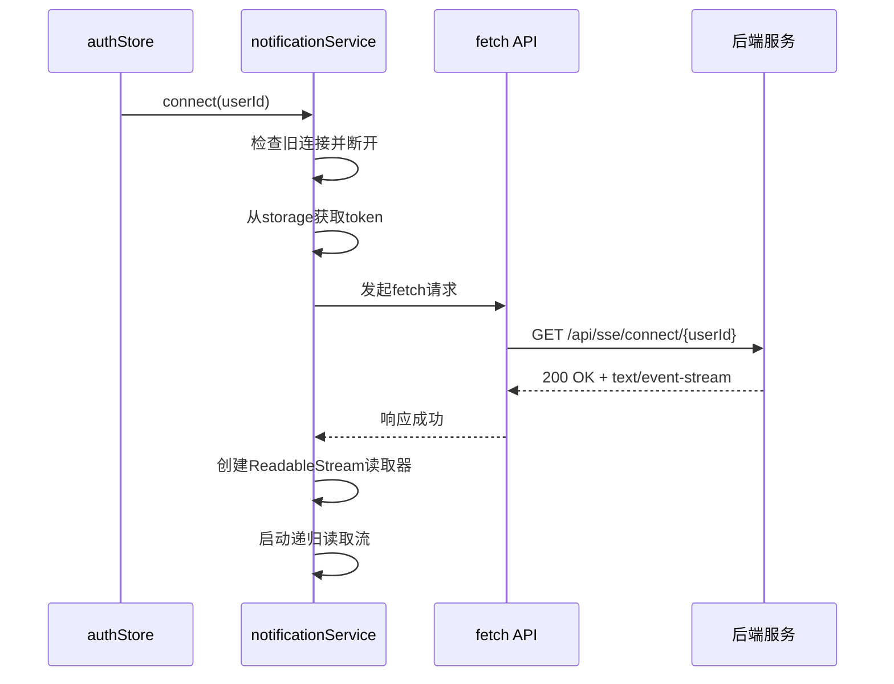
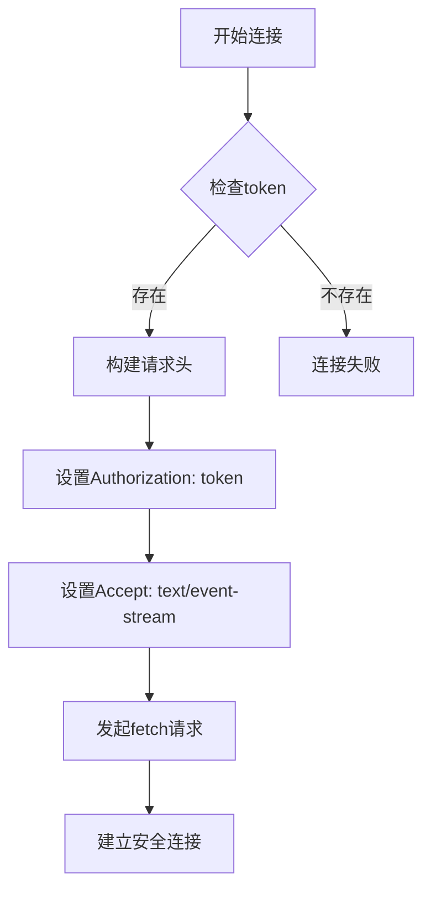
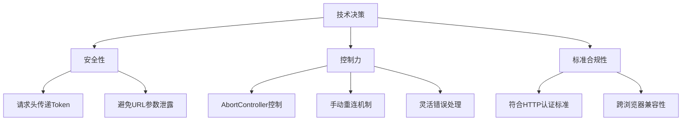
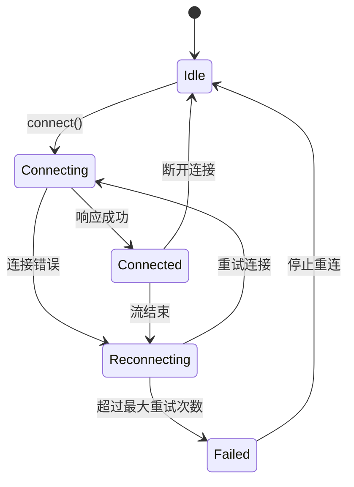
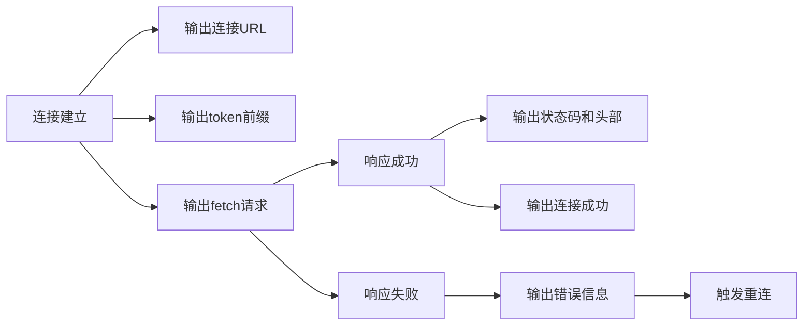
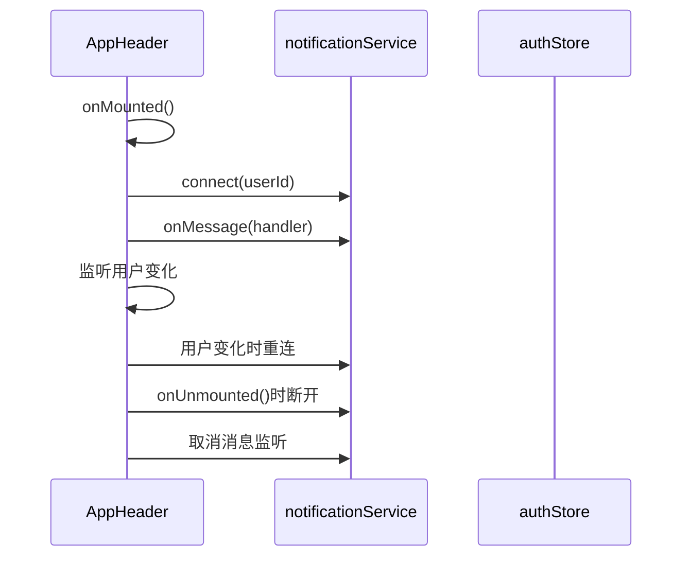
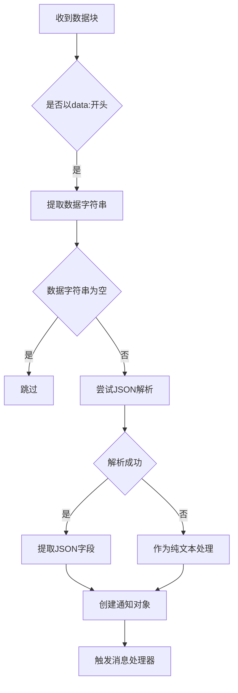

# SSE连接建立机制

<cite>
**本文档引用文件**  
- [notification.ts](file://src/services/notification.ts)
- [auth.ts](file://src/services/auth.ts)
- [AppHeader.vue](file://src/layouts/AppHeader.vue)
- [auth.ts](file://src/stores/auth.ts)
- [index.ts](file://src/utils/index.ts)
- [SSE_TOKEN_AUTH_CHANGE.md](file://SSE_TOKEN_AUTH_CHANGE.md)
- [SSE_DEBUG_GUIDE.md](file://SSE_DEBUG_GUIDE.md)
- [SSE_MESSAGE_PARSE_FIX.md](file://SSE_MESSAGE_PARSE_FIX.md)
- [SSE_NOTIFICATION_INTEGRATION.md](file://SSE_NOTIFICATION_INTEGRATION.md)
</cite>

## 目录
1. [引言](#引言)
2. [连接初始化流程](#连接初始化流程)
3. [安全认证机制](#安全认证机制)
4. [技术决策分析](#技术决策分析)
5. [错误处理与重连机制](#错误处理与重连机制)
6. [日志输出与调试方法](#日志输出与调试方法)
7. [组件集成与生命周期管理](#组件集成与生命周期管理)
8. [消息解析机制](#消息解析机制)
9. [结论](#结论)

## 引言

本系统实现了基于SSE（Server-Sent Events）的实时通知推送功能，通过fetch API与ReadableStream的组合替代传统的EventSource，解决了认证安全性和连接控制力的关键问题。该机制在用户登录后自动建立长连接，实现后端主动向前端推送实时消息的功能，为专利服务平台提供了高效、安全的实时通信能力。

**Section sources**
- [SSE_NOTIFICATION_INTEGRATION.md](file://SSE_NOTIFICATION_INTEGRATION.md#L1-L20)

## 连接初始化流程

SSE连接的建立始于用户成功登录后，系统通过一系列协调的组件调用完成连接初始化。整个流程从用户认证开始，经过用户信息获取，最终触发SSE服务的连接方法。

**Diagram sources**
- [notification.ts](file://src/services/notification.ts#L25-L145)
- [auth.ts](file://src/stores/auth.ts#L100-L150)

**Section sources**
- [notification.ts](file://src/services/notification.ts#L25-L145)
- [auth.ts](file://src/stores/auth.ts#L100-L150)

## 安全认证机制

系统采用基于请求头的Token认证机制，避免了将敏感认证信息暴露在URL中的安全风险。通过Authorization请求头传递JWT令牌，符合现代Web应用的安全最佳实践。

**Diagram sources**
- [notification.ts](file://src/services/notification.ts#L44-L83)
- [SSE_TOKEN_AUTH_CHANGE.md](file://SSE_TOKEN_AUTH_CHANGE.md#L30-L60)

**Section sources**
- [notification.ts](file://src/services/notification.ts#L44-L83)
- [SSE_TOKEN_AUTH_CHANGE.md](file://SSE_TOKEN_AUTH_CHANGE.md#L30-L60)

## 技术决策分析

系统弃用原生EventSource而采用fetch+ReadableStream的技术方案，主要基于安全性、控制力和标准合规性三方面的考量。这一决策解决了传统SSE实现中的关键限制。

**Diagram sources**
- [SSE_TOKEN_AUTH_CHANGE.md](file://SSE_TOKEN_AUTH_CHANGE.md#L70-L140)
- [notification.ts](file://src/services/notification.ts#L82-L124)

**Section sources**
- [SSE_TOKEN_AUTH_CHANGE.md](file://SSE_TOKEN_AUTH_CHANGE.md#L70-L140)

## 错误处理与重连机制

系统实现了完善的错误处理和自动重连机制，确保在各种网络异常情况下仍能维持可靠的连接。当连接中断时，系统会自动尝试重新连接，最多重试5次，每次间隔3秒。

**Diagram sources**
- [notification.ts](file://src/services/notification.ts#L199-L237)
- [SSE_DEBUG_GUIDE.md](file://SSE_DEBUG_GUIDE.md#L225-L284)

**Section sources**
- [notification.ts](file://src/services/notification.ts#L199-L237)

## 日志输出与调试方法

系统提供了详细的调试日志，帮助开发者追踪连接状态和排查问题。每个关键操作都会输出结构化的日志信息，便于监控和故障诊断。

**Diagram sources**
- [SSE_DEBUG_GUIDE.md](file://SSE_DEBUG_GUIDE.md#L0-L75)
- [notification.ts](file://src/services/notification.ts#L82-L124)

**Section sources**
- [SSE_DEBUG_GUIDE.md](file://SSE_DEBUG_GUIDE.md#L0-L75)

## 组件集成与生命周期管理

SSE服务与应用的各个组件紧密集成，特别是在AppHeader组件中实现了完整的生命周期管理。组件在挂载时建立连接，在卸载时断开连接，确保资源的正确释放。

**Diagram sources**
- [AppHeader.vue](file://src/layouts/AppHeader.vue#L100-L200)
- [auth.ts](file://src/stores/auth.ts#L100-L150)

**Section sources**
- [AppHeader.vue](file://src/layouts/AppHeader.vue#L100-L200)

## 消息解析机制

系统实现了灵活的消息解析机制，能够处理JSON格式和纯文本格式的SSE消息。当JSON解析失败时，系统会将原始文本作为消息内容处理，确保不会丢失任何消息。

**Diagram sources**
- [SSE_MESSAGE_PARSE_FIX.md](file://SSE_MESSAGE_PARSE_FIX.md#L39-L74)
- [notification.ts](file://src/services/notification.ts#L164-L197)

**Section sources**
- [SSE_MESSAGE_PARSE_FIX.md](file://SSE_MESSAGE_PARSE_FIX.md#L39-L74)

## 结论

本系统通过采用fetch API与ReadableStream的组合，成功实现了安全、可靠的SSE连接机制。该方案不仅解决了传统EventSource在认证安全性方面的缺陷，还提供了更强的连接控制能力和更灵活的错误处理机制。通过详细的日志输出和完善的重连策略，系统能够在各种网络条件下保持稳定的实时通信能力，为用户提供流畅的实时通知体验。